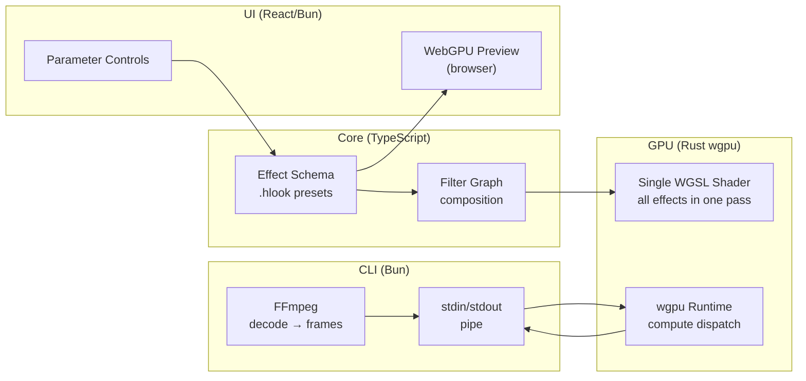
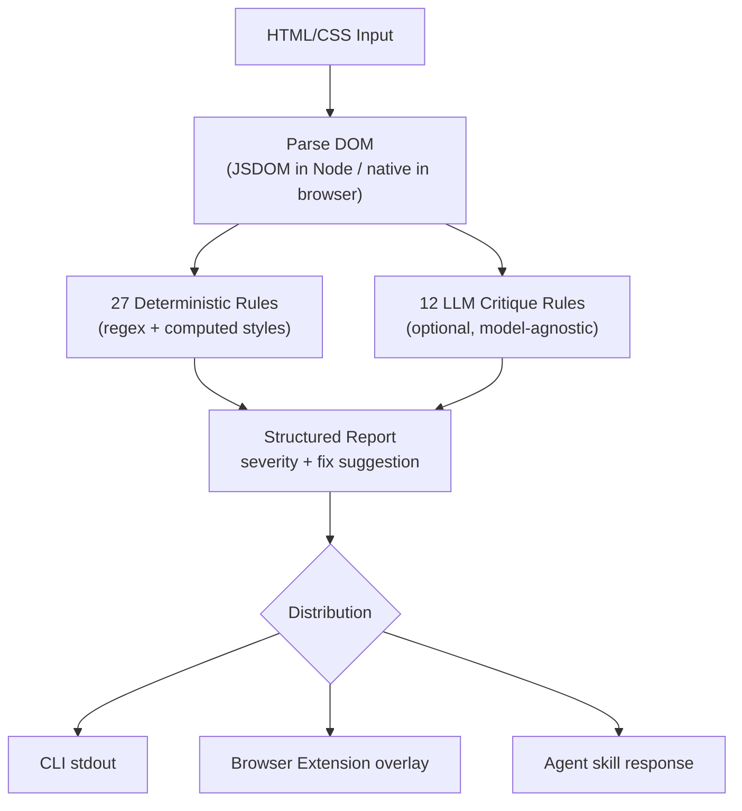

# OpenUI -- OrvaStudios Ecosystem (Creative Tools and Libraries)

The `src.OrvaStudios/` directory contains creative developer tools: a GPU-accelerated video processing engine, a design anti-pattern detector for AI agents, a zero-dependency shader collection, a lightweight React data-fetching hook, and serverless applications.

**Aha:** The most architecturally interesting project is Hance — it's a multi-language monorepo where TypeScript (Bun) handles the UI and CLI orchestration, while Rust (wgpu) handles the GPU compute for one-pass shader composition. The key insight: all film effects (color grading, halation, bloom, grain, vignette, split-tone, aberration, camera shake) run as a single WGSL compute shader pass, avoiding the multi-pass overhead that WebGL solutions typically incur.

Source: `src.OrvaStudios/` — 12 sub-projects

## Project Map

| Project | Type | Complexity | Description |
|---------|------|-----------|-------------|
| **hance** | Video Engine | Large | GPU-accelerated cinematic film-look engine (Rust wgpu + Bun) |
| **impeccable** | Design Skill | Large | 27 anti-pattern rules + 23 commands for AI coding agents |
| **radiant** | Shader Gallery | Medium | 94 standalone WebGL/Canvas shaders + SvelteKit gallery |
| **lite-query** | React Library | Small | Minimal data-fetching hook with SWR and cache |
| **shield** | Serverless App | Medium | Cloudflare Workers + D1 + Better Auth |
| **NoClap** | macOS Utility | Small | Swift audio delay utility (AudioKit) |
| **agent-reviews** | CLI Tool | Small | GitHub PR comment automation for agents |

## Hance — GPU-Accelerated Film Engine

Source: `src.OrvaStudios/hance/`

Monorepo with three packages:

```
packages/core   → Effect schema + filter graph (TypeScript/Bun)
packages/cli    → FFmpeg orchestration + CLI (TypeScript/Bun)
packages/wgpu   → Rust GPU renderer (wgpu + WGSL shaders)
```

### Architecture



### Key Design Decisions

- **One-pass composition**: All effects compile into a single WGSL compute shader — no multi-pass overhead
- **Preset system**: `.hlook` JSON files with version metadata for forward-compatible presets
- **Dual rendering**: Browser WebGPU for preview, Rust wgpu sidecar for headless export
- **FFmpeg integration**: Decode via ffmpeg → pipe frames to GPU → encode output
- **Bun runtime**: CLI and UI both built on Bun for fast startup and native compilation

```bash
bun run build:wgpu    # Compile Rust GPU renderer
bun run build:ui      # Build React frontend
bun run build         # Compile standalone CLI binary
```

### Effects (all in single shader pass)

| Effect | Parameters |
|--------|-----------|
| Color grading | Lift, gamma, gain, saturation, temperature |
| Halation | Radius, intensity, color tint |
| Bloom | Threshold, radius, intensity |
| Film grain | Amount, size, color vs mono |
| Vignette | Amount, roundness, feather |
| Split-tone | Highlights hue/sat, shadows hue/sat, balance |
| Chromatic aberration | Red/blue shift, edge falloff |
| Camera shake | Frequency, amplitude, rotation |

## Impeccable — Design Anti-Pattern Detection

Source: `src.OrvaStudios/impeccable/`

Multi-distribution design skill for AI coding agents:

- **27 deterministic rules**: Regex + JSDOM-based checks (no LLM required for core detection)
- **12 LLM critique rules**: Optional deeper analysis via AI model
- **23 commands**: `/impeccable craft`, `/impeccable audit`, `/impeccable polish`, etc.
- **7 domain references**: Typography, color, spatial, motion, interaction, responsive, UX writing
- **Multi-platform**: Cursor skill, Claude Code skill, GitHub Copilot skill, browser extension, CLI

### Detection Architecture



Anti-pattern categories: spacing inconsistency, color contrast failures, typography hierarchy violations, interaction affordance issues, responsive breakpoint problems, motion timing errors.

### Universal Distribution

```javascript
// detect-antipatterns.mjs auto-detects environment
const isBrowser = typeof window !== 'undefined';
// Node: uses JSDOM to parse HTML strings
// Browser: uses native DOM APIs on live page
```

## Radiant — 94 Standalone WebGL Shaders

Source: `src.OrvaStudios/radiant/`

Zero-dependency shader collection with SvelteKit gallery:

- **94 shaders**: Each is a self-contained HTML file (`<style>` + `<canvas>` + `<script>`)
- **Zero dependencies**: No build step, no npm packages — copy-paste into any project
- **6 color schemes**: Applied via CSS `filter` on iframes (no shader modification)
- **Live parameters**: `postMessage` API for runtime tuning (speed, colors, density)
- **Performance**: Visibility-based pausing, DPR-aware rendering (capped at 2x), 60fps target

### Shader Taxonomy

| Tag | Examples |
|-----|---------|
| `fill` | Full-viewport gradients, noise fields |
| `object` | Rotating geometry, floating shapes |
| `particles` | Particle systems, fireworks |
| `physics` | Gravity, fluid, cloth |
| `noise` | Perlin, simplex, voronoi |
| `organic` | Plants, cells, tendrils |
| `geometric` | Tessellation, fractals, grids |

### Embedding Pattern

```html
<!-- Zero-dependency shader embedding -->
<iframe src="shaders/aurora.html" style="filter: hue-rotate(180deg)"></iframe>

<script>
// Runtime parameter control
iframe.contentWindow.postMessage({ type: 'params', speed: 0.5, color: '#ff0000' }, '*');
</script>
```

## Lite-Query — Minimal React Data Fetching

Source: `src.OrvaStudios/lite-query/`

Lightweight alternative to React Query (single-file, copy-paste friendly):

```typescript
import { useQuery, prefetch } from 'lite-query';

// Basic usage
const { data, isLoading, error } = useQuery('users', () => fetch('/api/users').then(r => r.json()));

// Prefetch on hover
onMouseEnter={() => prefetch('user-detail', () => fetchUser(id))}
```

Key patterns:
- `useSyncExternalStore` for external cache subscription
- `Map<string, CacheEntry>` with `AbortController` for request cancellation
- Stale-while-revalidate with configurable `staleTime`
- Published to JSR (`bunx jsr publish`)

## Shield — Serverless Faith App

Source: `src.OrvaStudios/shield/`

Cloudflare Workers + D1 serverless application:

- **Backend**: Hono HTTP framework on Cloudflare Workers
- **Database**: Cloudflare D1 (distributed SQLite)
- **Auth**: Better Auth (email/password + Google OAuth)
- **Service layer**: `TapService`, `UserService` with Hono middleware
- **API docs**: Auto-generated OpenAPI/Swagger at `/docs`

## Replicating in Rust

| TypeScript | Rust Equivalent |
|-----------|-----------------|
| Bun + WGSL (hance) | wgpu directly (already Rust) |
| FFmpeg pipe (hance) | ffmpeg-next or direct libav bindings |
| JSDOM detection (impeccable) | scraper + regex for HTML analysis |
| SvelteKit gallery (radiant) | Leptos or static-site generator + raw WGSL |
| useSyncExternalStore (lite-query) | Custom signal system or leptos::create_resource |
| Cloudflare Workers (shield) | Cloudflare Workers (Rust target via wasm-bindgen) |
| AudioKit (NoClap) | cpal + dasp for audio DSP |

See [WASM Patterns](13-wasm-web-patterns.md) for web platform integration.
See [Rust Equivalents](11-rust-equivalents.md) for OpenUI-specific Rust mappings.
