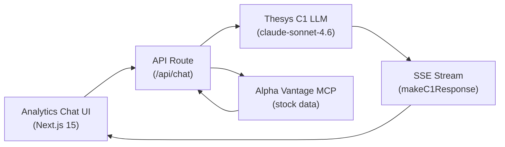
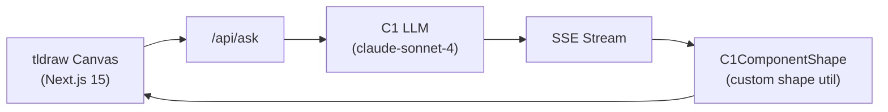
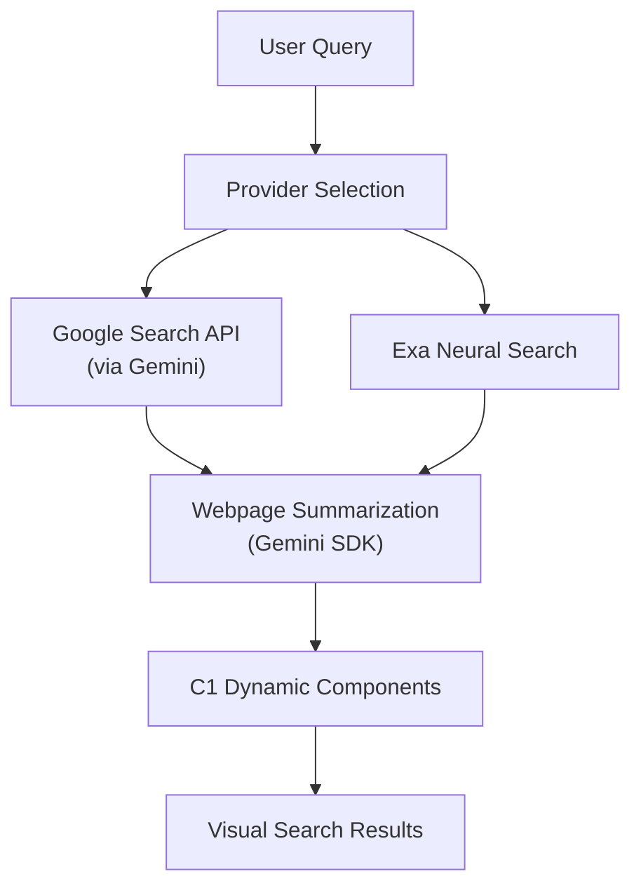
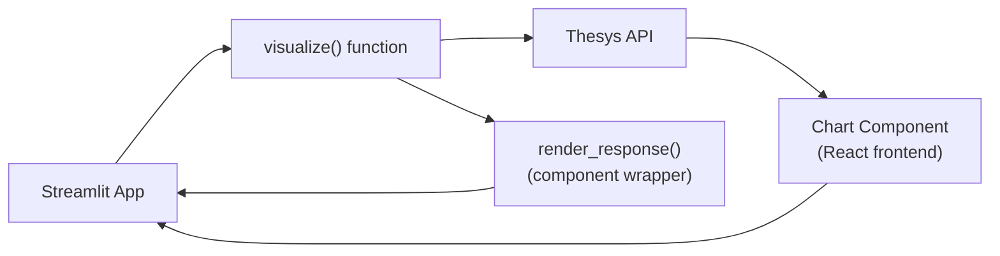
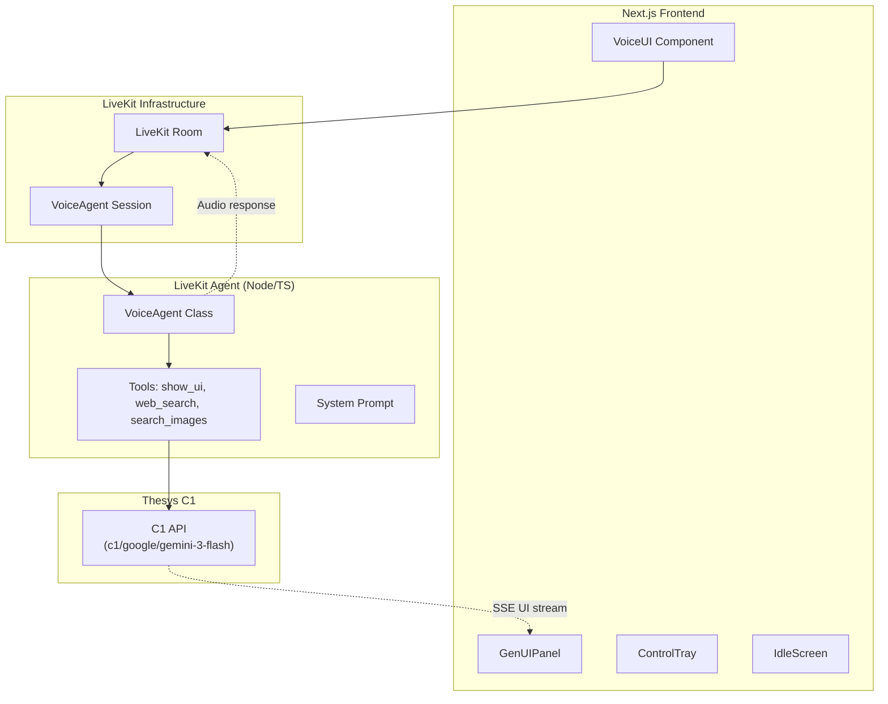

# OpenUI -- C1/Thesys Demo Applications

The Thesys C1 ecosystem consists of a collection of demo applications built on top of the Thesys Generative UI platform (C1). These apps showcase how OpenUI's streaming-first generative UI paradigm extends beyond chat interfaces into specialized domains: financial analytics, visual collaboration, search, and voice agents.

**Aha:** All C1 demo apps share the same core pattern: Next.js 15 App Router frontend → SSE streaming API route → Thesys C1 LLM (`c1/anthropic/claude-sonnet-4.6/v-20251230`) → `makeC1Response()` server utility that writes content and thinking states to a `ReadableStream`. The frontend consumes the stream via `useThreadManager` or `useThreadListManager` from `@thesysai/genui-sdk`. Custom components are registered via Zod schemas passed as `c1_custom_components` metadata.

Source: `/home/darkvoid/Boxxed/@formulas/src.rust/src.llamacpp/src.ui/` — 6 C1 demo apps

## Thesys C1 Core SDK Patterns

All C1 demo apps share these SDK patterns:

### Server-Side: `makeC1Response()`

```typescript
import { makeC1Response } from "@thesysai/genui-sdk/server";

const { responseStream, writeContent, writeThinkItem, end } = makeC1Response();

// Write thinking/processing states (shown as loading indicators)
writeThinkItem({ title: "Processing...", description: "Gathering data..." });

// Write streaming text content
await writeContent(chunk);

// End the stream when done
end();

return new NextResponse(responseStream, {
  headers: { "Content-Type": "text/event-stream" }
});
```

### Client-Side: Thread Management

```typescript
import { useThreadListManager, useThreadManager } from "@thesysai/genui-sdk";

const threadListManager = useThreadListManager({
  fetchThreadList: () => apiClient.getThreadList(),
  deleteThread: (id) => apiClient.deleteThread(id),
  createThread: (msg) => apiClient.createThread(msg),
});

const threadManager = useThreadManager({
  threadListManager,
  loadThread: (id) => apiClient.getMessages(id),
  apiUrl: "/api/chat",
});
```

### Custom Component Registration

```typescript
import { z } from "zod";
const CUSTOM_COMPONENT_SCHEMAS = {
  FiltersBar: z.toJSONSchema(FiltersBarSchema),
};

// Passed via metadata in the C1 API call
metadata: {
  thesys: JSON.stringify({ c1_custom_components: CUSTOM_COMPONENT_SCHEMAS })
}
```

## Analytics Agent with Generative UI

Source: `analytics-agent-generativeui/`

A full-stack stock market analytics application with a conversational AI agent ("Jules") that generates dynamic financial dashboards.

### Architecture



### Key Files

| File | Purpose |
|------|---------|
| `src/app/api/chat/route.ts` | Main chat endpoint, tool calling loop |
| `src/app/api/chat/mcpClient.ts` | Alpha Vantage MCP tool wrapper |
| `src/analytics-chat/index.tsx` | Chat shell component |
| `src/analytics-chat/use-thread.ts` | Thread state management |
| `src/components/FiltersBar.tsx` | Custom filter component |
| `src/components/filtersBarSchema.ts` | Zod schema for FiltersBar |

### Agent Tool-Calling Loop

The endpoint implements a continuous tool-calling loop:

```typescript
while (true) {
  const stream = client.responses.stream({
    model: "c1/anthropic/claude-sonnet-4.6/v-20251230",
    input,
    tools, // Alpha Vantage MCP tools
    metadata: { thesys: JSON.stringify({ c1_custom_components }) },
  });

  // Stream content and collect tool calls
  for await (const event of stream) {
    if (event.type === "response.output_text.delta") await writeContent(event.delta);
    if (event.item.type === "function_call") toolCalls.push(event.item);
  }

  if (toolCalls.length === 0) break; // No more tools → done

  // Execute tools and feed results back
  input = toolCalls.map(tc => ({
    type: "function_call_output",
    call_id: tc.call_id,
    output: await callMcpTool(tc.name, JSON.parse(tc.arguments)),
  }));
}
```

### Response ID Mapping

The app maintains a two-level ID map: `threadId → (SDK_UUID → Thesys_RESPONSE_ID)`. This is necessary because the frontend uses SDK-generated UUIDs while the Thesys API returns its own response IDs for continuation.

### System Prompt Structure

The agent "Jules" is instructed to generate structured dashboard pages:
1. `CardHeader` with title and description
2. Single `FiltersBar` with all adjustable parameters
3. Charts/data views using condensed variants for timeseries

## Analytics with C1

Source: `analytics-with-c1/`

The canonical Thesys C1 financial analytics demo (live at `analytics-with-c1.vercel.app`). Simpler than the analytics-agent variant — uses direct C1 API calls without MCP tool integration.

### Architecture Differences from Analytics Agent

| Feature | analytics-agent | analytics-with-c1 |
|---------|----------------|-------------------|
| Data source | Alpha Vantage MCP | Direct API |
| Tool calling | Continuous loop | Single call |
| Custom components | FiltersBar (Zod schema) | None |
| File handling | No | CSV/Excel drag-and-drop |
| Analytics | PostHog | None |

### Source Structure

```
src/
├── app/                    # Next.js App Router
│   ├── components/         # DashboardScreen, Header, CopilotTray, Loader
│   ├── helpers/            # PostHog, retryWithBackoff
│   └── api/chat/route.ts   # C1 streaming endpoint
├── apiClient.ts            # Thread/message CRUD API client
├── config.server.ts        # Server-side config
├── config.ts               # Client-side config
├── hooks/                  # useFileDrag, useFileHandler, useIsMobile
└── services/               # sheetProcessor (CSV/Excel), threadService
```

### File Upload Processing

The app handles spreadsheet uploads via drag-and-drop:

```typescript
// useFileHandler.ts — processes uploaded CSV/Excel files
// sheetProcessor.ts — converts sheets to LLM-friendly data format
// Uploaded data is injected into the conversation context
```

## Canvas with C1

Source: `canvas-with-c1/`

An AI-powered visual collaboration canvas using `tldraw` for infinite canvas rendering. Users type prompts and the AI generates interactive cards directly onto the canvas as resizable shapes.

### Architecture



### Key Innovation: Custom tldraw Shape

The app registers a custom `c1-component` shape type:

```typescript
// shapeUtils/C1ComponentShapeUtil.tsx
// Registers "c1-component" as a new tldraw shape type
// Renders C1Response content inside the shape bounds
```

Shape lifecycle:
1. `createC1ComponentShape()` calculates optimal position avoiding overlap
2. Creates the shape with `prompt` prop
3. Calls `/api/ask` with the prompt + context from selected shapes
4. Updates shape props (`c1Response`, `isStreaming`) as content arrives

### Context-Aware Generation

The shape manager extracts context from currently selected shapes:

```typescript
const additionalContext = extractC1ShapeContext(editor);
// Returns content from all selected C1 shapes
// Injected into API call so new cards relate to existing ones
```

### API Route

Uses `@crayonai/stream` `transformStream` to pipe LLM output into the C1 response:

```typescript
const llmStream = await client.beta.chat.completions.runTools({
  model: "c1/anthropic/claude-sonnet-4/v-20251230",
  tools: [getImageSearchTool(onThinkingUpdate)],
});

transformStream(llmStream, (chunk) => {
  c1Response.writeContent(chunk.choices[0]?.delta?.content);
}, { onEnd: () => c1Response.end() });
```

## Search with C1

Source: `search-with-c1/`

A generative UI search engine that combines multi-provider web search (Google, Exa neural search) with C1 dynamic components for rich, visual search results.

### Search Provider Architecture



### Source Structure

```
src/app/api/ask/
├── route.ts                       # Main search endpoint
├── lib/generateAndStreamC1Response.ts
├── lib/findCachedTurn.ts
├── systemPrompt.ts                # C1 system prompt
└── types/
    ├── search.ts                  # Search result types
    └── searchProvider.ts          # Provider enum
src/app/api/services/
├── exaSearch.ts                   # Exa integration
├── googleGenAiSearch.ts           # Google GenAI search
├── googleImageSearch.ts           # Google Image search
└── googleWebSearch.ts             # Google Web search
src/app/api/cache/
├── threadCache.ts                 # In-memory thread cache
└── types.ts                       # Cache types
```

### Thread Caching

Uses in-memory caching for conversation turns:

```typescript
// threadCache.ts — manages search result caching per thread
// findCachedTurn.ts — checks cache before re-searching
```

## Streamlit Thesys Generative UI

Source: `streamlit-thesys-genui/`

A Streamlit component package (`streamlit_thesys`) that enables AI-generated charts and visualizations from natural language descriptions.

### Usage Pattern

```python
import streamlit_thesys as st_thesys

# Describe chart in plain language → get visualization back
st_thesys.visualize(
    instructions="Show me a bar chart of monthly revenue",
    data=my_dataframe,
    api_key="your-thesys-key"
)
```

### Architecture



### Source Structure

```
streamlit_thesys/
├── __init__.py          # Component declaration, visualize(), render_response()
├── demo_data.py         # Sample datasets
└── example.py           # Usage examples

frontend/                # React component (for _render_component_func)
```

### Component Model

Uses Streamlit's component framework:

```python
# Development: connects to localhost:3001
_render_component_func = components.declare_component("render_response", url="http://localhost:3001")

# Production: uses built frontend
_render_component_func = components.declare_component("render_response", path="frontend/build")

def render_response(c1Response, key=None):
    component_value = _render_component_func(c1Response=c1Response, key=key)
    return component_value  # Returns { llmFriendlyMessage, humanFriendlyMessage }
```

## Voice Agent Generative UI

Source: `voice-agent-generativeui/`

A voice-powered AI agent that responds with both speech and real-time generative UI visuals. Built on LiveKit for voice infrastructure and Thesys C1 for UI generation.

### Two Agent Modes

| Mode | Architecture | Latency | Flexibility |
|------|-------------|---------|-------------|
| **Pipeline** | Deepgram STT → Gemini Flash LLM → Inworld TTS | Higher | Swappable components |
| **Realtime** | OpenAI `gpt-realtime` (native audio) | Lower | Single provider lock-in |

### Architecture



### Agent Source Structure

```
livekit-agent/src/
├── index.ts              # Entry: reads mode from room metadata
├── agent.ts              # VoiceAgent class with mode-aware tool wiring
├── prompt.ts             # System prompt builder with narration section
└── tools/
    ├── web-search.ts     # Exa web search
    ├── image-search.ts   # Google Custom Search for images
    ├── show-ui.ts        # Streams visual UI via Thesys C1
    └── narration.ts      # Mode-specific narration wrapper
```

### ShowUI Tool Architecture

The key innovation: the `show_ui` tool streams UI generation in a background task while returning immediately so the voice LLM can start speaking:

```typescript
execute: async ({ content }) => {
  // Stream UI in background — LLM doesn't wait
  (async () => {
    const writer = await this.room.localParticipant.streamText({ topic: "genui" });
    const stream = await this.thesysClient.chat.completions.create({
      model: "c1/google/gemini-3-flash/v-20251230",
      messages: [{ role: "system", content: THESYS_SYSTEM_PROMPT }, { role: "user", content }],
      stream: true,
    });
    for await (const chunk of stream) {
      await writer.write(chunk.choices[0]?.delta?.content);
    }
    await writer.close();
  })();

  // Return immediately — LLM generates speech while UI renders
  return "UI is loading on screen. Tell the user what you're showing them.";
}
```

### Frontend Components

```
src/lib/components/
├── VoiceUI.tsx           # Main component, theme provider, agent state
├── GenUIPanel.tsx        # Receives and renders streamed UI content
├── ControlTray.tsx       # Mute, mode switch, connection controls
├── IdleScreen.tsx        # Landing page before session starts
├── TranscriptStrip.tsx   # Conversation transcript display
├── status-indicators.tsx # Connection state visualization
└── theme.ts              # Accent color system, dark mode
```

### Narration System

The `withNarration` wrapper in pipeline mode speaks during tool execution:

```typescript
// tools/narration.ts
// In pipeline mode: session.say() injects natural language
// during tool execution so the user isn't left in silence
// In realtime mode: narration handled by the model itself via prompting
```

## Replicating in Rust

| C1 Pattern | Rust Equivalent |
|-----------|-----------------|
| `makeC1Response()` SSE stream | `axum::response::Sse` with `tokio::sync::mpsc` |
| `useThreadManager` hook | Custom signal/store system |
| Thesys C1 API (`c1/anthropic/...`) | Any OpenAI-compatible endpoint |
| `transformStream` | `futures::stream::StreamExt::map` |
| tldraw custom shape | Custom canvas renderer or Tauri webview |
| LiveKit voice agent | `livekit-protocol` + `tokio` |
| Exa search | `reqwest` → Exa API |
| Alpha Vantage MCP | Direct API or MCP Rust SDK |
| `c1_custom_components` metadata | `utoipa` schema generation |

See [Rust Equivalents](11-rust-equivalents.md) for core OpenUI patterns.
See [WASM Patterns](13-wasm-web-patterns.md) for deployment considerations.
