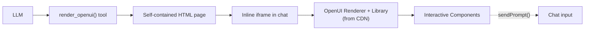

# OpenUI -- Tools, Plugins, and Examples

Supporting infrastructure around OpenUI and C1: developer tools, platform integrations, and a collection of 14 example applications demonstrating real-world patterns.

## make-no-mistakes — Agent Skill for Code Quality

Source: `make-no-mistakes/`

A Cursor skill distributed as two SKILL.md files. The project is a tongue-in-cheek commentary on AI-generated code quality, distributed alongside serious OpenUI tooling.

### What's in the Box

| File | Content |
|------|---------|
| `make-no-mistakes/SKILL.md` | Single instruction: "make no mistakes." |
| `make-no-mistakes-max/SKILL.md` | Extended version |

### Distribution

Installed as a Cursor skill:

```bash
cp -r make-no-mistakes/make-no-mistakes ~/.cursor/skills/
cp -r make-no-mistakes/make-no-mistakes-max ~/.cursor/skills/
```

Licensed under Apache License. Part of the OpenUI open-source suite.

## Open WebUI Plugin

Source: `openwebui-plugin/tool.py`

An [Open WebUI](https://github.com/open-webui/open-webui) tool that renders interactive OpenUI Lang components (charts, forms, tables, cards, follow-ups) inline in chat.

### Architecture



### How It Works

The tool builds a self-contained HTML page that loads the OpenUI renderer and component library from a jsDelivr CDN:

```python
_CDN_BASE = "https://cdn.jsdelivr.net/npm/@openuidev/browser-bundle"

def _build_openui_html(code: str, title: str, cdn_base: str) -> str:
    # Builds complete HTML page with:
    # 1. Theme detection script (syncs with Open WebUI theme)
    # 2. Height reporting via postMessage (iframe auto-resize)
    # 3. OpenUI bundle loaded from CDN
    # 4. sendPrompt bridge (user actions → chat messages)
    # 5. CSP header for security
```

### Tool Registration

The tool is defined as an Open WebUI `Tools` class:

```python
class Tools:
    class Valves(BaseModel):
        cdn_base_url: str = Field(default=_CDN_BASE)

    async def render_openui(self, openui_lang_code: str, title: str = "Response"):
        # Returns (HTMLResponse, result_context)
        # result_context tells the LLM: "UI is rendering, don't echo the code"
```

### Key Features

| Feature | Implementation |
|---------|---------------|
| **Theme sync** | MutationObserver on parent document, matches dark/light |
| **Auto-height** | ResizeObserver + scrollHeight reporting via `postMessage` |
| **Action bridge** | `sendPrompt(text)` → `postMessage({ type: 'input:prompt:submit' })` |
| **URL opening** | `openLink(url)` → `parent.window.open()` |
| **CSP** | `default-src 'self'; script-src 'unsafe-inline' https://cdn.jsdelivr.net` |
| **Error handling** | Loading state → success render → catch error → display error div |

### Body Script Communication

```javascript
// Height reporting (auto-resizing iframe)
new ResizeObserver(() => requestAnimationFrame(reportHeight)).observe(document.body);

// Action → chat bridge
function sendPrompt(text) {
  parent.postMessage({ type: 'input:prompt:submit', text: text }, '*');
}

// OpenURL bridge
function openLink(url) {
  try { parent.window.open(url, '_blank'); }
  catch(e) { window.open(url, '_blank'); }
}
```

### CDN Bundle Exports

The loaded bundle provides:
- `window.__OpenUI.Renderer` — React renderer component
- `window.__OpenUI.openuiChatLibrary` — Default component library
- `window.__OpenUI.createRoot(container)` — Creates React root
- `window.__OpenUI.React` — React reference

### Usage in Open WebUI

1. Install: Admin > Tools > Create new tool > paste `tool.py`
2. The LLM calls `render_openui(openui_lang_code, title)`
3. The tool returns an `HTMLResponse` — Open WebUI renders it as an inline iframe
4. User interactions (follow-up clicks, form submissions) post back into chat via `sendPrompt`

## create-c1-app — CLI Project Scaffolding

Source: `create-c1-app/`

A CLI tool (`npx create-c1-app`) that creates C1 project templates with API authentication configured.

### Features

- Interactive project setup via `@inquirer/prompts`
- Multiple template support (`template-c1-component-next`, `template-c1-next`)
- OAuth authentication with Thesys API
- Environment variable management
- Telemetry reporting
- Spinner-based progress indicators

### CLI Options

| Option | Alias | Description | Default |
|--------|-------|-------------|---------|
| `[project-name]` | — | Project name | Interactive prompt |
| `--template` | `-t` | Template to use | Interactive prompt |
| `--api-key` | `-k` | Thesys API key | Interactive prompt |
| `--auth` | — | Auth method: `oauth`, `manual`, `skip` | Interactive prompt |

### Source Architecture

```
src/
├── index.ts              # CLI entry (yargs + inquirer prompts)
├── auth/
│   ├── authenticator.ts  # OAuth flow with Thesys OIDC
│   └── resolve.ts        # Auth method resolution
├── env/
│   └── envManager.ts     # .env file management
├── generators/
│   └── project.ts        # Template generation
├── types/
│   └── index.ts          # AuthMethod, CLIOptions, CreateC1AppConfig
└── utils/
    ├── logger.ts         # Structured logging
    ├── spinner.ts        # Progress indicators
    ├── telemetry.ts      # Usage telemetry
    └── validation.ts     # Input validation
```

### OAuth Flow

```typescript
const THESYS_API_URL = "https://api.app.thesys.dev";
const THESYS_ISSUER_URL = "https://api.app.thesys.dev/oidc";
const THESYS_CLIENT_ID = "create-c1-app";

// Uses openid-client for OIDC discovery and authentication
// Authenticator handles the full OAuth PKCE flow
// Credentials stored in .env file via EnvironmentManager
```

## Example Applications

Source: `openui/examples/`

14 example applications demonstrating OpenUI patterns across frameworks, UI libraries, and use cases.

| Example | Framework | UI Library | What It Demonstrates |
|---------|-----------|------------|---------------------|
| **openui-chat** | Next.js | Default | Basic OpenUI chat with tool calling |
| **vercel-ai-chat** | Next.js | Default | Vercel AI SDK integration, multi-step tool calling |
| **shadcn-chat** | Next.js | shadcn/ui | 45+ custom components on shadcn design system |
| **supabase-chat** | Next.js | Default | Supabase persistence, RLS, real-time sidebar |
| **svelte-chat** | SvelteKit | Default | `@openuidev/svelte-lang`, Svelte component rendering |
| **vue-chat** | Vue | Default | Vue 3 integration with OpenUI |
| **mastra-chat** | Next.js | Default | Mastra agent + AG-UI protocol adapter |
| **multi-agent-chat** | Next.js | Default | Multi-agent orchestration with analytics sub-agent |
| **form-generator** | Next.js | HeroUI | Generative form builder with HeroUI components |
| **hands-on-table-chat** | Next.js | Handsontable | AI-powered spreadsheet with OpenUI chat panel |
| **openui-dashboard** | Next.js | Default | Conversational dashboard builder with MCP data sources |
| **openui-artifact-demo** | Next.js | Default | Artifact side panel for code display |
| **openui-react-native** | React Native (Expo) | Default | Mobile rendering with Next.js API backend |
| **react-email** | Next.js | React Email | AI-generated email with 44 email components |

### Key Patterns Across Examples

| Pattern | Demonstrated In |
|---------|----------------|
| **Basic SSE streaming** | openui-chat, vercel-ai-chat |
| **Custom component library** | shadcn-chat, form-generator, react-email |
| **Database persistence** | supabase-chat |
| **Alternative frameworks** | svelte-chat, vue-chat, openui-react-native |
| **Multi-agent** | multi-agent-chat, mastra-chat |
| **Specialized UI** | hands-on-table-chat, openui-dashboard |
| **AG-UI protocol** | mastra-chat |
| **Artifact panel** | openui-artifact-demo |

### Framework Adapter Pattern

Each non-React example follows the same adapter pattern:

```
LLM → streams openui-lang text → framework-specific parser → framework components
```

- **Svelte**: `@openuidev/svelte-lang` parses AST, renders Svelte components
- **Vue**: Vue 3 adapter renders Vue components from AST
- **React Native**: `@openuidev/react-lang` renders native components via Expo
