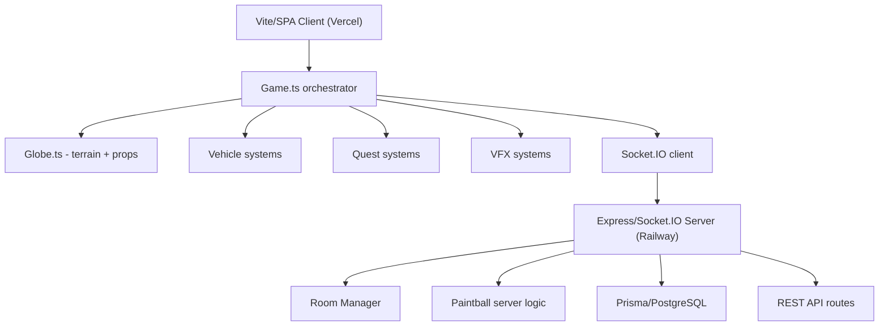

# Tiny Skies -- Exploration

A 3D browser-based flight adventure game built with Three.js, featuring procedural terrain generation, real-time multiplayer via Socket.IO, quest systems (package delivery, races, paintball combat), a progression system with XP and upgrade cards, atmospheric VFX (day/night cycle, aurora, meteor showers), and deployment across Vercel (client) and Railway (server).

## Architecture

## Source Structure

| Package | Files | Purpose |
|---------|-------|---------|
| `shared/` | 3 | Shared types, vehicle capabilities, constants |
| `client/src/game/` | ~60 | All game systems (Game.ts ~7000 lines, Globe.ts ~5800 lines) |
| `client/src/network/` | 2 | Socket.IO client, state sync |
| `client/src/ui/` | ~15 | HUD, lobby, overlays, debug menu |
| `client/src/audio/` | 1 | Audio manager with music crossfading |
| `server/src/` | 1 | Express app, Socket.IO setup |
| `server/src/rooms/` | 2 | Room manager, per-world room state |
| `server/src/routes/` | 4 | Worlds, lanterns, save-feed, events |
| `server/src/paintball/` | 2 | Server hit testing, constants |
| `server/prisma/` | 2 | Schema, seed data, 5 migrations |

## Key Innovations

1. **Spherical geometry everywhere** — positions as quaternions + altitude, great-circle movement
2. **Server-authoritative combat** — paintball cooldowns and hit tests validated server-side
3. **Seeded procedural generation** — Park-Miller LCG for deterministic terrain, props, AI behavior
4. **Dead reckoning multiplayer** — 20Hz state sync with 100ms interpolation buffer
5. **Custom shader injection** — Three.js `onBeforeCompile` for ocean foam, tree sway, flame billboards
6. **Endgame loop** — Moon approach → impact → moonstone union → brazier lighting → eternal flame
