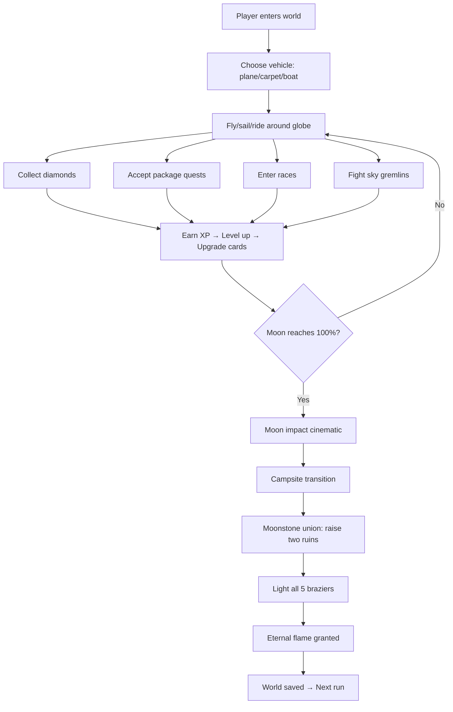

# Tiny Skies -- Overview

Tiny Skies is a 3D browser-based flight adventure game built with Three.js, deployed as a two-tier web application: a Vite/SPA client on Vercel and an Express/Socket.IO/Prisma server on Railway. Players fly a biplane over a procedurally-generated spherical island world, collecting diamonds, completing quests (package delivery, landmark selfies, paintball combat), racing through checkpoint rings, interacting with NPCs, and progressing through vehicle upgrades (biplane → magic carpet → void vehicle → boat). The game features real-time multiplayer via WebSocket state synchronization, a day/night cycle, atmospheric VFX (aurora, god rays, meteor showers, contrails, fireflies), and a progression system with XP, levels, and vehicle unlocks.

Source: `tinyskies/client/src/main.ts` — entry point
Source: `tinyskies/server/src/index.ts` — server entry point
Source: `tinyskies/shared/types.ts` — shared type definitions

## Technology Stack

| Layer | Technology | Purpose |
|-------|-----------|---------|
| **Rendering** | Three.js (VSM shadow maps) | WebGL 3D scene |
| **Build** | Vite + HMR | Client bundler, hot module replacement |
| **Language** | TypeScript (strict) | Type-safe client/server/shared code |
| **Networking** | Socket.IO (WebSocket transport) | Real-time multiplayer sync |
| **Database** | PostgreSQL 16 (Prisma ORM) | World configs, player events, lantern ledger |
| **Client Deploy** | Vercel | SPA hosting, serverless URL resolution |
| **Server Deploy** | Railway | Node.js container with PostgreSQL |
| **Analytics** | `@vercel/analytics` | Usage tracking |
| **Monorepo** | npm workspaces | `shared`, `client`, `server` packages |

## Monorepo Structure

```
tinyskies/
├── shared/                    # Shared types and constants
│   ├── types.ts               # PlayerState, WorldConfig, Vehicle, paintball/flag constants
│   ├── vehicleCapabilities.ts # Per-vehicle feature flags
│   └── index.ts               # Re-exports
├── client/                    # Browser game (SPA)
│   ├── src/
│   │   ├── main.ts            # Entry point, Vercel analytics, HMR
│   │   ├── game/              # All game systems (~60 files)
│   │   │   ├── Game.ts        # Master orchestrator (~7000 lines)
│   │   │   ├── Globe.ts       # Central 3D scene (~5800 lines)
│   │   │   ├── SphericalMath.ts  # Quaternion-based spherical geometry
│   │   │   ├── Plane.ts       # Biplane vehicle
│   │   │   ├── Boat.ts        # Boat vehicle
│   │   │   ├── Carpet.ts      # Magic carpet vehicle
│   │   │   ├── DayNightCycle.ts  # 195-second day/evening/night cycle
│   │   │   ├── MoonThreat.ts  # Approaching moon threat
│   │   │   ├── MeteorShower.ts  # Meteor impacts
│   │   │   ├── PaintballSystem.ts  # Combat projectiles
│   │   │   ├── FlagSystem.ts  # Hot-potato flag capture
│   │   │   ├── SkyGremlins.ts  # Enemy AI system (~1500 lines)
│   │   │   ├── VoidMoths.ts   # Cosmic void enemies
│   │   │   ├── Rings.ts       # Diamond collectibles
│   │   │   ├── Braziers.ts    # Brazier flame system
│   │   │   ├── RaceManager.ts # Time trial races
│   │   │   ├── PackageQuest.ts # Delivery quests
│   │   │   ├── CarpetPortalSystem.ts # Portal teleportation
│   │   │   ├── UpgradeManager.ts # Upgrade cards
│   │   │   ├── CosmicWorldPortal.ts # Void entry portals
│   │   │   ├── FlightControls.ts # Desktop input
│   │   │   ├── TouchControls.ts # Mobile virtual joystick
│   │   │   ├── CameraRig.ts   # Chase camera
│   │   │   └── ... 40 more VFX/NPC/system files
│   │   ├── network/           # Socket.IO client
│   │   │   ├── SocketClient.ts
│   │   │   └── StateSync.ts
│   │   ├── ui/                # HUD, lobby, overlays
│   │   ├── audio/             # AudioManager.ts
│   │   ├── config/            # Feature flags, server URL
│   │   └── utils/             # isMobile.ts
│   └── public/                # Fonts, NPC sprites, GLB models, audio
├── server/                    # Express + Socket.IO server
│   ├── src/
│   │   ├── index.ts           # Express app, Socket.IO setup
│   │   ├── flagConstants.ts   # Flag timing/radius constants
│   │   ├── rooms/
│   │   │   ├── RoomManager.ts # Room lifecycle, overflow
│   │   │   └── Room.ts        # Per-world state, combat
│   │   ├── routes/
│   │   │   ├── worlds.ts      # World CRUD, auto-join
│   │   │   ├── lanterns.ts    # Lantern collection ledger
│   │   │   ├── saveFeed.ts    # Recent world save entries
│   │   │   └── events.ts      # Game event tracking + dashboard
│   │   ├── paintball/
│   │   │   ├── constants.ts   # Paintball timing constants
│   │   │   └── hitTest.ts     # Server ray-point hit test
│   │   ├── terrain/           # Server copies of terrain code
│   │   └── utils/
│   │       └── worldNames.ts  # 900 generated world names
│   └── prisma/
│       ├── schema.prisma      # PostgreSQL models
│       └── migrations/        # 5 migration sets
├── api/                       # Vercel serverless functions
│   └── server-url.js          # Returns backend URL from env
├── patch.js                   # Post-build: SFX randomization, shake
├── patch2.js                  # Post-build: Meteor shader materials
├── patch3.js                  # Post-build: Meteor complete rewrite
└── vercel.json, railway.toml  # Deployment configuration
```

## Core Game Loop



## Game Phases

| Phase | Description |
|-------|-------------|
| `flying` | Normal gameplay — flying vehicle around the globe |
| `campsite` | Post-impact campfire scene, player can interact with NPCs |
| `transitioning` | Moving between game phases with overlay |
| `moonImpact` | Moon collision cinematic |
| `moonstoneUnion` | Player must visit both moonstone ruins to raise them |

## Key Architectural Decisions

**Spherical geometry everywhere.** All gameplay happens on a globe. Positions are represented as quaternions + altitude, not Cartesian XYZ. Movement uses great-circle arcs. Local orientation is derived from tangent frames (up/north/east). This means every system — physics, combat, networking, camera — operates in spherical space.

**Server-authoritative combat.** Paintball cooldowns, hit tests, and flag captures are all validated server-side. The client spawns optimistic projectiles for responsiveness, but the server determines hits and broadcasts results. This prevents cheating and ensures all players in a room see consistent combat outcomes.

**Seeded procedural generation.** A Park-Miller LCG (`seededRandom`) drives deterministic randomness across the entire game: terrain noise, prop placement, gremlin AI behavior, meteor spawns, rain patterns. Two players joining the same world seed see identical terrain, tree positions, and village layouts.

**Dead reckoning multiplayer.** Players broadcast their state at 20Hz (every 50ms). Remote players are rendered with a 100ms interpolation buffer. Between updates, dead reckoning predicts position forward by elapsed time. Corrections are applied smoothly with blended slerp.

**Custom shader injection.** Three.js built-in materials are extensively patched via `onBeforeCompile` to add custom GLSL effects: rim lighting, ocean foam, tree sway, flame billboards, molten moon cracks, holographic diamond shaders. This avoids the overhead of full custom shaders while getting the visual effects needed.

See [Architecture](01-architecture.md) for the game engine structure and scene hierarchy.
See [Terrain System](02-terrain-system.md) for procedural noise and surface generation.
See [Flight Controls](03-flight-controls.md) for input handling and physics.
