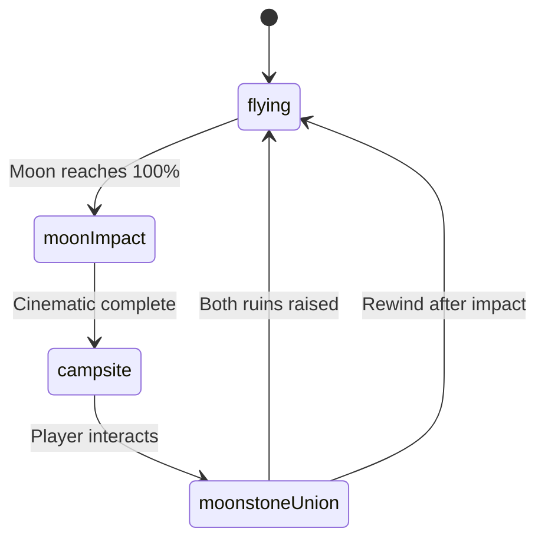

# Tiny Skies -- Architecture and Game Engine

The game engine is built around a single `Game` class that orchestrates all subsystems within a Three.js scene. The architecture follows a classic game loop pattern: initialize → update (tick) → render, with each subsystem updated in a deterministic order each frame.

Source: `tinyskies/client/src/game/Game.ts` — master orchestrator (~7000 lines)
Source: `tinyskies/client/src/main.ts` — entry point, HMR disposal

## Entry Point

```typescript
// client/src/main.ts
import { Game } from "./game/Game";
import { ProgressionManager } from "./game/ProgressionManager";
import { inject } from "@vercel/analytics";

inject({
  mode: import.meta.env.PROD ? "production" : "development",
});

if (import.meta.env.DEV) {
  const params = new URLSearchParams(window.location.search);
  if (params.has("clearSave")) {
    ProgressionManager.clearAll();  // Reset localStorage
    params.delete("clearSave");
    window.history.replaceState({}, "", `${window.location.pathname}...`);
  }
}

const app = document.getElementById("app")!;
const game = new Game(app);
game.start();

if (import.meta.hot) {
  import.meta.hot.accept();
  import.meta.hot.dispose(() => {
    game.dispose();  // Cancel animation frame, cleanup
    app.innerHTML = "";
  });
}
```

The entry point is minimal: create the `Game` instance, start the loop, and handle Vite HMR disposal for hot reloading during development.

## Game Class Structure

```typescript
// Game.ts — core fields
export class Game {
  private container: HTMLElement;
  private renderer!: WebGLRenderer;
  private scene!: Scene;
  private clock!: Clock;

  private globe!: Globe;
  private localPlayer!: Plane | Boat | Carpet;
  private controls!: FlightControls;
  private touchControls: TouchControls | null = null;
  private mobile = false;
  private cameraRig!: CameraRig;
  private remotePlanes!: RemotePlaneManager;
  private paintballSystem: PaintballSystem | null = null;
  private flagSystem: FlagSystem | null = null;
  // ... 40+ more subsystem fields
}
```

## Renderer Configuration

```typescript
this.renderer = new WebGLRenderer({ antialias: true });
this.renderer.shadowMap.enabled = true;
this.renderer.shadowMap.type = VSMShadowMap;  // Variance shadow maps
this.renderer.toneMapping = 3;  // ACES filmic
this.renderer.toneMappingExposure = 1.0;
this.renderer.outputColorSpace = SRGBColorSpace;
```

**VSMShadowMap** is chosen over the default PCFSoft because it produces softer, more physically-plausible shadows — important for the warm, cinematic aesthetic. The shadow map renders from the directional light's perspective and stores variance for soft shadow filtering.

## Scene Hierarchy

```mermaid
graph TD
    Scene --> Globe["Globe (spherical terrain)"]
    Globe --> SurfaceMesh["Surface sphere (256 segments)"]
    Globe --> OceanMesh["Ocean shader"]
    Globe --> AtmosphereMesh["Atmosphere glow shader"]
    Globe --> CloudRing["30 clouds drifting"]
    Globe --> Trees["10,000 instanced trees"]
    Globe --> CoconutTrees["270 coconut clusters"]
    Globe --> Rocks["400 instanced rocks"]
    Globe --> Villages["20 villages"]
    Globe --> Lighthouses["Rotating beam"]
    Globe --> Windmills["Spinning blades"]
    Globe --> Observatories["Dome + telescope"]
    Globe --> Stonehenges["Sarsen + lintels"]
    Globe --> ZenShrines["Torii gate"]
    Globe --> HotSprings["Steam particles"]
    Globe --> Mushrooms["Instanced particles"]
    Globe --> Balloons["5 hot-air balloons"]
    Globe --> RaceBanners["Floating banners"]
    Globe --> Moon["GLTF + ember particles"]
    Globe --> MoonstoneRuins["2 giant ring halves"]
    Globe --> VictoryStatue["GLTF memorial"]
    Globe --> FloatingTrees["28 forest clusters"]
    Globe --> Pyramids["Single GLB"]

    Scene --> PlayerGroup["Local vehicle group"]
    PlayerGroup --> PlaneOrBoatOrCarpet
    PlayerGroup --> Contrails
    PlayerGroup --> WakeTrail
    PlayerGroup --> SpeedLines
    PlayerGroup --> LensFlare

    Scene --> CameraRig
    Scene --> MeteorGroup
    Scene --> FlagRoot
    Scene --> GodRays
    Scene --> Starfield
    Scene --> Aurora
    Scene --> RainOverlay
    Scene --> RingManager
    Scene --> PaintballSystem
    Scene --> GremlinSystem
    Scene --> RaceManager
    Scene --> PackageQuest
    Scene --> PortalSystem
    Scene --> VoidMoths
```



## Game Loop

The game loop runs via `requestAnimationFrame`, with `Clock.getDelta()` providing the elapsed time since the last frame:

```typescript
private tick = (): void => {
  const delta = Math.min(this.clock.getDelta(), 0.1);  // Cap at 100ms
  const elapsed = this.clock.getElapsedTime();

  // Phase 1: Physics and controls
  this.controls.update(delta);
  this.localPlayer.update(delta, this.controls);

  // Phase 2: Vehicle position update
  this.updatePlayerPosition();

  // Phase 3: Multiplayer sync
  this.stateSync.update(delta);
  this.remotePlanes.update(delta);

  // Phase 4: Collectible checks
  this.ringManager.update(this.localPlayer);
  this.checkCollectibles();

  // Phase 5: Combat
  this.paintballSystem?.update(delta);
  this.skyGremlins?.update(delta, this.localPlayer);

  // Phase 6: Day/night cycle
  const dayNight = this.dayNightCycle.update(delta);

  // Phase 7: Audio crossfading
  this.audio.update(dayNight.musicWeights, delta);

  // Phase 8: UI updates
  this.hud.update(...);

  // Phase 9: Particle systems
  this.contrails.update(this.localPlayer, delta);
  this.wakeTrail.update(this.localPlayer, delta);

  // Phase 10: Render
  this.renderer.render(this.scene, this.camera);

  this.rafId = requestAnimationFrame(this.tick);
};
```

The loop is **deterministic in order**: controls are always processed before physics, physics before networking, networking before collectibles, collectibles before combat, combat before day/night, and so on. This prevents frame-order-dependent race conditions.

## Disposal and Cleanup

```typescript
dispose(): void {
  if (this.rafId) cancelAnimationFrame(this.rafId);
  this.socketClient?.disconnect();
  this.renderer.dispose();
  // ... dispose all subsystems
}
```

Called during HMR disposal and page unload, ensuring animation frames are cancelled, WebSocket connections are closed, and GPU resources are freed.

## Constant Tuning Parameters

The `Game` class contains ~200 tuning constants at the top of the file, organized by subsystem:

| Category | Examples | Purpose |
|----------|---------|---------|
| Balloon greeting | `BALLOON_GREET_DIST = 1.2`, `BALLOON_GREET_EXIT_DIST = 1.75` | Trigger NPC dialogue when near |
| Audio volumes | `EXPLOSION_SFX_VOLUME = 0.48`, `CRICKETS_LOOP_MAX_VOL = 0.045` | Per-sound mixing levels |
| Combo timing | `DIAMOND_COMBO_WINDOW_MS = 900`, `DIAMOND_COMBO_MAX_STEPS = 5` | Diamond collection combo system |
| XP tuning | `DIAMOND_COMBO_XP_PER_STEP = 0.05` | 5% XP bonus per combo step |
| Tutorial | `VEHICLE_TUTORIAL_OVERALL_MAX_MS = 30_000` | Auto-dismiss tutorial after 30s |
| Save feed | `SAVE_FEED_MIN_INTERVAL_MS = 10_000` | Debounce save-feed posts |
| Heartbeat | `SESSION_HEARTBEAT_MS = 60_000` | Playtime accounting every 60s |

These constants are deliberately placed at the top of the file so they can be tuned without reading through the implementation code.

## Game Phase Transitions



The **moon impact** phase triggers a cinematic: shockwave rings expand outward, 350 debris meshes fly up, camera rocks tumble. The **campsite** phase transitions to a ground-level scene with NPCs and a campfire. The **moonstone union** requires the player to visit both moonstone ruin sites and raise them, which triggers a cutscene of the two halves joining.

## Vehicle Selection

The lobby screen (`Lobby.ts`) lets players choose their vehicle. The `Game` class instantiates the correct vehicle type:

```typescript
const features = getVehicleFeatures(playerVehicle);
switch (playerVehicle) {
  case "plane":
    this.localPlayer = new Plane(this.scene, ...);
    break;
  case "boat":
    this.localPlayer = new Boat(this.scene, ...);
    break;
  case "carpet":
    this.localPlayer = new Carpet(this.scene, ...);
    break;
}
```

Each vehicle has different capabilities defined in `vehicleCapabilities.ts`:

| Feature | Plane | Carpet | Boat |
|---------|-------|--------|------|
| Diamond collection | Yes (15) | Yes (15) | Yes (24) |
| XP progression | Yes | Yes | Yes |
| Speed lines | Yes | Yes | No |
| Contrails | Yes | No | No |
| Wake trail | Yes | Yes | Yes |
| Package quests | Yes | Yes | No |
| Fishing mini-game | No | No | Yes |
| Portal teleportation | No | Yes | No |
| Camera tilt scale | 0.3 | 0.5 | 0.1 |
| Camera follow distance | 2.5 | 2.0 | 3.0 |

See [Vehicles](04-vehicles.md) for detailed vehicle implementations.
See [Terrain System](02-terrain-system.md) for Globe terrain generation.
See [Flight Controls](03-flight-controls.md) for input handling.
