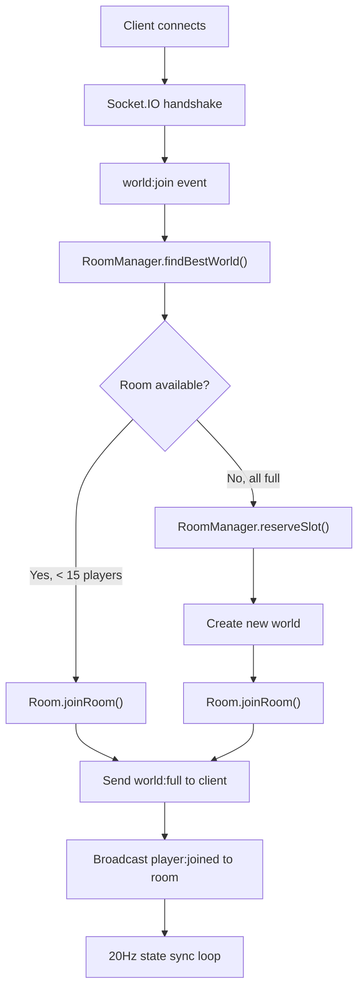
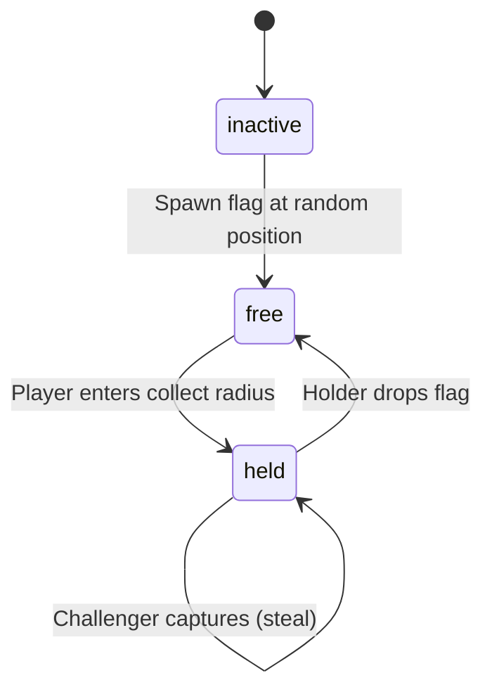

# Tiny Skies -- Multiplayer Networking

Multiplayer in Tiny Skies uses Socket.IO over WebSocket transport for real-time state synchronization between players in the same world. The architecture follows a client-server model: the server is authoritative for game state, and clients broadcast their position at 20Hz while receiving updates for all other players in the room.

Source: `tinyskies/server/src/index.ts` — Express + Socket.IO server
Source: `tinyskies/server/src/rooms/RoomManager.ts` — room lifecycle
Source: `tinyskies/server/src/rooms/Room.ts` — per-world room state
Source: `tinyskies/client/src/network/SocketClient.ts` — Socket.IO client
Source: `tinyskies/client/src/network/StateSync.ts` — client state broadcaster
Source: `tinyskies/client/src/game/RemotePlane.ts` — remote player interpolation

## Server Architecture



## Socket.IO Protocol

### Server-to-Client Events

```typescript
// shared/types.ts
interface ServerToClientEvents {
  "player:joined": (player: PlayerState) => void;
  "player:left": (playerId: string) => void;
  "player:update": (updates: PlayerState[]) => void;
  "world:state": (state: { players: PlayerState[], flags: FlagState[] }) => void;
  "world:config": (config: WorldConfig) => void;
  "world:full": (world: WorldConfig) => void;
  "paintball:fired": (data: PaintballFireEvent) => void;
  "paintball:hit": (data: PaintballHitEvent) => void;
  "flag:spawned": (data: FlagSpawnEvent) => void;
  "flag:collected": (data: FlagCollectedEvent) => void;
  "flag:capture_start": (data: FlagCaptureStartEvent) => void;
  "flag:capture_end": (data: FlagCaptureEndEvent) => void;
  "flag:stolen": (data: FlagStolenEvent) => void;
  "flag:dropped": (data: FlagDroppedEvent) => void;
  "flag:cleared": (data: FlagClearedEvent) => void;
  "flag:sync": (data: FlagSyncEvent) => void;
}
```

### Client-to-Server Events

```typescript
interface ClientToServerEvents {
  "player:move": (state: PlayerState) => void;
  "world:join": (data: { worldSlug?: string }) => void;
  "paintball:fire": (data: PaintballFireData) => void;
  "paintball:setUpgrades": (upgrades: PaintballUpgrades) => void;
  "flag:setSuppressed": (suppressed: boolean) => void;
  "debug:forceFlagSpawn": () => void;
}
```

## Room Manager

```typescript
// RoomManager.ts
const MAX_PLAYERS = 15;
const RESERVATION_TTL_MS = 15_000;

class RoomManager {
  private rooms = new Map<string, Room>();
  private reservations = new Map<string, { slug: string, expiresAt: number }>();

  getOrCreateRoom(slug: string): Room {
    if (!this.rooms.has(slug)) {
      this.rooms.set(slug, new Room(slug));
    }
    return this.rooms.get(slug)!;
  }

  // Find best world for auto-join: prefer non-full worlds
  async findBestWorld(): Promise<string> {
    // Query Prisma for worlds, sorted by player count
    // Return first non-full world slug
    // If all full, create new world
  }

  // Reservation system for auto-join overflow
  reserveSlot(slug: string): string {
    const reservationId = nanoid();
    this.reservations.set(reservationId, {
      slug,
      expiresAt: Date.now() + RESERVATION_TTL_MS,
    });
    return reservationId;
  }

  // Cleanup: remove empty unseeded worlds every 5 minutes
  startOverflowCleanup(): void {
    setInterval(() => {
      for (const [slug, room] of this.rooms) {
        if (!room.isSeeded && room.isEmpty()) {
          this.rooms.delete(slug);
        }
      }
    }, 5 * 60 * 1000);
  }
}
```

The **reservation system** handles the race condition where multiple players try to join the same world simultaneously. When a world is nearly full, the server issues a 15-second reservation slot. If the player connects within that window, they're admitted. Otherwise, they're routed to a different world.

## Room State Machine

```typescript
// Room.ts
class Room {
  private players = new Map<string, PlayerState>();
  private hotFlagMode: "inactive" | "free" | "held" = "inactive";
  private hotFlagHolderId: string | null = null;
  private hotFlagChallengers = new Map<string, { startMs: number, outOfRangeSinceMs: number }>();

  addPlayer(player: PlayerState): void {
    this.players.set(player.id, player);
    this.broadcast("player:joined", player);

    // Send existing players to new player
    this.broadcast("world:state", {
      players: Array.from(this.players.values()),
    });
  }

  removePlayer(playerId: string): void {
    this.players.delete(playerId);

    // If flag holder leaves, drop flag
    if (this.hotFlagHolderId === playerId) {
      this.dropFlag();
    }

    this.broadcast("player:left", playerId);
  }

  processFlag(delta: number): void {
    const now = Date.now();

    if (this.hotFlagMode === "free") {
      // Check each player's distance to flag position
      for (const [id, player] of this.players) {
        const dist = sphericalDistance(player.position, this.hotFlagPosition);
        if (dist < FLAG_COLLECT_RADIUS) {
          this.hotFlagMode = "held";
          this.hotFlagHolderId = id;
          this.broadcast("flag:collected", { playerId: id });
          break;
        }
      }
    } else if (this.hotFlagMode === "held") {
      // Process challengers
      for (const [cid, entry] of this.hotFlagChallengers) {
        const inRange = this.isInCaptureRange(cid);
        if (inRange && now - entry.startMs >= FLAG_CAPTURE_DURATION_MS) {
          // Successful capture — steal flag
          this.stealFlag(cid);
          return;
        } else if (!inRange && entry.outOfRangeSinceMs >= FLAG_CAPTURE_GRACE_MS) {
          // Challenger left capture range — remove
          this.hotFlagChallengers.delete(cid);
        }
      }

      // New challengers: players within capture radius of carrier
      const holder = this.players.get(this.hotFlagHolderId);
      if (holder) {
        for (const [id, player] of this.players) {
          if (id === this.hotFlagHolderId) continue;
          if (id === this.hotFlagHolderId || this.isInImmunityPeriod(id)) continue;
          const dist = sphericalDistance(player.position, holder.position);
          if (dist < FLAG_CAPTURE_RADIUS && !this.hotFlagChallengers.has(id)) {
            this.hotFlagChallengers.set(id, { startMs: now, outOfRangeSinceMs: 0 });
            this.broadcast("flag:capture_start", { challengerId: id });
          }
        }
      }
    }
  }

  private stealFlag(challengerId: string): void {
    const oldHolder = this.hotFlagHolderId;
    this.hotFlagHolderId = challengerId;
    this.setImmunity(challengerId, FLAG_IMMUNITY_MS);
    this.broadcast("flag:stolen", {
      newHolder: challengerId,
      oldHolder,
    });
    this.hotFlagChallengers.clear();
  }
}
```

### Flag State Machine



Flag suppression is used for cosmic void players — when the carpet enters the void, it suppresses flag events since combat doesn't apply in the void dimension.

## Paintball Combat (Server)

```typescript
// Room.ts — server-authoritative paintball
processPaintballFire(playerId: string, data: PaintballFireData): void {
  const player = this.players.get(playerId);
  if (!player) return;

  // Cooldown enforcement
  const now = Date.now();
  const elapsed = now - player.lastPaintballFireMs;

  // Double-tap burst: if second fire within PAINTBALL_BURST_WINDOW_MS
  if (elapsed < PAINTBALL_COOLDOWN_MS) {
    if (elapsed < PAINTBALL_BURST_WINDOW_MS) {
      // Burst fire allowed — send both projectiles
    } else {
      // Too early — ignore
      return;
    }
  }

  player.lastPaintballFireMs = now;

  // Broadcast fire event to all players
  this.broadcast("paintball:fired", {
    shooterId: playerId,
    direction: data.direction,
    color: data.color,
    upgrades: this.clampUpgrades(data.upgrades),
  });
}
```

**Upgrade clamping** prevents players from sending out-of-range upgrade values (e.g., speed > max). The server validates and clamps before broadcasting.

## State Sync (Client)

```typescript
// StateSync.ts
const SEND_INTERVAL_MS = 50;  // 20Hz

class StateSync {
  private lastSendMs = 0;

  update(delta: number): void {
    const now = Date.now();
    if (now - this.lastSendMs < SEND_INTERVAL_MS) return;
    this.lastSendMs = now;

    const state = {
      // Quaternion components (position on sphere)
      qx: player.position.x,
      qy: player.position.y,
      qz: player.position.z,
      qw: player.position.w,
      heading: player.heading,
      pitch: player.pitch,
      altitude: player.altitude,
      speed: player.speed,
      bankAngle: player.bankAngle,
      rollAngle: player.rollAngle,
      vehicle: player.vehicleType,
      hullColor: player.vehicleColor,
      carpetPortals: player.carpetPortals,
      carpetPortalTeleportSeq: player.portalTeleportSeq,
      timestamp: now,
    };

    // Boats send baseAltitude instead of altitude, zero pitch/bankAngle
    if (state.vehicle === "boat") {
      state.altitude = state.baseAltitude;
      state.pitch = 0;
      state.bankAngle = 0;
    }

    this.socket.emit("player:move", state);
  }
}
```

## Remote Player Interpolation

```typescript
// RemotePlane.ts
const MAX_BUFFER_SIZE = 6;
const INTERPOLATION_DELAY_MS = 100;
const CORRECTION_DURATION_MS = 150;

class RemotePlaneManager {
  private buffer = new Map<string, PlayerState[]>();  // Per-player snapshot buffer

  update(delta: number): void {
    for (const [id, snapshots] of this.buffer) {
      if (snapshots.length < 2) continue;

      // Interpolate between two snapshots with 100ms delay
      const targetTime = Date.now() - INTERPOLATION_DELAY_MS;
      const [prev, next] = this.findBracketingSnapshots(snapshots, targetTime);
      const t = (targetTime - prev.timestamp) / (next.timestamp - prev.timestamp);

      const interpolated = slerpPlayerState(prev, next, Math.max(0, Math.min(1, t)));
      this.renderRemote(interpolated);
    }
  }

  // Snap fade instead of interpolate for portal teleport
  handlePortalTeleport(playerId: string): void {
    this.buffer.get(playerId)?.clear();
    // Force snap to new position on next update
  }
}
```

**Interpolation delay** (100ms) means remote players are rendered slightly behind real-time. This smooths out network jitter at the cost of latency. The buffer stores up to 6 snapshots, providing about 300ms of history at 20Hz.

**Dead reckoning** predicts position between updates:

```typescript
function deadReckon(state: PlayerState, elapsed: number, globeRadius: number): PlayerState {
  // Move forward along heading at current speed
  const arcAngle = (state.speed * elapsed) / globeRadius;
  const newPosition = moveOnSphere(state.position, state.heading, arcAngle);
  return { ...state, position: newPosition };
}
```

When snapshots arrive with a gap (e.g., due to network delay), the client dead-reckons forward from the last known state. When the actual snapshot arrives, the correction is applied smoothly with a 150ms blending period to avoid visible snapping.

See [Server Architecture](12-server-architecture.md) for routes and database.
See [Quest Systems](06-quest-systems.md) for flag combat details.
