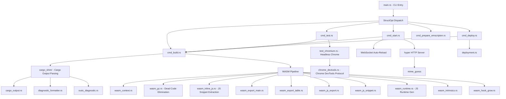

# Sub-Project Exploration: cargo-web

## Overview

**cargo-web** is a cargo subcommand designed to build, test, deploy, and serve Rust projects targeting the client-side web. It supports multiple compilation targets including `wasm32-unknown-unknown`, `wasm32-unknown-emscripten`, and `asmjs-unknown-emscripten`. The tool automates the entire build pipeline from compiling Rust to WASM, generating JavaScript runtime glue code, starting a development server with auto-reload, running tests in headless Chrome, and deploying production builds.

It was the primary build tool for the stdweb ecosystem and served as the equivalent of what `wasm-pack` became for the `wasm-bindgen` ecosystem.

## Architecture



## Directory Structure

```
cargo-web/
├── src/
│   ├── main.rs                      # CLI entry point, argv parsing
│   ├── lib.rs                       # Library root, CargoWebOpts enum, command dispatch
│   ├── build.rs                     # Core build pipeline (BuildArgs, Backend enum)
│   ├── config.rs                    # Web.toml configuration parsing
│   ├── error.rs                     # Error types
│   ├── package.rs                   # Cargo package metadata handling
│   ├── project_dirs.rs              # Project directory resolution
│   ├── utils.rs                     # Shared utilities
│   ├── http_utils.rs                # HTTP utilities for dev server
│   ├── emscripten.rs                # Emscripten SDK management
│   ├── deployment.rs                # Production deployment logic
│   │
│   ├── cmd_build.rs                 # `cargo web build` / `cargo web check`
│   ├── cmd_start.rs                 # `cargo web start` (dev server)
│   ├── cmd_test.rs                  # `cargo web test`
│   ├── cmd_deploy.rs                # `cargo web deploy`
│   ├── cmd_prepare_emscripten.rs    # `cargo web prepare-emscripten`
│   │
│   ├── cargo_shim/                  # Cargo subprocess management
│   │   ├── mod.rs                   # Cargo invocation and output streaming
│   │   ├── cargo_output.rs          # Structured cargo JSON output parsing
│   │   ├── diagnostic_formatter.rs  # Diagnostic message formatting
│   │   └── rustc_diagnostic.rs      # Rustc diagnostic type definitions
│   │
│   ├── wasm.rs                      # Low-level WASM binary manipulation
│   ├── wasm_context.rs              # WASM module context and metadata
│   ├── wasm_gc.rs                   # Dead code elimination for WASM
│   ├── wasm_inline_js.rs            # Extract inline JS from WASM custom sections
│   ├── wasm_intrinsics.rs           # WASM intrinsic function handling
│   ├── wasm_export_main.rs          # Main function export handling
│   ├── wasm_export_table.rs         # Function table export handling
│   ├── wasm_hook_grow.rs            # Memory grow hook injection
│   ├── wasm_js_export.rs            # JavaScript export generation
│   ├── wasm_js_snippet.rs           # JavaScript snippet compilation
│   ├── wasm_runtime.rs              # JavaScript runtime code generation
│   │
│   ├── test_chromium.rs             # Headless Chromium test runner
│   └── chrome_devtools.rs           # Chrome DevTools Protocol (CDP) client
│
├── build-scripts/                   # CI build scripts
├── ci/                              # CI configuration
├── integration-tests/               # Integration test crate
├── test-crates/                     # Test fixture crates (async-tests, cdylib, etc.)
├── Cargo.toml
├── Cargo.lock
└── README.md
```

## Key Components

### CLI and Command Dispatch

The CLI uses `structopt` (built on `clap`) to parse arguments. The main enum `CargoWebOpts` dispatches to six subcommands: Build, Check, Deploy, PrepareEmscripten, Start, and Test. The `run()` function in `lib.rs` is the central dispatch point.

**Supported targets:**
- `wasm32-unknown-unknown` (native WASM, default)
- `wasm32-unknown-emscripten` (Emscripten WASM)
- `asmjs-unknown-emscripten` (asm.js via Emscripten)

### WASM Processing Pipeline

After cargo compiles the Rust code, cargo-web performs several post-processing steps on the WASM binary:

1. **Context extraction** (`wasm_context.rs`) - Parses the WASM binary using `parity-wasm`, extracts metadata
2. **Inline JS extraction** (`wasm_inline_js.rs`) - Extracts JavaScript snippets embedded via the `js!` macro from WASM custom sections
3. **Dead code elimination** (`wasm_gc.rs`) - Removes unused functions and data
4. **Export handling** (`wasm_export_main.rs`, `wasm_export_table.rs`, `wasm_js_export.rs`) - Processes `#[js_export]` functions
5. **Memory growth hooks** (`wasm_hook_grow.rs`) - Injects hooks for WASM memory growth events
6. **Runtime generation** (`wasm_runtime.rs`) - Generates JavaScript runtime code from Handlebars templates

### Runtime Kinds

The runtime generator supports multiple output formats:

- **Standalone** - Self-contained HTML+JS that fetches and instantiates WASM
- **Library ES6** - ES6 module export for use with bundlers
- **WebExtension** - For browser extensions
- **OnlyLoader** - Minimal loader (experimental)

### Cargo Shim

The `cargo_shim` module wraps cargo subprocess invocation:
- Parses cargo's JSON output format
- Formats rustc diagnostics with ANSI colors
- Handles streaming output from long-running builds

### Dev Server (`cmd_start.rs`)

Uses `hyper` to serve the built project with:
- File watching via `notify` crate
- Auto-rebuild on file changes
- WebSocket-based auto-reload in the browser
- Configurable host/port binding

### Test Runner (`cmd_test.rs`, `test_chromium.rs`)

Supports two test backends:
- **Node.js** - Runs tests in Node.js
- **Headless Chromium** - Uses Chrome DevTools Protocol to run tests in a real browser

## Entry Points

### `main.rs`
- Parses `CARGO_WEB_LOG` environment variable for logging
- Strips the `web` subcommand from argv (since cargo invokes as `cargo-web web build`)
- Handles deprecated `--target-*` flags
- Dispatches to `run(CargoWebOpts)` in `lib.rs`

## Dependencies

| Dependency | Version | Purpose |
|------------|---------|---------|
| structopt | 0.2.14 | CLI argument parsing |
| clap | 2 | CLI framework (via structopt) |
| parity-wasm | 0.35 | WASM binary parsing and manipulation |
| hyper | 0.12 | HTTP server for dev mode |
| websocket | 0.21 | WebSocket for auto-reload |
| handlebars | 1 | JavaScript runtime template engine |
| notify | 4 | Filesystem watching |
| reqwest | 0.9 | HTTP client (Emscripten download) |
| cargo_metadata | 0.6 | Cargo workspace metadata |
| serde/serde_json | 1 | JSON serialization |
| sha1/sha2 | 0.6/0.8 | Hashing for cache keys |
| regex | 1 | Pattern matching in WASM processing |
| rustc-demangle | 0.1.5 | Demangling Rust symbols |
| failure | 0.1 | Error handling |
| mime_guess | 1 | MIME type detection for dev server |

## Key Insights

- cargo-web is effectively a complete WASM toolchain: it compiles, links, post-processes, generates runtime JS, serves, tests, and deploys
- The WASM post-processing pipeline is where the `js!` macro's inline JavaScript snippets are extracted from custom sections and woven into the generated runtime
- The Chrome DevTools Protocol integration enables true browser testing, not just Node.js
- The Handlebars-based runtime templating system allows clean separation of runtime logic from generation code
- The project uses older dependency versions throughout (hyper 0.12, futures 0.1, failure instead of thiserror) reflecting its 2017-2019 era origins
- Dead code elimination in `wasm_gc.rs` was critical since early WASM toolchains did not perform adequate tree-shaking
