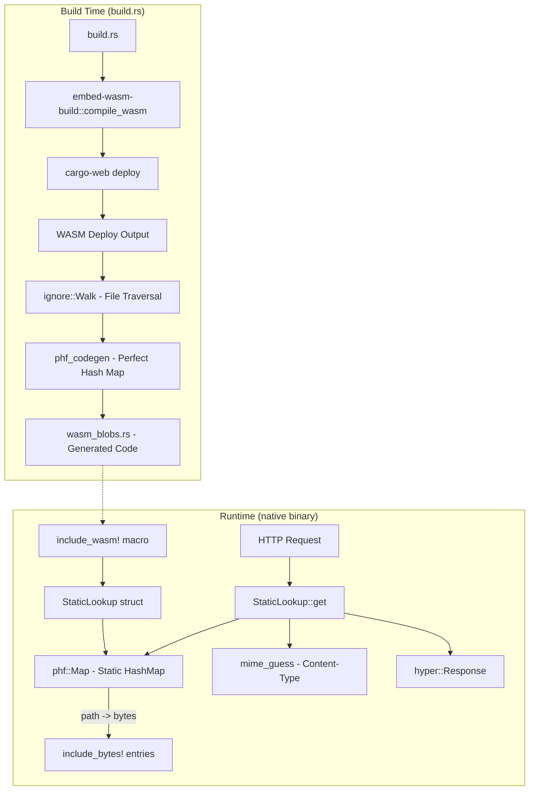
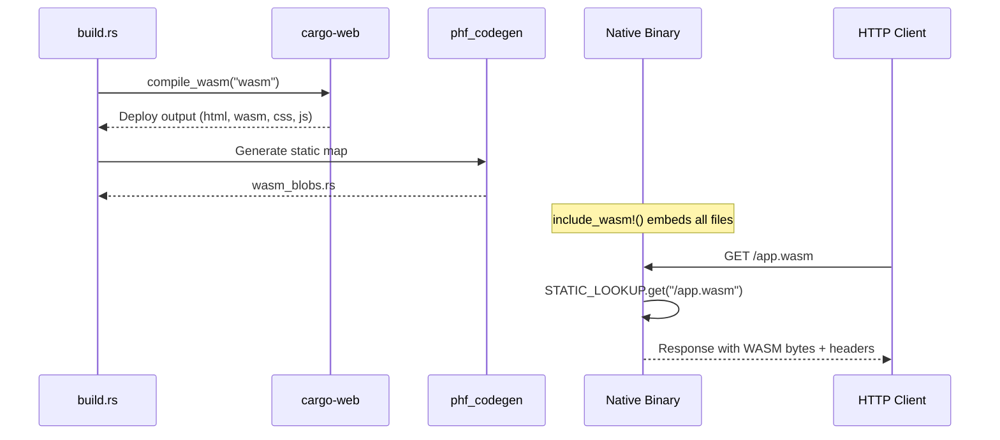

# Sub-Project Exploration: embed-wasm

## Overview

**embed-wasm** is a Rust library for embedding WASM build output (compiled Rust WASM and associated HTML/CSS/JS files) directly into native Rust binaries. This enables building single-binary applications that serve dynamic WASM frontends, eliminating the need for separate static file hosting. The project consists of two crates: a build-time crate that compiles and embeds WASM artifacts, and a runtime crate that serves them as HTTP responses.

The library was authored by Inanna Malick and depends on `cargo-web` for the WASM compilation step.

## Architecture



## Directory Structure

```
embed-wasm/
├── Cargo.toml                    # Workspace root
├── Cargo.lock
├── embed-wasm/                   # Runtime crate
│   ├── Cargo.toml
│   ├── src/
│   │   └── lib.rs                # StaticLookup, IndexHandling, include_wasm! macro
│   └── README.md
├── embed-wasm-build/             # Build-time crate
│   ├── Cargo.toml
│   ├── src/
│   │   └── lib.rs                # compile_wasm() function
│   └── README.md
├── .circleci/                    # CI configuration
├── LICENSE
└── README.md
```

## Key Components

### embed-wasm-build (Build-time Crate)

The `compile_wasm()` function orchestrates the entire build pipeline:

1. Determines the build profile (debug/release) from `PROFILE` env var
2. Creates a temporary output directory in `OUT_DIR`
3. Invokes `cargo-web deploy` programmatically via `CargoWebOpts::Deploy`
4. Traverses the deploy output directory using `ignore::Walk` (respects .gitignore)
5. Generates static byte arrays using `include_bytes!` for each file
6. Builds a perfect hash function (PHF) map from file paths to byte identifiers
7. Writes the generated code to `wasm_blobs.rs` in `OUT_DIR`
8. Registers `cargo:rerun-if-changed` hooks for all WASM source files

### embed-wasm (Runtime Crate)

Provides two key types:

- **`IndexHandling`** - Enum controlling whether `/` maps to `index.html`
- **`StaticLookup`** - Wraps a `phf::Map<&str, &[u8]>` and provides `get(path) -> Option<Response<Body>>`

The `include_wasm!` macro:
- Includes the generated `wasm_blobs.rs`
- Creates a static `STATIC_LOOKUP` instance with `MapEmptyPathToIndex` behavior

The `get()` method:
- Strips the leading `/` from the path
- Maps empty paths to `index.html` (if configured)
- Looks up the file in the PHF map
- Infers MIME type via `mime_guess`
- Sets `Content-Type`, `Accept-Ranges`, and `Content-Length` headers
- Returns a `hyper::Response<Body>`

## Data Flow



## Dependencies

### embed-wasm (runtime)
| Dependency | Purpose |
|------------|---------|
| phf | Perfect hash function map for O(1) static content lookup |
| hyper | HTTP response construction |
| headers | Typed HTTP header insertion |
| mime_guess | MIME type inference from file extensions |

### embed-wasm-build (build-time)
| Dependency | Purpose |
|------------|---------|
| cargo-web | WASM compilation and deployment |
| phf_codegen | PHF map code generation |
| ignore | .gitignore-aware directory traversal |
| structopt | CLI option construction for cargo-web |

## Key Insights

- The PHF (Perfect Hash Function) approach provides O(1) lookup for static content at runtime with zero startup cost
- The library directly depends on cargo-web as a library (not a CLI tool), invoking it programmatically
- The `include_bytes!` pattern means all WASM artifacts are baked into the binary at compile time, resulting in a single distributable executable
- This pattern is particularly useful for tools that need to serve a web UI (dashboards, monitoring tools, etc.)
- The project requires Rust nightly due to a bug fix for a stable regression (noted in README)
- There is a TODO noting that cargo-web may not be under active development, suggesting the author was aware of the ecosystem shift toward wasm-bindgen/wasm-pack
