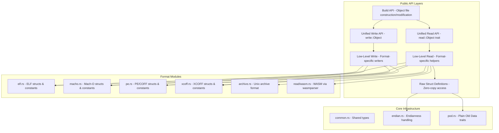

# Sub-Project Exploration: object

## Overview

**object** is a Rust crate providing a unified interface for reading and writing object files across platforms. It supports ELF, Mach-O, PE/COFF, XCOFF, WASM, and Unix archive formats. The crate is used as part of the Rust compiler's toolchain (`rustc-dep-of-std`) and is maintained under the `gimli-rs` organization. It provides multiple API levels: raw struct definitions for zero-copy access, low-level helpers, a unified high-level read API, and a unified write API.

This is a mature, widely-used crate (v0.36.7) with an MSRV of 1.65. It is `#![no_std]` by default with optional `std` and `alloc` features.

## Architecture



## Directory Structure

```
object/
├── Cargo.toml                     # Feature-gated dependencies, workspace config
├── build.rs                       # MSRV compatibility (cfg flags)
├── src/
│   ├── lib.rs                     # Crate root, no_std, feature flags
│   ├── common.rs                  # Shared types (SectionKind, SymbolKind, etc.)
│   ├── endian.rs                  # Endianness abstraction (Pod-safe)
│   ├── pod.rs                     # Plain-Old-Data trait for zero-copy
│   ├── elf.rs                     # ELF format raw definitions
│   ├── macho.rs                   # Mach-O format raw definitions
│   ├── pe.rs                      # PE/COFF format raw definitions
│   ├── xcoff.rs                   # XCOFF format raw definitions
│   ├── archive.rs                 # Archive format raw definitions
│   ├── read/                      # Read API
│   │   ├── mod.rs                 # Read module root
│   │   ├── any.rs                 # Unified File type (dispatches to format-specific)
│   │   ├── traits.rs              # Object, ObjectSection, ObjectSymbol traits
│   │   ├── archive.rs             # Archive reader
│   │   ├── wasm.rs                # WASM format reader
│   │   ├── read_ref.rs            # ReadRef trait for borrowing
│   │   ├── read_cache.rs          # Cached reading
│   │   ├── gnu_compression.rs     # GNU compressed section handling
│   │   └── util.rs                # Read utilities
│   ├── write/                     # Write API
│   │   ├── mod.rs                 # Write module root
│   │   ├── macho.rs               # Mach-O writer
│   │   ├── pe.rs                  # PE writer
│   │   ├── xcoff.rs               # XCOFF writer
│   │   ├── string.rs              # String table builder
│   │   └── util.rs                # Write utilities
│   └── build/                     # Build API (construct/modify object files)
│       ├── mod.rs                 # Build module root
│       ├── elf.rs                 # ELF builder
│       ├── bytes.rs               # Byte buffer utilities
│       ├── error.rs               # Build error types
│       └── table.rs               # Table construction
├── crates/
│   ├── examples/                  # Example programs (readobj, objdump, simple_write)
│   └── rewrite/                   # Object file rewriting tool
├── tests/
│   ├── build/                     # Build API tests (ELF)
│   ├── read/                      # Read API tests (COFF, ELF, Mach-O)
│   └── round_trip/                # Round-trip read/write tests
├── testfiles/                     # Test binary fixtures
├── xtask/                         # Build automation tasks
└── .github/                       # GitHub CI workflows
```

## Key Components

### Feature System

The crate uses an extensive feature system to control compilation:

- **Read features:** `read_core`, `read` (all formats + unaligned)
- **Write features:** `write_core`, `write_std`, `write` (all formats)
- **Build features:** `build_core`, `build`
- **Format features:** `archive`, `coff`, `elf`, `macho`, `pe`, `wasm`, `xcoff`
- **Misc features:** `std`, `compression` (flate2 + ruzstd), `unaligned`
- **Special:** `rustc-dep-of-std` for building as part of libstd

The default features enable all read formats with compression support.

### Unified Read API

The `read::Object` trait provides a format-agnostic interface:
- Sections, symbols, relocations, dynamic symbols
- The `read::File` type auto-detects the format and dispatches to the correct implementation
- Zero-copy where possible via `ReadRef` trait

### Unified Write API

The `write::Object` type constructs relocatable object files:
- Supports COFF, ELF, Mach-O, XCOFF output
- Manages sections, symbols, relocations
- Does not support writing executable files (use low-level writers for that)

### Build API

Higher-level API for constructing or modifying object files:
- Can read an existing file and modify it
- Currently supports ELF format
- Used by the `rewrite` example crate

### Zero-Copy Design

The `Pod` trait (Plain Old Data) enables zero-cost casting between byte slices and struct references:
- No deserialization step needed
- Endian-aware field access via the `endian` module
- Critical for performance when parsing large binaries

## Dependencies

| Dependency | Version | Purpose |
|------------|---------|---------|
| memchr | 2.4.1 | Fast byte searching |
| crc32fast | 1.2 | CRC32 checksum (write support) |
| flate2 | 1 | Zlib decompression (compressed sections) |
| ruzstd | 0.7.0 | Zstd decompression |
| wasmparser | 0.222.0 | WASM binary parsing |
| indexmap | 2.0 | Ordered maps (write support) |
| hashbrown | 0.15.0 | Hash map (write support, no_std) |

## Key Insights

- This crate is part of the Rust compiler toolchain itself (`rustc-dep-of-std` feature), making it extremely well-tested and stable
- The `no_std` default with granular features makes it usable in embedded and WASM contexts
- The multi-level API design (raw structs / low-level / unified) accommodates different use cases from raw binary analysis to high-level tooling
- WASM format support requires the `wasmparser` dependency, connecting it to the broader Rust WASM tooling ecosystem
- The `unaligned` feature allows processing files that do not follow strict alignment specifications
- The build API is the newest addition, enabling higher-level object file manipulation (read-modify-write)
- Version 0.36.7 indicates rapid iteration with many minor releases for format support additions
