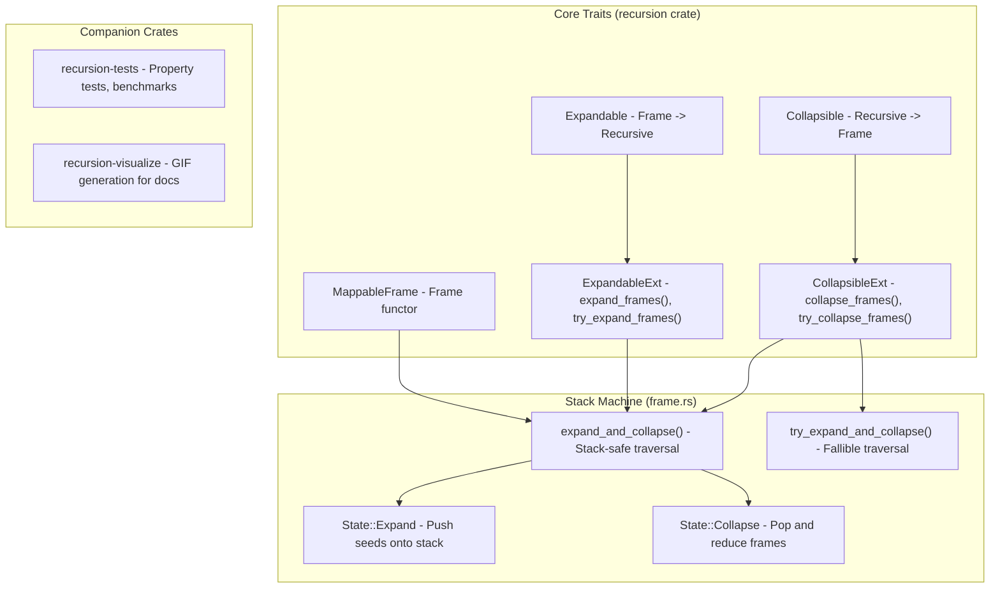
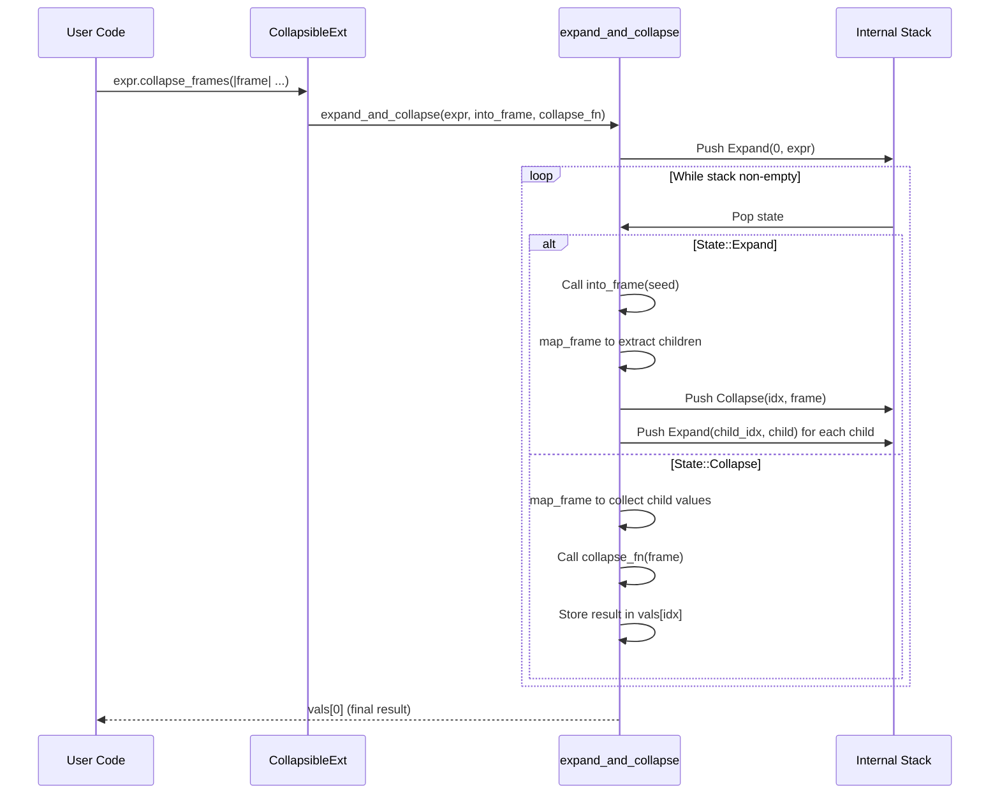

# Sub-Project Exploration: recursion

## Overview

**recursion** is a Rust crate providing tools for working with recursive data structures in a concise, stack-safe, and performant manner. It implements recursion schemes, a set of abstractions from functional programming (originating in Haskell) that separate the machinery of recursion from the logic of recursion. The crate enables collapsing recursive structures (catamorphisms), expanding structures from seeds (anamorphisms), and combining both, all without risking stack overflows.

The key insight is that instead of working with recursive types directly, you define a "frame" type where recursive references are replaced with a generic parameter, then use combinators to compose recursive operations.

## Architecture



## Directory Structure

```
recursion/
├── Cargo.toml                     # Workspace root
├── README.md                      # Comprehensive documentation with GIF visualizations
├── build_docs.sh                  # Documentation build script
├── docs/                          # Pre-built documentation
├── recursion/                     # Core crate
│   ├── Cargo.toml                 # v0.5.2, optional tokio/futures for experimental
│   ├── README.md
│   └── src/
│       ├── lib.rs                 # Crate root, re-exports core traits
│       ├── frame.rs               # MappableFrame trait, expand_and_collapse engine
│       └── recursive.rs           # Module re-exports
│           ├── collapse.rs        # Collapsible trait + CollapsibleExt
│           └── expand.rs          # Expandable trait + ExpandableExt
├── recursion-tests/               # Test crate
│   ├── Cargo.toml
│   ├── src/
│   │   ├── lib.rs
│   │   └── expr.rs                # Expr test fixture with MappableFrame impl
│   └── benches/
│       ├── expr.rs                # Expression evaluation benchmarks
│       └── list.rs                # List traversal benchmarks
└── recursion-visualize/           # Visualization crate
    ├── Cargo.toml
    ├── src/
    │   ├── lib.rs
    │   └── visualize.rs           # GIF generation for documentation
    └── examples/
        └── expr.rs                # Generate expr evaluation GIFs
```

## Key Components

### MappableFrame Trait

The foundational abstraction, equivalent to Haskell's `Functor` for type constructors:

```rust
pub trait MappableFrame {
    type Frame<X>;
    fn map_frame<A, B>(input: Self::Frame<A>, f: impl FnMut(A) -> B) -> Self::Frame<B>;
}
```

Uses GATs (Generic Associated Types) and the `PartiallyApplied` marker enum to work around Rust's inability to implement traits on partially-applied types.

### Collapsible Trait (Catamorphism / fold)

Defines how to decompose a recursive structure into a frame:

```rust
pub trait Collapsible {
    type FrameToken: MappableFrame;
    fn into_frame(self) -> <Self::FrameToken as MappableFrame>::Frame<Self>;
}
```

The `CollapsibleExt` trait provides:
- `collapse_frames(f: Frame<Out> -> Out) -> Out` - Infallible bottom-up reduction
- `try_collapse_frames(f: Frame<Out> -> Result<Out, E>) -> Result<Out, E>` - Fallible reduction

### Expandable Trait (Anamorphism / unfold)

Defines how to construct a recursive structure from a frame:

```rust
pub trait Expandable {
    type FrameToken: MappableFrame;
    fn from_frame(val: <Self::FrameToken as MappableFrame>::Frame<Self>) -> Self;
}
```

The `ExpandableExt` trait provides:
- `expand_frames(seed, f: Seed -> Frame<Seed>) -> Self` - Build structure from seed
- `try_expand_frames(seed, f: Seed -> Result<Frame<Seed>, E>) -> Result<Self, E>` - Fallible expansion

### Stack-Safe Engine (frame.rs)

The core `expand_and_collapse()` function implements a stack machine that avoids call-stack recursion:

1. Maintains a `Vec<State>` as an explicit stack
2. `State::Expand(idx, seed)` - Expand a seed into a frame, push children
3. `State::Collapse(idx, frame)` - Collect child results, apply collapse function
4. Uses a `Vec<Option<Out>>` values array with index-based references
5. Depth-first traversal: expands and collapses each branch in turn

This design guarantees stack safety regardless of recursion depth (limited only by heap).

### Experimental Features

The `experimental` feature gate enables async support via `tokio` and `futures`, allowing recursive operations in async contexts.

## Data Flow



## Dependencies

| Dependency | Version | Purpose |
|------------|---------|---------|
| futures | 0.3 | Async support (optional, experimental) |
| tokio | 1.19 | Async runtime (optional, experimental) |

The core crate has **zero required dependencies**.

## Key Insights

- The crate translates Haskell recursion schemes (cata/anamorphisms) into idiomatic Rust using GATs
- The `PartiallyApplied` marker type is a clever workaround for Rust's lack of higher-kinded types
- Stack safety is achieved through an explicit heap-allocated stack, trading call-stack overflows for heap memory usage
- The crate is heavily documented with animated GIFs showing step-by-step execution
- The benchmarks and tests use an expression language (`Expr`) as the canonical example, evaluating arithmetic trees
- The author has interacted with Rust compiler developers about GAT-related bugs, pushing the boundaries of Rust's type system
- This pattern is particularly valuable for compilers, interpreters, and tree transformations where deep recursion is common
- The zero-dependency core makes it suitable for embedding in any Rust project
