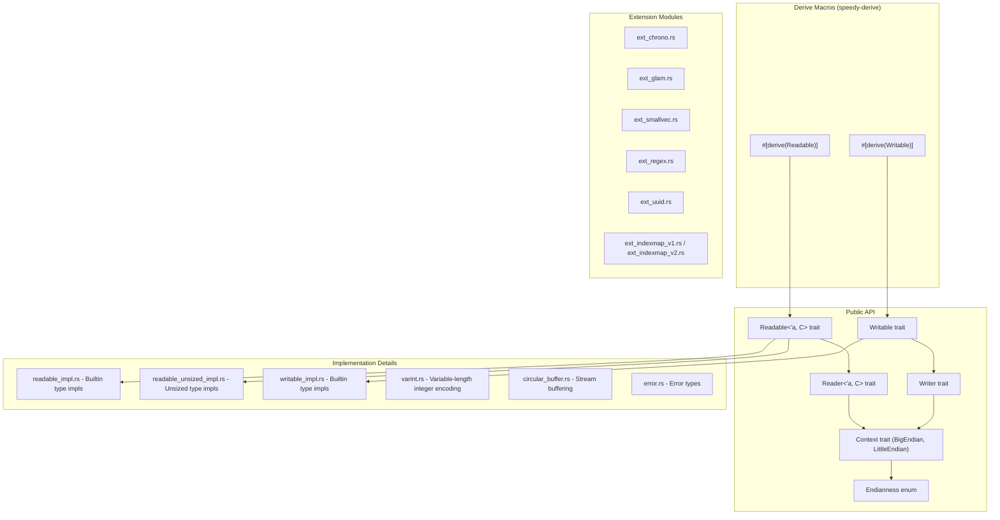

# Sub-Project Exploration: speedy

## Overview

**speedy** is a fast binary serialization framework for Rust. It provides `Readable` and `Writable` traits along with derive macros for automatic implementation, enabling efficient serialization with explicit endianness control. The crate is designed for performance-critical scenarios where the overhead of text-based formats (JSON, TOML) or self-describing binary formats (bincode, MessagePack) is unacceptable.

The crate is authored by Jan Bujak (Koute, same author as stdweb) and is at version 0.8.7. It supports `no_std` with optional `alloc` and `std` features.

## Architecture



## Directory Structure

```
speedy/
├── Cargo.toml                     # v0.8.7, workspace root
├── README.md                      # Comprehensive usage documentation
├── src/
│   ├── lib.rs                     # Crate root, feature-gated modules, basic tests
│   ├── readable.rs                # Readable trait definition
│   ├── readable_impl.rs           # Readable for primitives, Vec, String, etc.
│   ├── readable_unsized_impl.rs   # Readable for Cow<[T]>, Cow<str>
│   ├── reader.rs                  # Reader trait (buffer, stream, etc.)
│   ├── writable.rs                # Writable trait definition
│   ├── writable_impl.rs           # Writable for primitives, Vec, String, etc.
│   ├── writer.rs                  # Writer trait (buffer, stream, vec)
│   ├── context.rs                 # Context, BigEndian, LittleEndian
│   ├── endianness.rs              # Endianness enum (Little, Big, Native)
│   ├── error.rs                   # Error and IsEof types
│   ├── varint.rs                  # Variable-length integer encoding
│   ├── circular_buffer.rs         # Circular buffer for stream reading (std only)
│   ├── utils.rs                   # Internal utilities
│   ├── private.rs                 # Private/hidden implementation details
│   ├── ext_chrono.rs              # chrono DateTime support
│   ├── ext_glam.rs                # glam vector/matrix support
│   ├── ext_smallvec.rs            # SmallVec support
│   ├── ext_regex.rs               # Regex support
│   ├── ext_uuid.rs                # UUID support
│   ├── ext_indexmap_v1.rs         # indexmap v1 support
│   └── ext_indexmap_v2.rs         # indexmap v2 support
├── speedy-derive/                 # Proc-macro crate
│   ├── Cargo.toml
│   └── src/lib.rs                 # #[derive(Readable, Writable)] implementation
├── static-tests/                  # Compile-time assertion tests
│   ├── Cargo.toml
│   ├── src/lib.rs
│   └── tests/tests.rs
├── tests/
│   └── serialization_tests.rs     # Integration tests
├── benches/
│   └── bench.rs                   # Performance benchmarks
├── ci/                            # CI scripts
├── LICENSE-APACHE
└── LICENSE-MIT
```

## Key Components

### Core Traits

**`Readable<'a, C: Context>`** - Deserialize from a reader:
- `read_from<R: Reader<'a, C>>(reader: &mut R) -> Result<Self, C::Error>`
- Convenience methods: `read_from_buffer()`, `read_from_stream_buffered()`, `read_from_stream_unbuffered()`

**`Writable<C: Context>`** - Serialize to a writer:
- `write_to<T: Writer<C>>(&self, writer: &mut T) -> Result<(), C::Error>`
- Convenience methods: `write_to_vec()`, `write_to_buffer()`, `write_to_stream()`

**`Context`** - Endianness context:
- `BigEndian` and `LittleEndian` zero-sized types
- `Endianness` enum with `LittleEndian`, `BigEndian`, and `NATIVE` constant

**`Reader<'a, C>`** - Reading interface:
- `read_u8()`, `read_u16()`, `read_u32()`, `read_u64()`, `read_bytes()`
- Buffer readers (zero-copy) and stream readers (with circular buffer)

**`Writer<C>`** - Writing interface:
- `write_u8()`, `write_u16()`, `write_u32()`, `write_u64()`, `write_bytes()`
- Vec writer, buffer writer, stream writer

### Derive Macros

The `speedy-derive` crate provides `#[derive(Readable, Writable)]` with field attributes:

- `#[speedy(length = expr)]` - Variable-length field based on another field
- `#[speedy(length_type = u16)]` - Custom length prefix type
- `#[speedy(varint)]` - Variable-length integer encoding
- `#[speedy(skip)]` - Skip field during serialization
- `#[speedy(default_on_eof)]` - Default value when stream ends early
- `#[speedy(constant_prefix = bytes)]` - Expect a constant prefix

### Varint Encoding

Variable-length integer encoding for space efficiency:
- Small values use fewer bytes
- Larger values use more bytes with continuation bits
- Useful for lengths, counts, and sparse enums

### Extension Modules

Feature-gated support for popular crate types:
- **chrono** - DateTime serialization
- **glam** - Vector and matrix types (game/graphics math)
- **smallvec** - SmallVec serialization
- **regex** - Regex pattern serialization
- **uuid** - UUID serialization
- **indexmap** - Both v1 and v2 IndexMap support

## Dependencies

| Dependency | Version | Purpose |
|------------|---------|---------|
| memoffset | 0.9 | Struct field offset calculation |
| speedy-derive | 0.8.7 | Derive macros (optional, default) |
| chrono | 0.4 | DateTime support (optional) |
| glam | 0.15-0.29 | Math type support (optional) |
| smallvec | 1 | SmallVec support (optional) |
| regex | 1 | Regex support (optional) |
| uuid | 1 | UUID support (optional) |
| indexmap | 1/2 | Ordered map support (optional) |

## Key Insights

- The `no_std` + `alloc` support makes speedy usable in WASM and embedded contexts, complementing the stdweb ecosystem
- The `Context` trait with zero-sized types (`BigEndian`/`LittleEndian`) enables compile-time endianness selection with zero runtime cost
- The `Endianness` enum provides runtime endianness selection when needed
- The reader supports both zero-copy buffer reading (where data is borrowed) and stream reading (with an internal circular buffer)
- The `default_on_eof` attribute enables forward-compatible serialization: older data can be read by newer code
- The `length` attribute with expressions allows encoding protocols where one field determines another's length
- Performance is prioritized: `panic = "abort"` in release profile, `memoffset` for efficient struct access
- The wide version range for `glam` (0.15-0.29) shows commitment to supporting users across many glam versions
- Static tests ensure compile-time guarantees about the derive macro output
