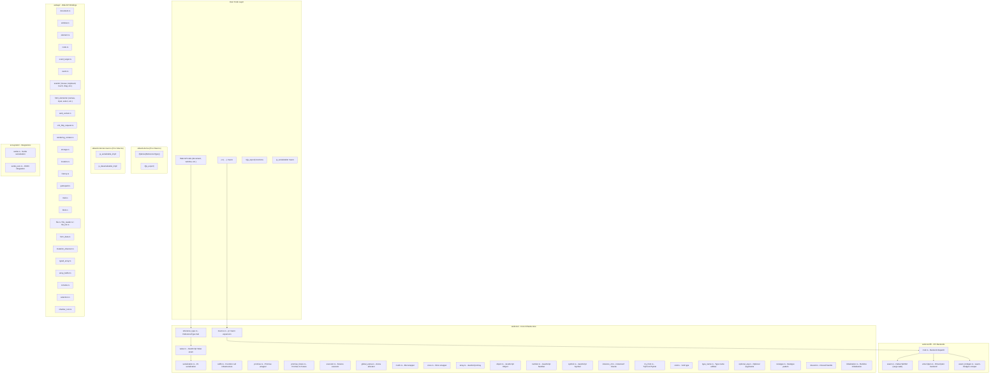

# Sub-Project Exploration: stdweb (Core Library)

## Overview

**stdweb** is the core library providing Rust bindings to Web APIs with high-level interoperability between Rust and JavaScript. It is the central crate in the ecosystem, offering the `js!` macro for inline JavaScript, comprehensive Web API bindings (DOM, events, Canvas, WebSocket, XHR, etc.), serde integration, closure passing between Rust and JavaScript, and the `#[js_export]` attribute for exposing Rust functions to JavaScript.

Version 0.4.20, authored by Jan Bujak, the crate supports three backends: native WASM (via cargo-web), Emscripten, and wasm-bindgen compatibility mode.

## Architecture



## Directory Structure

```
stdweb/
├── Cargo.toml                     # v0.4.20, feature-gated dependencies
├── build.rs                       # Rustc version detection
├── Web.toml                       # cargo-web config
├── README.md                      # Extensive usage documentation
├── CONTRIBUTING.md
├── src/
│   ├── lib.rs                     # Crate root with extensive documentation
│   ├── webcore/                   # Core infrastructure (19 files)
│   │   ├── mod.rs
│   │   ├── macros.rs              # js! macro expansion logic
│   │   ├── value.rs               # Value enum (Undefined, Null, Bool, Number, String, Reference)
│   │   ├── reference_type.rs      # ReferenceType trait
│   │   ├── serialization.rs       # JavaScript value serialization
│   │   ├── callfn.rs              # Function calling infrastructure
│   │   ├── promise.rs             # Promise wrapper
│   │   ├── promise_future.rs      # Promise-to-Future bridge
│   │   ├── executor.rs            # Minimal futures executor
│   │   ├── global_arena.rs        # Arena allocator for JS values
│   │   ├── initialization.rs      # Runtime init
│   │   ├── instance_of.rs         # instanceof checks
│   │   ├── mutfn.rs               # Mut<FnMut> wrapper
│   │   ├── once.rs                # Once<FnOnce> wrapper
│   │   ├── array.rs               # JS Array type
│   │   ├── object.rs              # JS Object type
│   │   ├── number.rs              # JS Number type
│   │   ├── symbol.rs              # JS Symbol type
│   │   ├── try_from.rs            # TryFrom/TryInto bridge
│   │   ├── type_name.rs           # Type name utilities
│   │   ├── void.rs                # Void type
│   │   ├── newtype.rs             # Newtype helpers
│   │   ├── optional_arg.rs        # Optional argument handling
│   │   ├── discard.rs             # Discard handle (closure cleanup)
│   │   ├── unsafe_typed_array.rs  # Unsafe typed array access
│   │   └── ffi/                   # FFI backends
│   │       ├── mod.rs             # Backend dispatch via cfg
│   │       ├── wasm.rs            # Native WASM backend
│   │       ├── emscripten.rs      # Emscripten backend
│   │       └── wasm_bindgen.rs    # wasm-bindgen compatibility
│   ├── webapi/                    # Web API bindings (40+ files)
│   │   ├── mod.rs
│   │   ├── document.rs            # Document interface
│   │   ├── window.rs              # Window interface
│   │   ├── element.rs             # Element interface
│   │   ├── node.rs                # Node interface
│   │   ├── event_target.rs        # EventTarget interface
│   │   ├── event.rs               # Base event types
│   │   ├── events/                # Event subtypes
│   │   │   ├── mod.rs
│   │   │   ├── mouse.rs           # Click, MouseDown, MouseUp, etc.
│   │   │   ├── keyboard.rs        # KeyDown, KeyUp, KeyPress
│   │   │   ├── touch.rs           # TouchStart, TouchMove, etc.
│   │   │   ├── drag.rs            # DragStart, DragEnd, etc.
│   │   │   ├── focus.rs           # Focus, Blur
│   │   │   ├── socket.rs          # WebSocket events
│   │   │   ├── progress.rs        # Progress events
│   │   │   ├── pointer.rs         # Pointer events
│   │   │   ├── gamepad.rs         # Gamepad events
│   │   │   ├── history.rs         # PopState events
│   │   │   ├── dom.rs             # DOMContentLoaded, etc.
│   │   │   └── slot.rs            # Slot change events
│   │   ├── html_elements/         # Specific HTML elements
│   │   │   ├── mod.rs
│   │   │   ├── canvas.rs          # CanvasElement
│   │   │   ├── input.rs           # InputElement
│   │   │   ├── textarea.rs        # TextAreaElement
│   │   │   ├── select.rs          # SelectElement
│   │   │   ├── option.rs          # OptionElement
│   │   │   ├── image.rs           # ImageElement
│   │   │   ├── template.rs        # TemplateElement
│   │   │   └── slot.rs            # SlotElement
│   │   ├── rendering_context.rs   # Canvas 2D + WebGL
│   │   ├── web_socket.rs          # WebSocket API
│   │   ├── xml_http_request.rs    # XMLHttpRequest
│   │   ├── blob.rs                # Blob API
│   │   ├── file.rs / file_reader.rs / file_list.rs
│   │   ├── form_data.rs           # FormData API
│   │   ├── storage.rs             # localStorage/sessionStorage
│   │   ├── location.rs            # Location API
│   │   ├── history.rs             # History API
│   │   ├── gamepad.rs             # Gamepad API
│   │   ├── midi.rs                # Web MIDI API
│   │   ├── mutation_observer.rs   # MutationObserver
│   │   ├── typed_array.rs         # TypedArray bindings
│   │   ├── array_buffer.rs        # ArrayBuffer bindings
│   │   ├── console.rs             # Console API
│   │   ├── selection.rs           # Selection API
│   │   ├── shadow_root.rs         # Shadow DOM
│   │   └── ...
│   └── ecosystem/                 # Third-party integrations
│       ├── mod.rs
│       ├── serde.rs               # Serde Serializer/Deserializer for Value
│       └── serde_json.rs          # serde_json integration
├── stdweb-derive/                 # Procedural macros
│   ├── Cargo.toml                 # v0.5.3
│   └── src/lib.rs                 # ReferenceType derive, js_export
├── stdweb-internal-macros/        # Internal procedural macros
│   ├── Cargo.toml                 # v0.2.9
│   └── src/lib.rs                 # js_serializable_impl!, js_deserializable_impl!
├── stdweb-internal-runtime/       # JavaScript runtime support
│   ├── Cargo.toml                 # v0.1
│   └── src/lib.rs                 # Runtime JS as Rust string constants
├── stdweb-internal-test-macro/    # Test macro support
│   ├── Cargo.toml                 # v0.1
│   └── src/lib.rs                 # async_test attribute
├── examples/                      # Example projects
│   ├── Cargo.toml
│   ├── minimal/                   # Alert example
│   ├── todomvc/                   # TodoMVC application
│   ├── hasher/                    # Export Rust to JS
│   ├── canvas/                    # Canvas 2D drawing
│   ├── webgl/                     # WebGL rendering
│   ├── echo/                      # WebSocket echo
│   ├── drag/                      # Drag and drop
│   ├── futures/                   # Futures/async
│   ├── gamepad/                   # Gamepad API
│   ├── hasher-parcel/             # Parcel bundler integration
│   └── wasm-bindgen-minimal/      # wasm-bindgen compat
├── standalone-tests/              # Standalone test crate
├── benchmarks/                    # Performance benchmarks
└── info/                          # Additional documentation
```

## Key Components

### Value Type System

The `Value` enum represents all JavaScript values in Rust:

```
Value::Undefined | Value::Null | Value::Bool(bool) | Value::Number(Number)
      | Value::String(String) | Value::Reference(Reference)
```

`Reference` wraps a JavaScript object reference managed by the runtime.

### ReferenceType Trait

All Web API types implement `ReferenceType`:
- `from_reference_unchecked(Reference) -> Self`
- `as_reference(&self) -> &Reference`

This enables dynamic type checking via `instanceof` and safe downcasting.

### FFI Backends

Three backend implementations selected via `cfg` attributes:
- **wasm.rs** - Native WASM32 target via cargo-web, uses custom sections for JS snippets
- **emscripten.rs** - Emscripten target, uses emscripten_asm_const
- **wasm_bindgen.rs** - wasm-bindgen compatibility layer

### Closure Handling

Two wrapper types for passing Rust closures to JavaScript:
- **`Once<F>`** - For `FnOnce` closures (called once, then consumed)
- **`Mut<F>`** - For `FnMut` closures (called multiple times, requires explicit `.drop()`)

### Memory Management

- **Arena allocator** (`global_arena.rs`) - Bulk allocation/deallocation for JS values
- **ArenaRestorePoint** - RAII guard that frees all arena allocations when dropped
- **Discard handles** - For managing closure lifetimes

## Dependencies

| Dependency | Version | Purpose |
|------------|---------|---------|
| discard | 1.0.3 | Discard handle pattern |
| serde | 1 | Serialization (optional, default) |
| serde_json | 1 | JSON integration (optional, default) |
| futures-*-preview | 0.3.0-alpha.15 | Async support (optional) |
| stdweb-derive | 0.5.3 | Proc macros (path dependency) |
| stdweb-internal-macros | 0.2.9 | Internal macros (path dependency) |
| stdweb-internal-runtime | 0.1 | JS runtime code (path dependency) |
| wasm-bindgen | 0.2 | wasm-bindgen compat (conditional) |

## Key Insights

- The crate provides the most comprehensive hand-written Web API bindings in Rust, covering DOM, events, Canvas, WebGL, WebSocket, XHR, Gamepad, MIDI, Shadow DOM, and more
- The three-backend architecture (native WASM, Emscripten, wasm-bindgen) provided maximum compatibility at the cost of implementation complexity
- The `js!` macro was innovative but ultimately lost to wasm-bindgen's `#[wasm_bindgen]` approach due to lack of compile-time JavaScript validation
- The arena allocator for JS values was necessary because each JS interop call requires marshaling data across the WASM/JS boundary
- The crate depends on preview versions of the futures crate, showing it was being developed during Rust's async stabilization period
- The extensive examples directory (TodoMVC, Canvas, WebGL, etc.) served as both documentation and integration tests
- wasm-bindgen compatibility mode was added as a migration path, acknowledging the ecosystem shift
