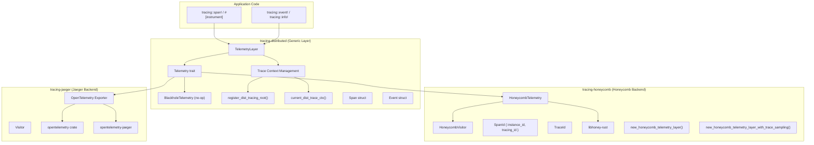

# Sub-Project Exploration: tracing-honeycomb

## Overview

**tracing-honeycomb** is a suite of crates for publishing distributed trace telemetry from Rust applications. It builds on the `tracing` ecosystem and provides:

1. **tracing-distributed** - A generic `TelemetryLayer` for publishing spans and events to arbitrary backends
2. **tracing-honeycomb** - A concrete implementation using [honeycomb.io](https://honeycomb.io) as the backend
3. **tracing-jaeger** - An alternative implementation using Jaeger/OpenTelemetry as the backend

The project enables distributed tracing across multiple services, correlating spans via trace IDs and parent span IDs.

## Architecture



## Directory Structure

```
tracing-honeycomb/
├── Cargo.toml                     # Workspace root
├── README.md                      # Overview and links
├── LICENSE                        # MIT
├── images/                        # Documentation images
├── .circleci/                     # CI configuration
├── tracing-distributed/           # Generic telemetry layer
│   ├── Cargo.toml                 # v0.2.0
│   ├── README.md
│   └── src/
│       ├── lib.rs                 # Exports: TelemetryLayer, Telemetry, BlackholeTelemetry
│       ├── telemetry.rs           # Telemetry trait + BlackholeTelemetry
│       ├── telemetry_layer.rs     # TelemetryLayer implementation
│       └── trace.rs               # Trace context: register_dist_tracing_root, current_dist_trace_ctx
├── tracing-honeycomb/             # Honeycomb.io backend
│   ├── Cargo.toml                 # v0.2.1
│   ├── README.md
│   ├── examples/
│   │   └── async_tracing.rs       # Async tracing example with tokio
│   └── src/
│       ├── lib.rs                 # Factory functions, re-exports
│       ├── honeycomb.rs           # HoneycombTelemetry implementation
│       └── visitor.rs             # HoneycombVisitor for span/event field extraction
└── tracing-jaeger/                # Jaeger/OpenTelemetry backend
    ├── Cargo.toml                 # v0.1.0
    ├── README.md
    ├── examples/
    │   └── async_tracing.rs       # Async tracing example
    └── src/
        ├── lib.rs                 # Exports
        ├── opentelemetry.rs       # OpenTelemetry exporter implementation
        └── visitor.rs             # Visitor for field extraction
```

## Key Components

### tracing-distributed

The generic foundation crate:

**`Telemetry` trait** - Backend interface:
- Report completed spans with timing, fields, and parent info
- Report events associated with spans
- `BlackholeTelemetry` provided as a no-op implementation for testing

**`TelemetryLayer`** - A `tracing_subscriber::Layer` that:
- Captures span enter/exit timing
- Collects span fields via visitors
- Associates events with their parent spans
- Calls the `Telemetry` backend when spans close
- Manages distributed trace context (trace ID + span ID)

**Trace Context Management:**
- `register_dist_tracing_root(trace_id, remote_parent_span)` - Mark current span as trace root
- `current_dist_trace_ctx()` - Retrieve trace context for propagation to other services

### tracing-honeycomb

Honeycomb.io-specific implementation:

**`SpanId { instance_id: u64, tracing_id: u64 }`** - Combines a random instance identifier (per process) with the tracing subscriber's span ID for global uniqueness

**`TraceId`** - Trace identifier for correlating spans across services

**`HoneycombTelemetry`** - Implements `Telemetry`:
- Uses `libhoney-rust` to send events to honeycomb.io
- Supports optional trace-level sampling (modulo on TraceId)
- Note: trace-level sampling is different from libhoney's event-level sampling; it ensures all spans in a sampled trace are sent

**Factory functions:**
- `new_honeycomb_telemetry_layer()` - Standard layer
- `new_honeycomb_telemetry_layer_with_trace_sampling()` - With trace-level sampling
- `new_blackhole_telemetry_layer()` - No-op for testing

### tracing-jaeger

OpenTelemetry/Jaeger backend:
- Uses `opentelemetry` 0.5.0 and `opentelemetry-jaeger` 0.4.0
- Alternative to Honeycomb for self-hosted tracing infrastructure

## Dependencies

### tracing-distributed
| Dependency | Version | Purpose |
|------------|---------|---------|
| tracing | 0.1.12 | Tracing framework |
| tracing-core | 0.1.9 | Core tracing types |
| tracing-subscriber | 0.2.0 | Layer infrastructure |
| itertools | 0.9 | Iterator utilities |
| parking_lot | 0.11.1 | Fast mutex (optional) |

### tracing-honeycomb
| Dependency | Version | Purpose |
|------------|---------|---------|
| tracing-distributed | 0.2.0 | Generic layer (path dependency) |
| libhoney-rust | 0.1.3 | Honeycomb.io API client |
| rand | 0.7 | Random instance ID generation |
| chrono | 0.4.9 | Timestamp handling |
| parking_lot | 0.11.1 | Fast mutex (optional) |

### tracing-jaeger
| Dependency | Version | Purpose |
|------------|---------|---------|
| tracing-distributed | 0.2.0 | Generic layer (path dependency) |
| opentelemetry | 0.5.0 | OpenTelemetry API |
| opentelemetry-jaeger | 0.4.0 | Jaeger exporter |
| rand | 0.7 | Random ID generation |

## Key Insights

- The layered architecture (generic distributed layer + specific backends) is a clean separation of concerns
- Trace-level sampling (vs. event-level) is a critical feature for distributed tracing: you either want all spans in a trace or none
- The `SpanId` design combining `instance_id` + `tracing_id` ensures uniqueness across processes without coordination
- The `parking_lot` optional feature indicates performance sensitivity in high-throughput tracing scenarios
- The older dependency versions (tracing 0.1, rand 0.7, futures-preview) date this to the 2019-2020 era
- The BlackholeTelemetry implementation enables testing instrumented code without a backend
- The project supports the `use_parking_lot` feature across all crates for consistent locking behavior
- This crate predates the now-standard `tracing-opentelemetry` crate, which has largely superseded it
