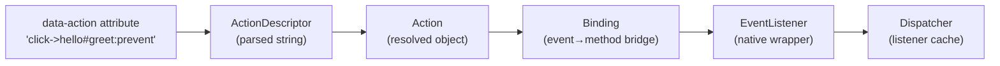
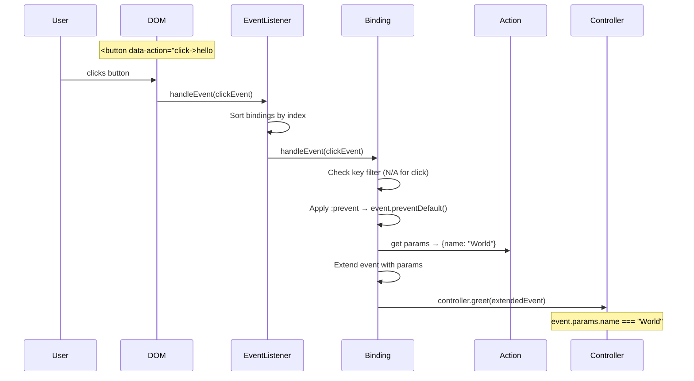

# Deep Dive: Action System

The action system is how Stimulus connects DOM events to controller methods. It spans six files and involves parsing attribute strings, creating event bindings, managing event listeners, and dispatching events to the correct controller method with the correct parameters.

## The Pipeline



## Step 1: Action Descriptor Parsing

**File:** `src/core/action_descriptor.ts`

The action descriptor string follows this grammar:
```
[eventName[@keyFilter]]->identifier#methodName[:option1[:option2]]
```

Examples:
```
click->hello#greet                    # Basic: click event, hello controller, greet method
keydown.enter->search#submit          # Key filter (legacy dot syntax)
keydown@enter->search#submit          # Key filter (@ syntax)
click->hello#greet:prevent:stop       # With options
resize@window->layout#update          # Window event target
input->search#filter:debounce(300)    # Custom filter with params
```

The parser uses a regex to extract:
- `eventName` — the DOM event name
- `keyFilter` — optional keyboard key filter
- `eventTarget` — `window`, `document`, or the element itself
- `identifier` — controller identifier
- `methodName` — method to call
- `eventOptions` — array of `:stop`, `:prevent`, `:self`, `:once`, `:capture`, `:passive`, or custom filters

### Default Event Names

When no event name is specified (e.g., `->hello#greet`), the framework infers defaults based on element tag:

| Element | Default Event |
|---|---|
| `<a>` | `click` |
| `<button>` | `click` |
| `<details>` | `toggle` |
| `<form>` | `submit` |
| `<input>` | `input` |
| `<select>` | `change` |
| `<textarea>` | `input` |
| Everything else | `click` |

Input elements with `type="submit"` default to `click` instead of `input`.

## Step 2: Action Object

**File:** `src/core/action.ts`

An `Action` combines the parsed descriptor with runtime context:

```typescript
class Action {
  readonly element: Element           // The element with data-action
  readonly index: number              // Position in the attribute (for ordering)
  readonly eventTarget: EventTarget   // window, document, or element
  readonly eventName: string          // Resolved event name
  readonly eventOptions: AddEventListenerOptions  // capture, once, passive
  readonly identifier: string         // Controller identifier
  readonly methodName: string         // Method to call
  readonly keyFilter: string          // Keyboard key filter
  readonly schema: Schema             // For key mappings
}
```

**Action parameters** are extracted from sibling data attributes:
```html
<button data-action="click->item#delete"
        data-item-id-param="42"
        data-item-confirm-param="true">
```
The `params` getter scans for `data-{identifier}-*-param` attributes and returns `{id: "42", confirm: "true"}` with type coercion (numbers, booleans, objects parsed from JSON).

## Step 3: Binding

**File:** `src/core/binding.ts`

A `Binding` connects an `Action` to a controller method via a `Context`. It's the object that actually gets called when an event fires.

```typescript
class Binding {
  readonly context: Context
  readonly action: Action

  handleEvent(event: Event): void {
    // 1. Apply action descriptor filters (custom registered filters)
    // 2. Check willBeInvokedByEvent (key filter match)
    // 3. Apply modifiers: :stop, :prevent, :self
    // 4. Extract params from data attributes
    // 5. Invoke controller method with extended event
  }
}
```

**Modifier application order:**
1. `:stop` → `event.stopPropagation()`
2. `:prevent` → `event.preventDefault()`
3. `:self` → skip if `event.target !== action.element`
4. Custom filters via `registerActionOption()`

**Key filter matching:**
For keyboard events, the `keyFilter` (e.g., `enter`, `ctrl+a`) is checked against the event. The schema provides key mappings (e.g., `enter` → `"Enter"`). Modifier keys (`meta`, `ctrl`, `alt`, `shift`) are supported.

## Step 4: EventListener

**File:** `src/core/event_listener.ts`

Wraps a native `addEventListener` call and manages multiple Bindings for the same event on the same target.

```typescript
class EventListener implements EventListenerObject {
  readonly eventTarget: EventTarget
  readonly eventName: string
  readonly eventOptions: AddEventListenerOptions
  private unorderedBindings: Set<Binding>

  handleEvent(event: Event): void {
    // Extend event with immediatePropagationStopped tracking
    // Call each binding in order (sorted by index)
    // Stop if immediatePropagationStopped
  }
}
```

**Key detail:** Bindings are sorted by their `action.index` (position in the `data-action` attribute) before invocation, ensuring deterministic ordering.

**Event extension:** The event is extended with an `immediatePropagationStopped` flag and `stopImmediatePropagation()` is wrapped to set it, allowing the framework to bail out of further binding invocation.

## Step 5: Dispatcher

**File:** `src/core/dispatcher.ts`

The central event listener cache. Ensures only one native `addEventListener` exists per `(eventTarget, eventName, eventOptions)` tuple.

```typescript
class Dispatcher {
  private eventListenerMaps: Map<EventTarget, Map<string, EventListener>>

  bindingConnected(binding: Binding): void {
    // Find or create EventListener for this binding's event
    // Add binding to the EventListener
  }

  bindingDisconnected(binding: Binding): void {
    // Remove binding from EventListener
    // If no bindings remain, remove EventListener and native listener
  }
}
```

**Lifecycle:** EventListeners are created lazily on first binding and removed when the last binding disconnects. This prevents unnecessary event listeners on the DOM.

## Step 6: BindingObserver

**File:** `src/core/binding_observer.ts`

Watches the DOM for `data-action` attribute changes and manages the Binding lifecycle.

Uses `ValueListObserver<Action>` which uses `TokenListObserver` → `AttributeObserver` → `ElementObserver` → native `MutationObserver`.

When a new action token appears in `data-action`:
1. `parseValueForToken()` creates an `Action` from the token
2. `elementMatchedValue()` creates a `Binding` and calls `dispatcher.bindingConnected()`

When a token disappears:
1. `elementUnmatchedValue()` calls `dispatcher.bindingDisconnected()`

## Complete Flow: Click Event



## Custom Action Filters

**File:** `src/core/application.ts`

Applications can register custom action filters:

```typescript
application.registerActionOption("throttle", ({ event, value }) => {
  // Return true to allow the action, false to block
})
```

These are checked in `Binding.handleEvent()` via the `applyFilterToAction()` method. The filter receives `{ name, value, event, element }` where `value` comes from parsing the option string (e.g., `:throttle(300)` passes `"300"`).

Built-in filters:
- `:stop` — `event.stopPropagation()`
- `:prevent` — `event.preventDefault()`
- `:self` — only fire if `event.target === element`

## Design Observations

- **Declarative binding** — The entire event→controller→method mapping lives in HTML, not JavaScript. Controllers never manually call `addEventListener`.
- **Ordered execution** — Action index (position in attribute) determines invocation order, giving HTML authors control over execution sequence.
- **Deduplication** — One native event listener per `(target, event, options)` tuple regardless of how many bindings exist. Efficient for pages with many controllers.
- **Parameter passing** — The `data-*-param` pattern enables passing data from HTML to controller methods without data attributes on the controller element itself, enabling reusable actions on child elements.
- **Key filter complexity** — Keyboard filtering supports modifier keys, key combinations, and the full key mapping schema. This is a significant feature for accessibility.
