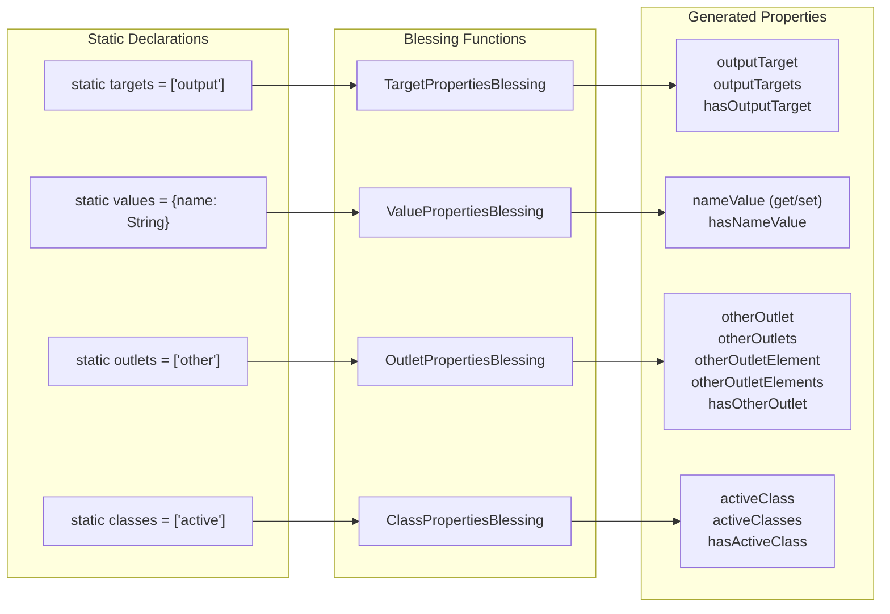

# Deep Dive: The Blessing System

The blessing system is Stimulus's metaprogramming engine. It dynamically injects computed properties (getters/setters) onto controller classes for targets, values, outlets, and CSS classes — turning static declarations like `static targets = ["output"]` into live accessor properties like `this.outputTarget`, `this.outputTargets`, and `this.hasOutputTarget`.

## How Blessings Work

### The Problem
When a user writes:
```typescript
class HelloController extends Controller {
  static targets = ["output"]
  // Wants: this.outputTarget, this.outputTargets, this.hasOutputTarget
}
```

These accessor properties don't exist on the class. Stimulus needs to add them dynamically based on the static declarations.

### The Solution: Shadow Prototypes

**File:** `src/core/blessing.ts`

```typescript
function bless<T>(constructor: Blessable<T>): Constructor<T> {
  const shadowConstructor = extend(constructor)
  const shadowProperties = shadow(constructor.blessings, shadowConstructor)
  Object.defineProperties(shadowConstructor.prototype, shadowProperties)
  return shadowConstructor
}
```

1. **`extend(constructor)`** — Creates a shadow constructor using `Reflect.construct` that inherits from the original but has its own prototype
2. **`shadow(blessings, constructor)`** — Calls each blessing function to get `PropertyDescriptorMap`s, merges them
3. **`Object.defineProperties()`** — Installs the computed properties on the shadow prototype

The shadow prototype chain means:
```
ShadowConstructor.prototype → UserController.prototype → Controller.prototype
```

Blessed properties live on the shadow prototype, keeping the original class clean.

### When Blessings Are Applied

Blessings run when `blessDefinition()` is called in `Module` construction:

```typescript
// definition.ts
function blessDefinition(definition: Definition): Definition {
  return {
    identifier: definition.identifier,
    controllerConstructor: bless(definition.controllerConstructor),
  }
}
```

This happens once per `router.loadDefinition()` — i.e., once per controller registration, not per instance.

## The Four Blessings

### 1. TargetPropertiesBlessing

**File:** `src/core/target_properties.ts`

For each entry in `static targets = ["name"]`, creates three properties:

| Property | Type | Behavior |
|---|---|---|
| `nameTarget` | `Element` | Returns first matching target; throws if missing |
| `nameTargets` | `Element[]` | Returns all matching targets |
| `hasNameTarget` | `boolean` | Returns whether at least one target exists |

Reads from `this.targets.find(name)` and `this.targets.findAll(name)` which query the Scope's TargetSet.

Uses `readInheritableStaticArrayValues()` to collect targets from the entire class hierarchy (supports inheritance).

### 2. ValuePropertiesBlessing

**File:** `src/core/value_properties.ts`

For each entry in `static values = { name: String, count: { type: Number, default: 0 } }`, creates:

| Property | Type | Behavior |
|---|---|---|
| `nameValue` | getter/setter | Reads from/writes to `data-{identifier}-name-value` attribute with type coercion |
| `hasNameValue` | `boolean` | Whether the data attribute exists |

**Type coercion rules:**

| Type | Reader (attribute → JS) | Writer (JS → attribute) |
|---|---|---|
| Array | `JSON.parse(value)` | `JSON.stringify(value)` |
| Boolean | `!(value == "0" \|\| value == "false")` | `value.toString()` |
| Number | `Number(value.replace(/_/g, ""))` | `value.toString()` |
| Object | `JSON.parse(value)` | `JSON.stringify(value)` |
| String | `value` | `value` |

**Default values:** Each type has a zero-value default (`[]`, `false`, `0`, `{}`, `""`). Can be overridden with `{ type: Number, default: 42 }` syntax.

### 3. OutletPropertiesBlessing

**File:** `src/core/outlet_properties.ts`

For each entry in `static outlets = ["other-controller"]`, creates five properties:

| Property | Type | Behavior |
|---|---|---|
| `otherControllerOutlet` | `Controller` | Returns first connected outlet controller; throws if missing |
| `otherControllerOutlets` | `Controller[]` | Returns all connected outlet controllers |
| `otherControllerOutletElement` | `Element` | Returns first outlet element; throws if missing |
| `otherControllerOutletElements` | `Element[]` | Returns all outlet elements |
| `hasOtherControllerOutlet` | `boolean` | Whether at least one outlet is connected |

Outlet properties use `namespaceCamelize()` which handles the `--` namespace separator in identifiers (e.g., `my--component` → `myComponent`).

The outlet getter also calls `this.outlets.find()` which queries the DOM via CSS selector stored in `data-{identifier}-{outlet}-outlet` attribute, and verifies the matched element has the outlet controller's identifier.

### 4. ClassPropertiesBlessing

**File:** `src/core/class_properties.ts`

For each entry in `static classes = ["active"]`, creates three properties:

| Property | Type | Behavior |
|---|---|---|
| `activeClass` | `string` | Returns the class from `data-{identifier}-active-class`; throws if missing |
| `activeClasses` | `string[]` | Returns space-split class list |
| `hasActiveClass` | `boolean` | Whether the class attribute exists |

## Inheritance Support

**File:** `src/core/inheritable_statics.ts`

All blessings use `readInheritableStaticArrayValues()` or `readInheritableStaticObjectPairs()` to collect static declarations from the entire prototype chain:

```typescript
class BaseController extends Controller {
  static targets = ["shared"]
}
class ChildController extends BaseController {
  static targets = ["specific"]
}
// ChildController gets: sharedTarget, specificTarget, etc.
```

The reader walks up the prototype chain via `Object.getPrototypeOf()` and collects values in ancestor-first order, ensuring parent declarations come before child declarations.

## Architecture Diagram



## Design Observations

- **Shadow prototypes avoid mutation** — The original controller class is never modified, which is important for class reuse and testing
- **One-time cost** — Blessings run once at registration, not per instance. All instances share the same blessed prototype
- **Inheritance-aware** — Static declarations are collected from the full class hierarchy, enabling meaningful controller inheritance
- **Error-on-access pattern** — Singular target/outlet/class getters throw descriptive errors when elements are missing, rather than returning null. This is a conscious API design choice favoring explicit failure
