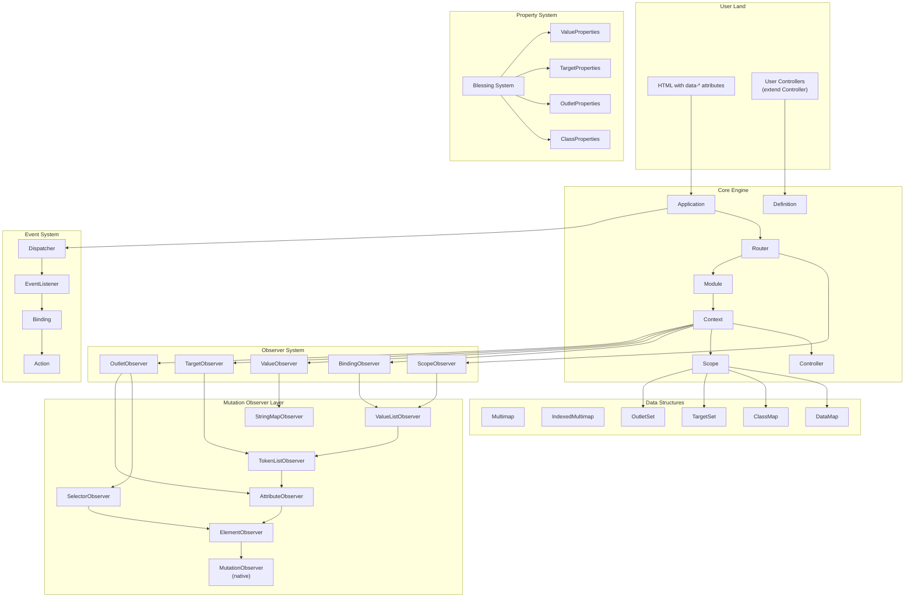
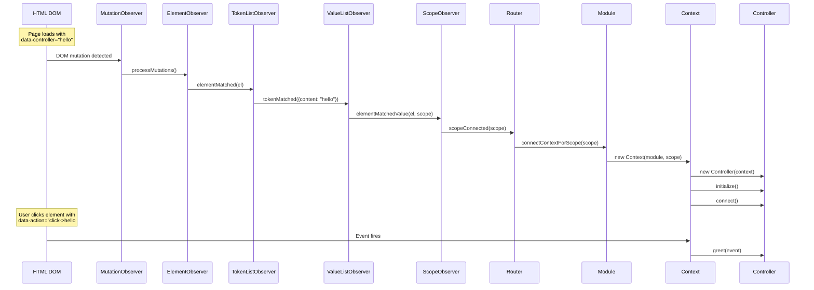
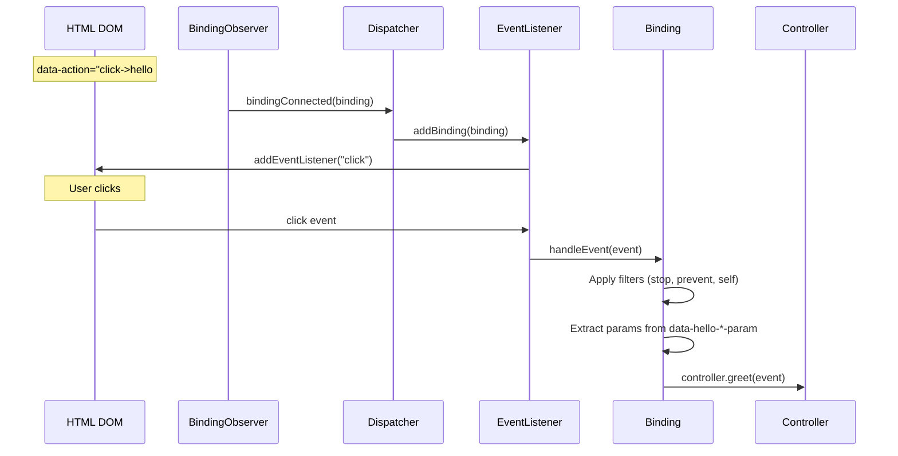

# Project Exploration: Stimulus

## Overview

Stimulus is a modest JavaScript framework created by Basecamp (now 37signals) for adding behavior to existing HTML. Unlike virtual-DOM frameworks that own the entire rendering pipeline, Stimulus takes a fundamentally different approach: it watches the DOM for annotated HTML attributes and automatically connects JavaScript controller objects to elements. The framework's tagline — "a modest JavaScript framework for the HTML you already have" — captures its philosophy precisely.

Stimulus is part of the Hotwire stack (alongside Turbo) and is designed for server-rendered applications where HTML arrives from the server and JavaScript adds progressive enhancement. Controllers are connected to DOM elements via `data-controller` attributes, actions are bound via `data-action` attributes, and elements within a controller's scope are referenced via `data-*-target` attributes. The framework handles all lifecycle management automatically through MutationObserver-based DOM watching.

The codebase is approximately 3,500 lines of TypeScript organized into three internal modules: `core` (the framework engine), `mutation-observers` (a layered DOM observation system), and `multimap` (data structures for bidirectional key-value tracking). The architecture is clean and compositional — each layer builds on the one below it through delegate interfaces, and the entire system is driven by native browser MutationObserver events.

## Repository

- **Location:** `/home/darkvoid/Boxxed/@formulas/src.UIFrameworks/src.basecamp/stimulus/`
- **Remote:** `git@github.com:hotwired/stimulus`
- **Primary Language:** TypeScript
- **License:** MIT
- **Version:** 3.2.2
- **Author:** Basecamp, LLC (David Heinemeier Hansson, Javan Makhmali, Sam Stephenson)

## Directory Structure

```
stimulus/
├── assets/                          # Logo and marketing images
│   ├── bc3-clipboard-ui.png
│   └── logo.svg
├── docs/
│   ├── handbook/                    # Tutorial-style documentation (7 chapters)
│   │   ├── 00_the_origin_of_stimulus.md
│   │   ├── 01_introduction.md
│   │   ├── 02_hello_stimulus.md
│   │   ├── 03_building_something_real.md
│   │   ├── 04_designing_for_resilience.md
│   │   ├── 05_managing_state.md
│   │   ├── 06_working_with_external_resources.md
│   │   └── 07_installing_stimulus.md
│   └── reference/                   # API reference documentation
│       ├── actions.md
│       ├── controllers.md
│       ├── css_classes.md
│       ├── lifecycle_callbacks.md
│       ├── outlets.md
│       ├── targets.md
│       ├── using_typescript.md
│       └── values.md
├── examples/                        # Standalone example app (Express + Webpack)
│   ├── controllers/                 # Example controllers (clipboard, hello, slideshow, tabs)
│   ├── views/                       # EJS templates
│   ├── public/                      # Static assets
│   ├── server.js                    # Express dev server
│   ├── webpack.config.js
│   └── package.json
├── packages/
│   └── stimulus/                    # Published npm package wrapper
│       ├── package.json             # Re-exports from @hotwired/stimulus
│       ├── index.js / index.d.ts
│       ├── rollup.config.js
│       └── webpack-helpers.js/.d.ts # Webpack require.context() helpers
├── src/
│   ├── core/                        # Framework engine (26 files)
│   │   ├── index.ts                 # Public API exports
│   │   ├── application.ts           # Top-level Application class
│   │   ├── controller.ts            # Base Controller class
│   │   ├── router.ts                # Routes scopes to modules
│   │   ├── module.ts                # Groups contexts for a controller definition
│   │   ├── context.ts               # Connects controller to scope + observers
│   │   ├── scope.ts                 # DOM element + identifier boundary
│   │   ├── schema.ts                # Attribute naming conventions
│   │   ├── definition.ts            # Controller identifier + constructor pair
│   │   ├── action.ts                # Parsed action from data-action attribute
│   │   ├── action_descriptor.ts     # Action string parser (e.g., "click->ctrl#method")
│   │   ├── action_event.ts          # Extended event interface with params
│   │   ├── binding.ts               # Connects action to controller method
│   │   ├── binding_observer.ts      # Watches for action attribute changes
│   │   ├── dispatcher.ts            # Central event listener manager
│   │   ├── event_listener.ts        # Native addEventListener wrapper
│   │   ├── blessing.ts              # Shadow prototype property injection
│   │   ├── class_map.ts             # CSS class attribute mapping
│   │   ├── class_properties.ts      # Class blessing (creates class accessors)
│   │   ├── data_map.ts              # Controller-scoped data attribute access
│   │   ├── guide.ts                 # Deprecation warning system
│   │   ├── inheritable_statics.ts   # Static property inheritance reader
│   │   ├── outlet_observer.ts       # Watches for outlet attribute changes
│   │   ├── outlet_properties.ts     # Outlet blessing (creates outlet accessors)
│   │   ├── outlet_set.ts            # Outlet element queries
│   │   ├── scope_observer.ts        # Watches for data-controller changes
│   │   ├── selectors.ts             # CSS selector generation for token attributes
│   │   ├── string_helpers.ts        # camelize, dasherize, tokenize
│   │   ├── target_observer.ts       # Watches for target attribute changes
│   │   ├── target_properties.ts     # Target blessing (creates target accessors)
│   │   ├── target_set.ts            # Target element queries
│   │   ├── value_observer.ts        # Watches for value data attribute changes
│   │   ├── value_properties.ts      # Value blessing (creates typed value accessors)
│   │   ├── logger.ts                # Console logger interface
│   │   ├── error_handler.ts         # Error handler interface
│   │   ├── constructor.ts           # Generic constructor type
│   │   └── utils.ts                 # isSomething, hasProperty helpers
│   ├── multimap/                    # Data structures (4 files)
│   │   ├── index.ts
│   │   ├── multimap.ts              # Map<K, Set<V>> wrapper
│   │   ├── indexed_multimap.ts      # Multimap with reverse index
│   │   └── set_operations.ts        # Atomic Map<K,Set<V>> operations
│   ├── mutation-observers/          # Layered DOM observation (7 files)
│   │   ├── index.ts
│   │   ├── element_observer.ts      # Base MutationObserver wrapper
│   │   ├── attribute_observer.ts    # Single-attribute presence tracking
│   │   ├── selector_observer.ts     # CSS selector matching
│   │   ├── string_map_observer.ts   # Attribute-to-key mapping
│   │   ├── token_list_observer.ts   # Space-separated token tracking
│   │   └── value_list_observer.ts   # Token-to-typed-value parsing
│   ├── tests/                       # QUnit test suite
│   │   ├── cases/                   # Test base classes
│   │   ├── controllers/             # Test controller implementations
│   │   ├── fixtures/                # HTML fixtures
│   │   └── modules/                 # Test modules (core + mutation-observers)
│   ├── index.ts                     # Main entry point (re-exports core)
│   ├── index.js                     # JS re-export
│   └── index.d.ts                   # Type declaration re-export
├── package.json                     # Root package config
├── tsconfig.json                    # TypeScript config
├── tsconfig.test.json               # Test TypeScript config
├── rollup.config.js                 # Rollup bundle config
├── karma.conf.cjs                   # Karma test runner config
├── .eslintrc / .prettierrc.json     # Linting/formatting config
├── CHANGELOG.md
├── README.md
├── LICENSE.md
├── CODE_OF_CONDUCT.md
└── SECURITY.md
```

## Architecture

### High-Level Diagram



### Component Breakdown

#### Application
- **Location:** `src/core/application.ts`
- **Purpose:** Top-level entry point that owns the Dispatcher and Router. Provides the public API for registering controllers, starting/stopping the framework, and handling errors.
- **Dependencies:** Router, Dispatcher, Schema
- **Dependents:** Everything — it's the root of the object graph
- **Key details:** `Application.start()` is the typical entry point. Waits for `DOMContentLoaded` before starting observers. Defaults to `document.documentElement` as its root element.

#### Router
- **Location:** `src/core/router.ts`
- **Purpose:** Maps controller identifiers to Modules and Scopes. Watches the DOM for `data-controller` attribute changes via ScopeObserver and connects/disconnects Modules accordingly.
- **Dependencies:** Application, ScopeObserver, Module, Scope, Multimap
- **Dependents:** Application
- **Key details:** Maintains two mappings — `modulesByIdentifier` (Map) and `scopesByIdentifier` (Multimap, since multiple elements can have the same controller). Implements `ScopeObserverDelegate`.

#### Module
- **Location:** `src/core/module.ts`
- **Purpose:** Represents a registered controller definition. Manages Context instances for each DOM element that declares that controller.
- **Dependencies:** Application, Definition, Context, Scope
- **Dependents:** Router
- **Key details:** Uses WeakMap for `contextsByScope` to allow garbage collection of detached elements. Calls `blessDefinition()` on construction to apply property blessings.

#### Context
- **Location:** `src/core/context.ts`
- **Purpose:** The central coordinator that connects a Controller instance to its Scope and all four observer subsystems (bindings, values, targets, outlets).
- **Dependencies:** Module, Scope, Controller, BindingObserver, ValueObserver, TargetObserver, OutletObserver
- **Dependents:** Module
- **Key details:** Creates the Controller instance, calls `initialize()` on construction, `connect()` when the element enters the DOM, and `disconnect()` when it leaves. Observer start/stop order matters — bindings start first on connect, stop last on disconnect.

#### Controller
- **Location:** `src/core/controller.ts`
- **Purpose:** Base class that users extend to define behavior. Provides access to scope, element, targets, outlets, classes, data, and the `dispatch()` method for custom events.
- **Dependencies:** Context (received via constructor)
- **Dependents:** User code
- **Key details:** Static `blessings` array defines which property blessings are applied. Static `targets`, `outlets`, `values` arrays/objects declare the controller's dependencies. `shouldLoad` static getter allows conditional registration.

#### Scope
- **Location:** `src/core/scope.ts`
- **Purpose:** Defines the boundary of a controller's DOM territory — the element with `data-controller` plus all descendant elements that aren't claimed by a nested controller of the same identifier.
- **Dependencies:** Schema, ClassMap, DataMap, TargetSet, OutletSet, Guide
- **Dependents:** Context, Router, target/outlet/value observers
- **Key details:** `containsElement()` checks if an element's closest controller ancestor is this scope's element — this is how nested scoping works. Creates a `documentScope` for outlet queries that need to search the entire document.

#### Schema
- **Location:** `src/core/schema.ts`
- **Purpose:** Defines the attribute naming conventions that Stimulus uses to find controllers, actions, targets, and outlets in HTML.
- **Dependencies:** None
- **Dependents:** Application, Scope, various observers
- **Key details:** Default schema uses `data-controller`, `data-action`, `data-{identifier}-target`, `data-{identifier}-{outlet}-outlet`. Includes keyboard key mappings for action key filters.

#### Blessing System
- **Location:** `src/core/blessing.ts`
- **Purpose:** Metaprogramming mechanism that adds computed properties to controller prototypes using shadow prototypes and `Reflect.construct`.
- **Dependencies:** None
- **Dependents:** Definition, *Properties modules
- **Key details:** Creates a shadow prototype chain so that blessed properties don't pollute the original controller class. Each blessing is a function that returns a `PropertyDescriptorMap`.

### Observer Subsystems

#### BindingObserver → Dispatcher → EventListener → Binding → Action
- **Purpose:** The action system. Watches `data-action` attributes for action descriptors, parses them into Action objects, creates Bindings that connect DOM events to controller methods, and routes through a central Dispatcher.
- **Flow:** `data-action="click->hello#greet"` → TokenListObserver detects token → BindingObserver parses Action → Dispatcher creates EventListener → native `addEventListener` → event fires → Binding invokes controller method with params

#### ValueObserver
- **Purpose:** Watches data attributes (`data-{identifier}-{name}-value`) for changes and invokes `{name}ValueChanged()` callbacks on the controller.
- **Uses:** StringMapObserver for attribute change detection
- **Key details:** Handles type coercion (Array, Boolean, Number, Object, String), default values, and initial value notification on connect.

#### TargetObserver
- **Purpose:** Watches `data-{identifier}-target` attributes and maintains a live collection of target elements per name. Invokes `{name}TargetConnected/Disconnected` callbacks.
- **Uses:** TokenListObserver, IndexedMultimap for element-to-name tracking

#### OutletObserver
- **Purpose:** Watches outlet attributes (`data-{identifier}-{outlet}-outlet`) which contain CSS selectors pointing to other controller elements. Connects outlet controller instances across the DOM.
- **Uses:** SelectorObserver for CSS selector matching, AttributeObserver for attribute changes, requires Router for cross-controller communication

## Entry Points

### Application.start()
- **File:** `src/core/application.ts:19`
- **Description:** Static factory method — creates an Application and starts it
- **Flow:**
  1. `new Application(element, schema)` — creates Dispatcher and Router
  2. `application.start()` — awaits DOM ready
  3. `dispatcher.start()` — no-op currently (event listeners are lazy)
  4. `router.start()` → `scopeObserver.start()` → begins MutationObserver watching
  5. Initial DOM scan finds all `data-controller` elements
  6. For each controller token, `scopeConnected()` fires
  7. If a Module is registered for that identifier, `connectContextForScope()` creates a Context
  8. Context creates Controller, calls `initialize()`, then `connect()`

### Application.register()
- **File:** `src/core/application.ts:48`
- **Description:** Registers a controller class for a given identifier
- **Flow:**
  1. Creates a Definition `{identifier, controllerConstructor}`
  2. Calls `router.loadDefinition()`
  3. Router creates Module (applies blessings to constructor)
  4. Connects Module to any already-discovered scopes for that identifier
  5. Calls `afterLoad()` static hook on the controller constructor

### Controller Lifecycle
- **File:** `src/core/context.ts`
- **Description:** Controller instances are managed by Context
- **Flow:**
  1. `new Controller(context)` — constructor receives Context
  2. `controller.initialize()` — called once when Context is created
  3. `controller.connect()` — called when element enters DOM
  4. `controller.disconnect()` — called when element leaves DOM
  5. Between connect/disconnect: `{name}ValueChanged()`, `{name}TargetConnected/Disconnected()`, `{name}OutletConnected/Disconnected()` callbacks fire as the DOM changes

## Data Flow





## External Dependencies

| Dependency | Version | Purpose |
|---|---|---|
| typescript | ^5.1.3 | Source language |
| rollup | ^2.53 | Bundle production builds (ESM + UMD) |
| @rollup/plugin-typescript | ^11.1.1 | TypeScript compilation for Rollup |
| @rollup/plugin-node-resolve | ^16.0.1 | Node module resolution for Rollup |
| rollup-plugin-terser | ^7.0.2 | Minification |
| tslib | ^2.5.3 | TypeScript runtime helpers |
| karma | ^6.4.4 | Test runner (browser-based) |
| karma-chrome-launcher | ^3.2.0 | Chrome browser launcher for tests |
| karma-firefox-launcher | ^2.1.3 | Firefox browser launcher for tests |
| qunit | ^2.20.0 | Test assertion framework |
| karma-qunit | ^4.2.1 | QUnit adapter for Karma |
| karma-webpack | ^4.0.2 | Webpack bundling for Karma tests |
| webpack | ^4.47.0 | Module bundling for tests |
| ts-loader | ^9.4.3 | TypeScript loader for Webpack |
| eslint | ^8.43.0 | Linting |
| prettier | ^2.8.8 | Code formatting |
| concurrently | ^9.1.2 | Run dev server + watch in parallel |

**Zero runtime dependencies.** The published package is self-contained.

## Configuration

### Schema (Runtime)
The `Schema` interface defines all attribute naming conventions. The default schema uses:
- `data-controller` — identifies controller elements
- `data-action` — binds events to controller methods
- `data-{identifier}-target` — marks target elements
- `data-{identifier}-{outlet}-outlet` — CSS selectors for outlet connections
- `data-{identifier}-{name}-value` — typed value storage

Applications can provide a custom schema at construction time to use different attribute names.

### Action Descriptor Syntax
```
[eventName]->controllerIdentifier#methodName[@keyFilter][:option1:option2]
```
- **eventName** — DOM event (defaults based on element tag: `submit` for forms, `input` for inputs, `click` for everything else)
- **controllerIdentifier** — matches `data-controller` value
- **methodName** — method name on the controller
- **keyFilter** — keyboard key filter (e.g., `@enter`, `@ctrl+a`)
- **options** — `:prevent` (preventDefault), `:stop` (stopPropagation), `:self` (only if event.target === element)
- **Event targets** — `@window` or `@document` suffix on eventName to listen on window/document

### Build Configuration
- **TypeScript:** `tsconfig.json` targets ES2020, strict mode, ESNext modules
- **Rollup:** Produces `dist/stimulus.js` (ESM) and `dist/stimulus.umd.js` (UMD)
- **Tests:** Separate `tsconfig.test.json`, Karma runs tests in real browsers

## Testing

- **Framework:** QUnit (assertion library) + Karma (test runner)
- **Browser testing:** Tests run in real Chrome and Firefox via Karma launchers
- **Test structure:**
  - `src/tests/cases/` — Base test case classes (DOMTestCase, ApplicationTestCase, ControllerTestCase, ObserverTestCase)
  - `src/tests/controllers/` — Test controller implementations
  - `src/tests/modules/core/` — Core framework tests (actions, values, targets, outlets, lifecycle, etc.)
  - `src/tests/modules/mutation-observers/` — Observer layer tests
- **Run:** `yarn test` (builds TypeScript, then runs Karma)
- **Coverage areas:** Action parsing, keyboard/click filters, event options, action params, action ordering/timing, application lifecycle, class/data/target/value/outlet properties, error handling, memory management, string helpers, mutation observers

## Key Insights

- **Zero runtime dependencies** — The entire framework is self-contained TypeScript compiled to ~15KB minified
- **MutationObserver all the way down** — Every reactive behavior is driven by native browser MutationObserver, making the framework inherently compatible with any HTML mutation method (Turbo, innerHTML, fetch + insert, etc.)
- **Layered observer architecture** — `ElementObserver → AttributeObserver → TokenListObserver → ValueListObserver → ScopeObserver/BindingObserver` forms an elegant composition chain where each layer adds specificity
- **Delegate pattern throughout** — Every observer uses TypeScript interfaces as delegate contracts, enabling loose coupling and testability
- **Blessing system for metaprogramming** — Rather than decorators or runtime monkey-patching, Stimulus uses shadow prototypes via `Reflect.construct` to inject target/value/outlet/class accessors onto controller classes
- **Scope boundaries via closest-ancestor** — `scope.containsElement()` uses `element.closest(controllerSelector)` to determine if a child element belongs to this controller or a nested one — elegant and CSS-native
- **WeakMap for memory safety** — Module uses `WeakMap<Scope, Context>` so detached DOM elements are garbage collected without manual cleanup
- **Action descriptors are fully declarative** — Event name, controller, method, key filter, and options are all encoded in a single `data-action` attribute string
- **Cross-controller communication via outlets** — Outlets use CSS selectors stored in attributes, allowing controllers to reference each other without JavaScript imports
- **Type coercion for values** — The value system supports Array, Boolean, Number, Object, and String types with automatic serialization to/from data attributes

## Open Questions

- **Performance at scale** — How does the framework perform with thousands of controllers? Each `data-controller` element gets its own Context with four observers, each backed by MutationObserver instances
- **Server-side rendering integration** — The framework assumes a browser environment (`document`, `MutationObserver`). How is SSR or testing outside a browser handled?
- **Custom action filters** — `registerActionOption()` is exposed but undocumented in the codebase. What are the intended use cases beyond the built-in `:prevent`, `:stop`, `:self`?
- **Outlet refresh mechanism** — `context.refresh()` only refreshes outlets. Why aren't other observers refreshable?
- **Legacy target format** — The `data-target="controller.name"` format is still supported with deprecation warnings. When is removal planned?
