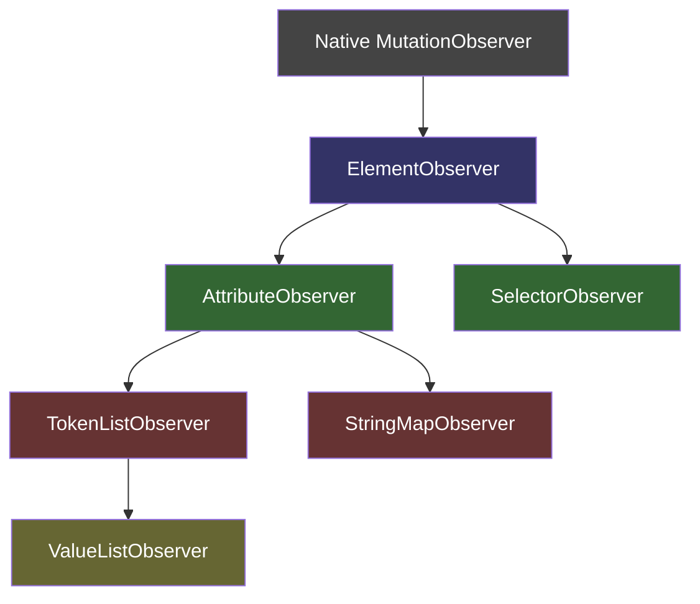

# Deep Dive: Mutation Observer Layer

The mutation observer module is the foundation of Stimulus's reactivity. It provides a layered abstraction over the native `MutationObserver` API, transforming raw DOM mutations into high-level semantic events that the core engine consumes.

## Architecture



Each layer composes the one below via the **delegate pattern** — every observer defines a delegate interface, and the layer above implements it.

## Layer 1: ElementObserver

**File:** `element_observer.ts`

The base layer. Wraps a native `MutationObserver` configured with `{ childList: true, subtree: true }` to detect element additions/removals, plus an optional attributes mode. Maintains a `Set<Element>` of currently matched elements.

**Delegate Interface:**
```typescript
interface ElementObserverDelegate {
  matchElement(element: Element): boolean
  matchElementsInTree(tree: Element): Element[]
  elementMatched?(element: Element): void
  elementUnmatched?(element: Element): void
  elementAttributeChanged?(element: Element, attributeName: string): void
}
```

**Key Mechanics:**
- On start, performs an initial `refresh()` to scan the entire subtree
- Processes mutations in batch, collecting added/removed nodes
- Uses `matchElementsInTree()` for efficient subtree scanning (delegates typically use `querySelectorAll`)
- `pause(callback)` method temporarily stops observing during DOM manipulation to prevent recursive mutation processing

## Layer 2a: AttributeObserver

**File:** `attribute_observer.ts`

Simplifies ElementObserver for the common case of tracking elements with a specific attribute. Matches elements via CSS selector `[attributeName]`.

**Delegate Interface:**
```typescript
interface AttributeObserverDelegate {
  elementMatchedAttribute?(element: Element, attributeName: string): void
  elementAttributeValueChanged?(element: Element, attributeName: string): void
  elementUnmatchedAttribute?(element: Element, attributeName: string): void
}
```

**Used by:** TokenListObserver, OutletObserver

## Layer 2b: SelectorObserver

**File:** `selector_observer.ts`

Tracks elements matching a dynamic CSS selector. The selector can be changed at runtime via a `selector` property setter.

**Key feature:** Maintains a `Multimap<string, Element>` to track which elements match which selectors. Supports an optional `selectorMatchElement()` delegate method for custom filtering beyond CSS.

**Used by:** OutletObserver (to find outlet elements via CSS selectors stored in data attributes)

## Layer 2c: StringMapObserver

**File:** `string_map_observer.ts`

Monitors attribute changes on a single element and maps attribute names to logical keys via a delegate-provided function. Tracks old values using `MutationObserver`'s `attributeOldValue: true`.

**Key mechanics:**
- Delegate's `getStringMapKeyForAttribute()` maps attribute names to logical keys (e.g., `data-hello-name-value` → `name`)
- Detects three states: key added (attribute appeared), value changed (attribute value modified), key removed (attribute disappeared)

**Used by:** ValueObserver (to track `data-{identifier}-{name}-value` attribute changes)

## Layer 3: TokenListObserver

**File:** `token_list_observer.ts`

Parses space-separated tokens from attribute values (like `data-controller="hello slideshow"`) and tracks individual tokens as first-class objects.

**Token structure:**
```typescript
interface Token {
  element: Element       // The DOM element
  attributeName: string  // The attribute containing this token
  index: number         // Position within the attribute value
  content: string       // The token string itself
}
```

**Key mechanics:**
- When an attribute changes, tokenizes both old and new values
- Zips old and new token lists to find the first divergence point
- Everything after the divergence is unmatched (old tokens) then matched (new tokens)
- This means reordering tokens causes unmatch+match cycles, preserving correct ordering semantics

**Used by:** ValueListObserver

## Layer 4: ValueListObserver

**File:** `value_list_observer.ts`

Generic top-level observer that converts tokens into typed values via a delegate-provided parser.

**Delegate Interface:**
```typescript
interface ValueListObserverDelegate<T> {
  parseValueForToken(token: Token): T | undefined
  elementMatchedValue(element: Element, value: T): void
  elementUnmatchedValue(element: Element, value: T): void
}
```

**Key mechanics:**
- Wraps TokenListObserver
- Caches parsed values per token in a `Map<Token, T>`
- Uses WeakMap keyed by element for token-to-value mappings
- If `parseValueForToken()` returns undefined, the token is silently ignored (parse error handling)

**Used by:** ScopeObserver (tokens → Scope objects), BindingObserver (tokens → Action objects)

## How the Core Uses These Layers

### Controller Discovery (ScopeObserver)
```
data-controller="hello slideshow"
  → ElementObserver finds element with [data-controller]
  → AttributeObserver detects attribute presence
  → TokenListObserver extracts ["hello", "slideshow"] tokens
  → ValueListObserver parses tokens into Scope objects
  → ScopeObserver notifies Router: scopeConnected(scope)
```

### Action Binding (BindingObserver)
```
data-action="click->hello#greet keydown.enter->hello#submit"
  → ElementObserver finds element with [data-action]
  → AttributeObserver detects attribute
  → TokenListObserver extracts action descriptor tokens
  → ValueListObserver parses tokens into Action objects
  → BindingObserver creates Bindings and registers with Dispatcher
```

### Value Changes (ValueObserver)
```
data-hello-name-value="World"  (attribute changes to "Universe")
  → StringMapObserver detects attribute change
  → Maps attribute to key "name"
  → ValueObserver reads new value, coerces type
  → Invokes controller.nameValueChanged("Universe", "World")
```

### Target Tracking (TargetObserver)
```
data-hello-target="output"
  → AttributeObserver detects [data-hello-target]
  → TokenListObserver extracts ["output"] token
  → TargetObserver adds element to target multimap
  → Invokes context.targetConnected(element, "output")
```

## Design Observations

1. **Composition over inheritance** — Each layer wraps rather than extends the layer below, communicating via delegate interfaces
2. **Lazy initialization** — Sets are created on-demand in the Multimap, observers only start when explicitly told to
3. **Efficient diffing** — TokenListObserver's zip-based comparison avoids full list diffing, sufficient because tokens are typically short lists
4. **Memory-conscious** — WeakMaps for per-element data, Set cleanup on empty to prevent memory leaks
5. **Pausable observation** — ElementObserver's `pause()` method prevents mutation storms during framework-initiated DOM changes
