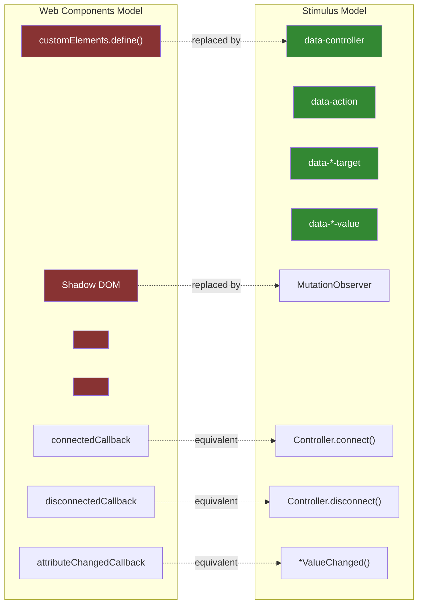

# Deep Dive: Web API Usage & The Anti-Component Philosophy

Stimulus is built entirely on standard web platform APIs with zero runtime dependencies. It deliberately avoids the Web Components spec (Custom Elements, Shadow DOM, HTML Templates) in favor of an attribute-driven enhancement model. This document catalogs every web API the framework depends on, explains why each is used, and analyzes the architectural implications of choosing DOM observation over component definition.

## Web API Inventory

### MutationObserver — The Reactivity Engine

**Used in:** `element_observer.ts`, `string_map_observer.ts` (2 files, 2 instances)

MutationObserver is the single most important web API in Stimulus. The entire framework's reactivity — controller discovery, action binding, target tracking, value changes, outlet connections — flows through exactly two MutationObserver instances per application:

1. **ElementObserver** (`element_observer.ts`) — configured with `{ childList: true, subtree: true }` plus optional attribute observation. This is the foundation of the observer layer. It watches the entire DOM subtree under the application root for element additions, removals, and attribute changes.

2. **StringMapObserver** (`string_map_observer.ts`) — configured with `{ attributes: true, attributeOldValue: true }`. Watches a single element's attributes for changes, capturing old values for diff detection. Used by ValueObserver to track `data-*-value` attribute mutations.

**Key methods used:**
- `new MutationObserver(callback)` — constructor
- `observer.observe(element, options)` — starts watching
- `observer.disconnect()` — stops watching
- `observer.takeRecords()` — flushes pending mutations synchronously before disconnect

**Why MutationObserver and not polling/dirty-checking:**
MutationObserver is async-batched by the browser — mutations are collected and delivered in microtask timing, after the current script execution but before rendering. This means Stimulus gets efficient batch notifications without blocking the main thread or missing mutations.

**Design choice:** The framework only creates two observer configurations, then layers all higher-level behavior on top through delegation. This is vastly more efficient than creating per-controller or per-attribute observers.

### Element Query APIs — DOM Navigation

**Used in:** `scope.ts`, `selector_observer.ts`, `attribute_observer.ts`, `outlet_set.ts`, `outlet_observer.ts`

| API | Where | Purpose |
|---|---|---|
| `element.querySelectorAll(selector)` | `scope.ts:44`, `selector_observer.ts:81`, `attribute_observer.ts:58` | Find all matching elements in a subtree |
| `element.matches(selector)` | `scope.ts:29,34`, `selector_observer.ts:64`, `outlet_set.ts:69`, `outlet_observer.ts:95,98` | Test if an element matches a CSS selector |
| `element.closest(selector)` | `scope.ts:40` | Find nearest ancestor matching selector |
| `element.contains(element)` | `element_observer.ts:149` | Check if element is a descendant |
| `element.isConnected` | `element_observer.ts:146` | Check if element is in the document |
| `node.nodeType` | `element_observer.ts:140` | Filter for Element nodes vs text/comment nodes |

**`element.closest()` is the scope boundary mechanism.** When Stimulus needs to determine if a child element belongs to a specific controller or to a nested controller of the same type, `scope.ts:40` calls:

```typescript
containsElement = (element: Element): boolean => {
  return element.closest(this.controllerSelector) === this.element
}
```

This single line replaces what would be a full tree-walking algorithm in other frameworks. It leverages the browser's native CSS selector engine for scope resolution.

**`querySelectorAll()` is used raw, not cached.** Target queries, outlet queries, and tree scans all call `querySelectorAll` directly. There's no virtual DOM or cached element registry — every query hits the live DOM. This ensures correctness after any mutation source (Turbo, innerHTML, external scripts) modifies the document.

### Attribute APIs — The Data Layer

**Used in:** `data_map.ts`, `string_map_observer.ts`, `attribute_observer.ts`, `token_list_observer.ts`, `outlet_set.ts`, `action.ts`

| API | Where | Purpose |
|---|---|---|
| `element.getAttribute(name)` | `data_map.ts:21`, `string_map_observer.ts:73`, `token_list_observer.ts:105`, `outlet_set.ts:44,68`, `action.ts:82` | Read attribute values |
| `element.setAttribute(name, value)` | `data_map.ts:26` | Write attribute values (value system) |
| `element.hasAttribute(name)` | `data_map.ts:32`, `attribute_observer.ts:53` | Check attribute existence |
| `element.removeAttribute(name)` | `data_map.ts:38` | Remove attributes |
| `element.attributes` | `action.ts:82` | Iterate all attributes (for param extraction) |

**Stimulus uses `getAttribute`/`setAttribute` rather than `element.dataset`.** This is deliberate — `dataset` normalizes attribute names (removing `data-` prefix and camelCasing), but Stimulus needs direct control over the raw attribute names since they follow framework-specific conventions (`data-{identifier}-{name}-value`). Using raw attribute methods also aligns with MutationObserver's `attributeName` property in mutation records.

**The DOM is the state store.** When you set `this.nameValue = "World"`, the value blessing's setter calls `this.data.set("name-value", "World")`, which calls `element.setAttribute("data-hello-name-value", "World")`. This attribute mutation is caught by StringMapObserver via MutationObserver, which triggers `nameValueChanged()`. The round-trip through the DOM is intentional — it means:
- Browser DevTools shows current state in the Elements panel
- Any tool that can set attributes can change Stimulus state
- Serializing/restoring state is just copying HTML

### Event APIs — Action System

**Used in:** `event_listener.ts`, `controller.ts`, `application.ts`

| API | Where | Purpose |
|---|---|---|
| `eventTarget.addEventListener(name, handler, options)` | `event_listener.ts:17` | Register DOM event listeners |
| `eventTarget.removeEventListener(name, handler, options)` | `event_listener.ts:21` | Remove DOM event listeners |
| `new CustomEvent(type, init)` | `controller.ts:99` | Create custom events for dispatch |
| `target.dispatchEvent(event)` | `controller.ts:100` | Fire custom events |
| `document.addEventListener("DOMContentLoaded", ...)` | `application.ts:113` | Wait for DOM ready |

**EventListener implements `EventListenerObject`** (the `handleEvent` protocol), not a function callback. This means the framework passes `this` (the EventListener instance) to `addEventListener` as the handler, and the browser calls its `handleEvent(event)` method. This pattern enables clean lifecycle management — the same object reference is used for both add and remove.

**Event extension for propagation tracking:**
```typescript
// event_listener.ts:64
Object.assign(event, {
  immediatePropagationStopped: false,
  stopImmediatePropagation() {
    this.immediatePropagationStopped = true
    // original is also called
  }
})
```
This monkey-patches each event with a flag so the framework can stop invoking further bindings when `stopImmediatePropagation()` is called, since native `stopImmediatePropagation()` doesn't provide a way to query its state.

**`window.onerror`** (`application.ts:90`) is called in the error handler, ensuring that Stimulus errors surface in global error monitoring tools even though they're caught internally.

### Reflect & Object APIs — Metaprogramming

**Used in:** `blessing.ts`, `inheritable_statics.ts`, and extensively across property blessing modules

| API | Where | Purpose |
|---|---|---|
| `Reflect.construct(constructor, args, newTarget)` | `blessing.ts:67` | Create shadow constructor without calling parent |
| `Reflect.setPrototypeOf(target, prototype)` | `blessing.ts:74` | Set up prototype chain for shadow constructor |
| `Object.defineProperties(target, descriptors)` | `blessing.ts:17` | Install blessed properties on shadow prototype |
| `Object.create(proto, descriptors)` | `blessing.ts:70` | Create shadow prototype object |
| `Object.getPrototypeOf(constructor)` | `inheritable_statics.ts:25` | Walk the class hierarchy for inherited statics |
| `Object.getOwnPropertyDescriptor(obj, key)` | `blessing.ts:44,47` | Read existing property descriptors to avoid conflicts |
| `Object.getOwnPropertyNames(obj)` | `blessing.ts:58` | Enumerate string-keyed properties |
| `Object.getOwnPropertySymbols(obj)` | `blessing.ts:58` | Enumerate symbol-keyed properties |
| `Object.assign(target, source)` | 15+ call sites | Merge objects (event extension, detail merging, option building) |
| `Object.keys(obj)` | `dispatcher.ts:115`, `value_observer.ts:110,116` | Enumerate enumerable keys |
| `Object.entries(obj)` | `binding.ts:57` | Iterate event option key-value pairs |

The **`Reflect.construct` + `Object.create`** combination in `blessing.ts` is the core metaprogramming trick:

```typescript
function extend<T>(constructor: Blessable<T>) {
  function extended() {
    return Reflect.construct(constructor, arguments, new.target)
  }
  extended.prototype = Object.create(constructor.prototype, {
    constructor: { value: extended }
  })
  Reflect.setPrototypeOf(extended, constructor)
  return extended as any
}
```

This creates a constructor function that:
1. Delegates instantiation to the original via `Reflect.construct` (preserving `new.target` for correct prototype)
2. Has its own prototype object (for blessed properties) that inherits from the original's prototype
3. Has the original as its `__proto__` (for static property inheritance)

### Collection Types — Memory Management

**Used across the entire framework:**

| Type | Instances | Purpose |
|---|---|---|
| `WeakMap` | 6 instances | GC-friendly per-element/per-scope data |
| `Map` | 12+ instances | Strong key-value mappings |
| `Set` | 8+ instances | Unique element/binding/context tracking |

**WeakMap usage is strategically placed at ownership boundaries:**

| Location | Keys | Values | Why WeakMap |
|---|---|---|---|
| `module.ts` | `Scope` | `Context` | Detached scopes should release their contexts |
| `scope_observer.ts` | `Element` | `Map<string, Scope>` | Removed elements should release scope data |
| `scope_observer.ts` | `Scope` | `number` (refcount) | Reference counting for scope lifecycle |
| `value_list_observer.ts` | `Token` | `ParseResult<T>` | Unmatched tokens should release parse results |
| `value_list_observer.ts` | `Element` | `Map<Token, T>` | Removed elements should release token maps |
| `guide.ts` | `any` | `Set<string>` | Deprecation warnings per object without preventing GC |

This is critical for long-running single-page applications with Turbo. As elements are added and removed from the DOM, the WeakMap entries for removed elements become eligible for garbage collection automatically. Without WeakMaps, the framework would leak memory proportional to the total number of elements ever created.

### Promise & Timing

| API | Where | Purpose |
|---|---|---|
| `new Promise()` | `application.ts:111` | DOM ready waiting |
| `document.readyState` | `application.ts:112` | Check if DOM is already loaded |
| `requestAnimationFrame` | `dom_test_case.ts:114` (tests only) | Wait for rendering in tests |

**No `setTimeout`, `requestAnimationFrame`, or `requestIdleCallback` in production code.** All timing is driven by MutationObserver's microtask delivery. This is a strong design constraint — the framework never delays or debounces its own operations.

## What Stimulus Does NOT Use

### Custom Elements (`customElements.define()`)

Custom Elements allow defining new HTML tags with their own lifecycle:
```javascript
class MyWidget extends HTMLElement {
  connectedCallback() { /* element added to DOM */ }
  disconnectedCallback() { /* element removed from DOM */ }
  attributeChangedCallback(name, oldVal, newVal) { /* attribute changed */ }
}
customElements.define('my-widget', MyWidget)
```

Stimulus reimplements this exact lifecycle through MutationObserver:
- `connectedCallback` → `Controller.connect()` (triggered by ScopeObserver detecting `data-controller` on added elements)
- `disconnectedCallback` → `Controller.disconnect()` (triggered by ScopeObserver detecting element removal)
- `attributeChangedCallback` → `ValueObserver` + `*ValueChanged()` callbacks (triggered by StringMapObserver)

**Why avoid Custom Elements:**
1. **Server-rendered HTML** — Custom Elements require JavaScript to define the element before it's meaningful. With Stimulus, elements are valid HTML before JavaScript loads — a `<div data-controller="hello">` is a normal div that gets enhanced.
2. **No tag registration** — Custom Elements require globally unique tag names. Stimulus controllers can be attached to any existing element and multiple controllers can share one element (`data-controller="hello slideshow"`).
3. **Progressive enhancement** — If JavaScript fails to load, Stimulus-annotated HTML still renders. Custom Elements with Shadow DOM may render empty or show FOUC.

### Shadow DOM

Shadow DOM provides style and DOM encapsulation:
```javascript
this.attachShadow({ mode: 'open' })
this.shadowRoot.innerHTML = '<slot></slot>'
```

Stimulus uses `element.closest()` for scope isolation instead:
```typescript
containsElement = (element: Element): boolean => {
  return element.closest(this.controllerSelector) === this.element
}
```

**Trade-offs:**

| Concern | Shadow DOM | Stimulus Scoping |
|---|---|---|
| Style isolation | Full encapsulation | None — CSS applies normally |
| DOM isolation | Shadow boundary hides internals | No isolation — `querySelectorAll` crosses scopes |
| Slotting | `<slot>` projection | N/A — content is already in place |
| Nesting | Shadow trees don't interfere | `closest()` finds the nearest controller boundary |
| DevTools | Shadow roots visible but separate | Everything visible in flat DOM |
| Third-party CSS | Blocked by shadow boundary | Works normally |

Stimulus's lack of Shadow DOM is a feature, not a limitation. Server-rendered HTML with existing CSS frameworks (Tailwind, Bootstrap) works without modification. There's no need to pierce shadow boundaries or define `::part()` selectors.

### HTML Templates (`<template>`)

```html
<template id="my-template">
  <div class="widget">...</div>
</template>
```

Stimulus has no rendering system. The HTML is written by the server (Rails, Django, Phoenix, etc.) or exists as static HTML. Controllers add behavior to existing markup — they never create it.

This means Stimulus controllers are inherently simpler than components — they're behavior-only, never layout/structure. Rendering is delegated entirely to the server or to other tools (Turbo Frames, Turbo Streams).

### Proxy / Reactive Properties

Frameworks like Vue and MobX use `Proxy` objects to intercept property access and trigger reactivity:
```javascript
const state = new Proxy(data, {
  set(target, key, value) {
    target[key] = value
    triggerUpdate(key)
    return true
  }
})
```

Stimulus routes all state through DOM attributes instead. The reactivity chain is:

```
JS property set → setAttribute() → MutationObserver → *ValueChanged() callback
```

This is slower than Proxy-based reactivity (DOM attribute serialization + observer delivery vs. synchronous property interception), but it provides:
- **External observability** — state is visible in browser DevTools
- **Persistence** — state survives across Turbo page navigations if the HTML is cached
- **Source-agnostic** — any tool that sets attributes triggers the same reactive callbacks

## Comparison: Stimulus vs Web Components



### Lifecycle Equivalence

| Web Component | Stimulus | Mechanism |
|---|---|---|
| `constructor()` | `Controller.initialize()` | Called once when Context is created |
| `connectedCallback()` | `Controller.connect()` | Element enters DOM (or observer starts with element present) |
| `disconnectedCallback()` | `Controller.disconnect()` | Element leaves DOM |
| `attributeChangedCallback()` | `*ValueChanged()` | StringMapObserver detects attribute mutation |
| `adoptedCallback()` | No equivalent | Stimulus doesn't track document transfers |
| `static observedAttributes` | `static values = {}` | Declares which attributes to watch |

### Capability Mapping

| Capability | Web Components | Stimulus |
|---|---|---|
| Define new HTML elements | `customElements.define()` | Not supported — augments existing elements |
| Style encapsulation | Shadow DOM | Not supported — use normal CSS |
| DOM encapsulation | Shadow DOM | `closest()` scoping — soft boundary, not hard |
| Content projection | `<slot>` | Not needed — content is already in place |
| Element templates | `<template>` | Not supported — server renders HTML |
| Event handling | Manual `addEventListener` | Declarative `data-action` |
| State management | Properties + `attributeChangedCallback` | `data-*-value` attributes + type coercion |
| Cross-component references | DOM queries or events | Outlets system (`data-*-outlet` CSS selectors) |
| Multiple behaviors per element | One Custom Element per tag | Multiple `data-controller` values per element |
| Inheritance | `class extends MyElement` | `class extends Controller` + inheritable statics |

## API Surface Summary

| Category | APIs Used | Count | Role |
|---|---|---|---|
| DOM Observation | `MutationObserver` | 2 instances | Core reactivity engine |
| DOM Query | `querySelectorAll`, `matches`, `closest`, `contains`, `isConnected` | 15+ sites | Element finding, scope resolution |
| DOM Attributes | `getAttribute`, `setAttribute`, `hasAttribute`, `removeAttribute`, `attributes` | 20+ sites | State storage, configuration |
| Events | `addEventListener`, `removeEventListener`, `CustomEvent`, `dispatchEvent` | 6 sites | Action system, custom events |
| Metaprogramming | `Reflect.construct`, `Reflect.setPrototypeOf`, `Object.defineProperties`, `Object.create` | 5 sites | Blessing system |
| Object Utilities | `Object.assign`, `Object.keys`, `Object.entries`, `Object.getPrototypeOf` | 25+ sites | Property merging, iteration |
| Collections | `Map`, `Set`, `WeakMap` | 26+ instances | State tracking, memory management |
| Lifecycle | `Promise`, `document.readyState`, `DOMContentLoaded` | 3 sites | Application startup |
| Error Handling | `window.onerror` | 1 site | Global error surfacing |
| Node Types | `Node.ELEMENT_NODE`, `node.nodeType` | 1 site | Mutation record filtering |

**Total unique web APIs: ~20.** Stimulus's API surface is remarkably small. The framework is essentially MutationObserver + querySelectorAll + getAttribute/setAttribute + addEventListener, composed through delegate interfaces. Everything else is standard JavaScript (Map, Set, WeakMap, Reflect, Object).

## Design Implications

### Why This Approach Works for Server-Rendered Apps

1. **HTML-first** — The server sends complete, meaningful HTML. JavaScript enhances it. If JS fails, users see content.
2. **Tool-agnostic** — Any server language (Ruby, Python, Go, PHP, Elixir) can render `data-*` attributes. No JSX, no template compilation, no build step for the HTML.
3. **Turbo-compatible** — Because state lives in DOM attributes and reactivity comes from MutationObserver, Turbo can replace page fragments and Stimulus automatically connects/disconnects controllers. No state synchronization needed.
4. **Debuggable** — All state is visible in the Elements panel. All events are native DOM events. No virtual DOM diffing to reason about.

### Where This Approach Has Limitations

1. **No render loop** — Controllers can't declaratively describe what the DOM should look like. Complex UI state (lists, conditional rendering, animations) requires imperative DOM manipulation.
2. **No style encapsulation** — CSS class collisions are possible. The `classes` system helps by indirecting class names through data attributes, but it's opt-in and manual.
3. **Attribute serialization overhead** — Values are serialized to/from strings on every access. Complex objects go through `JSON.stringify`/`JSON.parse` on each read/write.
4. **No SSR for behavior** — While HTML renders server-side, the behavior attachment only happens client-side. There's no equivalent to server components or hydration.
5. **MutationObserver latency** — Mutations are delivered asynchronously (microtask). There's a brief window where the DOM has changed but controllers haven't reacted yet. This rarely matters in practice but differs from synchronous Custom Element callbacks.
