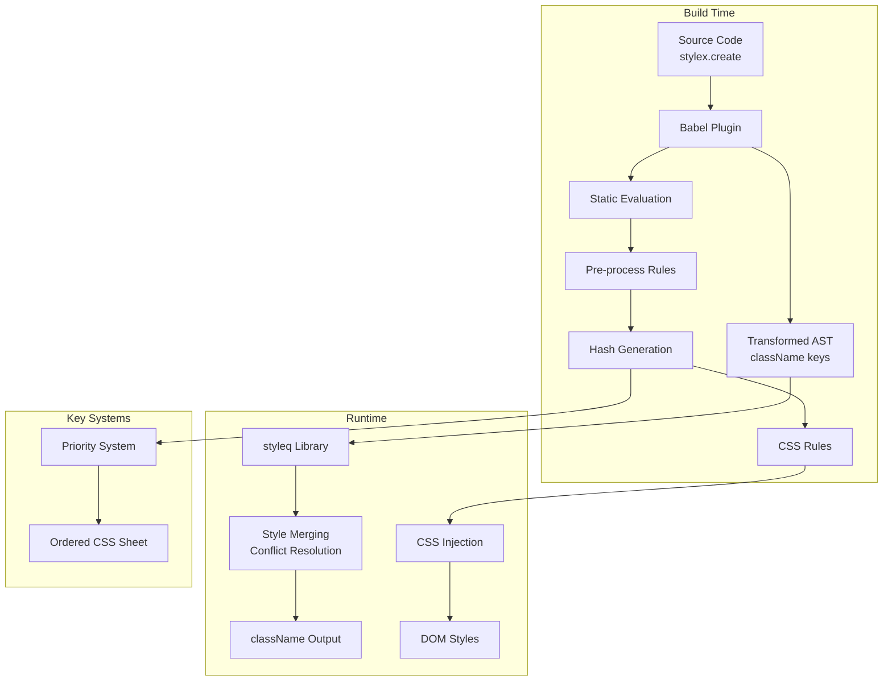

# Project Exploration: StyleX - Atomic CSS-in-JS

## Overview

StyleX is Meta's JavaScript library for defining styles for optimized user interfaces. It implements an **atomic CSS-in-JS** architecture that achieves **zero runtime overhead** through build-time style extraction and compilation.

Unlike traditional CSS-in-JS libraries (styled-components, emotion) that inject styles at runtime, StyleX extracts all styles at build time using a Babel plugin, generates atomic CSS classes, and produces a minimal runtime that only handles class name merging and conflict resolution.

The key innovation is the **"atomic" approach**: each CSS property-value pair becomes its own CSS class (e.g., `.x1e2nbdu { background-color: red }`), enabling:
- Maximum style reuse across components
- Predictable cascade-free styling
- Deterministic specificity through priority-based ordering
- Dead code elimination of unused styles

## Repository

- **Location:** `/home/darkvoid/Boxxed/@formulas/src.UIFrameworks/src.stylex/stylex`
- **Remote:** https://github.com/facebook/stylex
- **Primary Language:** JavaScript with Flow types
- **License:** MIT

## Directory Structure

```
stylex/
├── packages/
│   ├── @stylexjs/
│   │   ├── babel-plugin/          # Core: Build-time style extraction
│   │   │   ├── src/
│   │   │   │   ├── index.js       # Main plugin entry
│   │   │   │   ├── visitors/
│   │   │   │   │   ├── stylex-create.js      # Transforms stylex.create()
│   │   │   │   │   ├── stylex-props.js       # Transforms stylex.props()
│   │   │   │   │   ├── stylex-define-vars.js # CSS custom properties
│   │   │   │   │   └── stylex-keyframes.js   # Animation keyframes
│   │   │   │   ├── shared/
│   │   │   │   │   ├── stylex-create.js      # Namespace transformation
│   │   │   │   │   ├── preprocess-rules/
│   │   │   │   │   │   ├── PreRule.js        # Rule representation
│   │   │   │   │   │   └── flatten-raw-style-obj.js
│   │   │   │   │   └── utils/
│   │   │   │   │       ├── convert-to-className.js  # Hash -> className
│   │   │   │   │       ├── generate-css-rule.js     # CSS rule generation
│   │   │   │   │       ├── hash.js                  # MurmurHash2
│   │   │   │   │       └── property-priorities.js   # Specificity system
│   │   │   │   └── utils/
│   │   │   │       ├── state-manager.js      # Plugin state
│   │   │   │       └── evaluate-path.js      # Static evaluation
│   │   │   └── __tests__/
│   │   ├── stylex/                # Runtime library
│   │   │   ├── src/
│   │   │   │   ├── stylex.js              # Main exports (throws at runtime)
│   │   │   │   ├── inject.js              # Runtime CSS injection
│   │   │   │   └── stylesheet/
│   │   │   │       ├── createSheet.js             # CSSStyleSheet wrapper
│   │   │   │       └── createOrderedCSSStyleSheet.js  # Priority-ordered sheet
│   │   │   └── __tests__/
│   │   ├── cli/                   # CLI tooling
│   │   ├── unplugin/              # Vite/Webpack plugin wrapper
│   │   ├── rollup-plugin/         # Rollup integration
│   │   ├── postcss-plugin/        # PostCSS integration
│   │   └── eslint-plugin/         # Linting rules
│   ├── shared/                    # Shared utilities (minimal)
│   ├── style-value-parser/        # CSS value parsing
│   ├── docs/                      # Documentation site
│   └── benchmarks/                # Performance benchmarks
├── examples/
│   ├── example-cli/               # Standalone CLI example
│   ├── example-nextjs/            # Next.js App Router
│   ├── example-vite-react/        # Vite + React
│   ├── example-webpack/           # Webpack setup
│   ├── example-esbuild/           # esbuild integration
│   └── example-redwoodsdk/        # RedwoodSDK
├── tools/
│   └── husky/                     # Git hooks
└── flow-typed/                    # Flow type definitions
```

## Architecture

### High-Level Diagram



### Component Breakdown

#### @stylexjs/babel-plugin
- **Location:** `packages/@stylexjs/babel-plugin/src/`
- **Purpose:** Build-time transformation of stylex API calls
- **Key Files:**
  - `src/index.js` - Main plugin, orchestrates visitors
  - `src/visitors/stylex-create.js` - Transforms `stylex.create()` calls
  - `src/shared/stylex-create.js` - Converts style objects to classNames
  - `src/shared/utils/convert-to-className.js` - Hash-based className generation
- **Dependencies:** @babel/core, @babel/traverse, @stylexjs/shared

#### @stylexjs/stylex (Runtime)
- **Location:** `packages/@stylexjs/stylex/src/`
- **Purpose:** Runtime API and CSS injection
- **Key Files:**
  - `src/stylex.js` - Exports create, props, defineVars, etc.
  - `src/inject.js` - Runtime CSS injection with constant tracking
  - `src/stylesheet/createOrderedCSSStyleSheet.js` - Priority-ordered CSS
- **Dependencies:** styleq (external package for merging)

#### styleq (External)
- **Purpose:** Ultra-fast style merging and conflict resolution
- **Key Features:**
  - WeakMap caching for compiled styles
  - Last-write-wins cascade simulation
  - Handles arrays, booleans, and nested styles

## Style System

### Atomic CSS Generation

StyleX converts each CSS property-value pair into an atomic class:

```javascript
// Input
const styles = stylex.create({
  root: {
    backgroundColor: 'red',
    color: 'blue',
  }
});

// Build-time output (Babel transformation)
const styles = {
  root: {
    kWkggS: "xrkmrrc",  // backgroundColor: red
    kMwMTN: "xju2f9n",  // color: blue
    $$css: true
  }
};

// Generated CSS
.xrkmrrc { background-color: red; }
.xju2f9n { color: blue; }
```

### Hash Generation Process

1. **String construction:** `dashedKey + valueAsString + modifierHashString`
2. **Hashing:** MurmurHash2 with seed=1, output in base62
3. **ClassName format:** `{prefix}{hash}` (default prefix: `x`)
4. **Debug mode:** `{key}-{prefix}{hash}` for readability

```javascript
// From convert-to-className.js
const stringToHash = dashedKey + valueAsString + modifierHashString;
const className = debug
  ? `${key}-${classNamePrefix}${createHash('<>' + stringToHash)}`
  : classNamePrefix + createHash('<>' + stringToHash);
```

### CSS Rule Generation

```javascript
// From generate-css-rule.js
export function generateCSSRule(className, key, value, pseudos, atRules) {
  // Generate LTR declaration
  const ltrPairs = pairs.map(pair => generateLtr(pair, options));
  const ltrDecls = ltrPairs.map(pair => pair.join(':')).join(';');

  // Generate RTL if needed
  const rtlDecls = pairs.map(generateRtl).filter(Boolean).join(';');

  // Build nested rule for pseudos and at-rules
  const ltrRule = buildNestedCSSRule(className, ltrDecls, pseudos, atRules);

  return { priority, ltr: ltrRule, rtl: rtlRule };
}
```

## Build-Time vs Runtime Behavior

### Build-Time (Babel Plugin)

The Babel plugin performs several transformations:

1. **Static Evaluation:** Evaluates style objects at compile time
2. **Style Extraction:** Converts style objects to className mappings
3. **CSS Collection:** Collects all generated CSS rules with priorities
4. **Code Transformation:** Replaces `stylex.create()` calls with compiled objects

```javascript
// transformStyleXCreate (simplified flow)
export default function transformStyleXCreate(path, state) {
  // 1. Evaluate the style object argument
  const { confident, value } = evaluateStyleXCreateArg(firstArg, state);

  // 2. Transform using @stylexjs/shared
  const [compiledStyles, injectedStyles] = stylexCreate(value, state.options);

  // 3. Register CSS for extraction
  state.registerStyles(listOfStyles, path);

  // 4. Replace call with compiled object AST
  pathReplaceHoisted(path, convertObjectToAST(compiledStyles));
}
```

### Runtime (stylex library)

The runtime is minimal - it only handles:
1. **Style merging** via `styleq`
2. **CSS injection** for dynamic styles (rare)

```javascript
// props() function - the main runtime work
export function props(...styles) {
  const [className, style, dataStyleSrc] = styleq(styles);

  const result = {};
  if (className != null && className !== '') {
    result.className = className;
  }
  if (style != null && Object.keys(style).length > 0) {
    result.style = style;
  }
  if (dataStyleSrc != null && dataStyleSrc !== '') {
    result['data-style-src'] = dataStyleSrc;
  }
  return result;
}
```

### Runtime API Throws at Runtime

Most StyleX APIs throw if called at runtime - they must be compiled:

```javascript
export const create: StyleX$Create = function stylexCreate(_styles) {
  throw new Error(
    "Unexpected 'stylex.create' call at runtime. " +
    "Styles must be compiled by '@stylexjs/babel-plugin'."
  );
};
```

Only `props()` works at runtime (via `styleq`).

## Priority System & Conflict Resolution

StyleX uses a numeric priority system to ensure correct cascade order:

### Priority Values

| Priority | Type |
|----------|------|
| 0 | CSS Custom Property declarations (`@property`) |
| 1 | CSS Custom Properties (`--*`) |
| 30 | `@supports` rules |
| 200 | `@media` queries |
| 300 | `@container` queries |
| 1000 | Shorthands of shorthands (`all`, `border`, `background`) |
| 2000 | Shorthands of longhands (`margin`, `padding`, `border-width`) |
| 3000 | Logical longhand properties |
| 4000 | Physical longhand properties |
| 5000 | Pseudo-elements (`::before`, `::after`) |
| 40-170 | Pseudo-classes (`:hover`=130, `:focus`=150, `:active`=170) |

### Specificity Handling

StyleX adds specificity levels to prevent cascade issues:

```javascript
// inject.js - adds specificity based on priority
const text = addSpecificityLevel(resolved, Math.floor(priority / 1000));
sheet.insert(text, priority);
```

### Ordered CSS StyleSheet

```javascript
// createOrderedCSSStyleSheet.js
// Each rule is inserted at a position based on its priority group
function insert(cssText, groupValue) {
  const group = Number(groupValue);

  // Create group marker if needed
  if (groups[group] == null) {
    groups[group] = { start: null, rules: [encodeGroupRule(group)] };
  }

  // Insert at correct position within group
  sheetInsert(sheet, group, cssText);
}
```

## Dynamic Values and Variables

### CSS Custom Properties (defineVars)

```javascript
// defineVars creates CSS custom properties
export const globalTokens = stylex.defineVars({
  fontSans: 'system-ui, sans-serif',
  spacing: {
    xs: '4px',
    sm: '8px',
    md: '16px',
  }
});

// Usage in styles
const styles = stylex.create({
  text: {
    fontFamily: globalTokens.fontSans,
    padding: globalTokens.spacing.md,
  }
});
```

### Dynamic Styles (Function Styles)

StyleX supports dynamic values through function styles:

```javascript
const styles = stylex.create({
  // Static style
  base: {
    padding: 10,
  },
  // Dynamic style (returns inline styles)
  colored: (color: string) => ({
    color: color,
  }),
});

// Usage
<div {...stylex.props(styles.base, styles.colored('red'))} />
```

### Theme System (createTheme)

```javascript
const baseTokens = stylex.defineVars({
  bg: 'white',
  fg: 'black',
});

const darkTheme = stylex.createTheme(baseTokens, {
  bg: 'black',
  fg: 'white',
});

// Usage
<div {...stylex.props(darkTheme)}>
```

## Style Merging with styleq

The `styleq` library handles merging multiple style objects:

```javascript
// styleq algorithm (simplified)
function styleq(...styles) {
  const definedProperties = [];
  let className = '';

  // Process from last to first (last wins)
  for (const style of styles.reverse()) {
    if (style.$$css) {
      // Compiled style object
      for (const prop in style) {
        if (!definedProperties.includes(prop)) {
          definedProperties.push(prop);
          className = style[prop] + ' ' + className;
        }
      }
    } else {
      // Dynamic inline style
      // Similar property deduplication
    }
  }

  return [className];
}
```

**Key features:**
- WeakMap caching for repeated style objects
- First-seen property wins (when iterating reverse = last write wins)
- Handles arrays, booleans, and falsy values

## How It Differs from Other CSS-in-JS

| Feature | StyleX | Emotion/styled-components |
|---------|--------|---------------------------|
| **Extraction** | Build-time (Babel) | Runtime (JavaScript) |
| **CSS Output** | Atomic (per property) | Component-scoped blocks |
| **Runtime Cost** | ~1ms (styleq merging) | 10-50ms (style injection) |
| **Bundle Size** | Deduplicated atomic classes | Full CSS per component |
| **Specificity** | Deterministic (priority) | Cascade-dependent |
| **DevTools** | Generated class names | Readable component names |
| **Dynamic Styles** | CSS variables + inline | Full runtime power |

## Key Insights

1. **Zero Runtime Overhead:** All style computation happens at build time. The runtime only merges pre-computed class names.

2. **Atomic = Reusable:** Each property-value pair is a separate class, enabling maximum reuse across the application.

3. **Priority over Cascade:** Instead of relying on CSS cascade order, StyleX uses numeric priorities to ensure correct specificity.

4. **styleq is Critical:** The external `styleq` library provides ultra-fast O(n) style merging with WeakMap caching.

5. **Flow Types:** The codebase uses Flow extensively for type safety, with type definitions in `flow-typed/`.

6. **Physical-RTL Support:** Automatic RTL generation for properties that have logical equivalents (e.g., `marginLeft` -> `margin-inline-start`).

7. **Build Outputs:** The Babel plugin outputs both the transformed code AND a metadata object with all CSS rules for extraction.

## Open Questions / Areas for Deeper Study

1. **Haste Module System:** Some build configurations use Haste - Meta's internal module system
2. **Server Components:** Integration with React Server Components (RSC examples exist)
3. **Critical CSS Extraction:** How critical CSS is determined and extracted
4. **Hot Module Replacement:** Dev-time style injection strategy
