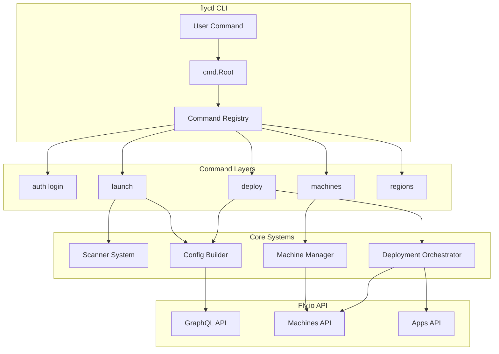

# Deep Dive: flyctl Architecture

## Overview

This deep dive examines flyctl - the Go-based CLI tool that serves as the primary interface for interacting with Fly.io's edge platform. We'll explore its command architecture, the scanner system for automatic app configuration, machine lifecycle management, and deployment orchestration.

## Architecture



## Command Framework

### Root Command Structure

```go
// cmd/root.go

package cmd

import (
    "github.com/spf13/cobra"
    "github.com/superfly/flyctl/internal/cli"
    "github.com/superfly/flyctl/internal/flag"
)

// NewRootCommand returns the root command
func NewRootCommand() *cobra.Command {
    cmd := &cobra.Command{
        Use:   "flyctl",
        Short: "Command line interface for Fly.io",
        Long:  `Flyctl is a command-line tool for interacting with Fly.io's edge platform.`,
    }
    
    // Add global flags
    flag.Add(cmd,
        flag.String{
            Name:        "access-token",
            Description: "Fly API access token",
            Env:         "FLY_API_TOKEN",
        },
        flag.String{
            Name:        "config",
            Description: "Path to config file",
            Env:         "FLY_CONFIG",
        },
        flag.Bool{
            Name:        "debug",
            Description: "Enable debug logging",
            Env:         "FLY_DEBUG",
        },
        flag.String{
            Name:        "region",
            Description: "Default region for operations",
            Env:         "FLY_REGION",
        },
    )
    
    // Register all subcommands
    cmd.AddCommand(
        newAuth(),
        newApps(),
        newDeploy(),
        newLaunch(),
        newMachines(),
        newRegions(),
        newSecrets(),
        newVolumes(),
        newPostgres(),
        newRedis(),
        newProxy(),
        newSSH(),
        newLogs(),
        newStatus(),
        newOpen(),
        newScale(),
        newDashboard(),
    )
    
    return cmd
}
```

### Command Registration Pattern

```go
// internal/command/command.go

type Command struct {
    // Command metadata
    Use     string
    Short   string
    Long    string
    Example string
    
    // Execution
    RunE    func(cmd *cobra.Command, args []string) error
    PreRunE func(cmd *cobra.Command, args []string) error
    
    // Flags
    Flags       flag.FlagSet
    Hidden      bool
    Aliases     []string
    SuggestFor  []string
    
    // Configuration
    RequireSession  bool  // Need authenticated session
    TakeWorkspace   bool  // Load workspace config
    NeedAppConfig   bool  // Require fly.toml
    LoadAppConfig   bool  // Optionally load fly.toml
}

// RegisterCommand adds a command to the registry
func RegisterCommand(parent *cobra.Command, cmd *Command) {
    cobraCmd := &cobra.Command{
        Use:     cmd.Use,
        Short:   cmd.Short,
        Long:    cmd.Long,
        Example: cmd.Example,
        Aliases: cmd.Aliases,
        Hidden:  cmd.Hidden,
        RunE:    cmd.RunE,
        PreRunE: cmd.PreRunE,
    }
    
    // Add flags
    cmd.Flags.AddToCommand(cobraCmd)
    
    parent.AddCommand(cobraCmd)
}
```

## Scanner System

The scanner automatically generates configuration for different application types.

### Scanner Interface

```go
// scanner/scanner.go

package scanner

// SourceInfo describes a source code directory
type SourceInfo struct {
    // Detection
    Family      string  // Language family (nodejs, python, go, etc.)
    Docs        string  // Documentation URL
    Callback    func() error  // Post-detection callback
    
    // Configuration
    Files       []string        // Files to include
    BuildArgs   map[string]string
    Variables   map[string]string
    
    // Ports and healthchecks
    Port       int      // Default port
    HttpCheckPath   string  // Health check path
    HttpCheckPort   int     // Health check port
    
    // Release actions
    ReleaseCmd   string  // Command to run before release
    
    // Volumes
    Volumes []SourceVolume
    
    // Environment
    Env       map[string]string
    Secrets   []string  // Secret names to prompt for
    
    // Build kit
    Builder     string  // Buildpack builder
    Dockerfile  string  // Custom Dockerfile path
}

// SourceVolume describes a persistent volume
type SourceVolume struct {
    Source      string  // Volume name
    Destination string  // Mount path
    InitialSize string  // Initial size (e.g., "10gb")
}

// Scanner interface for different languages
type Scanner interface {
    // Detect if this scanner matches the source directory
    Detect(sourceDir string) bool
    
    // Get configuration for this source type
    GetConfig(sourceDir string) (*SourceInfo, error)
    
    // Run any post-detection setup
    Run(sourceDir string) error
}
```

### Node.js Scanner

```go
// scanner/nodejs.go

package scanner

import (
    "os"
    "path/filepath"
    "encoding/json"
)

type NodeJSScanner struct{}

func (s *NodeJSScanner) Detect(sourceDir string) bool {
    // Check for package.json
    packageJSONPath := filepath.Join(sourceDir, "package.json")
    if _, err := os.Stat(packageJSONPath); err != nil {
        return false
    }
    
    // Read and parse package.json
    data, err := os.ReadFile(packageJSONPath)
    if err != nil {
        return false
    }
    
    var pkg struct {
        Scripts map[string]interface{} `json:"scripts"`
    }
    
    if err := json.Unmarshal(data, &pkg); err != nil {
        return false
    }
    
    // Check for start script
    _, hasStart := pkg.Scripts["start"]
    return hasStart
}

func (s *NodeJSScanner) GetConfig(sourceDir string) (*SourceInfo, error) {
    return &SourceInfo{
        Family:      "nodejs",
        Docs:        "https://nodejs.org/docs",
        Port:        8080,
        ReleaseCmd:  "npm run migrate",
        HttpCheckPath: "/health",
        HttpCheckPort: 8080,
        
        BuildArgs: map[string]string{
            "NODE_ENV": "production",
        },
        
        Variables: map[string]string{
            "PORT": "8080",
        },
        
        Env: map[string]string{
            "NODE_ENV": "production",
        },
        
        Secrets: []string{
            "SESSION_SECRET",
            "DATABASE_URL",
        },
        
        Volumes: []SourceVolume{
            {
                Source:      "uploads",
                Destination: "/app/uploads",
                InitialSize: "5gb",
            },
        },
    }, nil
}

func (s *NodeJSScanner) Run(sourceDir string) error {
    // Check for npm vs yarn
    if _, err := os.Stat(filepath.Join(sourceDir, "yarn.lock")); err == nil {
        // Use yarn
        return nil
    }
    // Default to npm
    return nil
}
```

### Python/Django Scanner

```go
// scanner/python.go

package scanner

import (
    "os"
    "path/filepath"
    "regexp"
)

type PythonScanner struct{}

func (s *PythonScanner) Detect(sourceDir string) bool {
    // Check for requirements.txt or pyproject.toml
    files := []string{"requirements.txt", "pyproject.toml", "setup.py"}
    for _, file := range files {
        if _, err := os.Stat(filepath.Join(sourceDir, file)); err == nil {
            return true
        }
    }
    return false
}

func (s *PythonScanner) GetConfig(sourceDir string) (*SourceInfo, error) {
    // Detect framework
    framework := s.detectFramework(sourceDir)
    
    switch framework {
    case "django":
        return s.getDjangoConfig(sourceDir)
    case "flask":
        return s.getFlaskConfig(sourceDir)
    case "fastapi":
        return s.getFastAPIConfig(sourceDir)
    default:
        return s.getDefaultConfig(sourceDir)
    }
}

func (s *PythonScanner) detectFramework(sourceDir string) string {
    // Check for Django
    if _, err := os.Stat(filepath.Join(sourceDir, "manage.py")); err == nil {
        return "django"
    }
    
    // Check requirements.txt for framework
    reqPath := filepath.Join(sourceDir, "requirements.txt")
    if data, err := os.ReadFile(reqPath); err == nil {
        content := string(data)
        if regexp.MustCompile(`(?i)django`).MatchString(content) {
            return "django"
        }
        if regexp.MustCompile(`(?i)flask`).MatchString(content) {
            return "flask"
        }
        if regexp.MustCompile(`(?i)fastapi`).MatchString(content) {
            return "fastapi"
        }
    }
    
    return "default"
}

func (s *PythonScanner) getDjangoConfig(sourceDir string) (*SourceInfo, error) {
    return &SourceInfo{
        Family:      "python",
        Docs:        "https://docs.djangoproject.com",
        Port:        8000,
        ReleaseCmd:  "python manage.py migrate",
        HttpCheckPath: "/health/",
        HttpCheckPort: 8000,
        
        BuildArgs: map[string]string{
            "DJANGO_SETTINGS_MODULE": "config.settings.production",
        },
        
        Variables: map[string]string{
            "PORT": "8000",
        },
        
        Env: map[string]string{
            "DJANGO_ENV": "production",
        },
        
        Secrets: []string{
            "SECRET_KEY",
            "DATABASE_URL",
            "REDIS_URL",
        },
        
        Volumes: []SourceVolume{
            {
                Source:      "media",
                Destination: "/app/media",
                InitialSize: "10gb",
            },
            {
                Source:      "static",
                Destination: "/app/static",
                InitialSize: "2gb",
            },
        },
    }, nil
}
```

### Go Scanner

```go
// scanner/go.go

package scanner

import (
    "os"
    "path/filepath"
    "go/parser"
    "go/token"
)

type GoScanner struct{}

func (s *GoScanner) Detect(sourceDir string) bool {
    // Check for go.mod
    if _, err := os.Stat(filepath.Join(sourceDir, "go.mod")); err == nil {
        return true
    }
    
    // Check for .go files
    matches, _ := filepath.Glob(filepath.Join(sourceDir, "*.go"))
    return len(matches) > 0
}

func (s *GoScanner) GetConfig(sourceDir string) (*SourceInfo, error) {
    // Detect port from source
    port := s.detectPort(sourceDir)
    
    return &SourceInfo{
        Family:      "go",
        Docs:        "https://go.dev/doc",
        Port:        port,
        HttpCheckPath: "/health",
        HttpCheckPort: port,
        
        BuildArgs: map[string]string{
            "CGO_ENABLED": "0",
            "GOOS":        "linux",
            "GOARCH":      "amd64",
        },
        
        Variables: map[string]string{
            "PORT": string(rune(port)),
        },
        
        Env: map[string]string{
            "GIN_MODE":    "release",
            "PORT":        string(rune(port)),
        },
        
        Secrets: []string{
            "DATABASE_URL",
        },
    }, nil
}

func (s *GoScanner) detectPort(sourceDir string) int {
    port := 8080  // Default
    
    // Parse Go files for port configuration
    filepath.Walk(sourceDir, func(path string, info os.FileInfo, err error) error {
        if err != nil {
            return nil
        }
        
        if filepath.Ext(path) != ".go" {
            return nil
        }
        
        fset := token.NewFileSet()
        f, err := parser.ParseFile(fset, path, nil, parser.ParseComments)
        if err != nil {
            return nil
        }
        
        // Look for port assignments in source
        // This is simplified - real implementation would be more thorough
        _ = f
        
        return nil
    })
    
    return port
}
```

### Dockerfile Generation

```go
// scanner/dockerfile.go

package scanner

import (
    "fmt"
    "strings"
    "text/template"
)

// DockerfileTemplate generates Dockerfile from SourceInfo
func DockerfileTemplate(info *SourceInfo) (string, error) {
    var tmpl string
    
    switch info.Family {
    case "nodejs":
        tmpl = nodejsDockerfile
    case "python":
        tmpl = pythonDockerfile
    case "go":
        tmpl = goDockerfile
    default:
        tmpl = defaultDockerfile
    }
    
    t, err := template.New("dockerfile").Parse(tmpl)
    if err != nil {
        return "", err
    }
    
    var buf strings.Builder
    err = t.Execute(&buf, info)
    if err != nil {
        return "", err
    }
    
    return buf.String(), nil
}

const nodejsDockerfile = `# Build stage
FROM node:18-alpine AS builder

WORKDIR /app

# Copy package files
COPY package*.json ./

# Install dependencies
RUN npm ci --only=production

# Copy source code
COPY . .

# Build if needed
RUN npm run build --if-present

# Production stage
FROM node:18-alpine

WORKDIR /app

# Create non-root user
RUN addgroup -g 1001 -S nodejs && \
    adduser -S nodejs -u 1001

# Copy from builder
COPY --from=builder --chown=nodejs:nodejs /app/node_modules ./node_modules
COPY --from=builder --chown=nodejs:nodejs /app .

# Switch to non-root user
USER nodejs

# Expose port
EXPOSE {{.Port}}

# Health check
{{if .HttpCheckPath}}HEALTHCHECK --interval=30s --timeout=3s --start-period=5s --retries=3 \
    CMD wget -qO- http://localhost:{{.Port}}{{.HttpCheckPath}} || exit 1{{end}}

# Start command
CMD ["npm", "start"]
`

const pythonDockerfile = `# Build stage
FROM python:3.11-slim AS builder

WORKDIR /app

# Install build dependencies
RUN apt-get update && apt-get install -y \
    build-essential \
    && rm -rf /var/lib/apt/lists/*

# Copy requirements
COPY requirements.txt .

# Install Python dependencies
RUN pip install --no-cache-dir --user -r requirements.txt

# Copy source
COPY . .

# Production stage
FROM python:3.11-slim

WORKDIR /app

# Create non-root user
RUN useradd -m -u 1001 appuser

# Copy from builder
COPY --from=builder /root/.local /home/appuser/.local
COPY --from=builder --chown=appuser:appuser /app .

# Set PATH
ENV PATH=/home/appuser/.local/bin:$PATH

# Switch to non-root user
USER appuser

# Expose port
EXPOSE {{.Port}}

# Health check
{{if .HttpCheckPath}}HEALTHCHECK --interval=30s --timeout=3s --start-period=5s --retries=3 \
    CMD python -c "import urllib.request; urllib.request.urlopen('http://localhost:{{.Port}}{{.HttpCheckPath}}')" || exit 1{{end}}

# Start command
CMD ["{{if .ReleaseCmd}}gunicorn{{else}}python{{end}}", "main:app"]
`

const goDockerfile = `# Build stage
FROM golang:1.21-alpine AS builder

WORKDIR /app

# Install ca-certificates for HTTPS
RUN apk add --no-cache ca-certificates

# Copy go mod files
COPY go.mod go.sum* ./
RUN go mod download

# Copy source
COPY . .

# Build binary
ARG CGO_ENABLED=0
ARG GOOS=linux
ARG GOARCH=amd64

RUN go build -ldflags="-w -s" -o /app/server .

# Production stage
FROM scratch

# Copy ca-certificates
COPY --from=builder /etc/ssl/certs/ca-certificates.crt /etc/ssl/certs/

# Copy binary
COPY --from=builder /app/server /app/server

# Expose port
EXPOSE {{.Port}}

# Health check
{{if .HttpCheckPath}}HEALTHCHECK --interval=30s --timeout=3s --start-period=5s --retries=3 \
    CMD wget -qO- http://localhost:{{.Port}}{{.HttpCheckPath}} || exit 1{{end}}

# Start command
CMD ["/app/server"]
`

const defaultDockerfile = `FROM ubuntu:22.04

WORKDIR /app

RUN apt-get update && apt-get install -y \
    curl \
    ca-certificates \
    && rm -rf /var/lib/apt/lists/*

COPY . .

EXPOSE {{.Port}}

CMD ["./start.sh"]
`
```

## Machine Management

### Machine Client

```go
// internal/machine/machine_client.go

package machine

import (
    "context"
    "fmt"
    "net/http"
    "time"
    
    "github.com/superfly/flyctl/api"
    "github.com/superfly/flyctl/internal/build/imgsrc"
)

// MachineClient manages Fly.io Machines
type MachineClient struct {
    apiClient *api.Client
    appName   string
    org       *api.Organization
}

// MachineConfig represents machine configuration
type MachineConfig struct {
    // Basic
    Name   string
    Region string
    
    // Resources
    CPUKind  string  // "shared" or "performance"
    CPUs     int
    MemoryMB int
    
    // Image
    ImageRef string
    
    // Services
    Services []api.MachineService
    
    // Checks
    Checks map[string]api.MachineCheck
    
    // Environment
    Env       map[string]string
    Secrets   []api.MachineSecret
    Metadata  map[string]string
    
    // Lifecycle
    RestartPolicy *api.MachineRestartPolicy
    Init          *api.MachineInit
    Mounts        []api.MachineMount
}

// NewMachineClient creates a new machine client
func NewMachineClient(apiClient *api.Client, appName string) *MachineClient {
    org, _ := apiClient.GetOrganizationByApp(appName)
    
    return &MachineClient{
        apiClient: apiClient,
        appName:   appName,
        org:       org,
    }
}

// CreateMachine creates a new machine
func (mc *MachineClient) CreateMachine(ctx context.Context, config MachineConfig) (*api.Machine, error) {
    // Build machine config
    machineConfig := &api.LaunchMachineInput{
        Name:       config.Name,
        Region:     config.Region,
        Config:     &api.MachineConfig{},
        SkipLaunch: false,
    }
    
    // Set resources
    machineConfig.Config.Guest = &api.MachineGuest{
        CPUKind:  config.CPUKind,
        CPUs:     config.CPUs,
        MemoryMB: config.MemoryMB,
    }
    
    // Set image
    machineConfig.Config.Image = config.ImageRef
    
    // Set services
    machineConfig.Config.Services = config.Services
    
    // Set checks
    machineConfig.Config.Checks = config.Checks
    
    // Set environment
    machineConfig.Config.Env = config.Env
    
    // Set secrets
    for _, secret := range config.Secrets {
        machineConfig.Config.Secrets = append(machineConfig.Config.Secrets, api.MachineSecret{
            Name: secret.Name,
        })
    }
    
    // Set metadata
    machineConfig.Config.Metadata = config.Metadata
    
    // Set mounts
    machineConfig.Config.Mounts = config.Mounts
    
    // Set restart policy
    if config.RestartPolicy != nil {
        machineConfig.Config.Restart = *config.RestartPolicy
    }
    
    // Set init (process, entrypoint, cmd)
    if config.Init != nil {
        machineConfig.Config.Init = *config.Init
    }
    
    // Create machine
    machine, err := mc.apiClient.LaunchMachine(ctx, api.LaunchMachineInput{
        OrganizationID: mc.org.ID,
        Name:           config.Name,
        Region:         config.Region,
        Config:         machineConfig.Config,
        SkipLaunch:     false,
    })
    
    if err != nil {
        return nil, fmt.Errorf("failed to create machine: %w", err)
    }
    
    return machine, nil
}

// GetMachine retrieves a machine by ID
func (mc *MachineClient) GetMachine(ctx context.Context, machineID string) (*api.Machine, error) {
    return mc.apiClient.GetMachine(ctx, machineID)
}

// ListMachines lists all machines for an app
func (mc *MachineClient) ListMachines(ctx context.Context) ([]*api.Machine, error) {
    return mc.apiClient.ListMachines(ctx, mc.appName)
}

// StartMachine starts a stopped machine
func (mc *MachineClient) StartMachine(ctx context.Context, machineID string) error {
    return mc.apiClient.StartMachine(ctx, machineID)
}

// StopMachine stops a running machine
func (mc *MachineClient) StopMachine(ctx context.Context, machineID string, timeout time.Duration) error {
    signal := "SIGINT"
    timeoutSec := int(timeout.Seconds())
    
    return mc.apiClient.StopMachine(ctx, api.StopMachineInput{
        ID:       machineID,
        Signal:   signal,
        Timeout:  timeoutSec,
    })
}

// RestartMachine restarts a machine
func (mc *MachineClient) RestartMachine(ctx context.Context, machineID string) error {
    return mc.apiClient.RestartMachine(ctx, machineID)
}

// DestroyMachine destroys a machine
func (mc *MachineClient) DestroyMachine(ctx context.Context, machineID string, force bool) error {
    return mc.apiClient.DestroyMachine(ctx, machineID, force)
}

// UpdateMachine updates a machine's configuration
func (mc *MachineClient) UpdateMachine(ctx context.Context, machine *api.Machine, config MachineConfig) (*api.Machine, error) {
    // Update config
    machine.Config.Guest = &api.MachineGuest{
        CPUKind:  config.CPUKind,
        CPUs:     config.CPUs,
        MemoryMB: config.MemoryMB,
    }
    
    machine.Config.Image = config.ImageRef
    machine.Config.Env = config.Env
    machine.Config.Metadata = config.Metadata
    
    // Update machine
    updated, err := mc.apiClient.UpdateMachine(ctx, api.LaunchMachineInput{
        ID:     machine.ID,
        Name:   machine.Name,
        Region: machine.Region,
        Config: machine.Config,
    })
    
    if err != nil {
        return nil, fmt.Errorf("failed to update machine: %w", err)
    }
    
    return updated, nil
}
```

### Machine Lifecycle

```go
// internal/machine/lifecycle.go

package machine

import (
    "context"
    "fmt"
    "time"
)

// MachineState represents machine state
type MachineState string

const (
    StateCreated  MachineState = "created"
    StateStarting MachineState = "starting"
    StateRunning  MachineState = "running"
    StateStopping MachineState = "stopping"
    StateStopped  MachineState = "stopped"
    StateError    MachineState = "error"
)

// LifecycleManager handles machine lifecycle operations
type LifecycleManager struct {
    client *MachineClient
}

// DeployInput contains deployment parameters
type DeployInput struct {
    AppName     string
    ImageRef    string
    Region      string
    Strategy    string  // "rolling", "immediate", "canary"
    MaxUnavailable float32
    
    Config *MachineConfig
}

// Deploy executes a deployment
func (lm *LifecycleManager) Deploy(ctx context.Context, input DeployInput) error {
    // Get existing machines
    existingMachines, err := lm.client.ListMachines(ctx)
    if err != nil {
        return fmt.Errorf("failed to list machines: %w", err)
    }
    
    switch input.Strategy {
    case "rolling":
        return lm.rollingDeploy(ctx, input, existingMachines)
    case "immediate":
        return lm.immediateDeploy(ctx, input, existingMachines)
    case "canary":
        return lm.canaryDeploy(ctx, input, existingMachines)
    default:
        return lm.rollingDeploy(ctx, input, existingMachines)
    }
}

// rollingDeploy does rolling deployment
func (lm *LifecycleManager) rollingDeploy(ctx context.Context, input DeployInput, existing []*api.Machine) error {
    if len(existing) == 0 {
        // No existing machines - create new one
        input.Config.ImageRef = input.ImageRef
        _, err := lm.client.CreateMachine(ctx, *input.Config)
        return err
    }
    
    // Calculate how many can be down at once
    maxDown := int(float32(len(existing)) * input.MaxUnavailable)
    if maxDown < 1 {
        maxDown = 1
    }
    
    // Deploy machine by machine
    for i, machine := range existing {
        // Create replacement first (to maintain availability)
        input.Config.Name = fmt.Sprintf("%s-%d", input.AppName, len(existing)+i)
        input.Config.Region = machine.Region
        input.Config.ImageRef = input.ImageRef
        
        newMachine, err := lm.client.CreateMachine(ctx, *input.Config)
        if err != nil {
            return fmt.Errorf("failed to create replacement machine: %w", err)
        }
        
        // Wait for new machine to be healthy
        if err := lm.waitForHealth(ctx, newMachine.ID); err != nil {
            return fmt.Errorf("new machine never became healthy: %w", err)
        }
        
        // Destroy old machine
        if err := lm.client.DestroyMachine(ctx, machine.ID, true); err != nil {
            return fmt.Errorf("failed to destroy old machine: %w", err)
        }
    }
    
    return nil
}

// waitForHealth waits for machine to pass health checks
func (lm *LifecycleManager) waitForHealth(ctx context.Context, machineID string) error {
    timeout := 5 * time.Minute
    interval := 5 * time.Second
    
    start := time.Now()
    for time.Since(start) < timeout {
        machine, err := lm.client.GetMachine(ctx, machineID)
        if err != nil {
            return err
        }
        
        if machine.State == "running" && machine.HealthStatus() == "passing" {
            return nil
        }
        
        time.Sleep(interval)
    }
    
    return fmt.Errorf("timeout waiting for machine health")
}

// immediateDeploy replaces all machines at once
func (lm *LifecycleManager) immediateDeploy(ctx context.Context, input DeployInput, existing []*api.Machine) error {
    // Stop all existing machines
    for _, machine := range existing {
        lm.client.StopMachine(ctx, machine.ID, 30*time.Second)
    }
    
    // Destroy old machines
    for _, machine := range existing {
        lm.client.DestroyMachine(ctx, machine.ID, true)
    }
    
    // Create new machines
    input.Config.ImageRef = input.ImageRef
    _, err := lm.client.CreateMachine(ctx, *input.Config)
    return err
}

// canaryDeploy deploys to one region first
func (lm *LifecycleManager) canaryDeploy(ctx context.Context, input DeployInput, existing []*api.Machine) error {
    // Find machines in primary region
    var primaryMachines []*api.Machine
    var otherMachines []*api.Machine
    
    for _, m := range existing {
        if m.Region == input.Region {
            primaryMachines = append(primaryMachines, m)
        } else {
            otherMachines = append(otherMachines, m)
        }
    }
    
    // Deploy to primary region first
    input.Config.ImageRef = input.ImageRef
    canaryMachine, err := lm.client.CreateMachine(ctx, *input.Config)
    if err != nil {
        return err
    }
    
    // Wait for canary to be healthy
    if err := lm.waitForHealth(ctx, canaryMachine.ID); err != nil {
        return err
    }
    
    // If canary is healthy, proceed with rest
    return lm.rollingDeploy(ctx, input, existing)
}
```

## Deployment Orchestration

### Deployment Flow

```go
// internal/deploy/deploy.go

package deploy

import (
    "context"
    "fmt"
    
    "github.com/superfly/flyctl/internal/build/imgsrc"
    "github.com/superfly/flyctl/internal/machine"
)

// DeploymentOrchestrator coordinates deployments
type DeploymentOrchestrator struct {
    apiClient     *api.Client
    machineClient *machine.MachineClient
}

// DeploymentResult contains deployment results
type DeploymentResult struct {
    Success       bool
    ImageRef      string
    Machines      []*api.Machine
    AllocationIDs []string
}

// Deploy executes a full deployment
func (do *DeploymentOrchestrator) Deploy(ctx context.Context, input DeployInput) (*DeploymentResult, error) {
    result := &DeploymentResult{}
    
    // Step 1: Build or resolve image
    img, err := do.resolveImage(ctx, input)
    if err != nil {
        return nil, fmt.Errorf("failed to resolve image: %w", err)
    }
    result.ImageRef = img
    
    // Step 2: Validate configuration
    if err := do.validateConfig(ctx, input); err != nil {
        return nil, fmt.Errorf("invalid configuration: %w", err)
    }
    
    // Step 3: Deploy to machines
    lifecycleManager := &machine.LifecycleManager{
        client: do.machineClient,
    }
    
    machineConfig := input.Config
    machineConfig.ImageRef = img
    
    err = lifecycleManager.Deploy(ctx, machine.DeployInput{
        AppName:        input.AppName,
        ImageRef:       img,
        Region:         input.Region,
        Strategy:       input.Strategy,
        MaxUnavailable: input.MaxUnavailable,
        Config:         machineConfig,
    })
    
    if err != nil {
        return nil, fmt.Errorf("deployment failed: %w", err)
    }
    
    // Step 4: Get updated machine list
    result.Machines, err = do.machineClient.ListMachines(ctx)
    if err != nil {
        return nil, fmt.Errorf("failed to list machines: %w", err)
    }
    
    result.Success = true
    return result, nil
}

// resolveImage builds or fetches the deployment image
func (do *DeploymentOrchestrator) resolveImage(ctx context.Context, input DeployInput) (string, error) {
    if input.Image != "" {
        // Using pre-built image
        return input.Image, nil
    }
    
    if input.Dockerfile != "" {
        // Build from Dockerfile
        return do.buildFromDockerfile(ctx, input)
    }
    
    // Use buildpacks
    return do.buildWithBuildpacks(ctx, input)
}

// buildFromDockerfile builds image from Dockerfile
func (do *DeploymentOrchestrator) buildFromDockerfile(ctx context.Context, input DeployInput) (string, error) {
    builder := imgsrc.NewDockerfileBuilder(imgsrc.DockerfileBuildOptions{
        Path:       input.Path,
        Dockerfile: input.Dockerfile,
        Target:     input.Target,
        BuildArgs:  input.BuildArgs,
    })
    
    img, err := builder.Build(ctx, imgsrc.BuildOptions{
        AppName:    input.AppName,
        Registry:   "registry.fly.io",
        Push:       true,
        Platform:   "linux/amd64",
    })
    
    if err != nil {
        return "", fmt.Errorf("dockerfile build failed: %w", err)
    }
    
    return img.Tag, nil
}

// buildWithBuildpacks builds image using buildpacks
func (do *DeploymentOrchestrator) buildWithBuildpacks(ctx context.Context, input DeployInput) (string, error) {
    builder := imgsrc.NewBuildpacksBuilder(imgsrc.BuildpacksOptions{
        Builder: input.Builder,
        Path:    input.Path,
    })
    
    img, err := builder.Build(ctx, imgsrc.BuildOptions{
        AppName:  input.AppName,
        Registry: "registry.fly.io",
        Push:     true,
    })
    
    if err != nil {
        return "", fmt.Errorf("buildpacks build failed: %w", err)
    }
    
    return img.Tag, nil
}

// validateConfig validates deployment configuration
func (do *DeploymentOrchestrator) validateConfig(ctx context.Context, input DeployInput) error {
    // Validate region
    regions, err := do.apiClient.GetRegions(ctx, input.OrgSlug)
    if err != nil {
        return err
    }
    
    regionValid := false
    for _, r := range regions {
        if r.Code == input.Region {
            regionValid = true
            break
        }
    }
    
    if !regionValid {
        return fmt.Errorf("invalid region: %s", input.Region)
    }
    
    // Validate machine config
    if input.Config.MemoryMB < 256 {
        return fmt.Errorf("memory must be at least 256MB")
    }
    
    if input.Config.CPUs < 1 {
        return fmt.Errorf("must have at least 1 CPU")
    }
    
    return nil
}
```

## Conclusion

flyctl's architecture demonstrates:

1. **Cobra Framework**: Clean command hierarchy with consistent flag patterns
2. **Scanner System**: Automatic detection and configuration for multiple languages
3. **Machine Management**: Full lifecycle management with multiple deployment strategies
4. **Image Building**: Support for Dockerfile, buildpacks, and pre-built images
5. **Deployment Orchestration**: Rolling, immediate, and canary deployment strategies
6. **API Abstraction**: Clean separation between CLI and Fly.io GraphQL/Machines APIs

The modular design allows easy addition of new scanners, commands, and deployment strategies while maintaining a consistent user experience.
