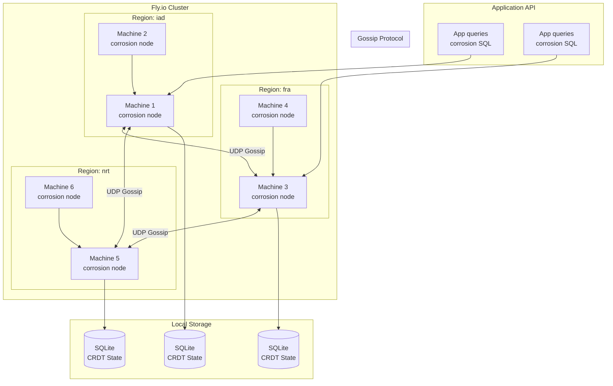

# Deep Dive: Corrosion Service Discovery

## Overview

This deep dive examines corrosion - Fly.io's distributed service discovery system built on CRDTs (Conflict-free Replicated Data Types) and SQLite. Corrosion enables Fly.io Machines to discover and communicate with each other across 80+ edge locations without a central coordinator.

## Architecture



## CRDT Fundamentals

### What are CRDTs?

CRDTs (Conflict-free Replicated Data Types) are data structures that can be replicated across multiple nodes and updated independently without coordination, while guaranteeing eventual consistency.

```rust
// CRDT properties:
// 1. Commutativity: op_a ∘ op_b = op_b ∘ op_a
// 2. Associativity: (op_a ∘ op_b) ∘ op_c = op_a ∘ (op_b ∘ op_c)
// 3. Idempotency: op_a ∘ op_a = op_a

// This means operations can be:
// - Applied in any order
// - Applied multiple times
// - Applied concurrently
// And still converge to the same state
```

### G-Counter (Grow-only Counter)

```rust
// crdts/gcounter.rs

use std::collections::HashMap;
use serde::{Serialize, Deserialize};

/// G-Counter: Grow-only counter CRDT
/// Each node increments its own count, merge takes max per node
#[derive(Debug, Clone, Serialize, Deserialize)]
pub struct GCounter {
    /// Node ID -> count
    counts: HashMap<String, u64>,
}

impl GCounter {
    pub fn new() -> Self {
        Self {
            counts: HashMap::new(),
        }
    }
    
    /// Increment counter for this node
    pub fn increment(&mut self, node_id: &str, amount: u64) {
        let entry = self.counts.entry(node_id.to_string()).or_insert(0);
        *entry += amount;
    }
    
    /// Get total count (sum of all node counts)
    pub fn value(&self) -> u64 {
        self.counts.values().sum()
    }
    
    /// Merge two G-Counters (takes max per node)
    pub fn merge(&mut self, other: &GCounter) {
        for (node_id, count) in &other.counts {
            let entry = self.counts.entry(node_id.clone()).or_insert(0);
            *entry = (*entry).max(*count);
        }
    }
}

// Example:
// Node A: {A: 5, B: 3}
// Node B: {A: 2, B: 7}
// After merge: {A: 5, B: 7} (takes max per node)
// Total: 12
```

### PN-Counter (Positive-Negative Counter)

```rust
// crdts/pncounter.rs

use super::gcounter::GCounter;

/// PN-Counter: Supports increment and decrement
/// Uses two G-Counters: one for increments, one for decrements
#[derive(Debug, Clone, Serialize, Deserialize)]
pub struct PNCounter {
    positive: GCounter,
    negative: GCounter,
}

impl PNCounter {
    pub fn new() -> Self {
        Self {
            positive: GCounter::new(),
            negative: GCounter::new(),
        }
    }
    
    pub fn increment(&mut self, node_id: &str, amount: u64) {
        self.positive.increment(node_id, amount);
    }
    
    pub fn decrement(&mut self, node_id: &str, amount: u64) {
        self.negative.increment(node_id, amount);
    }
    
    pub fn value(&self) -> u64 {
        self.positive.value().saturating_sub(self.negative.value())
    }
    
    pub fn merge(&mut self, other: &PNCounter) {
        self.positive.merge(&other.positive);
        self.negative.merge(&other.negative);
    }
}
```

### G-Set (Grow-only Set)

```rust
// crdts/gset.rs

use std::collections::HashSet;
use serde::{Serialize, Deserialize};

/// G-Set: Grow-only set CRDT
/// Elements can only be added, never removed
#[derive(Debug, Clone, Serialize, Deserialize)]
pub struct GSet<T: Eq + std::hash::Hash + Clone> {
    elements: HashSet<T>,
}

impl<T: Eq + std::hash::Hash + Clone> GSet<T> {
    pub fn new() -> Self {
        Self {
            elements: HashSet::new(),
        }
    }
    
    pub fn add(&mut self, element: T) {
        self.elements.insert(element);
    }
    
    pub fn contains(&self, element: &T) -> bool {
        self.elements.contains(element)
    }
    
    pub fn elements(&self) -> Vec<T> {
        self.elements.iter().cloned().collect()
    }
    
    /// Merge takes union of both sets
    pub fn merge(&mut self, other: &GSet<T>) {
        for element in &other.elements {
            self.elements.insert(element.clone());
        }
    }
}
```

### 2P-Set (Two-Phase Set)

```rust
// crdts/2pset.rs

use super::gset::GSet;

/// 2P-Set: Supports add and remove
/// Uses two G-Sets: one for additions, one for tombstones (removals)
/// Once removed, an element cannot be re-added
#[derive(Debug, Clone, Serialize, Deserialize)]
pub struct TwoPSet<T: Eq + std::hash::Hash + Clone> {
    added: GSet<T>,
    removed: GSet<T>,
}

impl<T: Eq + std::hash::Hash + Clone> TwoPSet<T> {
    pub fn new() -> Self {
        Self {
            added: GSet::new(),
            removed: GSet::new(),
        }
    }
    
    pub fn add(&mut self, element: T) {
        self.added.add(element);
    }
    
    pub fn remove(&mut self, element: &T) {
        if self.added.contains(element) {
            self.removed.add(element.clone());
        }
    }
    
    pub fn contains(&self, element: &T) -> bool {
        self.added.contains(element) && !self.removed.contains(element)
    }
    
    pub fn merge(&mut self, other: &TwoPSet<T>) {
        self.added.merge(&other.added);
        self.removed.merge(&other.removed);
    }
}
```

### OR-Set (Observed-Remove Set)

```rust
// crdts/orset.rs

use std::collections::{HashMap, HashSet};
use serde::{Serialize, Deserialize};

/// OR-Set: Observed-Remove Set CRDT
/// Supports add/remove with proper concurrent semantics
/// Uses unique tags to track causality
#[derive(Debug, Clone, Serialize, Deserialize)]
pub struct ORSet<T: Eq + std::hash::Hash + Clone> {
    /// Element -> set of (node_id, unique_id) tags
    elements: HashMap<T, HashSet<(String, u64)>>,
    /// Tombstones: removed tags
    tombstones: HashSet<(String, u64)>,
    /// Counter for generating unique IDs
    counter: u64,
}

impl<T: Eq + std::hash::Hash + Clone> ORSet<T> {
    pub fn new() -> Self {
        Self {
            elements: HashMap::new(),
            tombstones: HashSet::new(),
            counter: 0,
        }
    }
    
    pub fn add(&mut self, node_id: &str, element: T) {
        self.counter += 1;
        let tag = (node_id.to_string(), self.counter);
        
        self.elements
            .entry(element)
            .or_insert_with(HashSet::new)
            .insert(tag);
    }
    
    pub fn remove(&mut self, node_id: &str, element: &T) {
        // Collect all current tags for this element as tombstones
        if let Some(tags) = self.elements.get(element) {
            for tag in tags {
                self.tombstones.insert(tag.clone());
            }
        }
        
        // Remove the element
        self.elements.remove(element);
    }
    
    pub fn contains(&self, element: &T) -> bool {
        if let Some(tags) = self.elements.get(element) {
            // Element exists if any tag is not tombstoned
            tags.iter().any(|tag| !self.tombstones.contains(tag))
        } else {
            false
        }
    }
    
    pub fn elements(&self) -> Vec<T> {
        self.elements
            .keys()
            .filter(|e| self.contains(e))
            .cloned()
            .collect()
    }
    
    pub fn merge(&mut self, other: &ORSet<T>) {
        // Merge tombstones first
        self.tombstones.extend(other.tombstones.iter().cloned());
        
        // Merge elements
        for (element, tags) in &other.elements {
            let entry = self.elements.entry(element.clone()).or_insert_with(HashSet::new);
            entry.extend(tags.iter().cloned());
        }
        
        // Remove tombstoned elements
        self.elements.retain(|_, tags| {
            tags.retain(|tag| !self.tombstones.contains(tag));
            !tags.is_empty()
        });
        
        // Update counter
        self.counter = self.counter.max(other.counter);
    }
}
```

### LWW-Register (Last-Writer-Wins Register)

```rust
// crdts/lww_register.rs

use serde::{Serialize, Deserialize};

/// LWW-Register: Last-Writer-Wins Register CRDT
/// Uses timestamps to resolve conflicts
#[derive(Debug, Clone, Serialize, Deserialize)]
pub struct LWWRegister<T: Clone> {
    value: Option<T>,
    timestamp: u64,
}

impl<T: Clone> LWWRegister<T> {
    pub fn new(value: T) -> Self {
        Self {
            value: Some(value),
            timestamp: current_timestamp(),
        }
    }
    
    pub fn set(&mut self, value: T) {
        let ts = current_timestamp();
        if ts > self.timestamp {
            self.value = Some(value);
            self.timestamp = ts;
        }
    }
    
    pub fn get(&self) -> Option<&T> {
        self.value.as_ref()
    }
    
    pub fn merge(&mut self, other: &LWWRegister<T>) {
        if other.timestamp > self.timestamp {
            self.value = other.value.clone();
            self.timestamp = other.timestamp;
        }
    }
}

fn current_timestamp() -> u64 {
    use std::time::{SystemTime, UNIX_EPOCH};
    SystemTime::now()
        .duration_since(UNIX_EPOCH)
        .unwrap()
        .as_millis() as u64
}
```

## SQLite CRDT Storage

### Schema Design

```sql
-- corrosion/src/schema.sql

-- Node registration table
CREATE TABLE IF NOT EXISTS nodes (
    node_id TEXT PRIMARY KEY,
    address TEXT NOT NULL,
    port INTEGER NOT NULL,
    region TEXT NOT NULL,
    last_heartbeat INTEGER NOT NULL,
    metadata TEXT,
    created_at INTEGER DEFAULT (unixepoch())
);

-- Service instances table (OR-Set backed)
CREATE TABLE IF NOT EXISTS service_instances (
    service_name TEXT NOT NULL,
    instance_id TEXT NOT NULL,
    node_id TEXT NOT NULL,
    address TEXT NOT NULL,
    port INTEGER NOT NULL,
    tags TEXT,  -- JSON array of tags
    priority INTEGER DEFAULT 0,
    weight INTEGER DEFAULT 1,
    created_at INTEGER DEFAULT (unixepoch()),
    updated_at INTEGER DEFAULT (unixepoch()),
    PRIMARY KEY (service_name, instance_id)
);

-- CRDT operations log (for gossip)
CREATE TABLE IF NOT EXISTS crdt_operations (
    operation_id TEXT PRIMARY KEY,
    node_id TEXT NOT NULL,
    timestamp INTEGER NOT NULL,
    operation_type TEXT NOT NULL,  -- 'insert', 'update', 'delete'
    table_name TEXT NOT NULL,
    record_key TEXT NOT NULL,
    data TEXT,  -- JSON payload
    vector_clock TEXT,  -- JSON vector clock
    processed BOOLEAN DEFAULT FALSE
);

-- Vector clock state per node
CREATE TABLE IF NOT EXISTS vector_clocks (
    node_id TEXT NOT NULL,
    origin_node_id TEXT NOT NULL,
    clock_value INTEGER NOT NULL,
    PRIMARY KEY (node_id, origin_node_id)
);

-- Gossip peer state
CREATE TABLE IF NOT EXISTS gossip_peers (
    peer_id TEXT PRIMARY KEY,
    address TEXT NOT NULL,
    port INTEGER NOT NULL,
    last_gossip INTEGER,
    gossip_count INTEGER DEFAULT 0,
    failure_count INTEGER DEFAULT 0
);

-- Indexes for common queries
CREATE INDEX IF NOT EXISTS idx_services_by_name ON service_instances(service_name);
CREATE INDEX IF NOT EXISTS idx_services_by_node ON service_instances(node_id);
CREATE INDEX IF NOT EXISTS idx_nodes_by_region ON nodes(region);
CREATE INDEX IF NOT EXISTS idx_unprocessed_ops ON crdt_operations(processed) WHERE NOT processed;
```

### Rust SQLite Wrapper

```rust
// corrosion/src/db.rs

use rusqlite::{Connection, params};
use serde_json;
use std::sync::Arc;
use tokio::sync::RwLock;

pub struct CorrosionDb {
    conn: Arc<RwLock<Connection>>,
    node_id: String,
}

impl CorrosionDb {
    pub fn new(path: &str, node_id: String) -> Result<Self, rusqlite::Error> {
        let conn = Connection::open(path)?;
        
        // Enable WAL mode for better concurrency
        conn.execute("PRAGMA journal_mode = WAL", [])?;
        
        // Enable foreign keys
        conn.execute("PRAGMA foreign_keys = ON", [])?;
        
        // Set busy timeout
        conn.execute("PRAGMA busy_timeout = 5000", [])?;
        
        Ok(Self {
            conn: Arc::new(RwLock::new(conn)),
            node_id,
        })
    }
    
    /// Register this node in the cluster
    pub async fn register_node(&self, address: &str, port: u16, region: &str) -> Result<(), rusqlite::Error> {
        let conn = self.conn.write().await;
        
        conn.execute(
            "INSERT OR REPLACE INTO nodes (node_id, address, port, region, last_heartbeat, metadata)
             VALUES (?1, ?2, ?3, ?4, unixepoch(), ?5)",
            params![self.node_id, address, port, region, serde_json::json!({
                "version": env!("CARGO_PKG_VERSION"),
            })],
        )?;
        
        Ok(())
    }
    
    /// Register a service instance
    pub async fn register_service(
        &self,
        service_name: &str,
        instance_id: &str,
        address: &str,
        port: u16,
        tags: Vec<String>,
    ) -> Result<(), rusqlite::Error> {
        let conn = self.conn.write().await;
        
        let tags_json = serde_json::to_string(&tags)?;
        
        conn.execute(
            "INSERT OR REPLACE INTO service_instances 
             (service_name, instance_id, node_id, address, port, tags, updated_at)
             VALUES (?1, ?2, ?3, ?4, ?5, ?6, unixepoch())",
            params![service_name, instance_id, self.node_id, address, port, tags_json],
        )?;
        
        // Log CRDT operation for gossip
        self.log_crdt_operation(
            &conn,
            "insert",
            "service_instances",
            &format!("{}.{}", service_name, instance_id),
            &serde_json::json!({
                "service_name": service_name,
                "instance_id": instance_id,
                "address": address,
                "port": port,
                "tags": tags,
            }),
        )?;
        
        Ok(())
    }
    
    /// Deregister a service instance
    pub async fn deregister_service(
        &self,
        service_name: &str,
        instance_id: &str,
    ) -> Result<(), rusqlite::Error> {
        let conn = self.conn.write().await;
        
        conn.execute(
            "DELETE FROM service_instances 
             WHERE service_name = ?1 AND instance_id = ?2 AND node_id = ?3",
            params![service_name, instance_id, self.node_id],
        )?;
        
        // Log CRDT operation for gossip
        self.log_crdt_operation(
            &conn,
            "delete",
            "service_instances",
            &format!("{}.{}", service_name, instance_id),
            &serde_json::json!({
                "service_name": service_name,
                "instance_id": instance_id,
            }),
        )?;
        
        Ok(())
    }
    
    /// Query service instances by name
    pub async fn query_service(
        &self,
        service_name: &str,
    ) -> Result<Vec<ServiceInstance>, rusqlite::Error> {
        let conn = self.conn.read().await;
        
        let mut stmt = conn.prepare(
            "SELECT instance_id, node_id, address, port, tags, priority, weight
             FROM service_instances
             WHERE service_name = ?1
             ORDER BY priority DESC, weight ASC"
        )?;
        
        let rows = stmt.query_map(params![service_name], |row| {
            let tags_json: String = row.get(4)?;
            let tags: Vec<String> = serde_json::from_str(&tags_json).unwrap_or_default();
            
            Ok(ServiceInstance {
                instance_id: row.get(0)?,
                node_id: row.get(1)?,
                address: row.get(2)?,
                port: row.get(3)?,
                tags,
                priority: row.get(5)?,
                weight: row.get(6)?,
            })
        })?;
        
        let mut instances = Vec::new();
        for row in rows {
            instances.push(row?);
        }
        
        Ok(instances)
    }
    
    /// Get all healthy nodes
    pub async fn get_healthy_nodes(&self) -> Result<Vec<NodeInfo>, rusqlite::Error> {
        let conn = self.conn.read().await;
        
        let threshold = (std::time::SystemTime::now()
            .duration_since(std::time::UNIX_EPOCH)
            .unwrap()
            .as_secs() - 30) as i64;  // 30 second timeout
        
        let mut stmt = conn.prepare(
            "SELECT node_id, address, port, region, metadata
             FROM nodes
             WHERE last_heartbeat > ?1
             ORDER BY region, node_id"
        )?;
        
        let rows = stmt.query_map(params![threshold], |row| {
            let metadata_json: String = row.get(4)?;
            let metadata: serde_json::Value = serde_json::from_str(&metadata_json).unwrap_or_default();
            
            Ok(NodeInfo {
                node_id: row.get(0)?,
                address: row.get(1)?,
                port: row.get(2)?,
                region: row.get(3)?,
                metadata,
            })
        })?;
        
        let mut nodes = Vec::new();
        for row in rows {
            nodes.push(row?);
        }
        
        Ok(nodes)
    }
    
    /// Get unprocessed CRDT operations for gossip
    pub async fn get_unprocessed_operations(&self, limit: usize) -> Result<Vec<CrdtOperation>, rusqlite::Error> {
        let conn = self.conn.read().await;
        
        let mut stmt = conn.prepare(
            "SELECT operation_id, node_id, timestamp, operation_type, table_name, record_key, data, vector_clock
             FROM crdt_operations
             WHERE NOT processed
             ORDER BY timestamp ASC
             LIMIT ?1"
        )?;
        
        let rows = stmt.query_map(params![limit], |row| {
            let vc_json: String = row.get(7)?;
            let vector_clock: std::collections::HashMap<String, u64> = 
                serde_json::from_str(&vc_json).unwrap_or_default();
            
            Ok(CrdtOperation {
                operation_id: row.get(0)?,
                node_id: row.get(1)?,
                timestamp: row.get(2)?,
                operation_type: row.get(3)?,
                table_name: row.get(4)?,
                record_key: row.get(5)?,
                data: row.get(6)?,
                vector_clock,
            })
        })?;
        
        let mut ops = Vec::new();
        for row in rows {
            ops.push(row?);
        }
        
        Ok(ops)
    }
    
    /// Mark operation as processed
    pub async fn mark_operation_processed(&self, operation_id: &str) -> Result<(), rusqlite::Error> {
        let conn = self.conn.write().await;
        
        conn.execute(
            "UPDATE crdt_operations SET processed = TRUE WHERE operation_id = ?1",
            params![operation_id],
        )?;
        
        Ok(())
    }
    
    /// Apply a CRDT operation received via gossip
    pub async fn apply_crdt_operation(&self, op: &CrdtOperation) -> Result<(), rusqlite::Error> {
        let conn = self.conn.write().await;
        
        // Check if operation already applied (idempotency)
        let exists: bool = conn.query_row(
            "SELECT EXISTS(SELECT 1 FROM crdt_operations WHERE operation_id = ?1)",
            params![op.operation_id],
            |row| row.get(0),
        )?;
        
        if exists {
            return Ok(());  // Already processed
        }
        
        // Apply operation based on type
        match op.operation_type.as_str() {
            "insert" | "update" => {
                if op.table_name == "service_instances" {
                    let data: serde_json::Value = serde_json::from_str(&op.data)?;
                    
                    conn.execute(
                        "INSERT OR REPLACE INTO service_instances 
                         (service_name, instance_id, node_id, address, port, tags, updated_at)
                         VALUES (?1, ?2, ?3, ?4, ?5, ?6, ?7)",
                        params![
                            data["service_name"].as_str().unwrap(),
                            data["instance_id"].as_str().unwrap(),
                            data["node_id"].as_str().unwrap_or(&op.node_id),
                            data["address"].as_str().unwrap(),
                            data["port"].as_u64().unwrap() as u16,
                            serde_json::to_string(&data["tags"]).unwrap_or("[]".to_string()),
                            op.timestamp,
                        ],
                    )?;
                }
            }
            "delete" => {
                if op.table_name == "service_instances" {
                    let data: serde_json::Value = serde_json::from_str(&op.data)?;
                    
                    conn.execute(
                        "DELETE FROM service_instances 
                         WHERE service_name = ?1 AND instance_id = ?2",
                        params![
                            data["service_name"].as_str().unwrap(),
                            data["instance_id"].as_str().unwrap(),
                        ],
                    )?;
                }
            }
            _ => {}
        }
        
        // Log the operation
        let vc_json = serde_json::to_string(&op.vector_clock)?;
        conn.execute(
            "INSERT OR IGNORE INTO crdt_operations 
             (operation_id, node_id, timestamp, operation_type, table_name, record_key, data, vector_clock, processed)
             VALUES (?1, ?2, ?3, ?4, ?5, ?6, ?7, ?8, TRUE)",
            params![
                op.operation_id,
                op.node_id,
                op.timestamp,
                op.operation_type,
                op.table_name,
                op.record_key,
                op.data,
                vc_json,
            ],
        )?;
        
        Ok(())
    }
    
    fn log_crdt_operation(
        &self,
        conn: &Connection,
        op_type: &str,
        table: &str,
        key: &str,
        data: &serde_json::Value,
    ) -> Result<(), rusqlite::Error> {
        use std::time::{SystemTime, UNIX_EPOCH};
        
        let timestamp = SystemTime::now()
            .duration_since(UNIX_EPOCH)
            .unwrap()
            .as_millis() as u64;
        
        let operation_id = format!("{}-{}-{}", self.node_id, table, timestamp);
        
        // Get current vector clock
        let mut vc = self.get_vector_clock(conn)?;
        *vc.entry(self.node_id.clone()).or_insert(0) += 1;
        let vc_json = serde_json::to_string(&vc)?;
        
        let data_json = serde_json::to_string(data)?;
        
        conn.execute(
            "INSERT INTO crdt_operations 
             (operation_id, node_id, timestamp, operation_type, table_name, record_key, data, vector_clock)
             VALUES (?1, ?2, ?3, ?4, ?5, ?6, ?7, ?8)",
            params![operation_id, self.node_id, timestamp, op_type, table, key, data_json, vc_json],
        )?;
        
        Ok(())
    }
    
    fn get_vector_clock(&self, conn: &Connection) -> Result<std::collections::HashMap<String, u64>, rusqlite::Error> {
        let mut stmt = conn.prepare("SELECT origin_node_id, clock_value FROM vector_clocks WHERE node_id = ?1")?;
        let rows = stmt.query_map(params![self.node_id], |row| {
            Ok((row.get::<_, String>(0)?, row.get::<_, u64>(1)?))
        })?;
        
        let mut vc = std::collections::HashMap::new();
        for row in rows {
            let (origin, value) = row?;
            vc.insert(origin, value);
        }
        
        Ok(vc)
    }
}

#[derive(Debug, Clone)]
pub struct ServiceInstance {
    pub instance_id: String,
    pub node_id: String,
    pub address: String,
    pub port: u16,
    pub tags: Vec<String>,
    pub priority: i32,
    pub weight: i32,
}

#[derive(Debug, Clone)]
pub struct NodeInfo {
    pub node_id: String,
    pub address: String,
    pub port: u16,
    pub region: String,
    pub metadata: serde_json::Value,
}

#[derive(Debug, Clone)]
pub struct CrdtOperation {
    pub operation_id: String,
    pub node_id: String,
    pub timestamp: u64,
    pub operation_type: String,
    pub table_name: String,
    pub record_key: String,
    pub data: String,
    pub vector_clock: std::collections::HashMap<String, u64>,
}
```

## Gossip Protocol

### Gossip Implementation

```rust
// corrosion/src/gossip.rs

use std::sync::Arc;
use std::time::Duration;
use tokio::time::interval;
use tokio::sync::RwLock;
use rand::seq::SliceRandom;

pub struct GossipProtocol {
    node_id: String,
    db: Arc<super::db::CorrosionDb>,
    peers: Arc<RwLock<Vec<PeerInfo>>>,
    config: GossipConfig,
}

pub struct GossipConfig {
    pub gossip_interval: Duration,
    pub peer_timeout: Duration,
    pub batch_size: usize,
    pub fanout: usize,
}

impl Default for GossipConfig {
    fn default() -> Self {
        Self {
            gossip_interval: Duration::from_secs(1),
            peer_timeout: Duration::from_secs(30),
            batch_size: 100,
            fanout: 3,
        }
    }
}

#[derive(Debug, Clone)]
pub struct PeerInfo {
    pub node_id: String,
    pub address: String,
    pub port: u16,
    pub last_contact: std::time::SystemTime,
    pub failure_count: u32,
}

impl GossipProtocol {
    pub fn new(
        node_id: String,
        db: Arc<super::db::CorrosionDb>,
    ) -> Self {
        Self {
            node_id,
            db,
            peers: Arc::new(RwLock::new(Vec::new())),
            config: GossipConfig::default(),
        }
    }
    
    /// Start the gossip protocol
    pub async fn run(&self) -> Result<(), Box<dyn std::error::Error>> {
        let mut gossip_interval = interval(self.config.gossip_interval);
        
        loop {
            gossip_interval.tick().await;
            
            // Send heartbeat
            if let Err(e) = self.send_heartbeat().await {
                eprintln!("Failed to send heartbeat: {}", e);
            }
            
            // Gossip to random peers
            if let Err(e) = self.gossip_round().await {
                eprintln!("Gossip round failed: {}", e);
            }
            
            // Cleanup dead peers
            self.cleanup_peers().await;
        }
    }
    
    async fn send_heartbeat(&self) -> Result<(), Box<dyn std::error::Error>> {
        // Update local node heartbeat
        // In production, this would also query for our address/port
        self.db.register_node("127.0.0.1", 5000, "local").await?;
        Ok(())
    }
    
    async fn gossip_round(&self) -> Result<(), Box<dyn std::error::Error>> {
        // Get unprocessed operations
        let ops = self.db.get_unprocessed_operations(self.config.batch_size).await?;
        
        if ops.is_empty() {
            return Ok(());
        }
        
        // Get peer list
        let nodes = self.db.get_healthy_nodes().await?;
        
        // Filter out self and select random peers
        let peers: Vec<_> = nodes
            .into_iter()
            .filter(|n| n.node_id != self.node_id)
            .collect();
        
        if peers.is_empty() {
            return Ok(());
        }
        
        // Select random peers (fanout)
        let mut rng = rand::thread_rng();
        let selected: Vec<_> = peers
            .choose_multiple(&mut rng, self.config.fanout.min(peers.len()))
            .collect();
        
        // Send operations to selected peers
        for peer in selected {
            if let Err(e) = self.send_to_peer(peer, &ops).await {
                eprintln!("Failed to gossip to {}: {}", peer.node_id, e);
            }
        }
        
        Ok(())
    }
    
    async fn send_to_peer(
        &self,
        peer: &super::db::NodeInfo,
        ops: &[super::db::CrdtOperation],
    ) -> Result<(), Box<dyn std::error::Error>> {
        // In production, this would use UDP or TCP to send the operations
        // For now, we simulate by directly applying them
        
        let url = format!("http://{}:{}/gossip", peer.address, peer.port);
        
        // Serialize operations
        let payload = serde_json::to_string(&serde_json::json!({
            "sender": self.node_id,
            "operations": ops,
        }))?;
        
        // Send HTTP request (in production, use UDP for efficiency)
        let client = reqwest::Client::new();
        let response = client.post(&url)
            .header("Content-Type", "application/json")
            .body(payload)
            .send()
            .await?;
        
        if !response.status().is_success() {
            return Err(format!("Peer returned error: {}", response.status()).into());
        }
        
        // Mark operations as processed
        for op in ops {
            self.db.mark_operation_processed(&op.operation_id).await?;
        }
        
        Ok(())
    }
    
    /// Handle incoming gossip
    pub async fn handle_gossip(
        &self,
        sender_id: &str,
        ops: Vec<super::db::CrdtOperation>,
    ) -> Result<(), Box<dyn std::error::Error>> {
        // Apply each operation (CRDT semantics ensure idempotency)
        for op in &ops {
            if let Err(e) = self.db.apply_crdt_operation(op).await {
                eprintln!("Failed to apply CRDT operation: {}", e);
            }
        }
        
        Ok(())
    }
    
    async fn cleanup_peers(&self) {
        let mut peers = self.peers.write().await;
        
        let now = std::time::SystemTime::now();
        peers.retain(|peer| {
            peer.last_contact.elapsed().unwrap_or(Duration::from_secs(60)) 
                < self.config.peer_timeout
        });
    }
}
```

## Service Discovery API

### Query Interface

```rust
// corrosion/src/api.rs

use axum::{
    extract::{Path, Query, State},
    http::StatusCode,
    routing::get,
    Json, Router,
};
use serde::{Deserialize, Serialize};
use std::sync::Arc;

pub struct CorrosionApi {
    db: Arc<super::db::CorrosionDb>,
}

impl CorrosionApi {
    pub fn new(db: Arc<super::db::CorrosionDb>) -> Self {
        Self { db }
    }
    
    pub fn router(&self) -> Router {
        Router::new()
            .route("/services/:name", get(Self::query_service))
            .route("/services/:name/healthy", get(Self::query_healthy))
            .route("/nodes", get(Self::list_nodes))
            .route("/nodes/:id", get(Self::get_node))
            .route("/health", get(Self::health_check))
            .with_state(self.db.clone())
    }
    
    async fn query_service(
        State(db): State<Arc<super::db::CorrosionDb>>,
        Path(name): Path<String>,
    ) -> Result<Json<Vec<super::db::ServiceInstance>>, StatusCode> {
        let instances = db.query_service(&name)
            .await
            .map_err(|_| StatusCode::INTERNAL_SERVER_ERROR)?;
        
        Ok(Json(instances))
    }
    
    async fn query_healthy(
        State(db): State<Arc<super::db::CorrosionDb>>,
        Path(name): Path<String>,
    ) -> Result<Json<Vec<super::db::ServiceInstance>>, StatusCode> {
        let all_instances = db.query_service(&name)
            .await
            .map_err(|_| StatusCode::INTERNAL_SERVER_ERROR)?;
        
        // Filter to healthy instances (in production, check heartbeat)
        let healthy: Vec<_> = all_instances
            .into_iter()
            .filter(|i| i.tags.iter().any(|t| t == "healthy"))
            .collect();
        
        Ok(Json(healthy))
    }
    
    async fn list_nodes(
        State(db): State<Arc<super::db::CorrosionDb>>,
    ) -> Result<Json<Vec<super::db::NodeInfo>>, StatusCode> {
        let nodes = db.get_healthy_nodes()
            .await
            .map_err(|_| StatusCode::INTERNAL_SERVER_ERROR)?;
        
        Ok(Json(nodes))
    }
    
    async fn get_node(
        State(db): State<Arc<super::db::CorrosionDb>>,
        Path(id): Path<String>,
    ) -> Result<Json<super::db::NodeInfo>, StatusCode> {
        let nodes = db.get_healthy_nodes()
            .await
            .map_err(|_| StatusCode::INTERNAL_SERVER_ERROR)?;
        
        nodes.into_iter()
            .find(|n| n.node_id == id)
            .map(Json)
            .ok_or(StatusCode::NOT_FOUND)
    }
    
    async fn health_check() -> Result<StatusCode, StatusCode> {
        Ok(StatusCode::OK)
    }
}

#[derive(Debug, Serialize, Deserialize)]
pub struct ServiceQuery {
    pub name: String,
    pub tags: Option<Vec<String>>,
    pub region: Option<String>,
}
```

## Conclusion

Corrosion provides:

1. **CRDT-Based Replication**: Conflict-free data replication across all nodes
2. **SQLite Storage**: Efficient local storage with SQL query capabilities
3. **Gossip Protocol**: Decentralized peer-to-peer synchronization
4. **Service Discovery**: SQL-based service registration and querying
5. **Eventual Consistency**: Guaranteed convergence without coordination
6. **Idempotent Operations**: Safe to retry and reprocess operations

The combination of CRDTs with SQLite enables powerful SQL queries over eventually-consistent distributed data, making service discovery both flexible and resilient.
