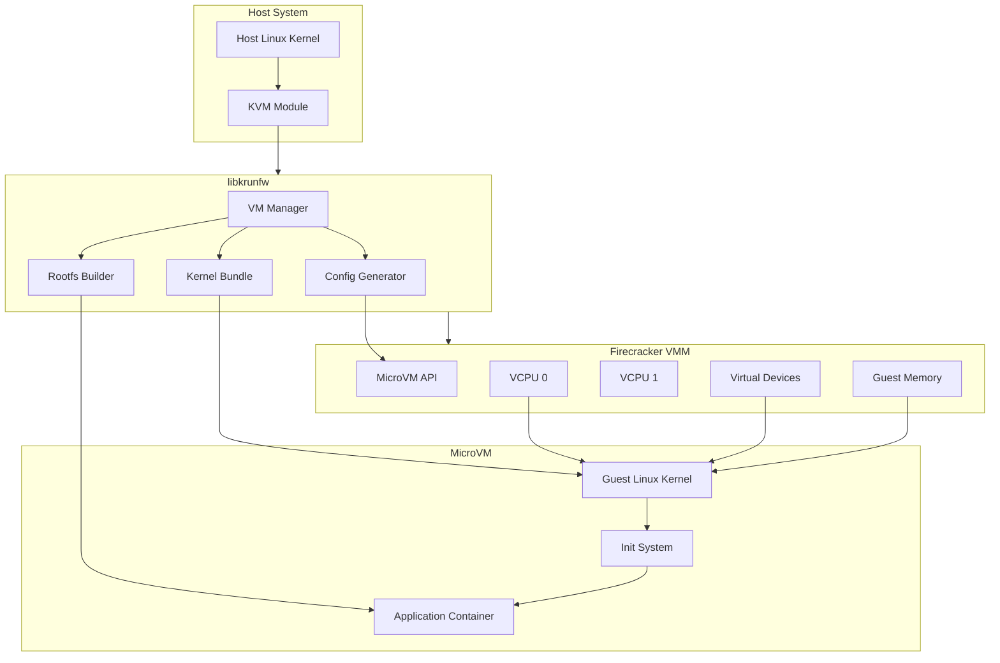

# Deep Dive: libkrunfw and MicroVMs

## Overview

This deep dive examines libkrunfw - Fly.io's embedded Linux kernel library for creating Firecracker microVMs. We'll explore hardware virtualization fundamentals, Firecracker architecture, kernel configuration, and the patches that enable Fly.io's edge platform.

## Architecture



## Hardware Virtualization Fundamentals

### CPU Virtualization Extensions

```rust
// Virtualization extensions provide hardware support for VMs

// Intel VT-x extensions:
// - VMX (Virtual Machine Extensions)
// - EPT (Extended Page Tables)
// - VT-d (Direct I/O)

// AMD-V extensions:
// - SVM (Secure Virtual Machine)
// - NPT (Nested Page Tables)
// - IOMMU (I/O Memory Management Unit)

/// CPU feature detection for virtualization
pub fn has_virtualization_support() -> bool {
    // Read CPUID leaf 1, ECX bit 5 (VMX for Intel)
    // or ECX bit 2 (SVM for AMD)
    
    let cpuid = unsafe {
        std::arch::x86_64::__cpuid(1)
    };
    
    // Check for VMX (Intel) or SVM (AMD)
    let has_vmx = (cpuid.ecx & (1 << 5)) != 0;
    let has_svm = (cpuid.ecx & (1 << 2)) != 0;
    
    has_vmx || has_svm
}

/// KVM capability checking
pub fn check_kvm_capabilities() -> Result<(), String> {
    use std::fs::File;
    use std::os::unix::io::AsRawFd;
    
    // Open /dev/kvm
    let kvm_fd = File::open("/dev/kvm")
        .map_err(|e| format!("Failed to open /dev/kvm: {}", e))?;
    
    // Check KVM version
    let version = unsafe {
        libc::ioctl(kvm_fd.as_raw_fd(), 0xAE00u64 as _)
    };
    
    if version < 0 {
        return Err("KVM not available".to_string());
    }
    
    // Check specific capabilities
    let capabilities = [
        kvm_ioctls::KVM_CAP_USER_MEMORY,
        kvm_ioctls::KVM_CAP_IRQFD,
        kvm_ioctls::KVM_CAP_IOEVENTFD,
        kvm_ioctls::KVM_CAP_PIT2,
        kvm_ioctls::KVM_CAP_SET_TSS_ADDR,
    ];
    
    for cap in &capabilities {
        let ret = unsafe {
            libc::ioctl(kvm_fd.as_raw_fd(), kvm_ioctls::KVM_CHECK_EXTENSION(), *cap)
        };
        
        if ret <= 0 {
            return Err(format!("KVM capability {} not supported", cap));
        }
    }
    
    Ok(())
}
```

### Memory Virtualization

```rust
// Memory virtualization with EPT/NPT

/// Guest Physical Address (GPA) to Host Physical Address (HPA) mapping
pub struct MemoryMap {
    /// Base GPA
    base_gpa: u64,
    /// Size in bytes
    size: usize,
    /// Host virtual address
    hva: *mut u8,
    /// Host physical address
    hpa: u64,
    /// Permissions
    read: bool,
    write: bool,
    execute: bool,
}

impl MemoryMap {
    /// Create a new memory region
    pub fn new(base_gpa: u64, size: usize) -> Result<Self, String> {
        // Allocate memory using mmap
        let ptr = unsafe {
            libc::mmap(
                std::ptr::null_mut(),
                size,
                libc::PROT_READ | libc::PROT_WRITE,
                libc::MAP_PRIVATE | libc::MAP_ANONYMOUS,
                -1,
                0,
            )
        };
        
        if ptr == libc::MAP_FAILED {
            return Err("Failed to allocate memory".to_string());
        }
        
        Ok(Self {
            base_gpa,
            size,
            hva: ptr as *mut u8,
            hpa: 0,  // Would be resolved via /proc/self/pagemap
            read: true,
            write: true,
            execute: false,
        })
    }
    
    /// Translate guest physical address to host virtual address
    pub fn gpa_to_hva(&self, gpa: u64) -> Option<*mut u8> {
        if gpa < self.base_gpa || gpa >= self.base_gpa + self.size as u64 {
            return None;
        }
        
        let offset = gpa - self.base_gpa;
        Some(unsafe { self.hva.add(offset as usize) })
    }
    
    /// Register memory region with KVM
    pub fn register_with_kvm(&self, kvm_fd: i32, slot: u32) -> Result<(), String> {
        let memory_region = kvm_bindings::kvm_userspace_memory_region {
            slot,
            flags: 0,
            guest_phys_addr: self.base_gpa,
            memory_size: self.size as u64,
            userspace_addr: self.hva as u64,
        };
        
        let ret = unsafe {
            libc::ioctl(
                kvm_fd,
                kvm_bindings::KVM_SET_USER_MEMORY_REGION(),
                &memory_region,
            )
        };
        
        if ret < 0 {
            return Err("Failed to register memory region".to_string());
        }
        
        Ok(())
    }
}

/// Memory layout for x86_64 microVM
pub struct MemoryLayout {
    /// Boot ROM (BIOS/UEFI)
    pub boot_rom_base: u64,
    pub boot_rom_size: usize,
    
    /// RAM starts here
    pub ram_base: u64,
    pub ram_size: usize,
    
    /// MMIO regions
    pub mmio_regions: Vec<MmioRegion>,
}

impl MemoryLayout {
    pub fn default_microvm(ram_size: usize) -> Self {
        Self {
            // Boot ROM at 16-bit compatibility region
            boot_rom_base: 0x000F0000,
            boot_rom_size: 0x00010000,
            
            // RAM starts at 1MB (traditional PC layout)
            ram_base: 0x00100000,
            ram_size,
            
            // MMIO regions for devices
            mmio_regions: vec![
                MmioRegion {
                    name: "uart".to_string(),
                    base: 0x03F8,
                    size: 8,
                },
                MmioRegion {
                    name: "rtc".to_string(),
                    base: 0x0070,
                    size: 2,
                },
                // ... more MMIO regions
            ],
        }
    }
}

#[derive(Debug, Clone)]
pub struct MmioRegion {
    pub name: String,
    pub base: u64,
    pub size: usize,
}
```

### Interrupt Virtualization

```rust
// Interrupt controller virtualization

/// Local APIC (Advanced Programmable Interrupt Controller)
pub struct LocalApic {
    /// APIC ID
    pub id: u32,
    /// Task Priority Register
    pub tpr: u8,
    /// Spurious Interrupt Vector Register
    pub svr: u8,
    /// In-Service Register (256 bits)
    pub isr: [u64; 4],
    /// Interrupt Request Register (256 bits)
    pub irr: [u64; 4],
    /// End Of Interrupt register
    pub eoi: u64,
}

impl LocalApic {
    pub fn new(id: u32) -> Self {
        Self {
            id,
            tpr: 0,
            svr: 0xFF,  // Enable APIC
            isr: [0; 4],
            irr: [0; 4],
            eoi: 0,
        }
    }
    
    /// Deliver an interrupt to this LAPIC
    pub fn deliver_interrupt(&mut self, vector: u8) {
        if vector < 32 {
            // Hardware exception - always deliver
            self.set_bit(&mut self.irr, vector);
        } else if vector as u8 > self.tpr {
            // Software interrupt - check priority
            self.set_bit(&mut self.irr, vector);
        }
    }
    
    fn set_bit(&mut self, arr: &mut [u64; 4], bit: u8) {
        let index = (bit / 64) as usize;
        let offset = bit % 64;
        arr[index] |= 1 << offset;
    }
    
    /// Get highest priority pending interrupt
    pub fn get_highest_irr(&self) -> Option<u8> {
        for i in (0..4).rev() {
            if self.irr[i] != 0 {
                let bit = 63 - self.irr[i].leading_zeros();
                return Some((i * 64 + bit as u8) as u8);
            }
        }
        None
    }
}

/// IO-APIC (I/O Advanced Programmable Interrupt Controller)
pub struct IoApic {
    /// Redirection Table (24 entries)
    pub redirection_table: [RedirectionEntry; 24],
    /// IO Select Register
    pub io_select: u8,
    /// IO Window Register
    pub io_window: u32,
}

#[derive(Debug, Clone, Copy)]
pub struct RedirectionEntry {
    pub vector: u8,
    pub delivery_mode: DeliveryMode,
    pub destination: u8,
    pub masked: bool,
}

#[derive(Debug, Clone, Copy, PartialEq)]
pub enum DeliveryMode {
    Fixed = 0,
    LowestPriority = 1,
    SMI = 2,
    NMI = 3,
    INIT = 4,
    ExtINT = 5,
    Reserved = 6,
    Startup = 7,
}
```

## Firecracker Architecture

### Firecracker VMM Structure

```rust
// Firecracker VMM components

/// Firecracker microVM configuration
pub struct FirecrackerConfig {
    /// VM ID
    pub vm_id: String,
    
    /// Kernel configuration
    pub kernel: KernelConfig,
    
    /// Root filesystem
    pub rootfs: RootfsConfig,
    
    /// Additional drives
    pub drives: Vec<DriveConfig>,
    
    /// Network interfaces
    pub network_interfaces: Vec<NetworkConfig>,
    
    /// VCPU configuration
    pub vcpu: VcpuConfig,
    
    /// Memory configuration
    pub memory: MemoryConfig,
    
    /// Boot timer
    pub boot_timer: bool,
    
    /// Logger
    pub logger: Option<LoggerConfig>,
    
    /// Metrics
    pub metrics: Option<MetricsConfig>,
}

#[derive(Debug, Clone)]
pub struct KernelConfig {
    /// Path to kernel image (or embedded data)
    pub image: String,
    /// Kernel command line
    pub cmdline: String,
    /// Initrd (optional)
    pub initrd: Option<String>,
}

#[derive(Debug, Clone)]
pub struct RootfsConfig {
    /// Path to rootfs image
    pub image: String,
    /// Read-only flag
    pub read_only: bool,
    /// Part UUID
    pub part_uuid: Option<String>,
}

#[derive(Debug, Clone)]
pub struct VcpuConfig {
    /// Number of vCPUs
    pub count: u8,
    /// CPU template (for consistency)
    pub template: Option<CpuTemplate>,
}

#[derive(Debug, Clone, Copy, PartialEq)]
pub enum CpuTemplate {
    None,
    T2,
    T2S,
    T2CL,
    T2A,
}

#[derive(Debug, Clone)]
pub struct MemoryConfig {
    /// Memory size in MB
    pub size_mb: usize,
    /// Track memory pages
    pub track_memory: bool,
}

/// Firecracker API client
pub struct FirecrackerClient {
    /// UNIX socket path
    socket_path: String,
    /// HTTP client
    client: reqwest::Client,
}

impl FirecrackerClient {
    pub fn new(socket_path: &str) -> Self {
        Self {
            socket_path: socket_path.to_string(),
            client: reqwest::Client::new(),
        }
    }
    
    /// Configure machine
    pub async fn configure_machine(&self, config: &FirecrackerConfig) -> Result<(), String> {
        // Set machine configuration
        self.put_machine_config(&json!({
            "vcpu_count": config.vcpu.count,
            "mem_size_mib": config.memory.size_mb,
            "smt": false,  // No simultaneous multithreading
        })).await?;
        
        // Set boot source
        self.put_boot_source(&json!({
            "kernel_image_path": config.kernel.image,
            "boot_args": config.kernel.cmdline,
            "initrd_path": config.kernel.initrd,
        })).await?;
        
        // Set root filesystem
        self.put_drive(&json!({
            "drive_id": "rootfs",
            "path_on_host": config.rootfs.image,
            "is_root_device": true,
            "part_uuid": config.rootfs.part_uuid,
            "is_read_only": config.rootfs.read_only,
        })).await?;
        
        // Configure network
        for (idx, net) in config.network_interfaces.iter().enumerate() {
            self.put_network_interface(&json!({
                "iface_id": format!("eth{}", idx),
                "host_dev_name": net.host_dev_name,
                "guest_mac": net.guest_mac,
            })).await?;
        }
        
        Ok(())
    }
    
    /// Start the microVM
    pub async fn start_machine(&self) -> Result<(), String> {
        let response = self.client
            .patch(format!("http://localhost/actions"))
            .json(&json!({
                "action_type": "InstanceStart",
            }))
            .send()
            .await
            .map_err(|e| e.to_string())?;
        
        if !response.status().is_success() {
            return Err(format!("Failed to start machine: {}", response.status()));
        }
        
        Ok(())
    }
    
    /// Stop the microVM
    pub async fn stop_machine(&self, send_sigterm: bool) -> Result<(), String> {
        let action = if send_sigterm {
            "SendCtrlAltDel"
        } else {
            "FlushMetrics"
        };
        
        let response = self.client
            .put(format!("http://localhost/actions"))
            .json(&json!({
                "action_type": action,
            }))
            .send()
            .await
            .map_err(|e| e.to_string())?;
        
        if !response.status().is_success() {
            return Err(format!("Failed to stop machine: {}", response.status()));
        }
        
        Ok(())
    }
    
    async fn put_machine_config(&self, config: &serde_json::Value) -> Result<(), String> {
        let response = self.client
            .put(format!("http://localhost/machine-config"))
            .json(config)
            .send()
            .await
            .map_err(|e| e.to_string())?;
        
        if !response.status().is_success() {
            return Err(format!("Failed to configure machine: {}", response.status()));
        }
        
        Ok(())
    }
    
    async fn put_boot_source(&self, config: &serde_json::Value) -> Result<(), String> {
        let response = self.client
            .put(format!("http://localhost/boot-source"))
            .json(config)
            .send()
            .await
            .map_err(|e| e.to_string())?;
        
        if !response.status().is_success() {
            return Err(format!("Failed to set boot source: {}", response.status()));
        }
        
        Ok(())
    }
    
    async fn put_drive(&self, config: &serde_json::Value) -> Result<(), String> {
        let response = self.client
            .put(format!("http://localhost/drives/{}", config["drive_id"]))
            .json(config)
            .send()
            .await
            .map_err(|e| e.to_string())?;
        
        if !response.status().is_success() {
            return Err(format!("Failed to configure drive: {}", response.status()));
        }
        
        Ok(())
    }
    
    async fn put_network_interface(&self, config: &serde_json::Value) -> Result<(), String> {
        let response = self.client
            .put(format!("http://localhost/network-interfaces/{}", config["iface_id"]))
            .json(config)
            .send()
            .await
            .map_err(|e| e.to_string())?;
        
        if !response.status().is_success() {
            return Err(format!("Failed to configure network: {}", response.status()));
        }
        
        Ok(())
    }
}
```

### VCPU Execution

```rust
// VCPU management and execution

use kvm_bindings::{kvm_regs, kvm_sregs, kvm_run};
use std::fs::File;
use std::os::unix::io::AsRawFd;

pub struct Vcpu {
    /// VCPU file descriptor
    fd: i32,
    /// VCPU ID
    id: u8,
    /// KVM run memory
    run_mmap: *mut kvm_run,
    /// KVM run size
    mmap_size: usize,
}

impl Vcpu {
    /// Create a new VCPU
    pub fn new(vm_fd: i32, id: u8) -> Result<Self, String> {
        // Create VCPU via KVM_CREATE_VCPU ioctl
        let vcpu_fd = unsafe {
            libc::ioctl(vm_fd, kvm_bindings::KVM_CREATE_VCPU(), id)
        };
        
        if vcpu_fd < 0 {
            return Err("Failed to create VCPU".to_string());
        }
        
        // Get mmap size for KVM run structure
        let mmap_size = unsafe {
            libc::ioctl(vm_fd, kvm_bindings::KVM_GET_VCPU_MMAP_SIZE())
        } as usize;
        
        // Map the KVM run structure
        let run_mmap = unsafe {
            libc::mmap(
                std::ptr::null_mut(),
                mmap_size,
                libc::PROT_READ | libc::PROT_WRITE,
                libc::MAP_SHARED,
                vcpu_fd,
                0,
            )
        } as *mut kvm_run;
        
        if run_mmap == libc::MAP_FAILED {
            return Err("Failed to mmap KVM run structure".to_string());
        }
        
        Ok(Self {
            fd: vcpu_fd,
            id,
            run_mmap,
            mmap_size,
        })
    }
    
    /// Initialize VCPU to real mode state
    pub fn init_real_mode(&self) -> Result<(), String> {
        // Set up segment registers for real mode
        let mut sregs: kvm_sregs = unsafe { std::mem::zeroed() };
        
        unsafe {
            if libc::ioctl(self.fd, kvm_bindings::KVM_GET_SREGS(), &mut sregs) < 0 {
                return Err("Failed to get SREGS".to_string());
            }
        }
        
        // Set up code segment (CS)
        sregs.cs.base = 0;
        sregs.cs.selector = 0;
        sregs.cs.limit = 0xffff;
        sregs.cs.type_ = 11;  // Code segment, readable, accessed
        sregs.cs.present = 1;
        sregs.cs.db = 0;  // Real mode
        sregs.cs.l = 0;
        sregs.cs.g = 0;  // Granularity = 1 byte
        
        // Set up data segments
        sregs.ds.base = 0;
        sregs.ds.selector = 0;
        sregs.ds.limit = 0xffff;
        sregs.ds.type_ = 3;  // Data segment, writable, accessed
        sregs.ds.present = 1;
        
        sregs.es = sregs.ds.clone();
        sregs.fs = sregs.ds.clone();
        sregs.gs = sregs.ds.clone();
        sregs.ss = sregs.ds.clone();
        
        // Set CR0 for real mode
        sregs.cr0 = 0;
        
        unsafe {
            if libc::ioctl(self.fd, kvm_bindings::KVM_SET_SREGS(), &sregs) < 0 {
                return Err("Failed to set SREGS".to_string());
            }
        }
        
        Ok(())
    }
    
    /// Initialize VCPU to protected/long mode
    pub fn init_long_mode(&self, rip: u64, rsp: u64) -> Result<(), String> {
        // Set up registers
        let mut regs: kvm_regs = unsafe { std::mem::zeroed() };
        regs.rip = rip;
        regs.rsp = rsp;
        regs.rbp = rsp;
        regs.rflags = 2;  // Reserved bit, always 1
        
        unsafe {
            if libc::ioctl(self.fd, kvm_bindings::KVM_SET_REGS(), &regs) < 0 {
                return Err("Failed to set registers".to_string());
            }
        }
        
        // Set up segment registers for long mode
        let mut sregs: kvm_sregs = unsafe { std::mem::zeroed() };
        
        unsafe {
            if libc::ioctl(self.fd, kvm_bindings::KVM_GET_SREGS(), &mut sregs) < 0 {
                return Err("Failed to get SREGS".to_string());
            }
        }
        
        // Set up code segment
        sregs.cs.base = 0;
        sregs.cs.selector = 0x10;  // Kernel code segment
        sregs.cs.limit = 0;
        sregs.cs.type_ = 10;  // Code segment, executable
        sregs.cs.present = 1;
        sregs.cs.db = 0;
        sregs.cs.l = 1;  // 64-bit mode
        sregs.cs.g = 1;  // Granularity = 4KB
        sregs.cs.dpl = 0;
        
        // Set up data segments
        sregs.ds.base = 0;
        sregs.ds.selector = 0x18;  // Kernel data segment
        sregs.ds.limit = 0;
        sregs.ds.type_ = 3;  // Data segment, writable
        sregs.ds.present = 1;
        sregs.ds.db = 1;
        sregs.ds.g = 1;
        sregs.ds.dpl = 0;
        
        sregs.es = sregs.ds.clone();
        sregs.fs = sregs.ds.clone();
        sregs.gs = sregs.ds.clone();
        sregs.ss = sregs.ds.clone();
        
        // Set up CR0 for protected mode
        sregs.cr0 = 0x11;  // PE (1) + PG (bit 31)
        sregs.cr0 |= 1 << 31;  // Enable paging
        sregs.cr3 = 0;  // Page table base
        sregs.cr4 = 0x60;  // PAE (bit 5) + OSFXSR (bit 9) + OSXMMEXCPT (bit 10)
        
        // Set up GDT
        let gdt: Vec<kvm_bindings::kvm_segment> = vec![
            // Null descriptor
            kvm_bindings::kvm_segment {
                base: 0,
                limit: 0,
                selector: 0,
                type_: 0,
                present: 0,
                dpl: 0,
                db: 0,
                l: 0,
                g: 0,
                ..Default::default()
            },
            // Kernel code segment
            kvm_bindings::kvm_segment {
                base: 0,
                limit: 0xfffff,
                selector: 0x10,
                type_: 10,
                present: 1,
                dpl: 0,
                db: 0,
                l: 1,
                g: 1,
                ..Default::default()
            },
            // Kernel data segment
            kvm_bindings::kvm_segment {
                base: 0,
                limit: 0xfffff,
                selector: 0x18,
                type_: 3,
                present: 1,
                dpl: 0,
                db: 1,
                l: 0,
                g: 1,
                ..Default::default()
            },
        ];
        
        sregs.gdt.base = 0;  // GDT will be loaded by bootloader
        sregs.gdt.limit = ((gdt.len() * 16) - 1) as u16;
        
        unsafe {
            if libc::ioctl(self.fd, kvm_bindings::KVM_SET_SREGS(), &sregs) < 0 {
                return Err("Failed to set SREGS".to_string());
            }
        }
        
        Ok(())
    }
    
    /// Run the VCPU until VM exit
    pub fn run(&self) -> Result<VmExit, String> {
        loop {
            // Enter guest via KVM_RUN ioctl
            let ret = unsafe {
                libc::ioctl(self.fd, kvm_bindings::KVM_RUN())
            };
            
            if ret < 0 && errno::errno().0 != libc::EINTR {
                return Err("KVM_RUN failed".to_string());
            }
            
            // Check exit reason from mmap'd kvm_run structure
            let exit_reason = unsafe { (*self.run_mmap).exit_reason };
            
            match exit_reason {
                kvm_bindings::KVM_EXIT_IO => {
                    // Handle PIO exit
                    let pio = unsafe { (*self.run_mmap).io };
                    self.handle_pio(&pio)?;
                    // Continue execution
                }
                kvm_bindings::KVM_EXIT_MMIO => {
                    // Handle MMIO exit
                    let mmio = unsafe { (*self.run_mmap).mmio };
                    self.handle_mmio(&mmio)?;
                    // Continue execution
                }
                kvm_bindings::KVM_EXIT_INTR => {
                    // Interrupt - return to userspace
                    return Ok(VmExit::Interrupt);
                }
                kvm_bindings::KVM_EXIT_SHUTDOWN => {
                    // Triple fault - VM shutdown
                    return Ok(VmExit::Shutdown);
                }
                kvm_bindings::KVM_EXIT_FAIL_ENTRY => {
                    // Failed to enter guest
                    return Err("VM entry failed".to_string());
                }
                kvm_bindings::KVM_EXIT_EXCEPTION => {
                    // Exception in guest
                    return Err("Guest exception".to_string());
                }
                kvm_bindings::KVM_EXIT_DEBUG => {
                    // Debug exit
                    return Ok(VmExit::Debug);
                }
                kvm_bindings::KVM_EXIT_HYPERCALL => {
                    // Hypercall (KVM_HC_PORT_MSG)
                    let hypercall = unsafe { (*self.run_mmap).hypercall };
                    self.handle_hypercall(hypercall.nr, hypercall.args[0])?;
                    // Continue execution
                }
                kvm_bindings::KVM_EXIT_SYSTEM_EVENT => {
                    // System event (reset, shutdown)
                    let system_event = unsafe { (*self.run_mmap).system_event };
                    match system_event.type_ {
                        kvm_bindings::KVM_SYSTEM_EVENT_SHUTDOWN => {
                            return Ok(VmExit::Shutdown);
                        }
                        kvm_bindings::KVM_SYSTEM_EVENT_RESET => {
                            return Ok(VmExit::Reset);
                        }
                        _ => {}
                    }
                }
                _ => {
                    return Err(format!("Unknown exit reason: {}", exit_reason));
                }
            }
        }
    }
    
    fn handle_pio(&self, pio: &kvm_bindings::kvm_exit_io) -> Result<(), String> {
        // Handle port I/O (UART, etc.)
        // In real implementation, this would interact with device emulators
        Ok(())
    }
    
    fn handle_mmio(&self, mmio: &kvm_bindings::kvm_exit_mmio) -> Result<(), String> {
        // Handle memory-mapped I/O
        // In real implementation, this would interact with device emulators
        Ok(())
    }
    
    fn handle_hypercall(&self, nr: u64, arg0: u64) -> Result<(), String> {
        // Handle hypercalls (guest -> host communication)
        match nr {
            0 => {
                // KVM_HC_PORT_MSG: Send message to host
                // Used for console output, etc.
            }
            _ => {}
        }
        Ok(())
    }
}

pub enum VmExit {
    Interrupt,
    Shutdown,
    Reset,
    Debug,
}
```

## Kernel Bundling

### Embedded Kernel

```rust
// Kernel image bundling with libkrunfw

/// Embedded kernel configuration
pub struct KernelBundle {
    /// Kernel image (compressed)
    pub image: Vec<u8>,
    /// Kernel version
    pub version: String,
    /// Kernel config
    pub config: KernelConfig,
    /// Initrd (optional)
    pub initrd: Option<Vec<u8>>,
}

impl KernelBundle {
    /// Load kernel from embedded data
    pub fn from_embedded() -> Result<Self, String> {
        // In production, this would load from compiled-in data
        // For now, we simulate with file loading
        
        let kernel_path = "/usr/share/libkrunfw/vmlinux.bin";
        let image = std::fs::read(kernel_path)
            .map_err(|e| format!("Failed to read kernel: {}", e))?;
        
        let initrd_path = "/usr/share/libkrunfw/initrd.img";
        let initrd = std::fs::read(initrd_path).ok();
        
        Ok(Self {
            image,
            version: "6.1.0-flyio".to_string(),
            config: KernelConfig::default(),
            initrd,
        })
    }
    
    /// Extract kernel to temporary file
    pub fn extract_to_temp(&self) -> Result<String, String> {
        use std::io::Write;
        
        let temp_dir = std::env::temp_dir().join("libkrunfw");
        std::fs::create_dir_all(&temp_dir)
            .map_err(|e| format!("Failed to create temp dir: {}", e))?;
        
        let kernel_path = temp_dir.join(format!("vmlinux-{}", std::process::id()));
        let mut file = std::fs::File::create(&kernel_path)
            .map_err(|e| format!("Failed to create kernel file: {}", e))?;
        
        file.write_all(&self.image)
            .map_err(|e| format!("Failed to write kernel: {}", e))?;
        
        Ok(kernel_path.to_string_lossy().to_string())
    }
    
    /// Build kernel command line
    pub fn build_cmdline(&self, config: &VmConfig) -> String {
        let mut cmdline = String::from("console=ttyS0 reboot=k panic=1 pci=off");
        
        // Add root device
        cmdline.push_str(" root=/dev/vda");
        
        // Add initrd if present
        if self.initrd.is_some() {
            cmdline.push_str(" initrd=/initrd.img");
        }
        
        // Add custom parameters
        for (key, value) in &config.kernel_params {
            cmdline.push_str(&format!(" {}={}", key, value));
        }
        
        cmdline
    }
}

#[derive(Debug, Clone)]
pub struct KernelConfig {
    /// Number of CPUs
    pub nr_cpus: u8,
    /// Memory size
    pub mem_size: usize,
    /// Console device
    pub console: String,
    /// Additional parameters
    pub extra_params: Vec<String>,
}

impl Default for KernelConfig {
    fn default() -> Self {
        Self {
            nr_cpus: 1,
            mem_size: 128,
            console: "ttyS0".to_string(),
            extra_params: vec![],
        }
    }
}
```

### Rootfs Builder

```rust
// Root filesystem creation

use std::fs::{self, File};
use std::io::{Write, BufWriter};
use std::path::Path;

pub struct RootfsBuilder {
    /// Base directory
    base_dir: String,
    /// Mount points
    mounts: Vec<MountPoint>,
    /// Files to include
    files: Vec<RootfsFile>,
}

#[derive(Debug, Clone)]
pub struct MountPoint {
    pub path: String,
    pub size_mb: usize,
    pub read_only: bool,
}

#[derive(Debug, Clone)]
pub struct RootfsFile {
    pub path: String,
    pub content: Vec<u8>,
    pub mode: u32,
    pub uid: u32,
    pub gid: u32,
}

impl RootfsBuilder {
    pub fn new(base_dir: &str) -> Self {
        Self {
            base_dir: base_dir.to_string(),
            mounts: Vec::new(),
            files: Vec::new(),
        }
    }
    
    /// Add a mount point
    pub fn add_mount(&mut self, mount: MountPoint) {
        self.mounts.push(mount);
    }
    
    /// Add a file
    pub fn add_file(&mut self, file: RootfsFile) {
        self.files.push(file);
    }
    
    /// Build rootfs image
    pub fn build(&self, output_path: &str) -> Result<(), String> {
        // Create ext4 filesystem image
        
        // First, create directory structure
        let rootfs_dir = std::env::temp_dir().join("rootfs");
        fs::create_dir_all(&rootfs_dir)
            .map_err(|e| format!("Failed to create rootfs dir: {}", e))?;
        
        // Create standard directories
        for dir in &["bin", "sbin", "lib", "lib64", "usr", "var", "etc", "tmp", "proc", "sys", "dev"] {
            fs::create_dir_all(rootfs_dir.join(dir))
                .map_err(|e| format!("Failed to create {}: {}", dir, e))?;
        }
        
        // Create mount point directories
        for mount in &self.mounts {
            fs::create_dir_all(rootfs_dir.join(&mount.path[1..]))
                .map_err(|e| format!("Failed to create mount {}: {}", mount.path, e))?;
        }
        
        // Write files
        for file in &self.files {
            let full_path = rootfs_dir.join(&file.path[1..]);
            
            // Create parent directories
            if let Some(parent) = full_path.parent() {
                fs::create_dir_all(parent)
                    .map_err(|e| format!("Failed to create parent for {}: {}", file.path, e))?;
            }
            
            // Write file
            let mut f = File::create(&full_path)
                .map_err(|e| format!("Failed to create {}: {}", file.path, e))?;
            
            f.write_all(&file.content)
                .map_err(|e| format!("Failed to write {}: {}", file.path, e))?;
        }
        
        // Create ext4 image using e2fsprogs or similar
        // In production, this would call mke2fs or use a Rust library
        
        self.create_ext4_image(&rootfs_dir, output_path)?;
        
        // Cleanup
        fs::remove_dir_all(&rootfs_dir).ok();
        
        Ok(())
    }
    
    fn create_ext4_image(&self, rootfs_dir: &Path, output_path: &str) -> Result<(), String> {
        use std::process::Command;
        
        // Calculate image size (base + 10% overhead)
        let dir_size = Self::get_dir_size(rootfs_dir);
        let image_size = dir_size * 110 / 100;
        
        // Run mke2fs
        let output = Command::new("mke2fs")
            .args(&[
                "-t", "ext4",
                "-b", "4096",  // 4KB block size
                "-O", "^has_journal",  // No journal for microVM
                "-L", "rootfs",
                output_path,
                &format!("{}", image_size / 1024),  // Size in KB
            ])
            .output()
            .map_err(|e| format!("Failed to run mke2fs: {}", e))?;
        
        if !output.status.success() {
            return Err(format!("mke2fs failed: {}", String::from_utf8_lossy(&output.stderr)));
        }
        
        // Copy files using debugfs or debugfs-style operations
        // In production, use libguestfs or similar
        
        Ok(())
    }
    
    fn get_dir_size(path: &Path) -> u64 {
        let mut size = 0;
        
        if let Ok(entries) = fs::read_dir(path) {
            for entry in entries.flatten() {
                let metadata = entry.metadata();
                if let Ok(meta) = metadata {
                    if meta.is_file() {
                        size += meta.len();
                    } else if meta.is_dir() {
                        size += Self::get_dir_size(&entry.path());
                    }
                }
            }
        }
        
        size
    }
}
```

## Conclusion

libkrunfw enables:

1. **Firecracker Integration**: Seamless microVM creation and management
2. **Kernel Bundling**: Embedded kernel images with custom configurations
3. **Rootfs Management**: Efficient root filesystem creation and mounting
4. **Hardware Virtualization**: Direct KVM access for minimal overhead
5. **VCPU Management**: Full control over virtual CPU execution
6. **Memory Management**: GPA to HPA translation with EPT/NPT

The library forms the foundation for Fly.io's microVM-based edge platform, enabling fast cold starts and strong isolation.
