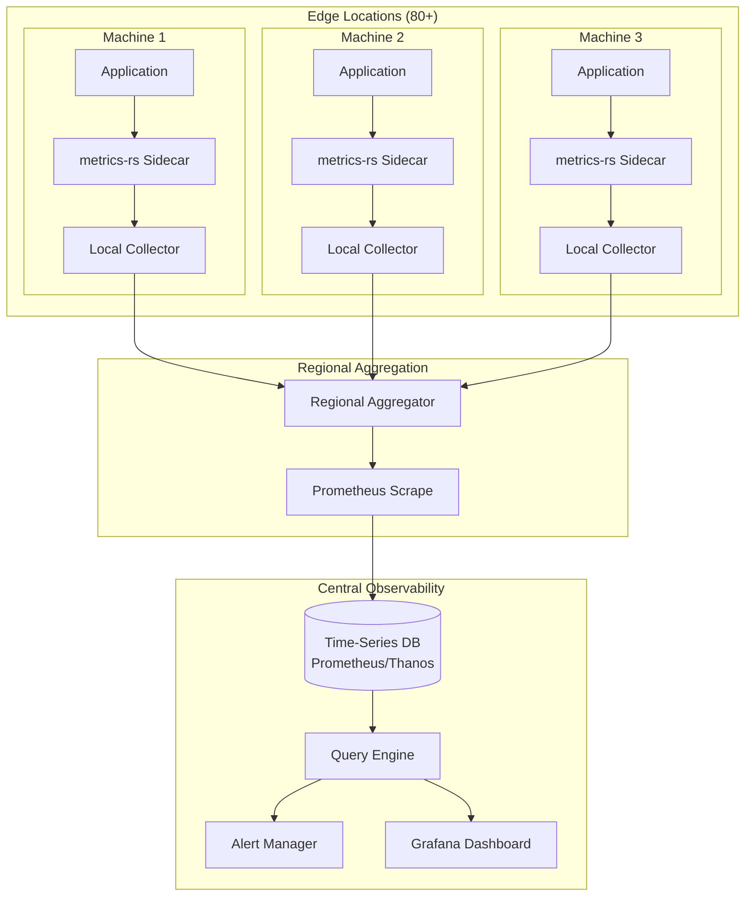

# Deep Dive: Metrics Collection

## Overview

This deep dive examines Fly.io's metrics collection system - from the Rust metrics framework to Prometheus integration and distributed observability. We'll explore metrics collection at the edge, aggregation patterns, and the architecture that enables monitoring across 80+ regions.

## Architecture



## Metrics Framework (metrics-rs)

### Core Traits and Types

```rust
// metrics-rs core abstractions

use std::sync::Arc;
use std::time::Instant;

/// Core trait for recording metrics
pub trait MetricsProvider: Send + Sync {
    /// Record a counter value
    fn counter(&self, name: &str) -> Counter;
    
    /// Record a gauge value
    fn gauge(&self, name: &str) -> Gauge;
    
    /// Record a histogram value
    fn histogram(&self, name: &str) -> Histogram;
    
    /// Record a distribution value
    fn distribution(&self, name: &str) -> Distribution;
    
    /// Record an absolute value (for counters that reset)
    fn absolute_counter(&self, name: &str, value: u64);
}

/// Counter - monotonically increasing value
pub struct Counter {
    name: String,
    labels: Vec<Label>,
    provider: Arc<dyn MetricsProvider>,
}

impl Counter {
    pub fn increment(&self, value: u64) {
        self.provider.absolute_counter(&self.name, value);
    }
    
    pub fn increment_by(&self, value: u64) {
        // In a real implementation, this would atomically add
        self.provider.absolute_counter(&self.name, value);
    }
}

/// Gauge - value that can go up or down
pub struct Gauge {
    name: String,
    labels: Vec<Label>,
    provider: Arc<dyn MetricsProvider>,
}

impl Gauge {
    pub fn set(&self, value: f64) {
        // Set gauge value
    }
    
    pub fn increment(&self, value: f64) {
        // Increment gauge
    }
    
    pub fn decrement(&self, value: f64) {
        // Decrement gauge
    }
}

/// Histogram - distribution of values in buckets
pub struct Histogram {
    name: String,
    labels: Vec<Label>,
    provider: Arc<dyn MetricsProvider>,
}

impl Histogram {
    pub fn record(&self, value: f64) {
        // Record value in histogram
    }
    
    pub fn record_duration(&self, duration: std::time::Duration) {
        self.record(duration.as_secs_f64() * 1000.0);  // Convert to ms
    }
}

/// Distribution - similar to histogram but with automatic bucketing
pub struct Distribution {
    name: String,
    labels: Vec<Label>,
    provider: Arc<dyn MetricsProvider>,
}

impl Distribution {
    pub fn record(&self, value: f64) {
        // Record value in distribution
    }
}

/// Label for metrics (key-value pair)
#[derive(Debug, Clone, PartialEq, Eq, Hash)]
pub struct Label {
    pub key: String,
    pub value: String,
}

impl Label {
    pub fn new(key: impl Into<String>, value: impl Into<String>) -> Self {
        Self {
            key: key.into(),
            value: value.into(),
        }
    }
}

/// Metric key - uniquely identifies a metric
#[derive(Debug, Clone, PartialEq, Eq, Hash)]
pub struct MetricKey {
    pub name: String,
    pub labels: Vec<Label>,
}

/// Metric type enumeration
#[derive(Debug, Clone, Copy, PartialEq, Eq)]
pub enum MetricType {
    Counter,
    Gauge,
    Histogram,
    Distribution,
}

/// Metric family - groups related metrics
pub struct MetricFamily {
    pub name: String,
    pub help: String,
    pub metric_type: MetricType,
    pub metrics: Vec<Metric>,
}

/// Individual metric value
pub struct Metric {
    pub labels: Vec<Label>,
    pub value: MetricValue,
    pub timestamp: u64,  // Unix timestamp in ms
}

#[derive(Debug, Clone)]
pub enum MetricValue {
    Counter(u64),
    Gauge(f64),
    Histogram {
        buckets: Vec<(f64, u64)>,  // (upper_bound, cumulative_count)
        count: u64,
        sum: f64,
    },
    Distribution {
        values: Vec<f64>,
        count: u64,
        sum: f64,
    },
}
```

### Metrics Recorder Implementation

```rust
// metrics-rs recorder implementation

use std::collections::HashMap;
use std::sync::atomic::{AtomicU64, Ordering};
use std::sync::Arc;
use parking_lot::RwLock;

/// In-memory metrics recorder
pub struct InMemoryRecorder {
    /// Counters: name + labels -> value
    counters: RwLock<HashMap<MetricKey, AtomicU64>>,
    
    /// Gauges: name + labels -> value (stored as f64 bits)
    gauges: RwLock<HashMap<MetricKey, AtomicU64>>,
    
    /// Histograms: name + labels -> HistogramState
    histograms: RwLock<HashMap<MetricKey, Arc<HistogramState>>>,
    
    /// Callback for exporting metrics
    on_snapshot: Option<Box<dyn Fn(&[MetricFamily]) + Send + Sync>>,
}

struct HistogramState {
    buckets: Vec<f64>,
    counts: Vec<AtomicU64>,
    sum: AtomicU64,
    count: AtomicU64,
}

impl InMemoryRecorder {
    pub fn new() -> Self {
        Self {
            counters: RwLock::new(HashMap::new()),
            gauges: RwLock::new(HashMap::new()),
            histograms: RwLock::new(HashMap::new()),
            on_snapshot: None,
        }
    }
    
    pub fn with_snapshot_callback<F>(mut self, callback: F) -> Self
    where
        F: Fn(&[MetricFamily]) + Send + Sync + 'static,
    {
        self.on_snapshot = Some(Box::new(callback));
        self
    }
    
    /// Take a snapshot of all metrics
    pub fn snapshot(&self) -> Vec<MetricFamily> {
        let mut families = Vec::new();
        let timestamp = std::time::SystemTime::now()
            .duration_since(std::time::UNIX_EPOCH)
            .unwrap()
            .as_millis() as u64;
        
        // Snapshot counters
        {
            let counters = self.counters.read();
            let mut counter_metrics = Vec::new();
            
            for (key, value) in counters.iter() {
                counter_metrics.push(Metric {
                    labels: key.labels.clone(),
                    value: MetricValue::Counter(value.load(Ordering::Relaxed)),
                    timestamp,
                });
            }
            
            if !counter_metrics.is_empty() {
                families.push(MetricFamily {
                    name: "counter_metrics".to_string(),
                    help: "Counter metrics".to_string(),
                    metric_type: MetricType::Counter,
                    metrics: counter_metrics,
                });
            }
        }
        
        // Snapshot gauges
        {
            let gauges = self.gauges.read();
            let mut gauge_metrics = Vec::new();
            
            for (key, value) in gauges.iter() {
                let bits = value.load(Ordering::Relaxed);
                let gauge_value = f64::from_bits(bits);
                
                gauge_metrics.push(Metric {
                    labels: key.labels.clone(),
                    value: MetricValue::Gauge(gauge_value),
                    timestamp,
                });
            }
            
            if !gauge_metrics.is_empty() {
                families.push(MetricFamily {
                    name: "gauge_metrics".to_string(),
                    help: "Gauge metrics".to_string(),
                    metric_type: MetricType::Gauge,
                    metrics: gauge_metrics,
                });
            }
        }
        
        // Snapshot histograms
        {
            let histograms = self.histograms.read();
            
            for (key, state) in histograms.iter() {
                let mut buckets = Vec::new();
                let mut cumulative = 0;
                
                for (i, upper_bound) in state.buckets.iter().enumerate() {
                    let count = state.counts[i].load(Ordering::Relaxed);
                    cumulative += count;
                    buckets.push((*upper_bound, cumulative));
                }
                
                let sum_bits = state.sum.load(Ordering::Relaxed);
                let sum = f64::from_bits(sum_bits);
                
                let histogram_value = MetricValue::Histogram {
                    buckets,
                    count: state.count.load(Ordering::Relaxed),
                    sum,
                };
                
                families.push(MetricFamily {
                    name: key.name.clone(),
                    help: format!("Histogram: {}", key.name),
                    metric_type: MetricType::Histogram,
                    metrics: vec![Metric {
                        labels: key.labels.clone(),
                        value: histogram_value,
                        timestamp,
                    }],
                });
            }
        }
        
        // Call snapshot callback if configured
        if let Some(ref callback) = self.on_snapshot {
            callback(&families);
        }
        
        families
    }
    
    /// Export metrics in Prometheus format
    pub fn export_prometheus(&self) -> String {
        let families = self.snapshot();
        let mut output = String::new();
        
        for family in families {
            // Write HELP comment
            output.push_str(&format!("# HELP {} {}\n", family.name, family.help));
            
            // Write TYPE comment
            let type_str = match family.metric_type {
                MetricType::Counter => "counter",
                MetricType::Gauge => "gauge",
                MetricType::Histogram => "histogram",
                MetricType::Distribution => "histogram",
            };
            output.push_str(&format!("# TYPE {} {}\n", family.name, type_str));
            
            // Write metrics
            for metric in family.metrics {
                let labels_str = if metric.labels.is_empty() {
                    String::new()
                } else {
                    let labels: Vec<String> = metric.labels
                        .iter()
                        .map(|l| format!("{}=\"{}\"", l.key, l.value))
                        .collect();
                    format!("{{{}}}", labels.join(","))
                };
                
                match metric.value {
                    MetricValue::Counter(value) => {
                        output.push_str(&format!("{}{} {}\n", family.name, labels_str, value));
                    }
                    MetricValue::Gauge(value) => {
                        output.push_str(&format!("{}{} {}\n", family.name, labels_str, value));
                    }
                    MetricValue::Histogram { buckets, count, sum } => {
                        for (upper_bound, cumulative_count) in buckets {
                            output.push_str(&format!(
                                "{}_bucket{} {} {}\n",
                                family.name,
                                format!("{}{}", labels_str, if labels_str.is_empty() {
                                    format!("{{le=\"{}\"}}", upper_bound)
                                } else {
                                    format!(",le=\"{}\"}}", upper_bound)
                                }),
                                cumulative_count
                            ));
                        }
                        output.push_str(&format!(
                            "{}_count{} {}\n",
                            family.name, labels_str, count
                        ));
                        output.push_str(&format!(
                            "{}_sum{} {}\n",
                            family.name, labels_str, sum
                        ));
                    }
                    MetricValue::Distribution { values, count, sum } => {
                        // Convert distribution to histogram format
                        output.push_str(&format!("{}_count{} {}\n", family.name, labels_str, count));
                        output.push_str(&format!("{}_sum{} {}\n", family.name, labels_str, sum));
                    }
                }
            }
        }
        
        output
    }
}

impl Default for InMemoryRecorder {
    fn default() -> Self {
        Self::new()
    }
}
```

### Common Metrics Patterns

```rust
// Common metrics patterns for applications

use std::time::Instant;

/// HTTP request metrics
pub struct HttpMetrics {
    requests_total: Counter,
    requests_in_flight: Gauge,
    request_duration_seconds: Histogram,
    response_size_bytes: Histogram,
}

impl HttpMetrics {
    pub fn new(provider: &dyn MetricsProvider) -> Self {
        Self {
            requests_total: provider.counter("http_requests_total"),
            requests_in_flight: provider.gauge("http_requests_in_flight"),
            request_duration_seconds: provider.histogram("http_request_duration_seconds"),
            response_size_bytes: provider.histogram("http_response_size_bytes"),
        }
    }
    
    /// Record an HTTP request
    pub fn record_request(
        &self,
        method: &str,
        path: &str,
        status: u16,
        duration: std::time::Duration,
        response_size: u64,
    ) {
        let labels = vec![
            Label::new("method", method),
            Label::new("path", path),
            Label::new("status", status.to_string()),
        ];
        
        self.requests_total.increment(1);
        self.requests_in_flight.decrement(1.0);
        self.request_duration_seconds.record_duration(duration);
        self.response_size_bytes.record(response_size as f64);
    }
    
    /// Create a request timer guard
    pub fn start_request(&self, method: &str, path: &str) -> RequestTimer<'_> {
        self.requests_in_flight.increment(1.0);
        RequestTimer {
            metrics: self,
            start: Instant::now(),
            method: method.to_string(),
            path: path.to_string(),
            recorded: false,
        }
    }
}

pub struct RequestTimer<'a> {
    metrics: &'a HttpMetrics,
    start: Instant,
    method: String,
    path: String,
    recorded: bool,
}

impl<'a> Drop for RequestTimer<'a> {
    fn drop(&mut self) {
        if !self.recorded {
            let duration = self.start.elapsed();
            self.metrics.record_request(
                &self.method,
                &self.path,
                500,  // Default to error if not set
                duration,
                0,
            );
            self.recorded = true;
        }
    }
}

impl<'a> RequestTimer<'a> {
    pub fn set_status(&mut self, status: u16) {
        // Update status for recording
    }
    
    pub fn set_response_size(&mut self, size: u64) {
        // Update response size for recording
    }
    
    pub fn finish(mut self, status: u16, response_size: u64) {
        let duration = self.start.elapsed();
        self.metrics.record_request(
            &self.method,
            &self.path,
            status,
            duration,
            response_size,
        );
        self.recorded = true;
    }
}

/// Database connection pool metrics
pub struct DbPoolMetrics {
    pool_size: Gauge,
    pool_available: Gauge,
    pool_waiting: Gauge,
    connection_acquire_seconds: Histogram,
    query_duration_seconds: Histogram,
    queries_total: Counter,
    query_errors_total: Counter,
}

impl DbPoolMetrics {
    pub fn new(provider: &dyn MetricsProvider, pool_name: &str) -> Self {
        let common_labels = vec![Label::new("pool", pool_name)];
        
        Self {
            pool_size: provider.gauge("db_pool_size"),
            pool_available: provider.gauge("db_pool_available"),
            pool_waiting: provider.gauge("db_pool_waiting"),
            connection_acquire_seconds: provider.histogram("db_connection_acquire_seconds"),
            query_duration_seconds: provider.histogram("db_query_duration_seconds"),
            queries_total: provider.counter("db_queries_total"),
            query_errors_total: provider.counter("db_query_errors_total"),
        }
    }
    
    pub fn record_query(&self, query_name: &str, duration: std::time::Duration, error: bool) {
        self.queries_total.increment(1);
        self.query_duration_seconds.record_duration(duration);
        
        if error {
            self.query_errors_total.increment(1);
        }
    }
}

/// Application lifecycle metrics
pub struct AppMetrics {
    uptime_seconds: Gauge,
    restarts_total: Counter,
    build_info: Counter,  // Use counter with labels for build info
}

impl AppMetrics {
    pub fn new(provider: &dyn MetricsProvider, version: &str, commit: &str) -> Self {
        let build_labels = vec![
            Label::new("version", version),
            Label::new("commit", commit),
        ];
        
        Self {
            uptime_seconds: provider.gauge("app_uptime_seconds"),
            restarts_total: provider.counter("app_restarts_total"),
            build_info: provider.counter("app_build_info"),
        }
    }
    
    pub fn update_uptime(&self) {
        let uptime = std::time::SystemTime::now()
            .duration_since(std::time::UNIX_EPOCH)
            .unwrap()
            .as_secs_f64();
        self.uptime_seconds.set(uptime);
    }
    
    pub fn record_restart(&self, reason: &str) {
        self.restarts_total.increment(1);
    }
}
```

## Distributed Metrics Collection

### Local Collector

```rust
// Local metrics collector

use std::net::SocketAddr;
use std::sync::Arc;
use tokio::sync::RwLock;
use axum::{Router, routing::get, extract::State};

pub struct LocalCollector {
    /// Local metrics recorder
    recorder: Arc<InMemoryRecorder>,
    
    /// Regional aggregator endpoint
    aggregator_endpoint: Option<String>,
    
    /// Collection interval
    collection_interval: std::time::Duration,
}

impl LocalCollector {
    pub fn new(aggregator_endpoint: Option<String>) -> Self {
        let recorder = Arc::new(InMemoryRecorder::new());
        
        Self {
            recorder,
            aggregator_endpoint,
            collection_interval: std::time::Duration::from_secs(15),
        }
    }
    
    pub fn recorder(&self) -> Arc<InMemoryRecorder> {
        self.recorder.clone()
    }
    
    /// Start the collector server and exporter
    pub async fn run(&self, bind_addr: SocketAddr) -> Result<(), Box<dyn std::error::Error>> {
        // Create HTTP server for Prometheus scraping
        let app = Router::new()
            .route("/metrics", get(metrics_handler))
            .with_state(self.recorder.clone());
        
        // Start server
        let listener = tokio::net::TcpListener::bind(bind_addr).await?;
        println!("Metrics server listening on {}", bind_addr);
        
        // If aggregator endpoint is configured, start background exporter
        if let Some(ref endpoint) = self.aggregator_endpoint {
            let exporter = Exporter::new(endpoint.clone(), self.recorder.clone());
            tokio::spawn(async move {
                exporter.run().await;
            });
        }
        
        axum::serve(listener, app).await?;
        
        Ok(())
    }
}

async fn metrics_handler(
    State(recorder): State<Arc<InMemoryRecorder>>,
) -> impl axum::response::IntoResponse {
    let metrics = recorder.export_prometheus();
    axum::response::Response::builder()
        .header("Content-Type", "text/plain; version=0.0.4")
        .body(metrics)
        .unwrap()
}

struct Exporter {
    endpoint: String,
    recorder: Arc<InMemoryRecorder>,
    client: reqwest::Client,
}

impl Exporter {
    fn new(endpoint: String, recorder: Arc<InMemoryRecorder>) -> Self {
        Self {
            endpoint,
            recorder,
            client: reqwest::Client::new(),
        }
    }
    
    async fn run(&self) {
        let mut interval = tokio::time::interval(std::time::Duration::from_secs(15));
        
        loop {
            interval.tick().await;
            
            // Get metrics snapshot
            let metrics = self.recorder.export_prometheus();
            
            // Push to aggregator
            let result = self.client
                .post(&self.endpoint)
                .header("Content-Type", "text/plain; version=0.0.4")
                .body(metrics)
                .send()
                .await;
            
            if let Err(e) = result {
                eprintln!("Failed to push metrics: {}", e);
            }
        }
    }
}
```

### Regional Aggregator

```rust
// Regional metrics aggregator

use std::collections::HashMap;
use std::sync::Arc;
use tokio::sync::RwLock;
use axum::{Router, routing::post, extract::State, Json};

pub struct RegionalAggregator {
    /// Metrics from each collector
    collectors: Arc<RwLock<HashMap<String, CollectorState>>>,
    
    /// Aggregated metrics
    aggregated: Arc<RwLock<AggregatedMetrics>>,
    
    /// Central metrics endpoint
    central_endpoint: Option<String>,
}

struct CollectorState {
    last_seen: std::time::Instant,
    metrics: String,
}

struct AggregatedMetrics {
    /// Aggregated Prometheus metrics
    metrics: String,
    /// Last aggregation time
    last_aggregation: std::time::Instant,
}

impl RegionalAggregator {
    pub fn new(central_endpoint: Option<String>) -> Self {
        Self {
            collectors: Arc::new(RwLock::new(HashMap::new())),
            aggregated: Arc::new(RwLock::new(AggregatedMetrics {
                metrics: String::new(),
                last_aggregation: std::time::Instant::now(),
            })),
            central_endpoint,
        }
    }
    
    /// Start the aggregator server
    pub async fn run(&self, bind_addr: SocketAddr) -> Result<(), Box<dyn std::error::Error>> {
        let app = Router::new()
            .route("/push", post(push_handler))
            .route("/metrics", get(aggregated_metrics_handler))
            .with_state(self.clone());
        
        // Start background aggregation
        let aggregator = self.clone();
        tokio::spawn(async move {
            aggregator.aggregate_loop().await;
        });
        
        // Start background push to central
        if let Some(ref endpoint) = self.central_endpoint {
            let pusher = CentralPusher::new(endpoint.clone(), self.aggregated.clone());
            tokio::spawn(async move {
                pusher.run().await;
            });
        }
        
        let listener = tokio::net::TcpListener::bind(bind_addr).await?;
        axum::serve(listener, app).await?;
        
        Ok(())
    }
    
    async fn aggregate_loop(&self) {
        let mut interval = tokio::time::interval(std::time::Duration::from_secs(30));
        
        loop {
            interval.tick().await;
            
            // Collect metrics from all collectors
            let mut all_metrics = Vec::new();
            
            {
                let collectors = self.collectors.read().await;
                for (collector_id, state) in collectors.iter() {
                    // Skip stale collectors (no update in 5 minutes)
                    if state.last_seen.elapsed() > std::time::Duration::from_secs(300) {
                        continue;
                    }
                    
                    all_metrics.push(&state.metrics);
                }
            }
            
            // Aggregate metrics (merge time series)
            let aggregated = self.merge_metrics(all_metrics);
            
            // Update aggregated state
            {
                let mut agg = self.aggregated.write().await;
                agg.metrics = aggregated;
                agg.last_aggregation = std::time::Instant::now();
            }
        }
    }
    
    fn merge_metrics(&self, metrics_list: Vec<&String>) -> String {
        // In production, this would properly merge Prometheus metrics
        // For now, concatenate with separators
        let mut output = String::new();
        
        output.push_str("# Aggregated Regional Metrics\n");
        output.push_str(&format!("# Timestamp: {}\n", 
            std::time::SystemTime::now()
                .duration_since(std::time::UNIX_EPOCH)
                .unwrap()
                .as_millis()));
        output.push('\n');
        
        for metrics in metrics_list {
            output.push_str(metrics);
            output.push('\n');
        }
        
        output
    }
}

async fn push_handler(
    State(aggregator): State<RegionalAggregator>,
    collector_id: String,
    body: String,
) -> Json<serde_json::Value> {
    let mut collectors = aggregator.collectors.write().await;
    
    collectors.insert(collector_id, CollectorState {
        last_seen: std::time::Instant::now(),
        metrics: body,
    });
    
    Json(serde_json::json!({"status": "ok"}))
}

async fn aggregated_metrics_handler(
    State(aggregator): State<RegionalAggregator>,
) -> impl axum::response::IntoResponse {
    let aggregated = aggregator.aggregated.read().await;
    axum::response::Response::builder()
        .header("Content-Type", "text/plain; version=0.0.4")
        .body(aggregated.metrics.clone())
        .unwrap()
}

struct CentralPusher {
    endpoint: String,
    aggregated: Arc<RwLock<AggregatedMetrics>>,
    client: reqwest::Client,
}

impl CentralPusher {
    fn new(endpoint: String, aggregated: Arc<RwLock<AggregatedMetrics>>) -> Self {
        Self {
            endpoint,
            aggregated,
            client: reqwest::Client::new(),
        }
    }
    
    async fn run(&self) {
        let mut interval = tokio::time::interval(std::time::Duration::from_secs(60));
        
        loop {
            interval.tick().await;
            
            let metrics = {
                let agg = self.aggregated.read().await;
                agg.metrics.clone()
            };
            
            let result = self.client
                .post(&self.endpoint)
                .header("Content-Type", "text/plain; version=0.0.4")
                .body(metrics)
                .send()
                .await;
            
            if let Err(e) = result {
                eprintln!("Failed to push to central: {}", e);
            }
        }
    }
}
```

## Conclusion

The metrics collection system provides:

1. **In-Memory Recording**: Efficient local metrics storage with atomic operations
2. **Prometheus Format**: Native export to Prometheus text format
3. **Distributed Collection**: Hierarchical aggregation from edge to central
4. **Regional Aggregation**: Reduce cardinality and storage requirements
5. **Common Patterns**: Pre-built metrics for HTTP, databases, and app lifecycle
6. **Scalable Pipeline**: Multi-tier architecture for 80+ regions

This enables Fly.io to provide observability across its global edge platform while managing metrics cardinality and storage costs.
