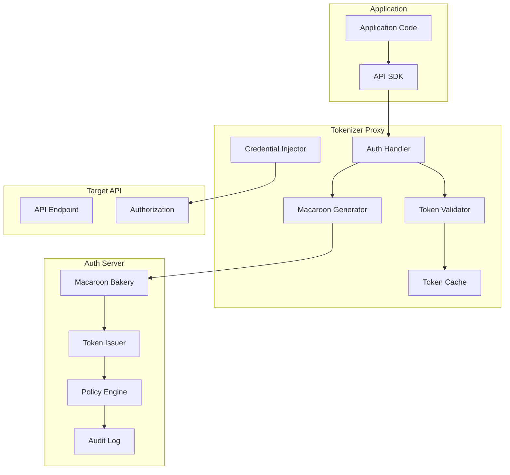

# Deep Dive: Tokenizer

## Overview

This deep dive examines Fly.io's tokenizer - a credential injection proxy that provides secure API authentication using macaroons. We'll explore macaroon cryptography, token lifecycle management, proxy architecture, and integration patterns for edge applications.

## Architecture



## Macaroon Fundamentals

### What are Macaroons?

Macaroons are bearer tokens with contextual restrictions that can be attenuated (restricted) and verified without contacting the issuing server.

```rust
// Macaroon structure

/// Macaroon - bearer token with caveats
pub struct Macaroon {
    /// Location identifier (issuing server)
    pub location: String,
    
    /// Public identifier for the macaroon
    pub identifier: Vec<u8>,
    
    /// Signature chain - each caveat adds to the chain
    pub signature: Vec<u8>,
    
    /// Caveats attached to this macaroon
    pub caveats: Vec<Caveat>,
}

/// Caveat - restriction on macaroon usage
pub struct Caveat {
    /// Caveat ID (for third-party caveats)
    pub cid: Option<Vec<u8>>,
    
    /// Caveat predicate (what must be satisfied)
    pub cl: Vec<u8>,  // Caveat locator
}

/// Types of caveats
pub enum CaveatType {
    /// First-party caveat - verified by the target service
    FirstParty(String),
    
    /// Third-party caveat - verified by another service
    ThirdParty {
        location: String,
        predicate: String,
        verification_key: Vec<u8>,
    },
}

// Example macaroon with caveats:
//
// Root Macaroon (issued by auth server):
//   location: "auth.fly.io"
//   identifier: "user:alex:key:abc123"
//   signature: HMAC(root_key, identifier)
//
// After adding first-party caveat "org:superfly":
//   signature' = HMAC(signature, "org:superfly")
//
// After adding third-party caveat for storage API:
//   signature'' = HMAC(signature', HMAC(third_party_key, "storage:read"))
//
// Final macaroon sent with request:
//   {
//     location: "auth.fly.io",
//     identifier: "user:alex:key:abc123",
//     caveats: ["org:superfly", "storage:read@storage.fly.io"],
//     signature: signature''
//   }
```

### Macaroon Implementation

```rust
// Macaroon implementation in Rust

use hmac::{Hmac, Mac as HmacMac};
use sha2::Sha256;
use rand::RngCore;
use serde::{Serialize, Deserialize};

type HmacSha256 = Hmac<Sha256>;

/// Macaroon builder
pub struct MacaroonBuilder {
    location: String,
    identifier: Vec<u8>,
    root_key: Vec<u8>,
    caveats: Vec<Caveat>,
}

impl MacaroonBuilder {
    pub fn new(location: impl Into<String>, root_key: Vec<u8>) -> Self {
        let mut identifier = vec![0u8; 16];
        rand::thread_rng().fill_bytes(&mut identifier);
        
        Self {
            location: location.into(),
            identifier,
            root_key,
            caveats: Vec::new(),
        }
    }
    
    pub fn with_identifier(mut self, identifier: Vec<u8>) -> Self {
        self.identifier = identifier;
        self
    }
    
    pub fn add_first_party_caveat(mut self, caveat: impl Into<Vec<u8>>) -> Self {
        self.caveats.push(Caveat {
            cid: None,
            cl: caveat.into(),
        });
        self
    }
    
    pub fn add_third_party_caveat(
        mut self,
        location: impl Into<String>,
        predicate: impl Into<Vec<u8>>,
        verification_key: Vec<u8>,
    ) -> Result<Self, MacaroonError> {
        // Generate random caveat ID
        let mut cid = vec![0u8; 16];
        rand::thread_rng().fill_bytes(&mut cid);
        
        // Compute the caveat signature
        let mut mac = HmacSha256::new_from_slice(&verification_key)
            .map_err(|_| MacaroonError::InvalidKey)?;
        mac.update(&cid);
        mac.update(&predicate.clone().into());
        let caveat_sig = mac.finalize().into_bytes().to_vec();
        
        // This would normally involve encryption for third-party verification
        // Simplified for this example
        
        self.caveats.push(Caveat {
            cid: Some(cid),
            cl: predicate.into(),
        });
        
        Ok(self)
    }
    
    pub fn build(self) -> Macaroon {
        // Compute root signature
        let mut mac = HmacSha256::new_from_slice(&self.root_key)
            .expect("HMAC can take key of any size");
        mac.update(&self.identifier);
        
        // Chain through all caveats
        let mut signature = mac.finalize().into_bytes().to_vec();
        
        for caveat in &self.caveats {
            let mut caveat_mac = HmacSha256::new_from_slice(&signature)
                .expect("HMAC can take key of any size");
            caveat_mac.update(&caveat.cl);
            if let Some(ref cid) = caveat.cid {
                caveat_mac.update(cid);
            }
            signature = caveat_mac.finalize().into_bytes().to_vec();
        }
        
        Macaroon {
            location: self.location,
            identifier: self.identifier,
            signature,
            caveats: self.caveats,
        }
    }
}

/// Macaroon for serialization
#[derive(Debug, Clone, Serialize, Deserialize)]
pub struct Macaroon {
    pub location: String,
    pub identifier: Vec<u8>,
    pub signature: Vec<u8>,
    pub caveats: Vec<Caveat>,
}

#[derive(Debug, Clone, Serialize, Deserialize)]
pub struct Caveat {
    pub cid: Option<Vec<u8>>,
    pub cl: Vec<u8>,
}

#[derive(Debug, thiserror::Error)]
pub enum MacaroonError {
    #[error("Invalid key")]
    InvalidKey,
    #[error("Invalid macaroon")]
    InvalidMacaroon,
    #[error("Caveat verification failed")]
    CaveatVerificationFailed,
    #[error("Serialization error: {0}")]
    SerializationError(String),
}

impl Macaroon {
    /// Serialize macaroon to base64 string
    pub fn serialize(&self) -> Result<String, MacaroonError> {
        let json = serde_json::to_string(self)
            .map_err(|e| MacaroonError::SerializationError(e.to_string()))?;
        Ok(base64::encode(json))
    }
    
    /// Deserialize macaroon from base64 string
    pub fn deserialize(s: &str) -> Result<Self, MacaroonError> {
        let json = base64::decode(s)
            .map_err(|e| MacaroonError::SerializationError(e.to_string()))?;
        serde_json::from_slice(&json)
            .map_err(|e| MacaroonError::SerializationError(e.to_string()))
    }
    
    /// Add a first-party caveat to an existing macaroon
    pub fn add_first_party_caveat(&mut self, caveat: impl Into<Vec<u8>>, root_key: &[u8]) {
        let caveat_bytes = caveat.into();
        
        // Update signature chain
        let mut mac = HmacSha256::new_from_slice(&self.signature)
            .expect("HMAC can take key of any size");
        mac.update(&caveat_bytes);
        self.signature = mac.finalize().into_bytes().to_vec();
        
        // Add caveat to list
        self.caveats.push(Caveat {
            cid: None,
            cl: caveat_bytes,
        });
    }
    
    /// Verify macaroon signature
    pub fn verify(&self, root_key: &[u8]) -> Result<(), MacaroonError> {
        // Recompute signature
        let mut mac = HmacSha256::new_from_slice(root_key)
            .map_err(|_| MacaroonError::InvalidKey)?;
        mac.update(&self.identifier);
        
        let mut expected_sig = mac.finalize().into_bytes().to_vec();
        
        for caveat in &self.caveats {
            let mut caveat_mac = HmacSha256::new_from_slice(&expected_sig)
                .expect("HMAC can take key of any size");
            caveat_mac.update(&caveat.cl);
            if let Some(ref cid) = caveat.cid {
                caveat_mac.update(cid);
            }
            expected_sig = caveat_mac.finalize().into_bytes().to_vec();
        }
        
        // Constant-time comparison
        use subtle::ConstantTimeEq;
        if self.signature.ct_eq(&expected_sig).into() {
            Ok(())
        } else {
            Err(MacaroonError::InvalidMacaroon)
        }
    }
}
```

### Caveat Predicates

```rust
// Caveat predicate language

use chrono::{DateTime, Utc};
use serde::{Serialize, Deserialize};

/// Caveat predicate - condition that must be satisfied
#[derive(Debug, Clone, Serialize, Deserialize)]
pub enum CaveatPredicate {
    /// Time-based restrictions
    Time(TimeCaveat),
    
    /// Operation-based restrictions
    Operation(OperationCaveat),
    
    /// Resource-based restrictions
    Resource(ResourceCaveat),
    
    /// IP-based restrictions
    IpAddress(IpCaveat),
    
    /// Organization membership
    Organization(OrgCaveat),
    
    /// Custom predicate (Lisp-like S-expression)
    Custom(String),
}

#[derive(Debug, Clone, Serialize, Deserialize)]
pub struct TimeCaveat {
    /// Not valid before this time
    pub nbf: Option<DateTime<Utc>>,
    
    /// Not valid after this time
    pub exp: Option<DateTime<Utc>>,
}

#[derive(Debug, Clone, Serialize, Deserialize)]
pub struct OperationCaveat {
    /// Allowed operations
    pub operations: Vec<String>,
}

#[derive(Debug, Clone, Serialize, Deserialize)]
pub struct ResourceCaveat {
    /// Resource pattern (glob or regex)
    pub pattern: String,
}

#[derive(Debug, Clone, Serialize, Deserialize)]
pub struct IpCaveat {
    /// Allowed IP ranges (CIDR notation)
    pub allowed_ranges: Vec<String>,
}

#[derive(Debug, Clone, Serialize, Deserialize)]
pub struct OrgCaveat {
    /// Required organization ID
    pub org_id: String,
    
    /// Required role within organization
    pub role: Option<String>,
}

impl CaveatPredicate {
    /// Serialize predicate to bytes for macaroon caveat
    pub fn to_bytes(&self) -> Result<Vec<u8>, serde_json::Error> {
        let json = serde_json::to_string(self)?;
        Ok(json.into_bytes())
    }
    
    /// Deserialize predicate from bytes
    pub fn from_bytes(bytes: &[u8]) -> Result<Self, serde_json::Error> {
        let json = String::from_utf8_lossy(bytes);
        serde_json::from_str(&json)
    }
    
    /// Check if a request satisfies this predicate
    pub fn verify(&self, context: &RequestContext) -> bool {
        match self {
            CaveatPredicate::Time(time) => {
                let now = Utc::now();
                
                if let Some(nbf) = &time.nbf {
                    if now < *nbf {
                        return false;
                    }
                }
                
                if let Some(exp) = &time.exp {
                    if now > *exp {
                        return false;
                    }
                }
                
                true
            }
            
            CaveatPredicate::Operation(op) => {
                op.operations.contains(&context.operation)
            }
            
            CaveatPredicate::Resource(res) => {
                // Simple glob matching
                glob_match(&res.pattern, &context.resource)
            }
            
            CaveatPredicate::IpAddress(ip) => {
                // Check if request IP is in allowed ranges
                ip.allowed_ranges.iter().any(|range| {
                    ip_in_cidr(&context.client_ip, range)
                })
            }
            
            CaveatPredicate::Organization(org) => {
                context.org_id == org.org_id && 
                org.role.as_ref().map_or(true, |r| context.role.as_ref() == Some(r))
            }
            
            CaveatPredicate::Custom(_) => {
                // Custom predicates would need a predicate interpreter
                // For now, assume they pass
                true
            }
        }
    }
}

/// Request context for caveat verification
#[derive(Debug, Clone)]
pub struct RequestContext {
    pub operation: String,      // e.g., "read", "write", "delete"
    pub resource: String,        // e.g., "/apps/my-app/machines"
    pub client_ip: String,       // e.g., "192.168.1.1"
    pub org_id: String,          // Organization ID
    pub role: Option<String>,    // User's role
    pub timestamp: DateTime<Utc>,
}

fn glob_match(pattern: &str, value: &str) -> bool {
    // Simple glob matching implementation
    // In production, use the globset crate
    pattern == "*" || pattern == value || value.starts_with(pattern.trim_end_matches('*'))
}

fn ip_in_cidr(ip: &str, cidr: &str) -> bool {
    // In production, use the ipnetwork crate
    // Simplified for this example
    cidr.starts_with(&ip[..ip.rfind('.').unwrap_or(0)])
}
```

## Tokenizer Proxy

### Proxy Architecture

```rust
// Tokenizer proxy implementation

use std::sync::Arc;
use axum::{
    extract::{Request, State},
    http::{HeaderMap, StatusCode},
    middleware::{self, Next},
    response::Response,
    Router,
};
use tokio::sync::RwLock;

pub struct TokenizerProxy {
    /// Auth server connection
    auth_client: Arc<AuthClient>,
    
    /// Token cache
    cache: Arc<TokenCache>,
    
    /// Local macaroon keys for verification
    verification_keys: Arc<RwLock<Vec<Vec<u8>>>>,
    
    /// Target API configuration
    target_config: TargetConfig,
}

struct TargetConfig {
    /// Target API base URL
    base_url: String,
    
    /// Credentials to inject
    credentials: Vec<Credential>,
}

struct Credential {
    /// Header name
    header: String,
    
    /// Credential value (or macaroon-based)
    value: CredentialValue,
}

enum CredentialValue {
    /// Static value
    Static(String),
    
    /// Macaroon-derived
    Macaroon {
        root_key: Vec<u8>,
        caveats: Vec<CaveatPredicate>,
    },
}

impl TokenizerProxy {
    pub fn new(target_config: TargetConfig) -> Result<Self, String> {
        Ok(Self {
            auth_client: Arc::new(AuthClient::new("https://auth.fly.io")?),
            cache: Arc::new(TokenCache::new()),
            verification_keys: Arc::new(RwLock::new(Vec::new())),
            target_config,
        })
    }
    
    /// Create the proxy router
    pub fn router(&self) -> Router {
        Router::new()
            .fallback(proxy_handler)
            .layer(middleware::from_fn_with_state(
                Arc::new(self.clone()),
                auth_middleware,
            ))
    }
    
    /// Load verification keys from auth server
    pub async fn refresh_keys(&self) -> Result<(), String> {
        let keys = self.auth_client.get_verification_keys().await?;
        
        let mut verification_keys = self.verification_keys.write().await;
        *verification_keys = keys;
        
        Ok(())
    }
}

async fn auth_middleware(
    State(proxy): State<Arc<TokenizerProxy>>,
    mut request: Request,
    next: Next,
) -> Result<Response, StatusCode> {
    // Extract Authorization header
    let auth_header = request
        .headers()
        .get("Authorization")
        .and_then(|v| v.to_str().ok())
        .ok_or(StatusCode::UNAUTHORIZED)?;
    
    // Parse macaroon from Bearer token
    if !auth_header.starts_with("Bearer ") {
        return Err(StatusCode::UNAUTHORIZED);
    }
    
    let macaroon_str = auth_header.trim_start_matches("Bearer ");
    let macaroon = Macaroon::deserialize(macaroon_str)
        .map_err(|_| StatusCode::UNAUTHORIZED)?;
    
    // Verify macaroon signature
    let verification_keys = proxy.verification_keys.read().await;
    let mut verified = false;
    
    for key in verification_keys.iter() {
        if macaroon.verify(key).is_ok() {
            verified = true;
            break;
        }
    }
    
    if !verified {
        return Err(StatusCode::UNAUTHORIZED);
    }
    
    // Verify all caveats
    let caveats: Vec<CaveatPredicate> = macaroon.caveats
        .iter()
        .filter_map(|c| CaveatPredicate::from_bytes(&c.cl).ok())
        .collect();
    
    // Build request context
    let context = build_request_context(&request);
    
    // Verify each caveat
    for caveat in &caveats {
        if !caveat.verify(&context) {
            return Err(StatusCode::FORBIDDEN);
        }
    }
    
    // Inject credentials into request
    inject_credentials(&mut request, &proxy.target_config, &caveats).await;
    
    // Call next handler
    Ok(next.run(request).await)
}

fn build_request_context(request: &Request) -> RequestContext {
    use chrono::Utc;
    
    let path = request.uri().path().to_string();
    let method = request.method().to_string();
    
    let client_ip = request
        .headers()
        .get("X-Forwarded-For")
        .and_then(|v| v.to_str().ok())
        .unwrap_or("0.0.0.0")
        .to_string();
    
    RequestContext {
        operation: method,
        resource: path,
        client_ip,
        org_id: String::new(),  // Would extract from macaroon
        role: None,
        timestamp: Utc::now(),
    }
}

async fn inject_credentials(
    request: &mut Request,
    config: &TargetConfig,
    caveats: &[CaveatPredicate],
) {
    for cred in &config.credentials {
        match &cred.value {
            CredentialValue::Static(value) => {
                request.headers_mut().insert(
                    &cred.header,
                    value.parse().unwrap(),
                );
            }
            CredentialValue::Macaroon { root_key, caveats: base_caveats } => {
                // Generate attenuated macaroon for this specific request
                let mut macaroon = MacaroonBuilder::new(
                    "tokenizer-proxy",
                    root_key.clone(),
                );
                
                // Add request-specific caveats
                for caveat in caveats {
                    if let Ok(bytes) = caveat.to_bytes() {
                        macaroon = macaroon.add_first_party_caveat(bytes);
                    }
                }
                
                let macaroon = macaroon.build();
                
                if let Ok(serialized) = macaroon.serialize() {
                    request.headers_mut().insert(
                        &cred.header,
                        format!("Bearer {}", serialized).parse().unwrap(),
                    );
                }
            }
        }
    }
}
```

### Token Cache

```rust
// Token cache for performance

use std::collections::HashMap;
use std::time::Duration;
use moka::future::Cache;
use tokio::sync::RwLock;

pub struct TokenCache {
    /// Cache of validated tokens
    validated: Cache<String, TokenInfo>,
    
    /// Cache of generated tokens
    generated: Cache<String, GeneratedToken>,
    
    /// Revocation list
    revoked: RwLock<HashSet<String>>,
}

struct TokenInfo {
    user_id: String,
    org_id: String,
    permissions: Vec<String>,
    expires_at: chrono::DateTime<chrono::Utc>,
}

struct GeneratedToken {
    token: String,
    created_at: chrono::DateTime<chrono::Utc>,
    last_used: chrono::DateTime<chrono::Utc>,
}

impl TokenCache {
    pub fn new() -> Self {
        Self {
            validated: Cache::builder()
                .max_capacity(10_000)
                .time_to_live(Duration::from_secs(300))  // 5 minutes
                .build(),
            generated: Cache::builder()
                .max_capacity(100_000)
                .time_to_live(Duration::from_secs(3600))  // 1 hour
                .build(),
            revoked: RwLock::new(HashSet::new()),
        }
    }
    
    /// Check if token is cached and valid
    pub async fn get_validated(&self, token: &str) -> Option<&TokenInfo> {
        // Check revocation first
        let revoked = self.revoked.read().await;
        if revoked.contains(token) {
            return None;
        }
        
        self.validated.get(token).await
    }
    
    /// Cache a validated token
    pub async fn cache_validation(&self, token: String, info: TokenInfo) {
        self.validated.insert(token, info).await;
    }
    
    /// Cache a generated token
    pub async fn cache_generated(&self, token: String, generated: GeneratedToken) {
        self.generated.insert(token, generated).await;
    }
    
    /// Get generated token info
    pub async fn get_generated(&self, token: &str) -> Option<GeneratedToken> {
        self.generated.get(token).await
    }
    
    /// Revoke a token
    pub async fn revoke(&self, token: &str) {
        self.revoked.write().await.insert(token.to_string());
        self.validated.invalidate(token).await;
        self.generated.invalidate(token).await;
    }
    
    /// Clean up old revoked tokens
    pub async fn cleanup_revoked(&self) {
        // In production, implement a periodic cleanup
        let mut revoked = self.revoked.write().await;
        // Keep only recently revoked tokens
        if revoked.len() > 10_000 {
            revoked.clear();
        }
    }
}

impl Default for TokenCache {
    fn default() -> Self {
        Self::new()
    }
}
```

### Auth Client

```rust
// Auth server client

use reqwest::Client;
use serde::{Deserialize, Serialize};

pub struct AuthClient {
    base_url: String,
    client: Client,
}

impl AuthClient {
    pub fn new(base_url: &str) -> Result<Self, String> {
        Ok(Self {
            base_url: base_url.to_string(),
            client: Client::new(),
        })
    }
    
    /// Get verification keys from auth server
    pub async fn get_verification_keys(&self) -> Result<Vec<Vec<u8>>, String> {
        let response = self.client
            .get(format!("{}/v1/keys", self.base_url))
            .send()
            .await
            .map_err(|e| e.to_string())?;
        
        if !response.status().is_success() {
            return Err(format!("Failed to get keys: {}", response.status()));
        }
        
        #[derive(Deserialize)]
        struct KeysResponse {
            keys: Vec<KeyInfo>,
        }
        
        #[derive(Deserialize)]
        struct KeyInfo {
            kid: String,
            key: String,  // Base64 encoded
        }
        
        let keys_response: KeysResponse = response.json().await.map_err(|e| e.to_string())?;
        
        let keys = keys_response.keys
            .into_iter()
            .filter_map(|k| base64::decode(&k.key).ok())
            .collect();
        
        Ok(keys)
    }
    
    /// Issue a new macaroon
    pub async fn issue_macaroon(
        &self,
        request: IssueMacaroonRequest,
    ) -> Result<MacaroonResponse, String> {
        let response = self.client
            .post(format!("{}/v1/macaroons", self.base_url))
            .json(&request)
            .send()
            .await
            .map_err(|e| e.to_string())?;
        
        if !response.status().is_success() {
            return Err(format!("Failed to issue macaroon: {}", response.status()));
        }
        
        let macaroon_response: MacaroonResponse = response.json().await.map_err(|e| e.to_string())?;
        Ok(macaroon_response)
    }
    
    /// Validate a macaroon
    pub async fn validate_macaroon(
        &self,
        macaroon: &Macaroon,
    ) -> Result<ValidationResponse, String> {
        let response = self.client
            .post(format!("{}/v1/validate", self.base_url))
            .json(&ValidateRequest {
                macaroon: macaroon.serialize().map_err(|e| e.to_string())?,
            })
            .send()
            .await
            .map_err(|e| e.to_string())?;
        
        if !response.status().is_success() {
            return Err(format!("Validation failed: {}", response.status()));
        }
        
        let validation: ValidationResponse = response.json().await.map_err(|e| e.to_string())?;
        Ok(validation)
    }
    
    /// Revoke a macaroon
    pub async fn revoke_macaroon(
        &self,
        identifier: &str,
    ) -> Result<(), String> {
        let response = self.client
            .post(format!("{}/v1/revoke", self.base_url))
            .json(&RevokeRequest {
                identifier: identifier.to_string(),
            })
            .send()
            .await
            .map_err(|e| e.to_string())?;
        
        if !response.status().is_success() {
            return Err(format!("Failed to revoke: {}", response.status()));
        }
        
        Ok(())
    }
}

#[derive(Debug, Serialize)]
pub struct IssueMacaroonRequest {
    pub user_id: String,
    pub org_id: String,
    pub permissions: Vec<String>,
    pub caveats: Vec<CaveatPredicate>,
    pub expires_in: Duration,
}

#[derive(Debug, Deserialize)]
pub struct MacaroonResponse {
    pub macaroon: String,  // Base64 encoded
    pub identifier: String,
    pub expires_at: chrono::DateTime<chrono::Utc>,
}

#[derive(Debug, Serialize)]
pub struct ValidateRequest {
    pub macaroon: String,
}

#[derive(Debug, Deserialize)]
pub struct ValidationResponse {
    pub valid: bool,
    pub user_id: Option<String>,
    pub org_id: Option<String>,
    pub permissions: Vec<String>,
}

#[derive(Debug, Serialize)]
pub struct RevokeRequest {
    pub identifier: String,
}
```

## Conclusion

Tokenizer provides:

1. **Macaroon-Based Auth**: Cryptographically secure tokens with caveat support
2. **Credential Injection**: Automatic proxy injection of API credentials
3. **Token Caching**: High-performance validation with Moka cache
4. **Caveat Verification**: Time, operation, resource, and IP restrictions
5. **Attenuation**: Generate restricted tokens from parent tokens
6. **Revocation Support**: Token blacklist for immediate invalidation

This enables Fly.io to provide secure, fine-grained API access control across its edge platform.
