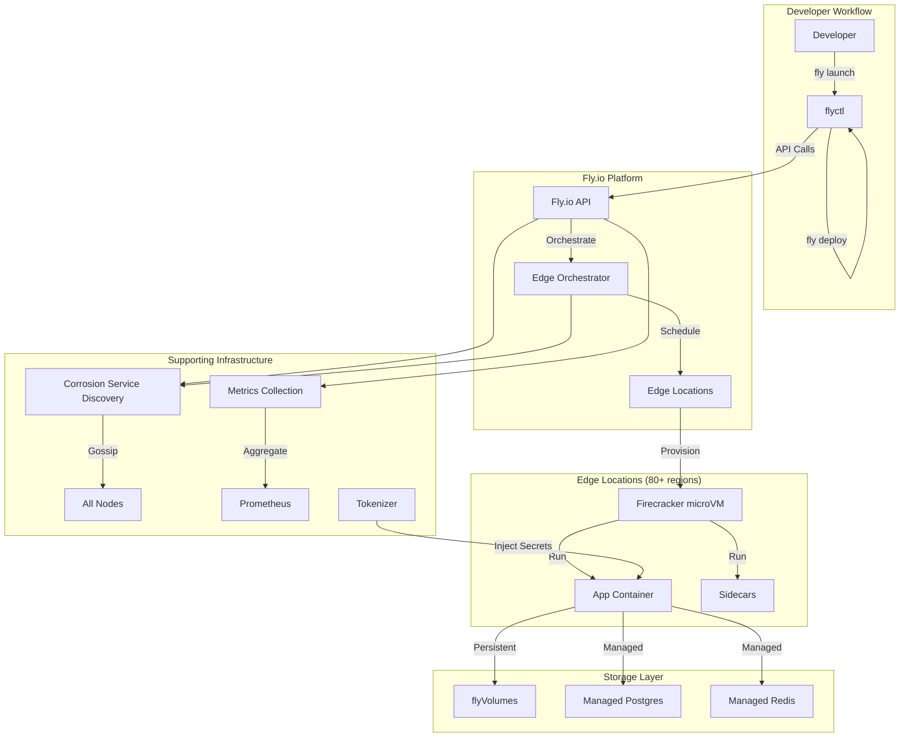
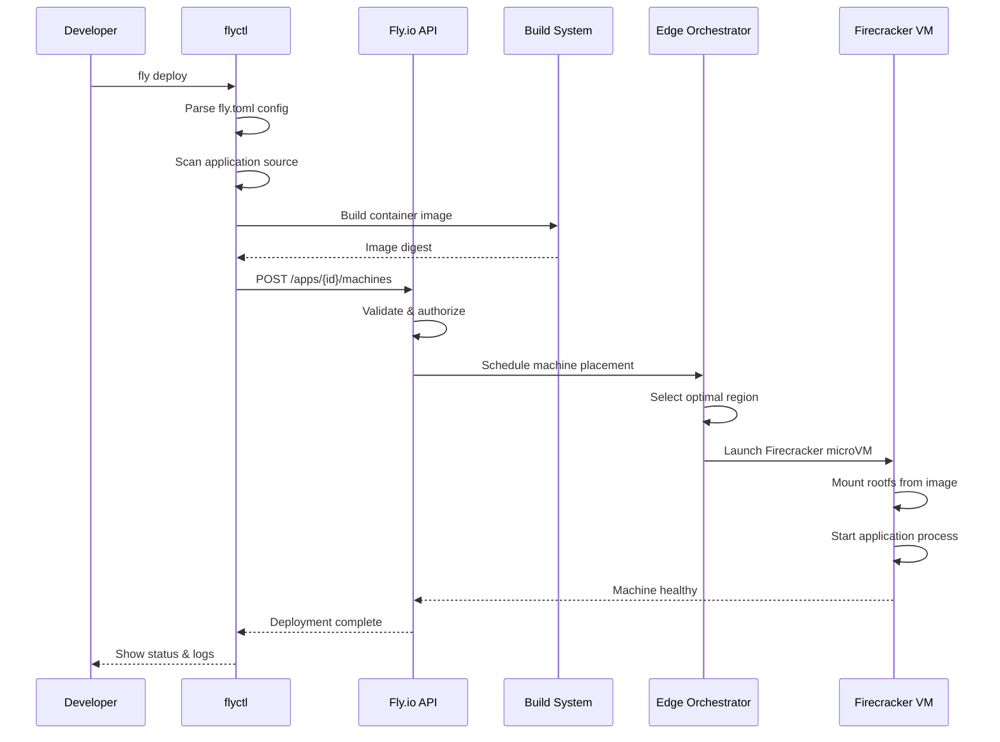
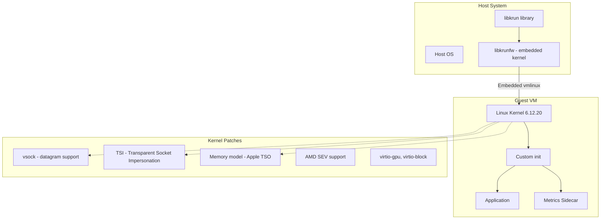
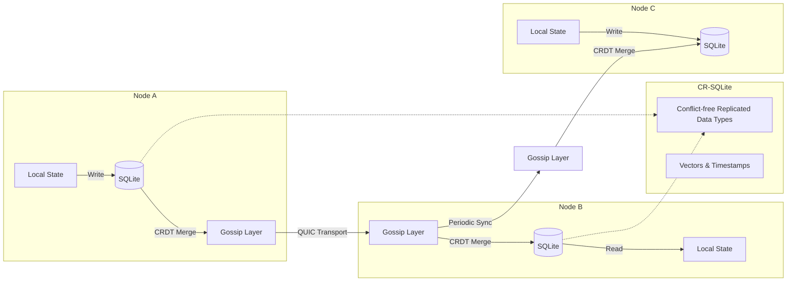
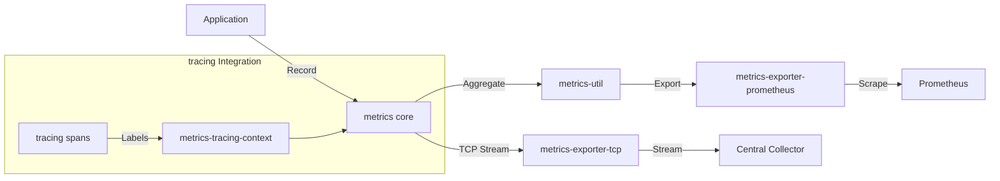
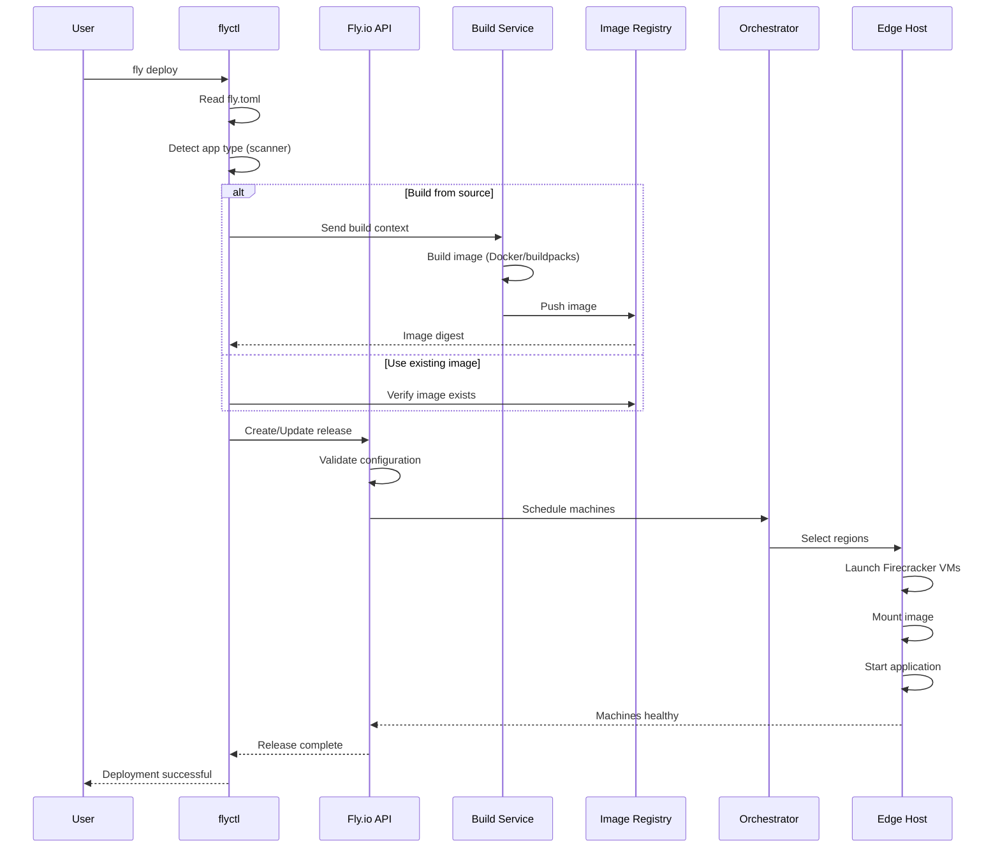
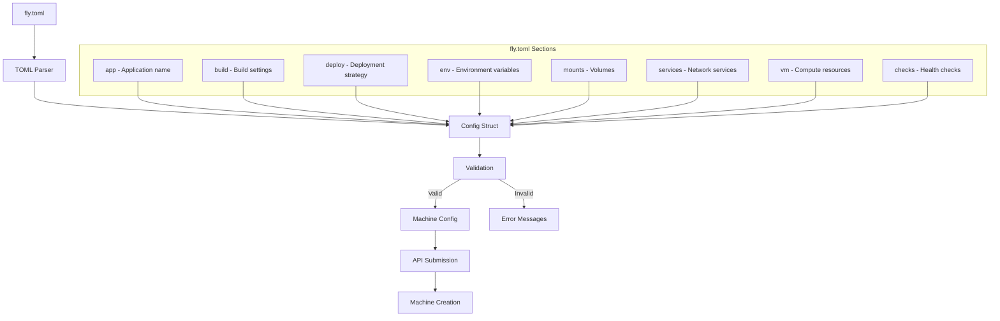

# Project Exploration: Superfly / Fly.io Edge Cloud Platform

## Overview

This exploration covers six repositories from Superfly (Fly.io), the edge cloud platform that enables developers to deploy applications globally with minimal configuration. Fly.io operates a distributed edge computing platform that runs applications in microVMs close to users worldwide.

**Fly.io** is a Cloudflare Workers competitor that runs real applications (not just serverless functions) in lightweight virtual machines at edge locations. The platform uses Firecracker microVMs, custom networking, and distributed infrastructure to provide low-latency deployment and execution.

The repositories explored represent the core infrastructure stack:
- **flyctl**: The CLI tool developers use to deploy and manage applications
- **corrosion**: A gossip-based service discovery system for distributed state
- **libkrunfw**: Embedded Linux kernel library for microVM creation
- **metrics**: Rust-based metrics collection framework (metrics-rs)
- **tokenizer**: HTTP proxy for secure third-party credential injection
- **mpg-postgres-image**: Hardened PostgreSQL container with OOM protection

## Repository Summary

| Project | Location | Repository | Primary Language | Purpose |
|---------|----------|------------|------------------|---------|
| flyctl | `/home/darkvoid/Boxxed/@formulas/src.superfly/flyctl` | github.com/superfly/flyctl | Go | CLI for deploying and managing Fly.io apps |
| corrosion | `/home/darkvoid/Boxxed/@formulas/src.superfly/corrosion` | github.com/superfly/corrosion | Rust | Gossip-based service discovery with CRDTs |
| libkrunfw | `/home/darkvoid/Boxxed/@formulas/src.superfly/libkrunfw` | github.com/superfly/libkrunfw | C/Python | Embedded kernel library for microVMs |
| metrics | `/home/darkvoid/Boxxed/@formulas/src.superfly/metrics` | github.com/metrics-rs/metrics | Rust | Metrics collection framework |
| tokenizer | `/home/darkvoid/Boxxed/@formulas/src.superfly/tokenizer` | github.com/superfly/tokenizer | Go | Credential injection proxy |
| mpg-postgres-image | `/home/darkvoid/Boxxed/@formulas/src.superfly/mpg-postgres-image` | github.com/superfly/mpg-postgres-image | Dockerfile | OOM-protected PostgreSQL image |

## Directory Structure

### flyctl (Main CLI Tool)

```
flyctl/
├── main.go                          # Entry point - initializes CLI
├── go.mod                           # Go module definition (Go 1.24.5)
├── Makefile                         # Build automation
├── Dockerfile*                      # Container build configs
├── genqlient.yaml                   # GraphQL client generator config
├── agent/                           # Fly.io agent for background operations
│   ├── agent.go                     # Agent main logic
│   ├── client.go                    # Agent client interface
│   ├── server/                      # Agent server implementation
│   └── internal/proto/              # Agent protocol definitions
├── cmd/                             # Additional CLI commands
│   └── audit/                       # Audit tooling
├── deps/                            # External dependencies
│   └── wintun/                      # Windows TUN driver for WireGuard
├── flyctl/                          # Core flyctl package
│   ├── config.go                    # Configuration structures
│   └── flyctl.go                    # Core functionality
├── flypg/                           # Postgres management commands
├── gql/                             # GraphQL API client (generated)
│   ├── generated.go                 # Auto-generated GraphQL client
│   ├── schema.graphql               # Fly.io GraphQL schema
│   └── inputs.go                    # GraphQL input types
├── helpers/                         # Utility functions
│   ├── clone.go                     # Deep clone utilities
│   ├── fs.go                        # Filesystem helpers
│   └── tablehelper.go               # Terminal table rendering
├── internal/                        # Internal packages (not exported)
│   ├── appconfig/                   # fly.toml configuration parsing
│   │   ├── config.go                # Config struct definitions
│   │   ├── definition.go            # Config <-> Definition conversion
│   │   ├── machines.go              # Machine-specific config
│   │   ├── service.go               # Service definitions
│   │   └── validation.go            # Config validation
│   ├── build/                       # Build system
│   │   └── imgsrc/                  # Image building (Docker, buildpacks)
│   ├── buildinfo/                   # Build metadata
│   ├── cache/                       # Local caching layer
│   ├── cli/                         # CLI framework setup
│   ├── command/                     # CLI command implementations
│   │   ├── agent/                   # Agent management commands
│   │   ├── apps/                    # App management
│   │   ├── auth/                    # Authentication flow
│   │   ├── deploy/                  # Deployment logic
│   │   ├── launch/                  # App creation wizard
│   │   ├── machine/                 # Machine (microVM) commands
│   │   ├── postgres/                # Managed Postgres
│   │   ├── redis/                   # Managed Redis
│   │   ├── volumes/                 # Persistent storage
│   │   └── ...                      # 40+ command packages
│   ├── config/                      # User configuration files
│   ├── flag/                        # CLI flag definitions
│   ├── machine/                     # Machine configuration & lifecycle
│   ├── metrics/                     # CLI telemetry
│   ├── prompt/                      # Interactive prompts
│   ├── sentry/                      # Error tracking
│   ├── tracing/                     # OpenTelemetry tracing
│   └── wireguard/                   # WireGuard tunnel management
├── iostreams/                       # Terminal I/O abstraction
├── logs/                            # Log streaming (NATS-based)
│   ├── polling.go                   # Polling log retrieval
│   └── nats.go                      # NATS streaming logs
├── proxy/                           # TCP/HTTP proxy for tunnels
├── scanner/                         # App detection & scaffolding
│   ├── scanner.go                   # Main scanner logic
│   ├── templates/                   # Language-specific templates
│   │   ├── deno/                    # Deno runtime
│   │   ├── django/                  # Django/Python
│   │   ├── go/                      # Go applications
│   │   ├── laravel/                 # Laravel/PHP
│   │   ├── nextjs/                  # Next.js
│   │   ├── node/                    # Node.js
│   │   ├── phoenix/                 # Phoenix/Elixir
│   │   ├── rails/                   # Ruby on Rails
│   │   └── rust/                    # Rust applications
│   └── *.go                         # Language-specific scanners
├── ssh/                             # SSH client for machines
├── test/preflight/                  # Integration tests
└── tools/                           # Build & release tooling
```

### corrosion (Service Discovery)

```
corrosion/
├── Cargo.toml                       # Workspace definition
├── Cargo.lock                       # Dependency lockfile
├── CHANGELOG.md
├── config.example.toml              # Example configuration
├── doc/                             # Documentation (mdbook)
│   ├── api/                         # HTTP API docs
│   ├── cli/                         # CLI reference
│   ├── config/                      # Configuration guide
│   ├── deploy-on-fly/               # Deployment guide
│   ├── crdts.md                     # CRDT implementation docs
│   ├── schema.md                    # Database schema docs
│   └── telemetry.md                 # Observability docs
├── crates/                          # Rust crate workspace
│   ├── backoff/                     # Retry backoff utilities
│   ├── consul-client/               # Consul API client
│   ├── corro-admin/                 # Admin CLI commands
│   ├── corro-agent/                 # Main agent implementation
│   │   ├── agent/
│   │   │   ├── bi.rs               # Broadcast interface
│   │   │   ├── bootstrap.rs        # Bootstrap logic
│   │   │   ├── handlers.rs         # Request handlers
│   │   │   └── run_root.rs         # Main event loop
│   │   └── api/
│   │       ├── peer/               # Peer-to-peer communication
│   │       └── public/             # Public HTTP API
│   ├── corro-api-types/             # API type definitions
│   ├── corro-base-types/            # Core type definitions
│   ├── corro-client/                # Rust client library
│   ├── corro-devcluster/            # Development cluster tool
│   ├── corro-pg/                    # PostgreSQL integration
│   ├── corro-tpl/                   # Template engine (Rhai)
│   ├── corro-types/                 # Shared types
│   ├── corro-utils/                 # Utility functions
│   ├── sqlite3-restore/             # SQLite restore utilities
│   ├── sqlite-functions/            # Custom SQLite functions
│   ├── sqlite-pool/                 # SQLite connection pooling
│   ├── spawn/                       # Process spawning
│   └── tripwire/                    # Graceful shutdown
├── examples/fly/                    # Fly.io deployment example
│   ├── fly.toml
│   ├── Dockerfile
│   └── templates/
└── integration-tests/               # Integration test suite
```

### libkrunfw (Embedded Kernel)

```
libkrunfw/
├── Makefile                         # Build automation
├── README.md                        # Build & usage guide
├── CODEOWNERS
├── LICENSE-GPL-2.0-only
├── LICENSE-LGPL-2.1-only
├── bin2cbundle.py                   # Binary to C bundle converter
├── config-libkrunfw_x86_64          # x86_64 kernel config
├── config-libkrunfw_aarch64         # ARM64 kernel config
├── config-libkrunfw-sev_x86_64      # SEV-enabled config
├── patches/                         # Kernel patches (21 patches)
│   ├── 0001-krunfw-Don-t-panic-when-init-dies.patch
│   ├── 0003-vsock-dgram-generalize-recvmsg.patch
│   ├── 0005-vsock-Support-multi-transport-datagrams.patch
│   ├── 0009-Transparent-Socket-Impersonation.patch
│   ├── 0012-prctl-Introduce-PR_-SET-GET-_MEM_MODEL.patch
│   ├── 0015-arm64-Implement-Apple-IMPDEF-TSO.patch
│   └── ...                          # vsock, memory model, virtio patches
├── patches-sev/                     # AMD SEV patches (4 patches)
│   ├── 0001-virtio-enable-DMA-API.patch
│   ├── 0002-x86-sev-write-AP-reset-vector.patch
│   └── ...
├── qboot/                           # Minimal x86 BIOS implementation
│   └── bios.bin
├── initrd/                          # Initial RAM disk
│   └── initrd.gz
├── utils/                           # Utility tools
│   ├── kernel_size_time.sh          # Kernel measurement script
│   ├── krunfw_measurement.c
│   ├── vmsa.h                       # VM Save Area definitions
│   └── Makefile
├── build_on_krunvm.sh               # Build in krunvm (macOS)
├── build_on_krunvm_debian.sh        # Debian builder variant
└── build_on_krunvm_fedora.sh        # Fedora builder variant
```

### metrics (Metrics Framework)

```
metrics/
├── Cargo.toml                       # Workspace definition
├── README.md
├── CODE_OF_CONDUCT.md
├── metrics/                         # Core metrics crate
├── metrics-macros/                  # Procedural macros
├── metrics-util/                    # Utility functions
├── metrics-exporter-tcp/            # TCP exporter
├── metrics-exporter-prometheus/     # Prometheus exporter
├── metrics-tracing-context/         # tracing integration
├── metrics-observer/                # Metrics observer
└── metrics-benchmark/               # Benchmarking tools
```

### tokenizer (Credential Proxy)

```
tokenizer/
├── go.mod
├── tokenizer.go                     # Main proxy implementation
├── processor.go                     # Secret processors
├── authorizer.go                    # Authorization logic
├── client.go                        # Client utilities
├── secret.go                        # Secret handling
├── request_validator.go             # Request validation
├── fly.toml                         # Fly.io deployment config
├── Dockerfile
├── cmd/
│   ├── tokenizer/                   # Server binary
│   └── curl/                        # Test client
├── flysrc/                          # Fly.io source integration
└── macaroon/                        # Macaroon auth tokens
```

### mpg-postgres-image (PostgreSQL Container)

```
mpg-postgres-image/
├── Dockerfile                       # Multi-arch Docker build
├── root-entrypoint.sh               # OOM protection wrapper
├── build-and-push.yml               # GitHub Actions workflow
├── README.md
└── .github/workflows/
```

## Architecture

### High-Level System Diagram



### Deployment Flow (flyctl -> Edge)



### MicroVM Architecture (Firecracker/libkrunfw)



### Corrosion Service Discovery Data Flow



### Metrics Collection Pipeline



## Component Breakdown

### flyctl - Core Components

#### CLI Entry Point
- **Location:** `flyctl/main.go`
- **Purpose:** Initializes the CLI framework, handles signals, and dispatches to command handlers
- **Dependencies:** `internal/cli`, `iostreams`, `internal/sentry`
- **Flow:**
  1. Parse command-line arguments
  2. Set up signal handling (SIGINT, SIGTERM)
  3. Initialize HTTP tracing and logging
  4. Execute root command with Cobra
  5. Handle errors and report to Sentry

#### Command Framework (`internal/command/`)
- **Purpose:** Implements 40+ CLI commands for app management
- **Key Commands:**
  - `deploy`: Deploy applications from source or image
  - `launch`: Interactive app creation wizard
  - `machine`: Direct machine (microVM) management
  - `postgres`: Managed PostgreSQL operations
  - `volumes`: Persistent volume management
  - `logs`: Stream application logs

#### App Configuration (`internal/appconfig/`)
- **Location:** `flyctl/internal/appconfig/`
- **Purpose:** Parse and validate `fly.toml` configuration files
- **Key Types:**
  - `Config`: Main configuration struct
  - `Mount`: Volume mount definitions
  - `Service`: Network service configuration
  - `HTTPService`: HTTP service with health checks
  - `Deploy`: Deployment strategy settings
- **Flow:** TOML parsing -> validation -> Machine config conversion

#### Scanner (`scanner/`)
- **Purpose:** Automatically detect application type and generate configuration
- **Supported Frameworks:** Django, Laravel, Phoenix, Rails, Redwood, Next.js, Node.js, Go, Flask, Python, Deno, Nuxt, Rust, .NET, static sites
- **Output:** `SourceInfo` struct with:
  - Dockerfile path and build args
  - Port configuration
  - Environment variables
  - Static asset configuration
  - Release/seed commands
  - GitHub Actions templates

#### Machine Management (`internal/machine/`)
- **Purpose:** Manage Fly.io microVMs (Machines API)
- **Key Features:**
  - Machine creation and destruction
  - Config updates with diff detection
  - Lease management for deployments
  - Health check monitoring
  - Process group handling

#### Image Building (`internal/build/imgsrc/`)
- **Purpose:** Build container images for deployment
- **Build Strategies:**
  - Local Docker build
  - Remote build on Fly.io builders
  - Buildpacks (Heroku-style)
  - Depot (accelerated builds)
  - Nixpacks

### corrosion - Core Components

#### Agent (`crates/corro-agent/`)
- **Location:** `corrosion/crates/corro-agent/src/`
- **Purpose:** Main service discovery agent
- **Key Modules:**
  - `agent/mod.rs`: Core agent logic
  - `agent/handlers.rs`: Request handling
  - `agent/bootstrap.rs`: Initial cluster bootstrap
  - `api/public/`: HTTP API for queries
  - `broadcast/`: Gossip broadcast layer
- **Dependencies:** foca (membership), rusqlite, quinn (QUIC)

#### CRDT Implementation
- **Technology:** CR-SQLite for conflict-free replicated types
- **Purpose:** Enable eventual consistency across distributed nodes
- **Mechanism:**
  - Each row has vector clock metadata
  - Conflicts resolved using last-writer-wins with causal ordering
  - Gossip propagates changes incrementally

#### HTTP API
- **Endpoints:**
  - `POST /query`: Execute SQL queries
  - `GET /subscribe`: Stream changes via SSE
  - `POST /transactions`: Multi-statement transactions
  - `GET /schema`: Current database schema

#### Membership Protocol
- **Implementation:** FOCA (scalable membership protocol)
- **Features:**
  - SWIM-style failure detection
  - Gossip-based dissemination
  - Configurable cluster membership

### libkrunfw - Core Components

#### Kernel Bundling
- **Base:** Linux kernel 6.12.20
- **Patches Applied:**
  1. vsock datagram support (multi-transport)
  2. Transparent Socket Impersonation (TSI)
  3. Memory model control (Apple TSO for Rosetta)
  4. AMD SEV (Secure Encrypted Virtualization)
  5. virtio enhancements (GPU, block device)
  6. Process autogrouping disable
  7. DAX block size support
  8. virtio-gpu partial mapping

#### Build System
- **Input:** Linux kernel source tarball
- **Process:**
  1. Download kernel source
  2. Apply patches in order
  3. Apply configuration (.config)
  4. Build kernel
  5. Convert binary to C bundle using `bin2cbundle.py`
- **Output:** `libkrunfw.so` (Linux) or `libkrunfw.dylib` (macOS)

#### Architecture Support
- **x86_64:** Full support with vmlinux binary
- **aarch64:** Full support with Image binary
- **SEV Variant:** AMD SEV-enabled builds

## Entry Points

### flyctl

| Entry Point | File | Description |
|-------------|------|-------------|
| Main Binary | `main.go` | CLI entry point, signal handling, CLI framework initialization |
| Deploy Command | `internal/command/deploy/deploy.go` | Deploy applications with rolling updates |
| Launch Command | `internal/command/launch/launch.go` | Interactive app creation wizard |
| Machine Commands | `internal/command/machine/*.go` | Direct microVM management |
| Agent | `agent/agent.go` | Background agent for local operations |

**Main Execution Flow:**
1. `main()` calls `run()`
2. `run()` creates context with signal handling
3. Initialize logging and HTTP tracing
4. Create root Cobra command
5. Execute command with `cli.Run()`
6. Handle errors, report to Sentry
7. Exit with appropriate code

### corrosion

| Entry Point | File | Description |
|-------------|------|-------------|
| Main Binary | `crates/corrosion/src/main.rs` | CLI entry point |
| Agent Command | `crates/corro-agent/src/agent/mod.rs` | Run service discovery agent |
| Query Command | `crates/corro-admin/src/` | Execute queries |
| Backup Command | `crates/sqlite3-restore/src/` | Backup/restore SQLite |

**Agent Execution Flow:**
1. Load configuration from TOML
2. Initialize SQLite database
3. Bootstrap cluster membership (FOCA)
4. Start QUIC listeners for peer communication
5. Start HTTP API server
6. Begin gossip loop
7. Handle incoming requests

### libkrunfw

| Entry Point | File | Description |
|-------------|------|-------------|
| Build Target | `Makefile` | `make` builds `libkrunfw.so` |
| Kernel Binary | `kernel.c` | C bundle containing kernel |
| bin2cbundle.py | `bin2cbundle.py` | Binary to C converter |

**Build Flow:**
1. Download Linux kernel 6.12.20
2. Apply 21 patches from `patches/`
3. Apply 4 SEV patches if building SEV variant
4. Configure kernel for microVM use
5. Compile kernel
6. Convert to C bundle
7. Link into shared library

## Data Flow

### Application Deployment Flow



### fly.toml Configuration Flow



## External Dependencies

### flyctl Dependencies

| Dependency | Purpose |
|------------|---------|
| github.com/superfly/fly-go | Fly.io API client library |
| github.com/docker/docker | Docker client for image building |
| github.com/spf13/cobra | CLI framework |
| github.com/superfly/graphql | GraphQL client for API |
| github.com/moby/buildkit | Low-level build toolkit |
| github.com/nats-io/nats.go | NATS for log streaming |
| go.opentelemetry.io/otel | OpenTelemetry tracing |
| github.com/getsentry/sentry-go | Error reporting |
| github.com/buildpacks/pack | Cloud Native Buildpacks |
| golang.org/x/net | HTTP/2, WebSocket support |
| github.com/vmihailenco/msgpack | MessagePack serialization |
| github.com/hashicorp/go-multierror | Error aggregation |
| github.com/samber/lo | Functional programming utilities |

### corrosion Dependencies

| Dependency | Purpose |
|------------|---------|
| rusqlite | SQLite database binding |
| foca | Cluster membership protocol |
| quinn | QUIC transport protocol |
| tokio | Async runtime |
| axum | HTTP web framework |
| metrics | Metrics collection |
| tracing | Instrumentation framework |
| serde | Serialization framework |
| tower | Service abstraction |
| rustls | TLS implementation |

### libkrunfw Dependencies

| Dependency | Purpose |
|------------|---------|
| Linux kernel 6.12.20 | Base kernel source |
| Python 3 | Build scripts |
| pyelftools | ELF binary parsing |
| GCC/Clang | Kernel compilation |

## Configuration

### fly.toml (Application Configuration)

The `fly.toml` file is the primary configuration file for Fly.io applications:

```toml
# Basic Application
app = "my-app"
primary_region = "iad"

# Build Configuration
[build]
  builder = "dockerfile"
  build_args = { VERSION = "1.0" }

# Deployment Strategy
[deploy]
  strategy = "rolling"
  max_unavailable = 0.33
  release_command = "migrate"

# Environment Variables
[env]
  PORT = "8080"
  LOG_LEVEL = "info"

# Persistent Volumes
[[mounts]]
  source = "data"
  destination = "/data"
  initial_size = "10gb"

# HTTP Service
[http_service]
  internal_port = 8080
  force_https = true

  [http_service.concurrency]
    type = "connections"
    hard_limit = 100
    soft_limit = 80

  [[http_service.checks]]
    interval = "10s"
    timeout = "5s"
    path = "/health"

# Services (TCP/UDP)
[[services]]
  protocol = "tcp"
  internal_port = 5432

  [[services.ports]]
    port = 5432
    handlers = ["tls", "pg_tls"]

# Health Checks
[checks]
  [checks.health]
    port = 8080
    type = "http"
    interval = "10s"
    timeout = "5s"
    path = "/health"

# VM Configuration
[[vm]]
  size = "shared-cpu-2x"
  memory = "1024mb"

# Metrics
[[metrics]]
  port = 9090
  path = "/metrics"
```

### corrosion Configuration (config.toml)

```toml
# Node identity
[node]
id = "node-1"
bind_address = "0.0.0.0:8800"

# Gossip configuration
[gossip]
members = ["node-2:8800", "node-3:8800"]

# API configuration
[api]
bind_address = "0.0.0.0:8080"

# Database configuration
[db]
path = "/var/lib/corrosion/data.db"

# Telemetry
[telemetry]
prometheus_bind = "0.0.0.0:9090"
```

## Testing

### flyctl Testing Strategy

- **Unit Tests:** Located alongside source files (`*_test.go`)
- **Integration Tests:** `test/preflight/` directory
- **Test Framework:** Standard Go testing + custom preflight framework
- **Coverage Areas:**
  - Configuration parsing
  - Command execution
  - API interactions
  - Build process

**Running Tests:**
```bash
# Unit tests
go test ./...

# Preflight (integration) tests
./scripts/preflight.sh
```

### corrosion Testing Strategy

- **Unit Tests:** Inline with source (`#[cfg(test)]` modules)
- **Integration Tests:** `integration-tests/` crate
- **Test Framework:** Rust test framework + assert2
- **Coverage Areas:**
  - Gossip protocol
  - CRDT operations
  - HTTP API
  - SQLite operations

**Running Tests:**
```bash
cargo test
cargo test --package integration-tests
```

### libkrunfw Testing

- **Build Verification:** Kernel boot testing
- **Measurement Scripts:** `utils/kernel_size_time.sh`
- **Manual Testing:** VM boot validation

## Key Insights

### Architecture Decisions

1. **MicroVM-based Isolation:** Fly.io uses Firecracker microVMs instead of containers for stronger isolation and faster cold starts than traditional VMs.

2. **Gossip-based Service Discovery:** Corrosion replaces centralized Consul with distributed SQLite + CRDTs, enabling fast local reads with eventual consistency.

3. **Embedded Kernel Approach:** libkrunfw bundles the Linux kernel as a C array in a shared library, simplifying VM creation by eliminating separate kernel files.

4. **Edge-first Design:** All components are designed for global distribution - corrosion's CRDTs, tokenizer's stateless proxy, flyctl's regional builder selection.

5. **Rust for Systems Components:** corrosion and metrics use Rust for memory safety and performance in long-running infrastructure services.

6. **GraphQL API:** Fly.io's internal API uses GraphQL, allowing flyctl to fetch precisely the data needed for each operation.

7. **NATS for Log Streaming:** Real-time log streaming uses NATS pub/sub for scalable, ordered message delivery.

### Technical Highlights

1. **CRDT Implementation:** corrosion uses CR-SQLite to provide conflict-free replicated tables, enabling each node to have a complete, consistent view of cluster state.

2. **QUIC Transport:** corrosion uses QUIC (via quinn) for peer-to-peer communication, providing multiplexed streams and improved latency over TCP.

3. **Transparent Socket Impersonation:** libkrunfw patches enable applications to intercept and modify socket traffic transparently, crucial for flycast (Fly's internal service mesh).

4. **Memory Model Control:** Apple TSO patches in libkrunfw enable Rosetta 2 compatibility for running x86_64 Linux binaries on Apple Silicon hosts.

5. **Build Acceleration:** flyctl supports Depot for accelerated builds, reducing image build times significantly.

### Developer Experience Features

1. **Automatic App Detection:** The scanner analyzes source code and generates appropriate fly.toml configuration for 15+ frameworks.

2. **GitHub Actions Integration:** flyctl can automatically generate CI/CD workflows for deploying on push.

3. **Interactive Launch Wizard:** `fly launch` provides a guided experience for new applications.

4. **Config Diff Detection:** Machine config updates show diffs before applying changes.

5. **Comprehensive Error Reporting:** Errors include request IDs, trace IDs, descriptions, suggestions, and documentation links.

## Open Questions

1. **How does flycast (Fly's service mesh) integrate with libkrunfw's TSI patches?** The transparent socket impersonation implementation details are not fully documented in the source.

2. **What is the exact relationship between corrosion and Fly's internal service discovery?** Corrosion appears to replace Consul, but the migration path and current adoption status is unclear.

3. **How are Firecracker microVMs networked together?** The vsock patches suggest sophisticated networking, but the full network architecture (flycast, anycast IPs) is not visible in these repositories.

4. **What metrics does the metrics-rs project collect from Fly.io infrastructure?** The metrics framework is generic, but specific Fly.io instrumentation is not visible.

5. **How does the remote builder infrastructure work?** flyctl references remote builders, but the builder orchestration is not part of these repositories.

6. **What is the status of SEV (Secure Encrypted Virtualization) support?** The patches exist but production deployment details are not clear.

7. **How does managed Postgres (MPG) integrate with the OOM-protected image?** The mpg-postgres-image shows OOM protection, but full integration with Fly's managed Postgres is not visible.
