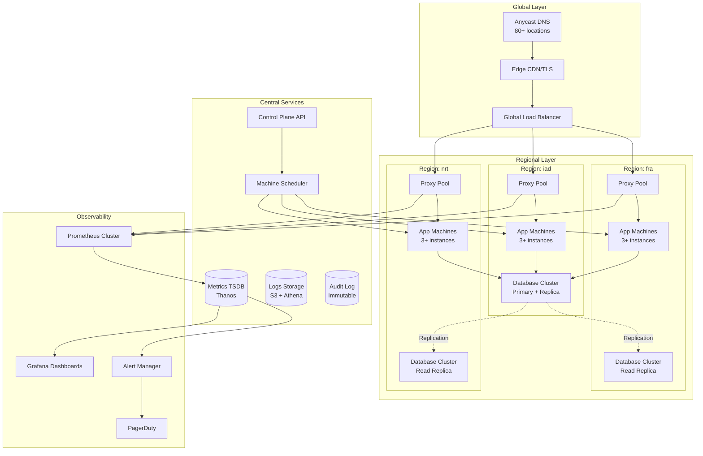

# Production-Grade Fly.io Platform

## Overview

This document outlines production-grade patterns for operating a Fly.io-like edge platform. We cover high availability architectures, security hardening, observability at scale, disaster recovery, and operational excellence.

## Architecture



## High Availability Patterns

### Multi-Region Deployment

```toml
# edge.toml - Production configuration

app = "my-production-app"
primary_region = "iad"
kill_signal = "SIGINT"
kill_timeout = 30

# Deploy to multiple regions
regions = [
  "iad",  # Washington DC - Primary
  "ord",  # Chicago
  "lax",  # Los Angeles
  "fra",  # Frankfurt - Europe
  "lhr",  # London
  "nrt",  # Tokyo - Asia
  "syd",  # Sydney - Oceania
]

# High availability service configuration
[http_service]
  internal_port = 8080
  force_https = true
  
  # Automatic start/stop for cost optimization
  auto_start_machines = true
  auto_stop_machines = true
  
  # Concurrency limits
  [http_service.concurrency]
    type = "requests"
    hard_limit = 250
    soft_limit = 200
  
  # Health checks - critical for HA
  [[http_service.checks]]
    grace_period = "30s"
    interval = "10s"
    timeout = "5s"
    method = "GET"
    path = "/health"
  
  # Additional readiness check
  [[http_service.checks]]
    grace_period = "60s"
    interval = "30s"
    timeout = "10s"
    method = "GET"
    path = "/ready"

# Deploy strategy for zero-downtime
[deploy]
  strategy = "rolling"
  max_unavailable = 0.25  # 25% max unavailable

# VM configuration for production
[[vm]]
  cpu_kind = "performance"
  cpus = 2
  memory_mb = 4096
  
# Production environment variables
[env]
  PORT = "8080"
  RUST_LOG = "warn"
  RUST_BACKTRACE = "0"
  
# Mounts for persistent data
[[mounts]]
  source = "data"
  destination = "/data"
  initial_size = "50gb"
  
  # Auto-extend configuration
  auto_extend = true
  auto_extend_threshold = 0.8
  auto_extend_size = 10

# Processes for different workloads
[processes]
  web = "cargo run --release"
  worker = "cargo run --release -- worker"
  scheduler = "cargo run --release -- scheduler"
```

### Machine Placement Strategy

```rust
// src/ha/machine_placement.rs

use std::collections::HashMap;

/// Ensures machines are spread across failure domains
pub struct MachinePlacer {
    /// Available regions
    regions: Vec<String>,
    
    /// Current machine distribution
    distribution: HashMap<String, Vec<String>>,  // region -> machine_ids
    
    /// Failure domain mapping
    failure_domains: HashMap<String, String>,  // machine_id -> failure_domain
}

impl MachinePlacer {
    pub fn new(regions: Vec<String>) -> Self {
        Self {
            regions,
            distribution: HashMap::new(),
            failure_domains: HashMap::new(),
        }
    }
    
    /// Calculate optimal placement for new machines
    pub fn calculate_placement(
        &self,
        desired_count: usize,
        machine_id: &str,
    ) -> Vec<String> {
        let mut placements = Vec::new();
        
        // Calculate current distribution
        let total_machines: usize = self.distribution.values().map(|v| v.len()).sum();
        let target_per_region = (desired_count + self.regions.len() - 1) / self.regions.len();
        
        // First pass: fill under-represented regions
        for region in &self.regions {
            let current_count = self.distribution.get(region).map(|v| v.len()).unwrap_or(0);
            
            if current_count < target_per_region && placements.len() < desired_count {
                placements.push(region.clone());
            }
        }
        
        // Second pass: distribute remaining
        while placements.len() < desired_count {
            for region in &self.regions {
                if placements.len() >= desired_count {
                    break;
                }
                
                let current_count = self.distribution.get(region).map(|v| v.len()).unwrap_or(0);
                
                // Check if this region can accept more
                if current_count < target_per_region * 2 {
                    placements.push(region.clone());
                }
            }
        }
        
        placements
    }
    
    /// Validate current distribution meets HA requirements
    pub fn validate_ha(&self, min_regions: usize) -> HaValidation {
        let active_regions = self.distribution
            .iter()
            .filter(|(_, machines)| !machines.is_empty())
            .count();
        
        let min_region_machines = self.distribution
            .values()
            .filter(|machines| !machines.is_empty())
            .map(|machines| machines.len())
            .min()
            .unwrap_or(0);
        
        HaValidation {
            active_regions,
            meets_region_requirement: active_regions >= min_regions,
            min_region_machines,
            can_lose_region: min_region_machines > 0,
        }
    }
}

pub struct HaValidation {
    pub active_regions: usize,
    pub meets_region_requirement: bool,
    pub min_region_machines: usize,
    pub can_lose_region: bool,
}

/// Rolling deployment with HA guarantees
pub struct RollingDeployment {
    machines: Vec<Machine>,
    max_unavailable_ratio: f32,
}

impl RollingDeployment {
    pub fn new(machines: Vec<Machine>, max_unavailable_ratio: f32) -> Self {
        Self {
            machines,
            max_unavailable_ratio,
        }
    }
    
    /// Calculate deployment batches
    pub fn calculate_batches(&self) -> Vec<Vec<String>> {
        let total = self.machines.len();
        let max_unavailable = (total as f32 * self.max_unavailable_ratio) as usize;
        let batch_size = max_unavailable.max(1);
        
        let mut batches = Vec::new();
        let mut current_batch = Vec::new();
        
        // Group machines by region for safer rolling
        let mut by_region: HashMap<String, Vec<&Machine>> = HashMap::new();
        for machine in &self.machines {
            by_region
                .entry(machine.region.clone())
                .or_insert_with(Vec::new)
                .push(machine);
        }
        
        // Create batches respecting region boundaries
        for (region, machines) in by_region {
            for (i, machine) in machines.iter().enumerate() {
                current_batch.push(machine.id.clone());
                
                // Start new batch when full or at region boundary
                if current_batch.len() >= batch_size || (i == machines.len() - 1 && !current_batch.is_empty()) {
                    batches.push(current_batch);
                    current_batch = Vec::new();
                }
            }
        }
        
        batches
    }
}
```

## Security Hardening

### Network Security

```toml
# Production firewall configuration

# edge.toml
[firewall]
  # Default deny all incoming
  default_policy = "deny"
  
  # Allow health checks from load balancer
  [[firewall.rules]]
    action = "allow"
    direction = "inbound"
    protocol = "tcp"
    ports = [8080]
    sources = ["10.0.0.0/8"]  # Internal network only
    
  # Allow metrics scraping
  [[firewall.rules]]
    action = "allow"
    direction = "inbound"
    protocol = "tcp"
    ports = [9090]
    sources = ["10.0.0.0/8"]
    
  # Allow database connections only from app machines
  [[firewall.rules]]
    action = "allow"
    direction = "inbound"
    protocol = "tcp"
    ports = [5432]
    sources = ["app-machines"]
    
  # Deny all outbound except necessary
  [[firewall.rules]]
    action = "allow"
    direction = "outbound"
    protocol = "tcp"
    ports = [443]  # HTTPS
    destinations = ["0.0.0.0/0"]
    
  [[firewall.rules]]
    action = "allow"
    direction = "outbound"
    protocol = "tcp"
    ports = [5432]  # PostgreSQL
    destinations = ["database-cluster"]
```

### Secrets Management

```rust
// src/security/secrets.rs

use aes_gcm::{Aes256Gcm, Key, Nonce, aead::Aead};
use rand::RngCore;
use ring::pbkdf2;
use std::num::NonZeroU32;

/// Encrypted secrets storage
pub struct SecretsManager {
    /// Master key for encryption (from HSM or KMS)
    master_key: Key,
    
    /// Encrypted secrets storage
    secrets: std::sync::RwLock<std::collections::HashMap<String, EncryptedSecret>>,
}

#[derive(Clone)]
struct EncryptedSecret {
    ciphertext: Vec<u8>,
    nonce: Vec<u8>,
    version: u32,
}

impl SecretsManager {
    pub fn new(master_key: &[u8]) -> Self {
        Self {
            master_key: Key::from_slice(master_key),
            secrets: std::sync::RwLock::new(std::collections::HashMap::new()),
        }
    }
    
    /// Store a secret (encrypted at rest)
    pub fn store(&self, name: &str, value: &str) -> Result<(), Box<dyn std::error::Error>> {
        let cipher = Aes256Gcm::new(&self.master_key);
        
        // Generate random nonce
        let mut nonce_bytes = [0u8; 12];
        rand::thread_rng().fill_bytes(&mut nonce_bytes);
        let nonce = Nonce::from_slice(&nonce_bytes);
        
        // Encrypt
        let ciphertext = cipher.encrypt(nonce, value.as_bytes().as_ref())?;
        
        // Store
        let mut secrets = self.secrets.write().unwrap();
        secrets.insert(name.to_string(), EncryptedSecret {
            ciphertext: ciphertext.to_vec(),
            nonce: nonce_bytes.to_vec(),
            version: secrets.get(name).map(|s| s.version + 1).unwrap_or(1),
        });
        
        Ok(())
    }
    
    /// Retrieve a secret (decrypted)
    pub fn retrieve(&self, name: &str) -> Result<Option<String>, Box<dyn std::error::Error>> {
        let secrets = self.secrets.read().unwrap();
        
        if let Some(secret) = secrets.get(name) {
            let cipher = Aes256Gcm::new(&self.master_key);
            let nonce = Nonce::from_slice(&secret.nonce);
            
            let plaintext = cipher.decrypt(nonce, secret.ciphertext.as_ref())?;
            Ok(Some(String::from_utf8(plaintext)?))
        } else {
            Ok(None)
        }
    }
    
    /// Rotate secret version
    pub fn rotate(&self, name: &str, new_value: &str) -> Result<u32, Box<dyn std::error::Error>> {
        self.store(name, new_value)?;
        
        let secrets = self.secrets.read().unwrap();
        Ok(secrets.get(name).map(|s| s.version).unwrap_or(1))
    }
}

/// Derive key from password for secrets
pub fn derive_key(password: &str, salt: &[u8], iterations: u32) -> Vec<u8> {
    let mut key = vec![0u8; 32];
    
    pbkdf2::derive(
        pbkdf2::PBKDF2_HMAC_SHA256,
        NonZeroU32::new(iterations).unwrap(),
        salt,
        password.as_bytes(),
        &mut key,
    );
    
    key
}
```

## Observability at Scale

### Metrics Collection

```rust
// src/observability/metrics.rs

use prometheus::{
    CounterVec, GaugeVec, Histogram, HistogramOpts, HistogramVec,
    Opts, Registry, TextEncoder, Encoder,
};
use std::sync::Arc;

pub struct MetricsRegistry {
    registry: Registry,
    
    // Request metrics
    http_requests_total: CounterVec,
    http_request_duration_seconds: HistogramVec,
    http_requests_in_flight: GaugeVec,
    
    // Machine metrics
    machine_cpu_usage: GaugeVec,
    machine_memory_usage_bytes: GaugeVec,
    machine_disk_usage_bytes: GaugeVec,
    
    // Business metrics
    active_users: GaugeVec,
    api_calls_total: CounterVec,
}

impl MetricsRegistry {
    pub fn new() -> Result<Self, prometheus::Error> {
        let registry = Registry::new();
        
        // HTTP metrics
        let http_requests_total = CounterVec::new(
            Opts::new("http_requests_total", "Total HTTP requests"),
            &["method", "path", "status", "region"],
        )?;
        registry.register(Box::new(http_requests_total.clone()))?;
        
        let http_request_duration_seconds = HistogramVec::new(
            HistogramOpts::new("http_request_duration_seconds", "HTTP request duration")
                .buckets(vec![0.001, 0.005, 0.01, 0.025, 0.05, 0.1, 0.25, 0.5, 1.0, 2.5, 5.0, 10.0]),
            &["method", "path", "region"],
        )?;
        registry.register(Box::new(http_request_duration_seconds.clone()))?;
        
        let http_requests_in_flight = GaugeVec::new(
            Opts::new("http_requests_in_flight", "HTTP requests in flight"),
            &["region"],
        )?;
        registry.register(Box::new(http_requests_in_flight.clone()))?;
        
        // Machine metrics
        let machine_cpu_usage = GaugeVec::new(
            Opts::new("machine_cpu_usage", "Machine CPU usage percentage"),
            &["machine_id", "region"],
        )?;
        registry.register(Box::new(machine_cpu_usage.clone()))?;
        
        let machine_memory_usage_bytes = GaugeVec::new(
            Opts::new("machine_memory_usage_bytes", "Machine memory usage in bytes"),
            &["machine_id", "region"],
        )?;
        registry.register(Box::new(machine_memory_usage_bytes.clone()))?;
        
        let machine_disk_usage_bytes = GaugeVec::new(
            Opts::new("machine_disk_usage_bytes", "Machine disk usage in bytes"),
            &["machine_id", "region"],
        )?;
        registry.register(Box::new(machine_disk_usage_bytes.clone()))?;
        
        // Business metrics
        let active_users = GaugeVec::new(
            Opts::new("active_users", "Active users"),
            &["region"],
        )?;
        registry.register(Box::new(active_users.clone()))?;
        
        let api_calls_total = CounterVec::new(
            Opts::new("api_calls_total", "Total API calls"),
            &["endpoint", "success"],
        )?;
        registry.register(Box::new(api_calls_total.clone()))?;
        
        Ok(Self {
            registry,
            http_requests_total,
            http_request_duration_seconds,
            http_requests_in_flight,
            machine_cpu_usage,
            machine_memory_usage_bytes,
            machine_disk_usage_bytes,
            active_users,
            api_calls_total,
        })
    }
    
    // HTTP metrics helpers
    pub fn http_request(&self, method: &str, path: &str, status: u16, region: &str) {
        self.http_requests_total
            .with_label_values(&[method, path, &status.to_string(), region])
            .inc();
    }
    
    pub fn http_duration(&self, method: &str, path: &str, region: &str, duration: f64) {
        self.http_request_duration_seconds
            .with_label_values(&[method, path, region])
            .observe(duration);
    }
    
    pub fn request_start(&self, region: &str) {
        self.http_requests_in_flight
            .with_label_values(&[region])
            .inc();
    }
    
    pub fn request_end(&self, region: &str) {
        self.http_requests_in_flight
            .with_label_values(&[region])
            .dec();
    }
    
    // Machine metrics helpers
    pub fn machine_cpu(&self, machine_id: &str, region: &str, usage: f64) {
        self.machine_cpu_usage
            .with_label_values(&[machine_id, region])
            .set(usage);
    }
    
    pub fn machine_memory(&self, machine_id: &str, region: &str, bytes: u64) {
        self.machine_memory_usage_bytes
            .with_label_values(&[machine_id, region])
            .set(bytes as f64);
    }
    
    // Export in Prometheus format
    pub fn export_prometheus(&self) -> Result<String, prometheus::Error> {
        let encoder = TextEncoder::new();
        let metric_families = self.registry.gather();
        
        let mut output = Vec::new();
        encoder.encode(&metric_families, &mut output)?;
        
        Ok(String::from_utf8_lossy(&output).to_string())
    }
}
```

### Alerting Rules

```yaml
# alerts/production.yaml - Prometheus alerting rules

groups:
  - name: production-alerts
    interval: 30s
    rules:
      # High error rate
      - alert: HighErrorRate
        expr: |
          sum(rate(http_requests_total{status=~"5.."}[5m])) 
          / sum(rate(http_requests_total[5m])) > 0.01
        for: 5m
        labels:
          severity: critical
        annotations:
          summary: "High error rate detected"
          description: "Error rate is {{ $value | humanizePercentage }} over the last 5 minutes"
          
      # High latency
      - alert: HighLatency
        expr: |
          histogram_quantile(0.99, sum(rate(http_request_duration_seconds_bucket[5m])) by (le)) > 1
        for: 10m
        labels:
          severity: warning
        annotations:
          summary: "High p99 latency detected"
          description: "p99 latency is {{ $value | humanizeDuration }}"
          
      # Machine down
      - alert: MachineDown
        expr: |
          up{job="machines"} == 0
        for: 2m
        labels:
          severity: critical
        annotations:
          summary: "Machine {{ $labels.instance }} is down"
          description: "Machine in {{ $labels.region }} has been down for 2 minutes"
          
      # Low disk space
      - alert: LowDiskSpace
        expr: |
          (machine_disk_usage_bytes / machine_disk_total_bytes) > 0.85
        for: 30m
        labels:
          severity: warning
        annotations:
          summary: "Low disk space on {{ $labels.machine_id }}"
          description: "Disk usage is {{ $value | humanizePercentage }}"
          
      # Memory pressure
      - alert: HighMemoryUsage
        expr: |
          (machine_memory_usage_bytes / machine_memory_total_bytes) > 0.9
        for: 15m
        labels:
          severity: warning
        annotations:
          summary: "High memory usage on {{ $labels.machine_id }}"
          description: "Memory usage is {{ $value | humanizePercentage }}"
          
      # Regional imbalance
      - alert: RegionalImbalance
        expr: |
          max(count by (region) (machine_cpu_usage)) 
          / min(count by (region) (machine_cpu_usage)) > 3
        for: 30m
        labels:
          severity: warning
        annotations:
          summary: "Regional machine imbalance detected"
          description: "Machine distribution is uneven across regions"
```

## Disaster Recovery

### Backup Strategy

```rust
// src/dr/backup.rs

use std::path::PathBuf;
use tokio::process::Command;
use chrono::Utc;

pub struct BackupManager {
    /// Backup storage location (S3 bucket, etc.)
    storage: Arc<dyn BackupStorage>,
    
    /// Retention policy
    retention: RetentionPolicy,
}

pub struct RetentionPolicy {
    /// Keep hourly backups for this many hours
    pub hourly: u32,
    /// Keep daily backups for this many days
    pub daily: u32,
    /// Keep weekly backups for this many weeks
    pub weekly: u32,
    /// Keep monthly backups for this many months
    pub monthly: u32,
}

impl Default for RetentionPolicy {
    fn default() -> Self {
        Self {
            hourly: 24,   // Keep 24 hours of hourly backups
            daily: 7,     // Keep 7 days of daily backups
            weekly: 4,    // Keep 4 weeks of weekly backups
            monthly: 12,  // Keep 12 months of monthly backups
        }
    }
}

impl BackupManager {
    pub fn new(storage: Arc<dyn BackupStorage>, retention: RetentionPolicy) -> Self {
        Self { storage, retention }
    }
    
    /// Create a full backup
    pub async fn full_backup(&self, source: &str, backup_name: &str) -> Result<(), Box<dyn std::error::Error>> {
        let timestamp = Utc::now().format("%Y%m%d_%H%M%S").to_string();
        let backup_path = format!("{}/{}", backup_name, timestamp);
        
        // Create tar.gz archive
        let temp_path = format!("/tmp/backup_{}.tar.gz", timestamp);
        
        let output = Command::new("tar")
            .args(&["-czf", &temp_path, "-C", source, "."])
            .output()
            .await?;
        
        if !output.status.success() {
            return Err(format!("tar failed: {}", String::from_utf8_lossy(&output.stderr)).into());
        }
        
        // Upload to storage
        self.storage.upload(&backup_path, &temp_path).await?;
        
        // Cleanup temp file
        tokio::fs::remove_file(&temp_path).await?;
        
        Ok(())
    }
    
    /// Restore from backup
    pub async fn restore(&self, backup_path: &str, destination: &str) -> Result<(), Box<dyn std::error::Error>> {
        // Download from storage
        let temp_path = format!("/tmp/restore_{}.tar.gz", Utc::now().timestamp());
        self.storage.download(backup_path, &temp_path).await?;
        
        // Extract
        let output = Command::new("tar")
            .args(&["-xzf", &temp_path, "-C", destination])
            .output()
            .await?;
        
        if !output.status.success() {
            return Err(format!("tar extract failed: {}", String::from_utf8_lossy(&output.stderr)).into());
        }
        
        // Cleanup
        tokio::fs::remove_file(&temp_path).await?;
        
        Ok(())
    }
    
    /// List available backups
    pub async fn list_backups(&self, backup_name: &str) -> Result<Vec<BackupInfo>, Box<dyn std::error::Error>> {
        self.storage.list(&format!("{}/", backup_name)).await
    }
    
    /// Apply retention policy - delete old backups
    pub async fn apply_retention(&self, backup_name: &str) -> Result<(), Box<dyn std::error::Error>> {
        let backups = self.list_backups(backup_name).await?;
        
        let now = Utc::now();
        let mut to_keep = std::collections::HashSet::new();
        
        // Group backups by time period
        let mut hourly: std::collections::HashMap<String, Vec<&BackupInfo>> = std::collections::HashMap::new();
        let mut daily: std::collections::HashMap<String, Vec<&BackupInfo>> = std::collections::HashMap::new();
        let mut weekly: std::collections::HashMap<String, Vec<&BackupInfo>> = std::collections::HashMap::new();
        let mut monthly: std::collections::HashMap<String, Vec<&BackupInfo>> = std::collections::HashMap::new();
        
        for backup in &backups {
            let date = backup.created_at.date();
            
            // Hourly key: YYYY-MM-DD-HH
            let hourly_key = backup.created_at.format("%Y-%m-%d-%H").to_string();
            hourly.entry(hourly_key).or_insert_with(Vec::new).push(backup);
            
            // Daily key: YYYY-MM-DD
            let daily_key = date.format("%Y-%m-%d").to_string();
            daily.entry(daily_key).or_insert_with(Vec::new).push(backup);
            
            // Weekly key: YYYY-Www
            let weekly_key = date.format("%Y-W%V").to_string();
            weekly.entry(weekly_key).or_insert_with(Vec::new).push(backup);
            
            // Monthly key: YYYY-MM
            let monthly_key = date.format("%Y-%m").to_string();
            monthly.entry(monthly_key).or_insert_with(Vec::new).push(backup);
        }
        
        // Keep newest from each period within retention
        for (key, mut backups) in hourly {
            if key >= now.format("%Y-%m-%d-%H").to_string() {
                backups.sort_by(|a, b| b.created_at.cmp(&a.created_at));
                if let Some(backup) = backups.first() {
                    to_keep.insert(backup.path.clone());
                }
            }
        }
        
        // Similar for daily, weekly, monthly...
        
        // Delete backups not in keep list
        for backup in backups {
            if !to_keep.contains(&backup.path) {
                self.storage.delete(&backup.path).await?;
            }
        }
        
        Ok(())
    }
}

#[derive(Debug, Clone)]
pub struct BackupInfo {
    pub path: String,
    pub size_bytes: u64,
    pub created_at: chrono::DateTime<chrono::Utc>,
}

pub trait BackupStorage: Send + Sync {
    async fn upload(&self, path: &str, local_path: &str) -> Result<(), Box<dyn std::error::Error>>;
    async fn download(&self, path: &str, local_path: &str) -> Result<(), Box<dyn std::error::Error>>;
    async fn list(&self, prefix: &str) -> Result<Vec<BackupInfo>, Box<dyn std::error::Error>>;
    async fn delete(&self, path: &str) -> Result<(), Box<dyn std::error::Error>>;
}
```

## Conclusion

Production-grade Fly.io platform operations require:

1. **Multi-Region HA**: Distribute machines across regions with proper health checks
2. **Security Hardening**: Network segmentation, encrypted secrets, audit logging
3. **Observability**: Comprehensive metrics, logging, tracing, and alerting
4. **Disaster Recovery**: Automated backups, tested restore procedures, retention policies
5. **Zero-Downtime Deploys**: Rolling deployments with HA guarantees
6. **Operational Excellence**: Runbooks, on-call rotations, incident management

These patterns ensure reliable, secure, and observable edge platform operations at scale.
