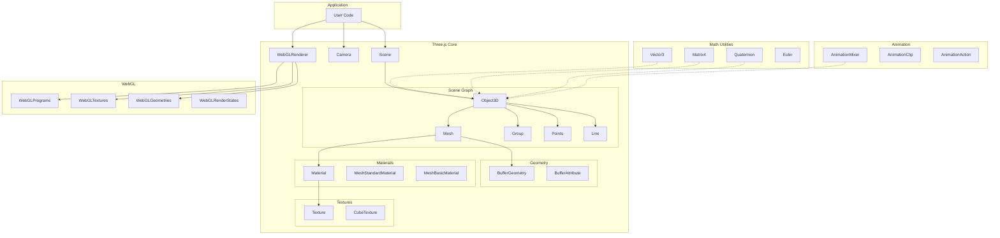

# Project Exploration: Three.js - 3D Graphics Library

## Overview

Three.js is a lightweight, cross-browser JavaScript library for creating 3D graphics with WebGL. It provides an easy-to-use abstraction layer over WebGL, making 3D graphics accessible to web developers without requiring deep knowledge of graphics programming.

The library's primary goal is to create an easy-to-use, lightweight, general-purpose 3D library. It includes WebGL and WebGPU renderers, with SVG and CSS3D renderers available as addons.

**Key Statistics:**
- Repository: `mrdoob/three.js` on GitHub
- Main entry points: `Three.Core.js` (core features), `Three.js` (full build), `Three.WebGPU.js` (WebGPU renderer)
- Current revision constant in `constants.js`

## Directory Structure

```
three.js/
├── src/                          # Core source code
│   ├── animation/                # Animation system (Mixer, Clip, Action, KeyframeTrack)
│   ├── audio/                    # 3D audio system
│   ├── cameras/                  # Camera types (Perspective, Orthographic, Stereo, Cube)
│   ├── core/                     # Core classes (Object3D, BufferGeometry, BufferAttribute)
│   ├── extras/                   # Utilities (curves, shapes, data/utils)
│   ├── geometries/               # Built-in geometry primitives
│   ├── helpers/                  # Debug helpers (axes, lights, cameras)
│   ├── lights/                   # Light types (ambient, directional, point, spot)
│   ├── loaders/                  # Asset loaders (textures, models, animations)
│   ├── materials/                # Material definitions (Basic, Standard, Physical, etc.)
│   ├── math/                     # Math utilities (Vector3, Matrix4, Quaternion)
│   ├── nodes/                    # Node-based material system (TSL)
│   ├── objects/                  # 3D objects (Mesh, Line, Points, SkinnedMesh)
│   ├── renderers/                # Renderers (WebGLRenderer, WebGPURenderer)
│   ├── scenes/                   # Scene graph (Scene, Fog)
│   ├── textures/                 # Texture handling
│   ├── constants.js              # Library constants
│   ├── Three.Core.js             # Core library exports
│   └── Three.js                  # Full library exports
├── examples/                     # Examples and addons
│   └── jsm/                      # ES modules addons
│       ├── controls/             # Camera controls (OrbitControls, etc.)
│       ├── loaders/              # Additional loaders (GLTF, OBJ, etc.)
│       ├── postprocessing/       # Post-processing effects
│       ├── shaders/              # Shader libraries
│       └── ...                   # Many more utilities
├── docs/                         # API documentation
├── manual/                       # Manual/guide content
└── playground/                   # Interactive playground
```

## Architecture

### High-Level Diagram



## Scene Graph

The scene graph is the foundation of Three.js's 3D world organization. It's a hierarchical tree structure where all 3D objects are nodes.

### Object3D - The Base Class

`Object3D` (in `src/core/Object3D.js`) is the base class for most objects in Three.js. It provides:

**Transform Properties:**
- `position` (Vector3) - Local position
- `rotation` (Euler) - Local rotation as Euler angles
- `quaternion` (Quaternion) - Local rotation as quaternion (alternative to rotation)
- `scale` (Vector3) - Local scale (default: 1,1,1)

**Matrix Properties:**
- `matrix` (Matrix4) - Local transformation matrix
- `matrixWorld` (Matrix4) - World transformation matrix
- `matrixAutoUpdate` (boolean) - Auto-update local matrix each frame
- `matrixWorldAutoUpdate` (boolean) - Auto-update world matrix each frame

**Hierarchy Methods:**
```javascript
add(object)           // Add child object
remove(object)        // Remove child object
attach(object)        // Add child while maintaining world transform
clear()               // Remove all children
traverse(callback)    // Recursively execute callback
```

**Key Methods:**
- `lookAt(x, y, z)` - Rotates object to face a point
- `updateMatrix()` - Updates local matrix from position/rotation/scale
- `updateMatrixWorld(force)` - Updates world matrix and all children
- `localToWorld(vector)` / `worldToLocal(vector)` - Coordinate conversion

### Scene

The `Scene` class (in `src/scenes/Scene.js`) extends Object3D and adds:

```javascript
scene.background      // Background color or texture
scene.environment     // Environment map for PBR materials
scene.fog             // Fog or FogExp2 for depth effects
scene.overrideMaterial // Override all materials for debugging
```

### Scene Graph Example

```javascript
// Create scene hierarchy
const scene = new THREE.Scene();
const group = new THREE.Group();
const mesh = new THREE.Mesh(geometry, material);

scene.add(group);      // Scene -> Group
group.add(mesh);       // Group -> Mesh

// Transform mesh relative to parent
mesh.position.set(1, 0, 0);  // 1 unit right of group
group.rotation.y = Math.PI / 4;  // Rotate entire group
```

## Rendering Pipeline

The rendering pipeline in Three.js follows a clear flow:

```
Scene + Camera → WebGLRenderer → Canvas
```

### Basic Rendering Flow

```javascript
const renderer = new THREE.WebGLRenderer({ canvas, antialias: true });
renderer.setSize(width, height);

function render() {
    requestAnimationFrame(render);
    renderer.render(scene, camera);
}
```

### WebGLRenderer Architecture

The `WebGLRenderer` (in `src/renderers/WebGLRenderer.js`) is composed of multiple internal modules:

| Module | Responsibility |
|--------|----------------|
| `WebGLPrograms` | Shader program compilation and caching |
| `WebGLTextures` | Texture upload and management |
| `WebGLGeometries` | Buffer data upload to GPU |
| `WebGLMaterials` | Material-to-shader binding |
| `WebGLRenderStates` | Render state management per scene/camera |
| `WebGLRenderLists` | Sorting and organizing objects to render |
| `WebGLShadowMap` | Shadow map generation and application |
| `WebGLMorphtargets` | Morph target interpolation |
| `WebGLClipping` | Clipping plane handling |
| `WebXRManager` | VR/AR support |

### Render Process

1. **Initialization** - Set up viewport, clear buffers
2. **Scene Culling** - Determine visible objects via frustum culling
3. **Render List Sorting** - Sort by material, depth, render order
4. **Shadow Pass** - Render shadow maps from light perspective
5. **Main Render Pass** - Render scene from camera perspective
6. **Post-Processing** (optional) - Apply effects via composer

### Render Target

```javascript
const renderTarget = new THREE.WebGLRenderTarget(width, height);
renderer.setRenderTarget(renderTarget);
renderer.render(scene, camera);
renderer.setRenderTarget(null);  // Back to screen
```

## Geometry and Buffer Attributes

### BufferGeometry

`BufferGeometry` (in `src/core/BufferGeometry.js`) stores vertex data in GPU-friendly buffers.

**Key Properties:**
```javascript
geometry.index          // Index buffer (optional)
geometry.attributes     // Named attribute dictionary
geometry.morphAttributes  // Morph target attributes
geometry.groups         // Draw call groups
geometry.boundingBox    // Computed bounding box
geometry.boundingSphere // Computed bounding sphere
```

**Standard Attribute Names:**
| Attribute | Description | Components |
|-----------|-------------|------------|
| `position` | Vertex positions | 3 (x, y, z) |
| `normal` | Surface normals | 3 (x, y, z) |
| `uv` | Texture coordinates | 2 (u, v) |
| `uv2` | Second UV set (lightmaps) | 2 |
| `color` | Vertex colors | 3 or 4 |
| `tangent` | Tangent vectors (normal maps) | 4 |
| `skinIndex` | Bone indices (skinning) | 4 |
| `skinWeight` | Bone weights (skinning) | 4 |

### BufferAttribute

`BufferAttribute` (in `src/core/BufferAttribute.js`) wraps typed arrays:

```javascript
const positions = new Float32Array([
    0, 0, 0,  // vertex 0
    1, 0, 0,  // vertex 1
    0, 1, 0   // vertex 2
]);

geometry.setAttribute('position', new THREE.BufferAttribute(positions, 3));

// Access methods
attribute.getX(index);
attribute.setXYZ(index, x, y, z);
attribute.needsUpdate = true;  // Re-upload to GPU
```

### Creating Custom Geometry

```javascript
const geometry = new THREE.BufferGeometry();

const vertices = new Float32Array([
    -1, -1, 0,
     1, -1, 0,
     0,  1, 0
]);

const normals = new Float32Array([
    0, 0, 1,
    0, 0, 1,
    0, 0, 1
]);

geometry.setAttribute('position', new THREE.BufferAttribute(vertices, 3));
geometry.setAttribute('normal', new THREE.BufferAttribute(normals, 3));
geometry.computeBoundingSphere();
```

## Material System and Shaders

### Material Hierarchy

```
Material (base)
├── MeshBasicMaterial       (no lighting)
├── MeshLambertMaterial     (Lambertian shading)
├── MeshPhongMaterial       (Phong shading with specular)
├── MeshStandardMaterial    (PBR, metallic-roughness)
├── MeshPhysicalMaterial    (PBR with clearcoat, transmission)
├── MeshToonMaterial        (Cel shading)
├── MeshNormalMaterial      (Debug normals)
├── MeshMatcapMaterial      (Material capture)
├── MeshDepthMaterial       (Depth buffer)
├── MeshDistanceMaterial    (Distance from light)
├── MeshDistanceMaterial    (Distance from light)
└── ShadowMaterial          (Shadows only)
```

### Material Properties (Base)

```javascript
material.side           // FrontSide, BackSide, DoubleSide
material.opacity        // 0-1 transparency
material.transparent    // Enable transparency
material.depthTest      // Test against depth buffer
material.depthWrite     // Write to depth buffer
material.blending       // NormalBlending, AdditiveBlending, etc.
material.map            // Diffuse/albedo texture
material.alphaMap       // Alpha transparency texture
material.normalMap      // Normal mapping
material.bumpMap        // Bump mapping
material.displacementMap // Vertex displacement
material.aoMap          // Ambient occlusion
material.lightMap       // Baked lighting
material.envMap         // Environment reflection
```

### PBR Materials

**MeshStandardMaterial** - Physically Based Rendering:
```javascript
const material = new THREE.MeshStandardMaterial({
    color: 0xffffff,        // Base color
    roughness: 0.5,         // 0 = mirror, 1 = diffuse
    metalness: 0.0,         // 0 = dielectric, 1 = metal
    map: colorTexture,
    roughnessMap: roughnessTexture,
    metalnessMap: metalnessTexture,
    normalMap: normalTexture,
    aoMap: aoTexture,
    envMap: environmentMap
});
```

**MeshPhysicalMaterial** - Extended PBR:
```javascript
const material = new THREE.MeshPhysicalMaterial({
    ...standardProperties,
    clearcoat: 1.0,         // Car paint layer
    clearcoatRoughness: 0.1,
    transmission: 1.0,      // Glass transparency
    thickness: 1.0,         // Refraction thickness
    iridescence: 1.0,       // Thin-film interference
    anisotropy: 1.0,        // Brushed metal effect
    dispersion: 0.0,        // Chromatic aberration
    sheen: 1.0              // Fabric-like surface
});
```

### Shader Customization

```javascript
// onBeforeCompile for shader modification
material.onBeforeCompile = (shader) => {
    shader.vertexShader = shader.vertexShader.replace(
        '#include <begin_vertex>',
        `
        #include <begin_vertex>
        transformed.z += sin(uv.x * 10.0) * 0.1;
        `
    );
};
```

## Animation System

### Components

| Class | Purpose |
|-------|---------|
| `AnimationClip` | Collection of keyframe tracks |
| `AnimationMixer` | Player for animations on an object |
| `AnimationAction` | Instance of a clip playing on a mixer |
| `KeyframeTrack` | Time-based property animation |
| `PropertyBinding` | Binds track to object property |
| `PropertyMixer` | Blends multiple property values |

### Animation Workflow

```javascript
// Load animation (e.g., from GLTF)
const clip = AnimationClip.parse(json);
const mixer = new AnimationMixer(mesh);
const action = mixer.clipAction(clip);

// Play animation
action.play();

// In render loop
const clock = new THREE.Clock();
function animate() {
    requestAnimationFrame(animate);
    const delta = clock.getDelta();
    mixer.update(delta);  // Advances animation
    renderer.render(scene, camera);
}
```

### Creating Keyframe Tracks

```javascript
// Animate position over 2 seconds
const times = [0, 1, 2];  // Seconds
const values = [
    0, 0, 0,  // Position at t=0
    5, 0, 0,  // Position at t=1
    5, 5, 0   // Position at t=2
];

const track = new THREE.VectorKeyframeTrack(
    '.position',  // Property path
    times,
    values
);

const clip = new THREE.AnimationClip('MoveAnimation', 2, [track]);
```

### Animation Blending

```javascript
// Cross-fade between animations
const walkAction = mixer.clipAction(walkClip);
const runAction = mixer.clipAction(runClip);

walkAction.fadeIn(0.5);
runAction.fadeOut(0.5);
```

## Math Utilities

### Vector3

The foundation of 3D math in Three.js:

```javascript
const v = new THREE.Vector3(x, y, z);

// Operations
v.add(v2)           // Addition
v.sub(v2)           // Subtraction
v.multiply(v2)      // Component-wise multiply
v.divide(v2)        // Component-wise divide
v.scale(scalar)     // Uniform scale

v.normalize()       // Unit vector
v.length()          // Magnitude
v.distanceTo(v2)    // Distance between points
v.dot(v2)           // Dot product
v.cross(v2)         // Cross product

v.lerp(v2, t)       // Linear interpolation
v.applyMatrix4(m)   // Transform by matrix
v.applyQuaternion(q) // Transform by quaternion
v.project(camera)   // Project to screen space
v.unproject(camera) // Unproject from screen space
```

### Matrix4

4x4 transformation matrices:

```javascript
const m = new THREE.Matrix4();

// Creation
m.makeTranslation(x, y, z);
m.makeRotationX(angle);
m.makeRotationY(angle);
m.makeRotationZ(angle);
m.makeScale(sx, sy, sz);
m.makePerspective(fov, aspect, near, far);
m.lookAt(eye, center, up);

// Operations
m.multiply(m2)      // Matrix multiplication
m.invert()          // Inverse
m.transpose()       // Transpose
m.decompose(pos, quat, scale)  // Extract components
m.compose(pos, quat, scale)    // Create from components
```

### Quaternion

Rotation representation that avoids gimbal lock:

```javascript
const q = new THREE.Quaternion(x, y, z, w);

// Creation
q.setFromAxisAngle(axis, angle);
q.setFromEuler(euler);
q.setFromRotationMatrix(m);
q.slerp(q2, t);       // Spherical linear interpolation

// Operations
q.multiply(q2)        // Combine rotations
q.invert()            // Inverse rotation
q.normalize()         // Ensure unit quaternion
v.applyQuaternion(q)  // Rotate vector
```

### Euler

Human-readable rotation angles:

```javascript
const euler = new THREE.Euler(x, y, z, order);
// order: 'XYZ' (default), 'YZX', 'ZXY', 'XZY', 'YXZ', 'ZYX'

// Conversion
quaternion.setFromEuler(euler);
euler.setFromQuaternion(quaternion);
```

## Lights

Three.js provides multiple light types:

| Light Type | Description |
|------------|-------------|
| `AmbientLight` | Uniform light from all directions |
| `DirectionalLight` | Parallel light (sun) with shadows |
| `PointLight` | Omnidirectional point source |
| `SpotLight` |锥形 spotlight with shadows |
| `HemisphereLight` | Sky/ground gradient lighting |
| `RectAreaLight` | Area light (webgl only) |
| `LightProbe` | Spherical harmonic environment lighting |

```javascript
// Directional light with shadows
const light = new THREE.DirectionalLight(0xffffff, 1);
light.position.set(5, 10, 7);
light.castShadow = true;
light.shadow.mapSize.width = 2048;
light.shadow.mapSize.height = 2048;
scene.add(light);
```

## Cameras

### PerspectiveCamera

Standard 3D camera mimicking human vision:

```javascript
const camera = new THREE.PerspectiveCamera(
    75,              // FOV (degrees)
    width / height,  // Aspect ratio
    0.1,             // Near plane
    1000             // Far plane
);

camera.position.set(0, 1, 5);
camera.lookAt(0, 0, 0);
```

### OrthographicCamera

Parallel projection (no perspective):

```javascript
const frustumSize = 10;
const aspect = width / height;
const camera = new THREE.OrthographicCamera(
    -frustumSize * aspect / 2,
    frustumSize * aspect / 2,
    frustumSize / 2,
    -frustumSize / 2,
    0.1,
    1000
);
```

## Key Insights

### 1. Everything is an Object3D

The scene graph is built entirely on Object3D. Meshes, cameras, lights, and groups all inherit from it, sharing the same transform system and hierarchy methods.

### 2. Matrix Updates are Automatic but Controllable

By default, Three.js updates matrices every frame. For performance, you can disable `matrixAutoUpdate` and manually call `updateMatrixWorld()` when needed.

### 3. Geometry Data is Immutable After First Render

After a geometry is rendered, buffer data cannot be safely modified without:
- Setting `attribute.needsUpdate = true`
- Disposing and recreating the geometry for major changes

### 4. Materials Compile Shaders On-Demand

Materials don't have shaders until first use. Identical materials share shader programs. Use `onBeforeCompile` for shader customization.

### 5. The Renderer Manages GPU State

WebGLRenderer maintains extensive state to minimize GPU state changes. It batches draw calls by material and handles resource disposal via `dispose()` methods.

### 6. Animation is Time-Based

The AnimationMixer uses delta time, not frames. This ensures consistent animation speed regardless of frame rate.

### 7. PBR Requires Environment Maps

For physically accurate reflections, PBR materials need an environment map. Use `PMREMGenerator` to preprocess environment textures.

## File Summary

| Category | Key Files |
|----------|-----------|
| Core | `src/core/Object3D.js`, `src/core/BufferGeometry.js`, `src/core/BufferAttribute.js` |
| Math | `src/math/Vector3.js`, `src/math/Matrix4.js`, `src/math/Quaternion.js` |
| Materials | `src/materials/Material.js`, `src/materials/MeshStandardMaterial.js` |
| Objects | `src/objects/Mesh.js`, `src/objects/Group.js` |
| Renderers | `src/renderers/WebGLRenderer.js` |
| Cameras | `src/cameras/PerspectiveCamera.js`, `src/cameras/OrthographicCamera.js` |
| Animation | `src/animation/AnimationMixer.js`, `src/animation/AnimationClip.js` |
| Scenes | `src/scenes/Scene.js` |
| Textures | `src/textures/Texture.js` |
| Exports | `src/Three.Core.js`, `src/Three.js` |
