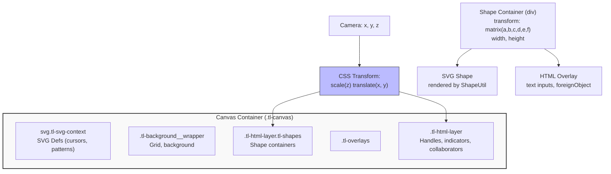
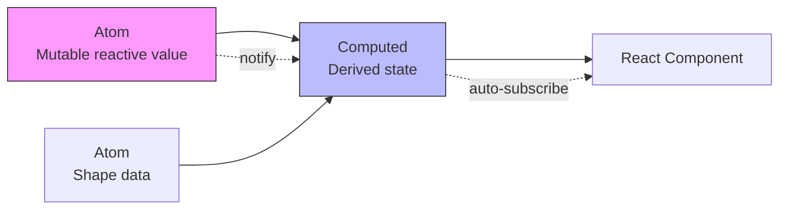
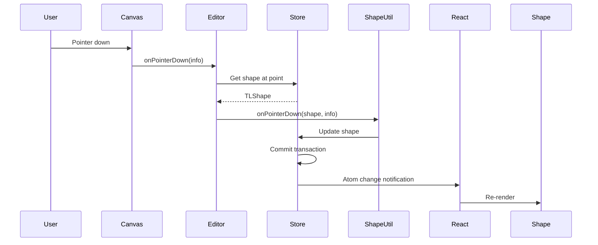

# Project Exploration: tldraw

## Overview

tldraw is an open-source infinite canvas SDK for React, enabling developers to build collaborative whiteboarding, diagramming, and design tools. It combines SVG and HTML layers to render shapes on an infinitely pannable and zoomable canvas, with a sophisticated signals-based reactive state management system.

The architecture is built around three core layers:
1. **`@tldraw/editor`** - Foundational canvas engine (pure engine without shapes/UI)
2. **`@tldraw/tldraw`** - Complete SDK with default shapes, tools, and UI
3. **`@tldraw/store`** - Reactive client-side database built on signals

## Repository

- **Location:** `/home/darkvoid/Boxxed/@formulas/src.UIFrameworks/src.tldraw/tldraw`
- **Remote:** `https://github.com/tldraw/tldraw`
- **Primary Language:** TypeScript
- **License:** Apache License 2.0

## Directory Structure

```
tldraw/
├── package.json                  # Monorepo root with yarn workspaces
├── yarn.lock                     # Dependency lock file
├── lazy.config.ts               # LazyRepo incremental build configuration
├── .vscode/                      # VS Code settings and launch configs
├── assets/                       # Static assets (fonts, icons, etc.)
├── packages/
│   ├── editor/                   # Core editor engine
│   │   ├── editor.css            # Canvas styles (54KB)
│   │   └── src/
│   │       ├── lib/
│   │       │   ├── TldrawEditor.tsx      # Editor component
│   │       │   ├── components/
│   │       │   │   ├── DefaultCanvas.tsx # Main canvas rendering
│   │       │   │   ├── SVGContainer.tsx  # SVG layer container
│   │       │   │   ├── HTMLContainer.tsx # HTML overlay container
│   │       │   │   └── Shape.tsx         # Shape rendering wrapper
│   │       │   ├── editor/
│   │       │   │   ├── Editor.ts         # Main editor class (7000+ lines)
│   │       │   │   ├── shapes/
│   │       │   │   │   ├── ShapeUtil.ts        # Shape definition base class
│   │       │   │   │   └── BaseBoxShapeUtil.tsx # Base class for box shapes
│   │       │   │   ├── tools/
│   │       │   │   │   ├── StateNode.ts    # State machine base class
│   │       │   │   │   └── RootState.ts    # Root tool state
│   │       │   │   └── managers/           # Input, Snap, Font, History managers
│   │       │   ├── hooks/
│   │       │   │   ├── useCanvasEvents.ts      # Pointer/gesture handlers
│   │       │   │   ├── useGestureEvents.ts     # Pinch/pan/zoom
│   │       │   │   ├── useTransform.ts         # CSS transform helper
│   │       │   │   └── useZoomCss.ts           # Zoom-based styling
│   │       │   └── primitives/
│   │       │       ├── Box.ts              # Bounding box class
│   │       │       ├── Vec.ts              # 2D vector class
│   │       │       ├── Mat.ts              # 2D transformation matrix
│   │       │       ├── geometry/           # Geometry2d, Group2d, etc.
│   │       │       └── easings.ts          # Animation easing functions
│   │   └── index.ts              # Public API exports
│   │
│   ├── tldraw/                   # Complete SDK
│   │   └── src/
│   │       ├── lib/
│   │       │   ├── Tldraw.tsx            # Main React component
│   │       │   ├── defaultShapeUtils.ts  # Default shapes (geo, text, arrow, etc.)
│   │       │   ├── defaultTools.ts       # Default tools (select, hand, etc.)
│   │       │   ├── shapes/               # Shape implementations
│   │       │   │   ├── arrow/ArrowShapeUtil.tsx
│   │       │   │   ├── draw/DrawShapeUtil.tsx
│   │       │   │   ├── frame/FrameShapeUtil.tsx
│   │       │   │   ├── geo/GeoShapeUtil.tsx
│   │       │   │   ├── highlight/HighlightShapeUtil.tsx
│   │       │   │   ├── image/ImageShapeUtil.tsx
│   │       │   │   ├── line/LineShapeUtil.tsx
│   │       │   │   ├── note/NoteShapeUtil.tsx
│   │       │   │   ├── text/TextShapeUtil.tsx
│   │       │   │   └── video/VideoShapeUtil.tsx
│   │       │   └── ui/                   # UI components (menus, panels, dialogs)
│   │       │       ├── TldrawUi.tsx
│   │       │       └── components/       # 80+ UI components
│   │       └── test/                     # Test utilities and tests
│   │
│   ├── store/                    # Reactive database
│   │   └── src/
│   │       ├── Atom.ts           # Reactive atom primitive
│   │       ├── Computed.ts       # Computed derived state
│   │       ├── Store.ts          # Main store class
│   │       └── migrations/       # Schema migrations
│   │
│   ├── tlschema/                 # Schema definitions and validators
│   │   └── src/
│   │       ├── records/
│   │       │   ├── TLCamera.ts       # Camera record (x, y, z)
│   │       │   ├── TLShape.ts        # Shape records
│   │       │   ├── TLPage.ts         # Page records
│   │       │   ├── TLInstance.ts     # Instance state
│   │       │   └── TLDocument.ts     # Document settings
│   │       └── styles/               # Style props and validators
│   │
│   ├── sync/                     # Multiplayer sync (Cloudflare Workers)
│   ├── sync-core/                # Core sync logic
│   ├── state/                    # Signals library (@tldraw/state)
│   ├── state-react/              # React integration for signals
│   ├── utils/                    # Utility functions
│   ├── worker/                   # Web worker utilities
│   └── ... (additional packages)
│
└── node_modules/
```

## Architecture

### High-Level Diagram

```mermaid
graph TB
    subgraph App[Application Layer]
        UI[Tldraw React Component]
        UserInput[User Input Events]
    end

    subgraph Tldraw["@tldraw/tldraw (Complete SDK)"]
        DefaultShapes[Default Shape Utils]
        DefaultTools[Default Tools]
        TldrawUI[UI Components]
    end

    subgraph Editor["@tldraw/editor (Canvas Engine)"]
        EditorClass[Editor Class]
        Canvas[Canvas Component]
        Shape[Shape Renderer]
        ShapeUtil[ShapeUtil Base]
        StateNode[StateNode Base]
        Managers[Managers]
    end

    subgraph Primitives["Primitives"]
        Mat[Mat - 2D Matrix]
        Vec[Vec - 2D Vector]
        Box[Box - Bounds]
        Geometry2d[Geometry2d]
    end

    subgraph Store["@tldraw/store (Reactive DB)"]
        Atom[Atom]
        Computed[Computed]
        Store[Store]
    end

    subgraph Schema["@tldraw/tlschema"]
        Camera[TLCamera]
        TLShape[TLShape]
        TLPage[TLPage]
    end

    subgraph Sync["@tldraw/sync"]
        Multiplayer[Cloudflare Durable Objects]
    end

    UI --> TldrawUI
    UserInput --> Canvas
    TldrawUI --> DefaultShapes & DefaultTools
    DefaultShapes --> ShapeUtil
    DefaultTools --> StateNode
    Canvas --> EditorClass
    EditorClass --> Managers
    EditorClass --> Store
    Store --> Schema
    Shape --> Primitives
    Sync --> Store
```

### The Infinite Canvas: SVG + HTML Layering

The infinite canvas is implemented using **two parallel layers** - one SVG and one HTML - that move together via CSS transforms:



#### Key Implementation Details:

**1. Camera System**

The camera is stored as a `TLCamera` record with three properties:
```typescript
interface TLCamera {
  x: number  // Pan offset X (negative = viewport moves right)
  y: number  // Pan offset Y (negative = viewport moves down)
  z: number  // Zoom level (1 = 100%, 0.5 = 50%, 2 = 200%)
}
```

**2. Layer Transformation (DefaultCanvas.tsx)**

```typescript
// From DefaultCanvas.tsx lines 55-94
useQuickReactor('position layers', function positionLayersWhenCameraMoves() {
  const { x, y, z } = editor.getCamera()

  // Small offset to align HTML and SVG layers precisely
  const offset = z >= 1
    ? modulate(z, [1, 8], [0.125, 0.5], true)
    : modulate(z, [0.1, 1], [-2, 0.125], true)

  const transform = `scale(${toDomPrecision(z)}) translate(${toDomPrecision(x + offset)}px,${toDomPrecision(y + offset)}px)`

  setStyleProperty(rHtmlLayer.current, 'transform', transform)
  setStyleProperty(rHtmlLayer2.current, 'transform', transform)
})
```

**3. Shape Positioning (Shape.tsx)**

Each shape has its own transform derived from its page position combined with the camera:

```typescript
// Shape container transform uses page transform
const pageTransform = editor.getShapePageTransform(id)
const transform = Mat.toCssString(pageTransform)
// Results in: "matrix(a, b, c, d, e, f)"

// Applied to shape container
setStyleProperty(containerRef.current, 'transform', transform)
```

**4. Matrix Transformations (Mat.ts)**

The `Mat` class handles 2D affine transformations:

```typescript
class Mat {
  a = 1.0, b = 0.0, c = 0.0, d = 1.0, e = 0.0, f = 0.0

  // CSS output
  toCssString() {
    return `matrix(${toDomPrecision(this.a)}, ${toDomPrecision(this.b)}, ...)`
  }

  // Compose transformations
  static Compose(...matrices: MatLike[]) {
    const matrix = Mat.Identity()
    for (let m of matrices) matrix.multiply(m)
    return matrix
  }

  // Apply to point
  static applyToPoint(m: MatLike, point: VecLike) {
    return new Vec(
      m.a * point.x + m.c * point.y + m.e,
      m.b * point.x + m.d * point.y + m.f
    )
  }
}
```

### Layer Stack (CSS z-index)

From `editor.css`:

```css
/* Canvas z-index layers */
--tl-layer-canvas-hidden: -999999;
--tl-layer-canvas-background: 100;
--tl-layer-canvas-grid: 150;
--tl-layer-watermark: 200;
--tl-layer-canvas-shapes: 300;         /* Shapes render here */
--tl-layer-canvas-overlays: 500;       /* Selection, brushes */
--tl-layer-canvas-in-front: 600;
--tl-layer-canvas-blocker: 10000;      /* Camera move blocker */

/* Overlay sub-layers */
--tl-layer-overlays-user-scribble: 40;
--tl-layer-overlays-user-brush: 50;
--tl-layer-overlays-selection-fg: 100;
--tl-layer-overlays-user-handles: 105;  /* Handles above selection */
--tl-layer-overlays-collaborator-cursor: 130;
```

### Signals-Based Reactivity

tldraw uses a custom signals library (`@tldraw/state`) for fine-grained reactivity:



**Atom:** Mutable reactive primitive
```typescript
const zoomLevel = atom('zoom', 1)
zoomLevel.set(1.5) // Triggers reactivity
```

**Computed:** Derived reactive value
```typescript
const efficientZoom = computed('efficientZoom', () => {
  return shapeCount.value > 300 ? debouncedZoom.get() : zoomLevel.get()
})
```

**React Integration:**
```typescript
// useValue hook - subscribes to signals
const camera = useValue('camera', () => editor.getCamera(), [editor])
```

### Shape System (ShapeUtil)

Every shape type extends `ShapeUtil<T>`:

```typescript
abstract class ShapeUtil<T extends TLShape> {
  // Definition
  static override type: TLShape['type']
  props: Record<string, AnyProp>

  // Geometry
  geometry(shape: T): Geometry2d

  // Rendering
  component(shape: T): JSX.Element
  backgroundComponent?: (shape: T) => JSX.Element

  // Interactions
  onPointerDown?(event: TLPointerEventInfo, shape: T): void
  onClick?(event: TLPointerEventInfo, shape: T): void

  // Lifecycle
  create(props: object): Partial<T>
  getDefaultProps(): T['props']
}
```

**Example: GeoShapeUtil**
```typescript
class GeoShapeUtil extends BaseBoxShapeUtil<TLGeoShape> {
  static override type = 'geo' as const

  component(shape) {
    return (
      <g>
        <rect width={shape.w} height={shape.h} fill={shape.props.color} />
        <text>{shape.props.text}</text>
      </g>
    )
  }

  geometry(shape) {
    return new Rectangle2d({
      width: shape.w,
      height: shape.h,
      isFilled: true
    })
  }
}
```

### Tool System (StateNode)

Tools are implemented as state machines using `StateNode`:

```typescript
class SelectTool extends StateNode {
  static override initial = 'idle'

  override children = () => [Idle, DraggingHandle, Cropping]

  override onPointerDown = (info) => {
    const shape = this.editor.getShapeAtPoint(info.point)
    if (shape) {
      this.parent.transition('pointing', info)
    }
  }
}

class Idle extends StateNode {
  override onPointerDown = () => {
    // Handle selection
  }

  override onPointerMove = () => {
    // Handle hover states
  }
}
```

## Data Flow



## Configuration

### Package.json Key Dependencies

```json
{
  "dependencies": {
    "@tldraw/state": "workspace:*",
    "@tldraw/store": "workspace:*",
    "@tldraw/tlschema": "workspace:*",
    "react": "^18.2.0 || ^19",
    "react-dom": "^18.2.0 || ^19",
    "eventemitter3": "^5.0.1"
  },
  "devDependencies": {
    "lazyrepo": "0.0.0-alpha.24",
    "typescript": "5.8.2",
    "vite": "^6.0.0"
  }
}
```

### Build System: LazyRepo

tldraw uses a custom incremental build system:

```typescript
// lazy.config.ts
export default defineConfig({
  tasks: {
    'build': {
      command: 'vite build',
      dependencies: ['build-deps'],
      outputs: ['dist/**']
    },
    'test': {
      command: 'vitest run',
      dependencies: ['build']
    }
  }
})
```

## External Dependencies

| Dependency | Version | Purpose |
|------------|---------|---------|
| react | ^18.2.0 / ^19 | UI framework |
| @tldraw/state | workspace:* | Signals-based reactivity |
| @tldraw/store | workspace:* | Reactive database |
| eventemitter3 | ^5.0.1 | Event emitter for Editor |
| classnames | ^2.3.2 | CSS class utilities |
| lodash | ^4.17.21 | Utility functions |
| idb | ^7.1.1 | IndexedDB for persistence |

## Testing

tldraw has comprehensive testing:

- **Unit tests:** Vitest for utilities and primitives
- **Integration tests:** TestEditor class simulates user interactions
- **Visual tests:** Screenshot comparisons for rendering
- **E2E tests:** Playwright for full app flows

Example test (cameraState.test.ts):
```typescript
it('becomes moving when camera changes via setCamera', () => {
  expect(editor.getCameraState()).toBe('idle')
  editor.setCamera({ x: 100, y: 100, z: 1 })
  expect(editor.getCameraState()).toBe('moving')

  editor.forceTick(5) // Advance timers
  expect(editor.getCameraState()).toBe('idle')
})
```

## Key Insights

1. **Dual-Layer Rendering**: SVG handles vector shapes; HTML handles text inputs and UI overlays. Both layers share the same CSS transform derived from camera position.

2. **Matrix-Based Transforms**: All shape positioning uses 2D affine transformation matrices (`Mat` class), enabling efficient composition of translation, rotation, and scale.

3. **Viewport Culling**: `editor.getCulledShapes()` returns shapes outside the viewport - these are hidden via `display: none` for performance.

4. **Signals Over Observables**: The custom signals library provides fine-grained reactivity with automatic dependency tracking, avoiding React re-renders for unchanged components.

5. **Shape-Defined Geometry**: Each shape defines its own geometry via `ShapeUtil.geometry()`, enabling custom hit testing and collision detection.

6. **State Machine Tools**: Tools use hierarchical state machines (StateNode) for clean interaction logic with parent/child state transitions.

7. **Session-Scoped Camera**: Each page has a camera record scoped to the session (not persisted), allowing multiple users to have independent views.

8. **Debounced Zoom Optimization**: When many shapes exist (>300), rendering uses debounced zoom level during camera movement to avoid expensive re-renders.

## Open Questions

1. **WebGL Usage**: The minimap uses WebGL (`webgl-minimap` package) - how is the canvas rasterized for GPU rendering?

2. **Text Rendering**: How does `TextManager` handle font loading and text measurement across different shape types?

3. **Sync Architecture**: How does `@tldraw/sync` use Cloudflare Durable Objects for multiplayer state synchronization?

4. **Asset Loading**: How are images/videos loaded and cached? What happens with broken assets?

5. **Export Pipeline**: How does `exportToSvg` convert the HTML/SVG canvas to a single exported SVG?

6. **Performance at Scale**: What are the performance characteristics with 10,000+ shapes? What optimization strategies exist?
