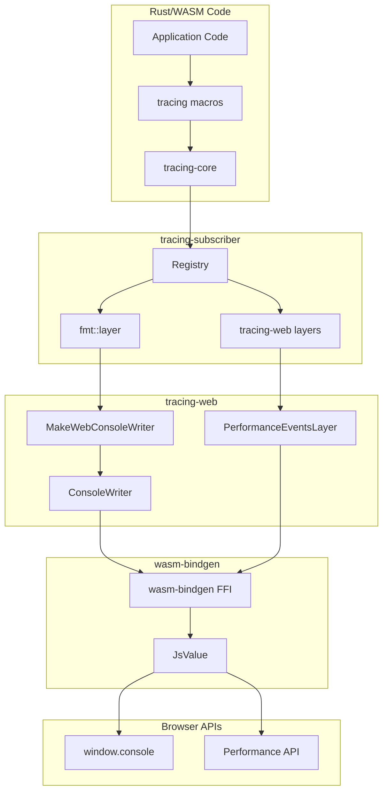
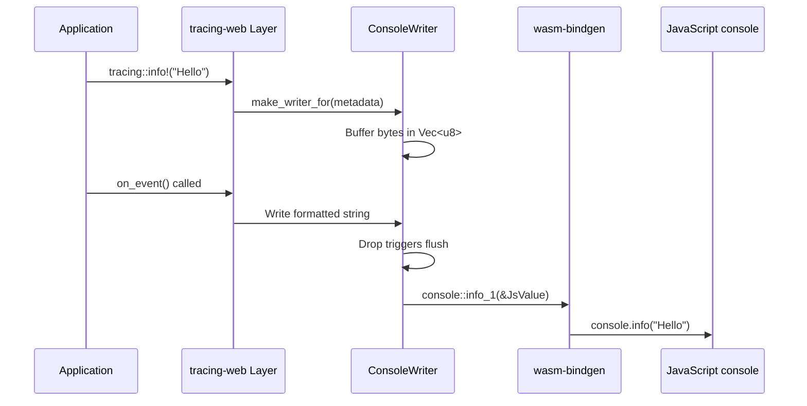
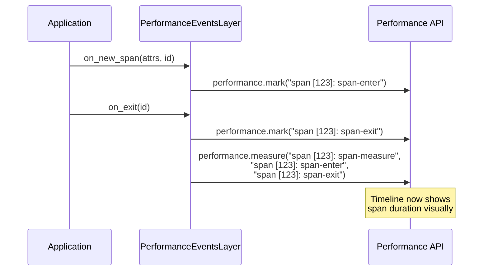

# tracing-web Architecture

This document explains **how tracing-web works** at an architectural level, covering the browser integration points and the tracing pipeline.

## High-Level Architecture



## The Tracing Pipeline

### 1. Event Emission

When your code calls a tracing macro:

```rust
tracing::info!(user_id = %id, "User logged in");
```

The macro expands to code that:
1. Creates a `Metadata` struct describing the event (level, target, file, line)
2. Calls `tracing_core::dispatch::Dispatch::event()`
3. The `Dispatch` forwards to all registered `Layer`s

### 2. Layer Processing

Each `Layer` receives the event and can:

```rust
impl<S: Subscriber> Layer<S> for MakeWebConsoleWriter {
    fn on_event(&self, event: &Event, ctx: Context<'_, S>) {
        // 1. Get the log level from metadata
        let level = event.metadata().level();

        // 2. Create a writer for this level
        let mut writer = self.make_writer_for(event.metadata());

        // 3. Format and write the event
        event.record(&mut visitor);
    }
}
```

### 3. Console Output Flow



### 4. Performance API Flow



## Component Architecture

### ConsoleWriter System

```
MakeWebConsoleWriter (MakeWriter trait)
         │
         ▼ create writer for specific level
    ┌─────────────────┐
    │  ConsoleWriter  │
    ├─────────────────┤
    │ - buffer: Vec<u8>│
    │ - level: Level  │
    │ - log: fn()     │
    └─────────────────┘
         │
         │ on drop, flush buffer
         ▼
    ┌─────────────────┐
    │  LogDispatcher  │ (fn pointer)
    │  select based   │
    │  on level+style │
    └─────────────────┘
         │
         ├──────┬──────┬──────┬──────┐
         ▼      ▼      ▼      ▼      ▼
    TRACE  DEBUG  INFO   WARN  ERROR
     │      │      │      │      │
     ▼      ▼      ▼      ▼      ▼
  debug  debug  info  warn  error
```

**Key Design: Type-Level Dispatch**

The code uses a clever type-level dispatch pattern:

```rust
// Trait for log implementations
trait LogImpl {
    fn log_simple(level: Level, msg: &str);
    fn log_pretty(level: Level, msg: &str);
}

// Dummy types for each level
struct LogLevelTrace;
struct LogLevelDebug;
struct LogLevelInfo;
// etc.

// Macro generates impls
make_log_impl!(LogLevelTrace {
    simple: console::debug_1,
    pretty: { log: console::debug_4, fmt: "%cTRACE%c %s", ... }
});

// Select at runtime, dispatch at compile time
fn select_dispatcher(style: impl LogImplStyle, level: Level) -> LogDispatcher {
    if level == Level::TRACE {
        style.get_dispatch::<LogLevelTrace>()  // Returns fn pointer
    }
    // ...
}
```

This avoids virtual dispatch overhead while maintaining flexibility.

### PerformanceEventsLayer System

```
PerformanceEventsLayer<S, N>
    │
    ├── S: Subscriber + LookupSpan (generic over subscriber)
    └── N: FormatSpan (generic over formatting strategy)
              │
              ├──── () (no details)
              └──── FormatSpanFromFields<N>
                         │
                         └── Uses tracing-subscriber's FormatFields trait
```

**Span Lifecycle:**

| Method | Browser Action |
|--------|----------------|
| `on_new_span` | Store formatted fields in span extensions |
| `on_enter` | `performance.mark("{name} [{id}]: span-enter")` |
| `on_record` | `performance.mark("{name} [{id}]: span-record")` |
| `on_exit` | `performance.mark("{name} [{id}]: span-exit")` + `performance.measure()` |

**Extensions Storage:**

The layer uses `tracing_subscriber::registry::Extensions` as a type-map to store formatted field data:

```rust
// When span is created
fn on_new_span(&self, attrs: &span::Attributes<'_>, span: &span::Id, ctx: Context<'_, S>) {
    let span = ctx.span(span).expect("span must exist");
    self.fmt_details.add_details(&mut span.extensions_mut(), attrs);
    // This stores FormattedFields<N> in the Extensions type-map
}

// When span exits
fn on_exit(&self, span: &span::Id, ctx: Context<'_, S>) {
    let span = ctx.span(span).expect("span must exist");
    if let Some(details) = self.fmt_details.find_details(&span.extensions()) {
        // Use the pre-formatted details string
        p.mark_detailed(&mark_exit_name, details)?;
    }
}
```

## Browser Integration Details

### FFI Bindings

```rust
#[wasm_bindgen]
extern "C" {
    #[wasm_bindgen(js_name = _fakeGlobal)]
    type Global;

    #[wasm_bindgen()]
    type Performance;

    #[wasm_bindgen(static_method_of = Global, js_class = "globalThis", getter)]
    fn performance() -> Performance;

    #[wasm_bindgen(method, catch, js_name = "mark")]
    fn do_mark(this: &Performance, name: &str) -> Result<(), JsValue>;

    #[wasm_bindgen(method, catch, js_name = "mark")]
    fn do_mark_with_details(
        this: &Performance,
        name: &str,
        details: &JsValue,
    ) -> Result<(), JsValue>;
}
```

### Performance API Wrapper

```rust
impl Performance {
    fn mark(&self, name: &str) -> Result<(), JsValue> {
        self.do_mark(name)
    }

    fn mark_detailed(&self, name: &str, details: &str) -> Result<(), JsValue> {
        // Create JavaScript object: { detail: details }
        let details_obj = Object::create(JsValue::NULL.unchecked_ref::<Object>());
        let detail_prop = JsString::from(wasm_bindgen::intern("detail"));
        Reflect::set(&details_obj, &detail_prop, &JsValue::from(details)).unwrap();
        self.do_mark_with_details(name, &details_obj)
    }

    fn measure(&self, name: &str, start: &str, end: &str) -> Result<(), JsValue> {
        self.do_measure_with_start_mark_and_end_mark(name, start, end)
    }
}
```

### Console Output with CSS Styling

For "pretty" output, the code uses console formatting specifiers:

```rust
// Format string for styled output
const FORMAT: &str = "%cTRACE%c %s";
//                    │ │    │
//                    │ │    └── Message (third argument)
//                    │ └────── Reset style (second %c)
//                    └──────── Style (first %c)

// Label style for TRACE level
const LABEL_STYLE: &str = "color: white; font-weight: bold; padding: 0 5px; background: #75507B;";

// Console call
console::debug_4(&fmt, &label_style, &msg_style, &message);
```

## Memory Management

### Buffer Strategy

`ConsoleWriter` uses a `Vec<u8>` buffer that flushes on drop:

```rust
pub struct ConsoleWriter {
    buffer: Vec<u8>,
    level: Level,
    log: LogDispatcher,
}

impl Drop for ConsoleWriter {
    fn drop(&mut self) {
        let message = String::from_utf8_lossy(&self.buffer);
        (self.log)(self.level, message.as_ref());
    }
}
```

**Trade-offs:**
- **Pro:** Compatible with `std::io::Write` trait
- **Con:** UTF-8 decode then re-encode as UTF-16 for JS
- **Note:** The code acknowledges this inefficiency in a TODO comment

### Thread-Local Performance Handle

```rust
thread_local! {
    static PERF: Performance = {
        let performance = Global::performance();
        assert!(!performance.is_undefined(), "browser seems to not support the Performance API");
        performance
    };
}
```

This caches the Performance object per thread (in WASM, typically one thread).

## Error Handling

The code gracefully handles browser API failures:

```rust
let _ = PERF.with(|p| {
    if let Some(details) = self.fmt_details.find_details(&span.extensions()) {
        p.mark_detailed(&mark_name, details)
    } else {
        p.mark(&mark_name)
    }
}); // Errors are silently ignored - browser APIs are best-effort
```

Rationale: Browser DevTools are debugging infrastructure; failures shouldn't crash production code.

## Integration with tracing-subscriber

```rust
// tracing-web provides Layer implementations
let fmt_layer = tracing_subscriber::fmt::layer()
    .with_writer(MakeWebConsoleWriter::new());

let perf_layer = performance_layer()
    .with_details_from_fields(Pretty::default());

// Stack layers using Registry
tracing_subscriber::registry()
    .with(fmt_layer)    // fmt::Layer<ConsoleWriter>
    .with(perf_layer)   // PerformanceEventsLayer
    .init();
```

The `Registry` is the central hub that dispatches events to all layers.

## See Also

- [tracing Ecosystem](./tracing-ecosystem.md) - Overview of tracing crates
- [Implementation Details](./implementation.md) - Code-level analysis
- [Mozilla Performance API](https://developer.mozilla.org/en-US/docs/Web/API/Performance)
