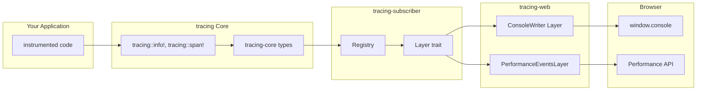

# tracing-web Exploration

---
**Location:** `/home/darkvoid/Boxxed/@formulas/src.rust/tracing-web/`
**Repository:** https://github.com/WorldSEnder/tracing-web
**Version:** 0.1.3
**Explored At:** 2026-03-26
**Language:** Rust (WASM)
---

## Project Overview

### What is tracing-web?

`tracing-web` is a **tracing-compatible subscriber layer for web platforms**. It bridges the gap between Rust's powerful `tracing` ecosystem and browser debugging tools, enabling developers to use structured logging and distributed tracing concepts directly in WebAssembly applications running in the browser.

### Core Purpose

The crate provides two primary capabilities:

1. **Console Output Layer** - Routes `tracing` events to browser's `console` API with level-appropriate methods (`console.debug`, `console.info`, `console.warn`, `console.error`)

2. **Performance API Layer** - Emits span enter/exit events as [Performance Marks and Measures](https://developer.mozilla.org/en-US/docs/Web/API/Performance), enabling timeline visualization in browser DevTools

### Relationship to the tracing Crate



`tracing-web` implements the `Layer` trait from `tracing-subscriber`, making it a **subscriber** in the tracing ecosystem. It does NOT replace `tracing` - it consumes tracing events and routes them to browser APIs.

### Use Cases

1. **WASM Web Applications** - Debug Yew, Dioxus, or Leptos applications with structured logging
2. **Performance Profiling** - Visualize component lifecycles in browser Performance tab
3. **Cross-Platform Logging** - Use the same tracing instrumentation on native and web targets
4. **Browser-Based Debugging** - Replace `console.log` with typed, structured events

## Quick Start Example

```rust
use tracing_web::{MakeWebConsoleWriter, performance_layer};
use tracing_subscriber::fmt::format::Pretty;
use tracing_subscriber::prelude::*;

fn main() {
    // Layer 1: Console output
    let fmt_layer = tracing_subscriber::fmt::layer()
        .with_ansi(false)
        .without_time()
        .with_writer(MakeWebConsoleWriter::new());

    // Layer 2: Performance marks
    let perf_layer = performance_layer()
        .with_details_from_fields(Pretty::default());

    // Combine layers
    tracing_subscriber::registry()
        .with(fmt_layer)
        .with(perf_layer)
        .init();

    // Use tracing macros anywhere in your code
    tracing::info!("Application started");

    let span = tracing::debug_span!("my_operation");
    let _guard = span.enter();
    tracing::debug!("Inside span");
}
```

## Project Structure

```
tracing-web/
├── Cargo.toml                  # Package configuration
├── README.md                   # Usage documentation
├── CHANGELOG.md                # Version history
├── CONTRIBUTING.md             # Contribution guidelines
├── LICENSE-APACHE              # Apache 2.0 license
├── LICENSE-MIT                 # MIT license
├── rustfmt.toml                # Rust formatting config
├── src/
│   ├── lib.rs                  # Library entry point
│   ├── console_writer.rs       # Console output implementation
│   └── performance_layer.rs    # Performance API implementation
└── examples/
    └── trace-yew-app/          # Yew framework example
        ├── Cargo.toml
        ├── index.html
        └── src/main.rs
```

## Key Statistics

| Metric | Value |
|--------|-------|
| Version | 0.1.3 |
| Edition | Rust 2021 |
| License | MIT OR Apache-2.0 |
| Dependencies | 5 core crates |
| Source Lines | ~500 LOC |

## Core Dependencies

| Crate | Version | Purpose |
|-------|---------|---------|
| `js-sys` | 0.3.59 | JavaScript type bindings |
| `wasm-bindgen` | 0.2.82 | Rust/JS interop |
| `web-sys` | 0.3.59 | Web APIs (console, performance) |
| `tracing-core` | 0.1.29 | Core tracing types |
| `tracing-subscriber` | 0.3.15 | Subscriber infrastructure |

## Design Philosophy

1. **Zero-Overhead Abstraction** - Compile-time dispatch where possible
2. **Browser-Native** - Uses native browser APIs, not polyfills
3. **Composable** - Works alongside other `tracing-subscriber` layers
4. **Type-Safe** - Leverages Rust's type system for correct log levels

## Integration Points

### With Yew

The example application demonstrates integration with [Yew](https://yew.rs):

```rust
// In main.rs of trace-yew-app
fn main() {
    // Initialize tracing...

    tracing::debug_span!("top-level", i = 5).in_scope(|| {
        tracing::trace!("This is a trace message.");
        tracing::debug!(msg = ?message, "Hello, world!");
        Span::current().record("i", 7);
    });

    yew::Renderer::<App>::new().render();
}
```

### With time crate

For timestamps in browsers:

```toml
# Cargo.toml
[dependencies]
time = { version = "0.3", features = ["wasm-bindgen"] }
```

```rust
use tracing_subscriber::fmt::time::UtcTime;

let fmt_layer = tracing_subscriber::fmt::layer()
    .with_timer(UtcTime::rfc_3339());
```

## See Also

- [Architecture Deep Dive](./architecture.md)
- [tracing Ecosystem](./tracing-ecosystem.md)
- [Implementation Details](./implementation.md)
- [Rust Replication Plan](./rust-revision.md)

## Sources

- [tokio-rs/tracing](https://github.com/tokio-rs/tracing)
- [WorldSEnder/tracing-web](https://github.com/WorldSEnder/tracing-web)
- [tracing-subscriber documentation](https://docs.rs/tracing-subscriber)
