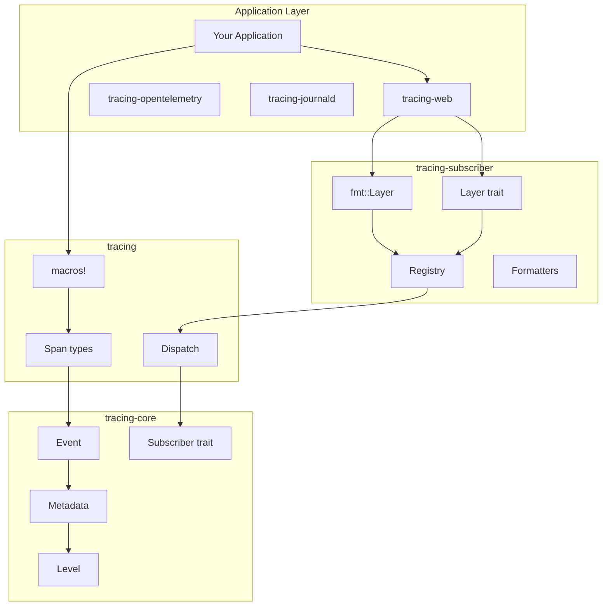

# tracing Ecosystem Deep Dive

This document explores the **tracing crate ecosystem** that `tracing-web` builds upon. Understanding these crates is essential for working with structured logging in Rust.

## Ecosystem Overview



## tracing-core

**Crate:** `tracing-core`
**Version:** 0.1.29 (as used by tracing-web)
**Purpose:** Core types and traits with minimal dependencies

### Key Types

#### Level

```rust
#[derive(Clone, Copy, Debug, PartialEq, Eq, Hash)]
pub struct Level(LevelInner);

impl Level {
    pub const TRACE: Level = Level::new(LevelInner::Trace);
    pub const DEBUG: Level = Level::new(LevelInner::Debug);
    pub const INFO: Level = Level::new(LevelInner::Info);
    pub const WARN: Level = Level::new(LevelInner::Warn);
    pub const ERROR: Level = Level::new(LevelInner::Error);

    pub fn as_str(&self) -> &'static str {
        match *self {
            Level::TRACE => "TRACE",
            Level::DEBUG => "DEBUG",
            Level::INFO => "INFO",
            Level::WARN => "WARN",
            Level::ERROR => "ERROR",
        }
    }
}
```

**Usage in tracing-web:**
```rust
// console_writer.rs selects console method based on level
fn select_dispatcher(style: impl LogImplStyle, level: Level) -> LogDispatcher {
    if level == Level::TRACE {
        style.get_dispatch::<LogLevelTrace>()
    } else if level == Level::DEBUG {
        style.get_dispatch::<LogLevelDebug>()
    }
    // ...
}
```

#### Metadata

```rust
pub struct Metadata<'a> {
    name: &'static str,
    target: &'static str,
    level: Level,
    file: Option<&'static str>,
    line: Option<u32>,
    // ...
}
```

**Usage in tracing-web:**
```rust
// performance_layer.rs extracts span name from metadata
fn template_name(span: &SpanRef<'_, S>, event_name: &str) -> String {
    let span_id = span.id().into_u64();
    let name = span.metadata().name();
    format!("{name} [{span_id}]: {event_name}")
}
```

#### Event

```rust
pub struct Event<'a> {
    fields: &'a FieldSet,
    metadata: &'static Metadata<'static>,
}

impl<'a> Event<'a> {
    pub fn dispatch(&'a self, subscriber: &dyn Subscriber) {
        subscriber.event(self);
    }

    pub fn record(&self, visitor: &mut dyn Visit) {
        // Record field values
    }
}
```

#### Subscriber Trait

```rust
pub trait Subscriber: 'static {
    fn enabled(&self, metadata: &Metadata) -> bool;
    fn new_span(&self, span: &span::Attributes) -> span::Id;
    fn record(&self, span: &span::Id, values: &span::Record);
    fn record_follows_from(&self, span: &span::Id, follows: &span::Id);
    fn event(&self, event: &Event);
    fn enter(&self, span: &span::Id);
    fn exit(&self, span: &span::Id);
    fn try_close(&self, span: span::Id) -> bool;
}
```

**Note:** `tracing-web` does NOT implement `Subscriber` directly. It implements `Layer` which is a composable subscriber modifier.

## tracing

**Crate:** `tracing`
**Purpose:** Main crate with macros and high-level types

### Macros

#### Event Macros

```rust
// Basic usage
tracing::trace!("verbose debugging info");
tracing::debug!("variable value: {}", x);
tracing::info!("user {} logged in", user_id);
tracing::warn!("deprecated API usage");
tracing::error!("something went wrong!");

// With fields
tracing::info!(target: "my_target", user_id = %id, "action");
tracing::debug!(my_field = ?value, "message");

// Shorthand syntax
tracing::info!(%user_id, "action");  // Logs user_id as Display
tracing::debug!(?error);             // Logs error as Debug
```

#### Span Macros

```rust
// Create and enter span
let span = tracing::info_span!("my_span", user_id = %id);
let _guard = span.enter();

// Using the guard pattern
tracing::info_span!("my_span").in_scope(|| {
    // Code here is inside the span
});

// Async support
async {
    let _span = tracing::info_span!("async_task").entered();
    // Span active for rest of async block
}.await;

// Instrument attribute
#[tracing::instrument(level = "debug", skip(self))]
fn my_method(&self, arg: usize) -> Result<()> {
    // Automatically creates span named "my_method"
    // Logs arguments and return value
}
```

### Span Lifecycle

```rust
// 1. Creation
let span = tracing::span!(Level::INFO, "my_span", field = value);

// 2. Entry (makes span current)
span.enter();  // or span.in_scope(|| { ... })

// 3. Record new values
span.record("field", &new_value);

// 4. Exit (when guard drops or in_scope returns)
// Automatic on guard drop

// 5. Close (when reference count reaches 0)
// Automatic when span goes out of scope
```

## tracing-subscriber

**Crate:** `tracing-subscriber`
**Version:** 0.3.15
**Purpose:** Composable subscriber implementations

### Registry

The `Registry` is the central hub that stores span data and dispatches to layers:

```rust
use tracing_subscriber::registry;

let subscriber = registry()
    .with(layer1)
    .with(layer2);

tracing::subscriber::set_global_default(subscriber)?;
// OR
subscriber.init();  // Convenience method
```

**Internal Structure:**
```
Registry
    ├── SpanData (type-map per span)
    │   ├── Extensions (type-map for custom data)
    │   ├── RefCount
    │   └── Parent Id
    └── Layer List
        ├── Layer 1
        ├── Layer 2
        └── ...
```

### Layer Trait

```rust
pub trait Layer<S: Subscriber>: 'static {
    // Filtering
    fn enabled(&self, metadata: &Metadata, ctx: Context<'_, S>) -> bool;
    fn max_level_hint(&self) -> Option<LevelFilter>;

    // Span lifecycle
    fn on_new_span(&self, attrs: &span::Attributes<'_>, id: &span::Id, ctx: Context<'_, S>);
    fn on_record(&self, id: &span::Id, values: &span::Record<'_>, ctx: Context<'_, S>);
    fn on_follows_from(&self, span: &span::Id, follows: &span::Id, ctx: Context<'_, S>);
    fn on_enter(&self, id: &span::Id, ctx: Context<'_, S>);
    fn on_exit(&self, id: &span::Id, ctx: Context<'_, S>);
    fn on_close(&self, id: span::Id, ctx: Context<'_, S>);
    fn on_id_change(&self, old: &span::Id, new: &span::Id, ctx: Context<'_, S>);

    // Events
    fn on_event(&self, event: &Event<'_>, ctx: Context<'_, S>);

    // Try to convert to a concrete type
    fn downcast_raw(&self, id: TypeId) -> Option<*const ()>;
}
```

**tracing-web implements Layer for:**
- `MakeWebConsoleWriter` - Console output
- `PerformanceEventsLayer` - Performance API marks

### fmt::Layer

```rust
use tracing_subscriber::fmt::layer;

let fmt_layer = layer()
    .with_ansi(false)                    // Disable colors
    .without_time()                      // No timestamps
    .with_level(true)                    // Include level
    .with_target(true)                   // Include target
    .with_writer(MakeWebConsoleWriter::new());  // Custom writer
```

**Writers implement MakeWriter:**

```rust
pub trait MakeWriter<'a> {
    type Writer: Write;

    fn make_writer(&'a self) -> Self::Writer;
    fn make_writer_for(&'a self, meta: &Metadata<'_>) -> Self::Writer {
        self.make_writer()
    }
}

// tracing-web implements this for MakeWebConsoleWriter
impl<'a> MakeWriter<'a> for MakeWebConsoleWriter {
    type Writer = ConsoleWriter;

    fn make_writer(&'a self) -> Self::Writer {
        ConsoleWriter {
            buffer: vec![],
            level: Level::TRACE,
            log: /* fallback dispatcher */,
        }
    }

    fn make_writer_for(&'a self, meta: &Metadata<'_>) -> Self::Writer {
        ConsoleWriter {
            buffer: vec![],
            level: *meta.level(),
            log: select_dispatcher(/* based on level */),
        }
    }
}
```

### Formatters

```rust
use tracing_subscriber::fmt::format;

// Built-in formatters
format::Pretty    // Multi-line, human-readable
format::Compact   // Single-line, concise
format::Json      // JSON output
format::Format    // Default formatter
```

**Used by tracing-web:**
```rust
// performance_layer.rs uses formatters to extract field data
let perf_layer = performance_layer()
    .with_details_from_fields(Pretty::default());
```

### Field Recording

```rust
// FormattedFields stores pre-formatted span data
pub struct FormattedFields<N> {
    pub fields: String,
    _formatter: PhantomData<N>,
}

impl<N> FormattedFields<N> {
    pub fn new(s: String) -> Self {
        Self { fields: s, _formatter: PhantomData }
    }

    pub fn as_writer(&mut self) -> &mut dyn std::fmt::Write {
        // Returns self as a Write implementation
    }
}
```

## Related Crates

### tracing-log

Bridges `log` crate to `tracing`:

```rust
use tracing_log::LogTracer;
LogTracer::init()?;

// Now log::info!("msg") becomes tracing events
```

### tracing-opentelemetry

OpenTelemetry integration:

```rust
use tracing_opentelemetry::OpenTelemetryLayer;

let otel_layer = OpenTelemetryLayer::new(tracer);
tracing_subscriber::registry().with(otel_layer).init();
```

### tracing-appender

Non-blocking appenders:

```rust
use tracing_appender::rolling::{RollingFileAppender, Rotation};

let appender = RollingFileAppender::new(Rotation::DAILY, "logs/", "myapp.log");
let (non_blocking, _guard) = tracing_appender::non_blocking(appender);

let subscriber = registry().with(fmt::layer().with_writer(non_blocking));
```

### tracing-error

Error handling with span contexts:

```rust
use tracing_error::{ErrorLayer, InstrumentError};

let subscriber = registry()
    .with(fmt::layer())
    .with(ErrorLayer::default());

let result = fallible_op().context("operation failed")?;
```

## Version Compatibility

| tracing-web | tracing | tracing-subscriber | tracing-core |
|-------------|---------|-------------------|--------------|
| 0.1.3       | (via subscriber) | 0.3.15 | 0.1.29 |

**Note:** tracing-web doesn't directly depend on `tracing`, only on `tracing-core` and `tracing-subscriber`. This reduces dependencies for WASM targets.

## Ecosystem Diagram

```
                    Application
                        │
         ┌──────────────┼──────────────┐
         │              │              │
    tracing::info!  tracing::span!  #[instrument]
         │              │              │
         └──────────────┼──────────────┘
                        │
                 tracing-core
              (Event, Metadata, Level)
                        │
                        ▼
                 Dispatch router
                        │
         ┌──────────────┼──────────────┐
         │              │              │
    fmt::Layer    WebConsole    Performance
         │           Layer           Layer
         │              │              │
         ▼              ▼              ▼
    stdout       console.*      performance.*
```

## Sources

- [tokio-rs/tracing](https://github.com/tokio-rs/tracing)
- [tracing documentation](https://docs.rs/tracing)
- [tracing-subscriber documentation](https://docs.rs/tracing-subscriber)
- [tracing-core documentation](https://docs.rs/tracing-core)
