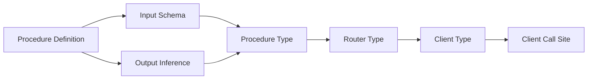

# Deep Dive: Type Inference System

## Overview

This deep dive examines how tRPC achieves full end-to-end type safety without schema files or code generation. Types flow from server procedures to client calls entirely through TypeScript's type system, using procedural type generation, conditional types, and template literal types.

## The Type Inference Problem

Traditional RPC approaches:

```typescript
// REST with OpenAPI - types can drift
// server.ts
app.get('/users/:id', (req, res) => {
  res.json({ id: req.params.id, name: 'Alice' })
})

// client.ts - types must be manually maintained or generated
interface User {
  id: string
  name: string
}
// What if server changes but types aren't regenerated?

// GraphQL - schema is source of truth, but separate from implementation
// schema.graphql
type User {
  id: ID!
  name: String!
}

// resolver.ts - implementation can diverge from schema
```

tRPC approach:

```typescript
// Server defines the type ONCE
const appRouter = t.router({
  user: publicProcedure
    .input(z.object({ id: z.string() }))
    .query(({ input }) => ({ id: input.id, name: 'Alice' }))
})

// Client infers automatically - no generation step
const user = await client.user.query({ id: '123' })
// user: { id: string; name: string }
// If server changes, client types update on next build
```

## Type Inference Pipeline



### Step 1: Procedure Type Inference

```typescript
// @trpc/server/src/core/procedure.ts

// The base procedure builder
export interface ProcedureBuilder<TDef extends ProcedureDefinition> {
  _def: TDef
  
  // Input validation adds input type
  input<$Input>(
    input: Parser<TDef['_input_in'], $Input>
  ): ProcedureBuilder<{
    _input_in: $Input
    _input_out: $Input
    _output_out: TDef['_output_out']
    _meta: TDef['_meta']
  }>
  
  // Output transformation
  output<$OutputOut>(
    output: Parser<TDef['_output_out'], $OutputOut>
  ): ProcedureBuilder<{
    _input_in: TDef['_input_in']
    _input_out: TDef['_input_out']
    _output_out: $OutputOut
    _meta: TDef['_meta']
  }>
  
  // Middleware can modify context
  use<$MiddlewareArgs>(
    fn: MiddlewareFunction<TDef, $MiddlewareArgs>
  ): ProcedureBuilder<{
    _input_in: TDef['_input_in']
    _input_out: TDef['_input_out']
    _output_out: TDef['_output_out']
    _meta: TDef['_meta']
  }>
  
  // Query returns the output type
  query(
    fn: QueryResolver<TDef['_input_out'], TDef['_output_out']>
  ): QueryProcedure<TDef>
  
  // Mutation returns the output type
  mutation(
    fn: MutationResolver<TDef['_input_out'], TDef['_output_out']>
  ): MutationProcedure<TDef>
}

// Type inference happens in the resolver
type QueryResolver<TInput, TOutput> = (opts: {
  input: TInput
  ctx: Context
}) => TOutput | Promise<TOutput>

// When you write:
const userProc = publicProcedure
  .input(z.object({ id: z.string() }))
  .query(({ input }) => ({ id: input.id, name: 'Alice' }))

// TypeScript infers:
// 1. input: { id: string } (from Zod schema)
// 2. output: { id: string; name: string } (from return type)
```

### Step 2: Router Type Construction

```typescript
// @trpc/server/src/core/router.ts

export interface Router<TRecord extends ProcedureRecord = any> {
  _def: RouterDef<TRecord>
  createCaller(ctx: inferRouterContext<this>): inferRouterCaller<this>
}

// Router definition
export function router<TRecord extends ProcedureRecord>(
  procs: TRecord
): Router<TRecord> {
  return new Router(procs)
}

// Type inference from procedures to router
type inferRouterContext<TRouter extends Router<any>> = 
  TRouter extends Router<infer TRecord> 
    ? inferProcedureContext<TRecord>
    : never

type inferRouterCaller<TRouter extends Router<any>> = 
  TRouter extends Router<infer TRecord>
    ? inferProcedureCaller<TRecord>
    : never

// When you define:
const appRouter = t.router({
  user: t.router({
    get: userGetProcedure,
    list: userListProcedure,
  }),
  post: postRouter,
})

// TypeScript builds a nested type structure:
type AppRouter = {
  user: {
    get: QueryProcedure<{ input: { id: string }, output: User }>
    list: QueryProcedure<{ input: void, output: User[] }>
  }
  post: PostRouter
}
```

### Step 3: Client Type Inference

```typescript
// @trpc/client/src/createTRPCClient.ts

// The magic: transform router types into client call types
export type createTRPCClient<TRouter extends Router<any>> = {
  [TKey in keyof inferRouterRecord<TRouter>]: 
    inferRouterEntryClient<inferRouterRecord<TRouter>[TKey]>
}

// Recursively process nested routers
type inferRouterEntryClient<TEntry> = 
  TEntry extends Router<infer TRecord>
    ? createTRPCClient<Router<TRecord>>  // Nested router
    : TEntry extends QueryProcedure<infer TDef>
    ? {
        query(input: TDef['_input_in']): Promise<TDef['_output_out']>
      }
    : TEntry extends MutationProcedure<infer TDef>
    ? {
        mutate(input: TDef['_input_in']): Promise<TDef['_output_out']>
      }
    : never

// The client object has fully typed methods
const client = createTRPCClient<AppRouter>({...})

// client.user.get.query({ id: '123' })
// TypeScript knows:
// - input must be { id: string }
// - output is Promise<User>

// This is NOT code generation - it's procedural type generation
// The types exist only in TypeScript's type system
```

## Conditional Types in tRPC

tRPC heavily uses conditional types to transform router definitions into client APIs:

```typescript
// Extract input type from procedure
type inferProcedureInput<TProc extends Procedure<any>> = 
  TProc extends Procedure<infer TDef>
    ? TDef['_input_in']
    : never

// Extract output type from procedure  
type inferProcedureOutput<TProc extends Procedure<any>> =
  TProc extends Procedure<infer TDef>
    ? TDef['_output_out']
    : never

// Check if procedure is a query
type isQuery<TProc> = 
  TProc extends QueryProcedure<any> ? true : false

// Check if procedure is a mutation
type isMutation<TProc> =
  TProc extends MutationProcedure<any> ? true : false

// Conditional client API
type ProcedureClient<TProc extends Procedure<any>> = {
  query: isQuery<TProc> extends true
    ? (input: inferProcedureInput<TProc>) => Promise<inferProcedureOutput<TProc>>
    : never
  mutate: isMutation<TProc> extends true
    ? (input: inferProcedureInput<TProc>) => Promise<inferProcedureOutput<TProc>>
    : never
}[isQuery<TProc> extends true ? 'query' : isMutation<TProc> extends true ? 'mutate' : never]

// Result: queries only have .query(), mutations only have .mutate()
```

## Template Literal Types

tRPC uses template literal types for type-safe path construction:

```typescript
// Build type-safe procedure paths
type inferRouterPaths<TRouter extends Router<any>, TPrefix extends string = ''> = {
  [TKey in keyof inferRouterRecord<TRouter>]: 
    TKey extends string
      ? inferRouterRecord<TRouter>[TKey] extends Router<any>
        ? inferRouterPaths<inferRouterRecord<TRouter>[TKey], `${TPrefix}${TKey}.`>
        : `${TPrefix}${TKey}`
      : never
}[keyof inferRouterRecord<TRouter>]

// For router { user: { get: proc, list: proc }, post: { list: proc } }
// Results in: 'user.get' | 'user.list' | 'post.list'

// Used in batch link for type-safe batching
type BatchPaths = inferRouterPaths<AppRouter>
// 'user.get' | 'user.list' | 'post.create' ...
```

## Zod Integration

tRPC integrates with Zod for runtime validation that produces static types:

```typescript
// @trpc/server/src/core/zod.ts

// Extract TypeScript type from Zod schema
type infer<T extends z.ZodType<any>> = z.infer<T>

// Procedure input uses Zod for runtime + static types
const procedure = publicProcedure
  .input(z.object({
    id: z.string().uuid(),
    email: z.string().email().optional(),
    role: z.enum(['admin', 'user']).default('user'),
  }))
  .query(({ input }) => {
    // input is typed as:
    // { id: string, email?: string, role: 'admin' | 'user' }
    // Runtime validation ensures UUID format, email format
  })

// Custom transforms
const dateSchema = z.string().transform(s => new Date(s))

const procedure = publicProcedure
  .input(z.object({
    startDate: dateSchema,
  }))
  .query(({ input }) => {
    // input.startDate is a Date object at runtime
    // TypeScript knows it's a Date
  })
```

## Type-Safe Error Handling

```typescript
// @trpc/server/src/error/TRPCError.ts

export type TRPC_ERROR_CODE_KEY = 
  | 'BAD_REQUEST'
  | 'UNAUTHORIZED'
  | 'FORBIDDEN'
  | 'NOT_FOUND'
  | 'INTERNAL_SERVER_ERROR'
  | ...

export type TRPC_ERROR_CODE_NUMBER = 400 | 401 | 403 | 404 | 500 | ...

// Error shape is typed
export interface TRPCErrorShape<
  TCode extends TRPC_ERROR_CODE_KEY | TRPC_ERROR_CODE_NUMBER = TRPC_ERROR_CODE_KEY
> {
  code: TCode
  message: string
  data: {
    code: TCode
    httpStatus: number
    path?: string
  }
}

// Client-side error typing
try {
  await client.user.query({ id: 'invalid' })
} catch (err) {
  if (err instanceof TRPCClientError) {
    // err.shape.code is typed
    if (err.shape.code === 'BAD_REQUEST') {
      // Handle validation error
    }
  }
}
```

## Type Inference Without Generics

tRPC avoids requiring explicit generics at call sites:

```typescript
// Bad DX (requires generics):
const user = client.query<User, { id: string }>('user', { id: '1' })

// tRPC DX (no generics needed):
const user = await client.user.query({ id: '1' })
// Types inferred from procedure definition

// How? The router type flows through the client type:
type Client = {
  user: {
    query: (input: { id: string }) => Promise<User>
  }
}

// TypeScript infers input and output from the client type
// No need to specify them explicitly
```

## Advanced: Inferring Router Types

```typescript
// Export router type for client use
export type AppRouter = typeof appRouter

// Client imports only the TYPE, not implementation
import type { AppRouter } from './server/router'

const client = createTRPCClient<AppRouter>({...})

// Type-only import means:
// - Zero bundle size impact on client
// - Types are compiled away
// - Client only knows the shape, not implementation

// Infer specific procedure types
type GetUserInput = inferProcedureInput<AppRouter['user']['get']>
type GetUserOutput = inferProcedureOutput<AppRouter['user']['get']>

// Use in shared types
type User = Awaited<ReturnType<typeof client.user.query>>
```

## Limitations and Edge Cases

```typescript
// 1. Circular references need explicit typing
type User = {
  friends: User[]  // Works
}

// 2. Union inputs require care
const proc = publicProcedure
  .input(z.union([
    z.object({ id: z.string() }),
    z.object({ email: z.string() }),
  ]))
  .query(({ input }) => {
    // input is { id: string } | { email: string }
    // Need to narrow in handler
    if ('id' in input) { ... }
  })

// 3. Optional input
const proc = publicProcedure
  .input(z.object({ filter: z.string() }).optional())
  .query(({ input }) => {
    // input is { filter: string } | undefined
  })

// 4. No input
const proc = publicProcedure
  .query(() => 'hello')
  // input is void
```

## Performance Considerations

```typescript
// Complex type inference can slow down TypeScript
// tRPC optimizes by:

// 1. Using inferred types rather than computed types where possible
const router = t.router({...})  // Inferred
type AppRouter = typeof router  // Fast

// 2. Avoiding deep conditional type chains
// Instead of:
type Complex<T> = T extends X ? A : T extends Y ? B : ...

// Use simpler compositions
type Input<T> = T extends Procedure<infer D> ? D['_input_in'] : never

// 3. Caching router types
export type AppRouter = typeof appRouter  // Compute once, reuse
```

## Conclusion

tRPC's type inference system demonstrates:

1. **Procedural Type Generation**: Types built from runtime definitions, not generated files
2. **Conditional Types**: Transform procedure definitions into client APIs
3. **Template Literal Types**: Type-safe path construction for nested routers
4. **Zod Integration**: Runtime validation produces static types
5. **Type Flow**: Server → Router → Client, all inferred automatically
6. **Zero Runtime Cost**: Types are compile-time only, no generation step

This enables a developer experience where changing a server procedure immediately updates all client call sites with full type safety and autocompletion.
