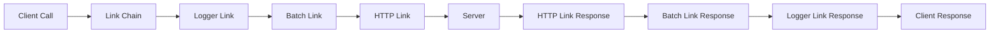

# Deep Dive: Links Architecture

## Overview

This deep dive examines tRPC's links system - client-side middleware that processes requests before they reach the server. Links handle batching, caching, logging, error handling, and transport selection (HTTP, WebSocket).

## Links Architecture



## Link Interface

```typescript
// @trpc/client/src/links/types.ts

export interface TRPCRequest {
  method: 'query' | 'mutation'
  path: string
  input: unknown
}

export interface TRPCResponse {
  id: number | null
  result: {
    data: unknown
    type: 'data'
  }
}

export interface TRPCResultMessage<T> {
  id: number
  result: {
    type: 'data'
    data: T
  }
}

// The core link interface
export interface TRPCLink<TRouter extends Router<any>> {
  (opts: {
    op: Operation
    next: (op: Operation) => Observable<TRPCResultMessage<unknown>>
  }): Observable<TRPCResultMessage<unknown>>
}

// Operation represents a client request
interface Operation {
  id: number
  type: 'query' | 'mutation' | 'subscription'
  path: string
  input: unknown
  context: Record<string, unknown>
}

// Observable for streaming responses
interface Observable<T> {
  subscribe(observer: {
    next?: (value: T) => void
    error?: (err: Error) => void
    complete?: () => void
  }): Subscription
}
```

## HTTP Batch Link

```typescript
// @trpc/client/src/links/httpBatchLink.ts

interface HttpBatchLinkOptions {
  url: string
  maxURLLength?: number
  maxBatchSize?: number
  batchWaitMs?: number
  headers?: HeadersInit | (() => HeadersInit)
  fetch?: typeof fetch
}

export function httpBatchLink<TRouter extends Router<any>>(
  opts: HttpBatchLinkOptions
): TRPCLink<TRouter> {
  const maxURLLength = opts.maxURLLength ?? 2083  // Browser limit
  const maxBatchSize = opts.maxBatchSize ?? 100
  const batchWaitMs = opts.batchWaitMs ?? 0
  
  // Queue for batching
  const batchQueue: Operation[] = []
  let batchTimeout: ReturnType<typeof setTimeout> | null = null
  
  const executeBatch = async () => {
    if (batchQueue.length === 0) return
    
    const operations = [...batchQueue]
    batchQueue.length = 0
    
    // Build batch request
    const inputs = operations.map(op => op.input)
    const paths = operations.map(op => op.path)
    
    // Send as POST with batched inputs
    const response = await fetch(opts.url, {
      method: 'POST',
      headers: {
        'Content-Type': 'application/json',
        ...(typeof opts.headers === 'function' ? opts.headers() : opts.headers),
      },
      body: JSON.stringify({
        batch: operations.map((op, i) => ({
          id: op.id,
          method: op.type,
          path: op.path,
          input: op.input,
        })),
      }),
    })
    
    const results = await response.json()
    
    // Distribute results back to operations
    results.forEach((result: TRPCResponse, i: number) => {
      operations[i].observer.next(result)
      operations[i].observer.complete()
    })
  }
  
  const scheduleBatch = (operation: Operation) => {
    batchQueue.push(operation)
    
    // Execute immediately if batch is full
    if (batchQueue.length >= maxBatchSize) {
      executeBatch()
      return
    }
    
    // Schedule batch execution
    if (batchTimeout) {
      clearTimeout(batchTimeout)
    }
    
    if (batchWaitMs > 0) {
      batchTimeout = setTimeout(executeBatch, batchWaitMs)
    } else {
      // Microtask for immediate batching
      Promise.resolve().then(executeBatch)
    }
  }
  
  return ({ op, next }) => {
    return new Observable(observer => {
      // Add observer to operation
      const operation = {
        ...op,
        observer,
      }
      
      scheduleBatch(operation)
      
      return () => {
        // Cleanup
        if (batchTimeout) {
          clearTimeout(batchTimeout)
        }
      }
    })
  }
}

// Usage
const client = createTRPCClient<AppRouter>({
  links: [
    httpBatchLink({
      url: 'http://localhost:3000/trpc',
      maxBatchSize: 10,
      batchWaitMs: 10,  // Wait up to 10ms to batch requests
    }),
  ],
})

// Multiple calls get batched
const [user, posts, comments] = await Promise.all([
  client.user.query({ id: '1' }),
  client.posts.query({ userId: '1' }),
  client.comments.query({ userId: '1' }),
])
// All three calls sent in single HTTP request
```

## HTTP Link (Single Request)

```typescript
// @trpc/client/src/links/httpLink.ts

interface HttpLinkOptions {
  url: string
  headers?: HeadersInit | (() => HeadersInit)
  fetch?: typeof fetch
}

export function httpLink<TRouter extends Router<any>>(
  opts: HttpLinkOptions
): TRPCLink<TRouter> {
  return ({ op }) => {
    return new Observable(observer => {
      const execute = async () => {
        try {
          // Build URL
          const path = `${opts.url}/${op.path}`
          
          // For queries, use GET with input in query string
          if (op.type === 'query') {
            const query = new URLSearchParams({
              input: JSON.stringify(op.input),
            })
            const url = `${path}?${query}`
            
            const response = await fetch(url, {
              method: 'GET',
              headers: typeof opts.headers === 'function' 
                ? opts.headers() 
                : opts.headers,
            })
            
            const result = await response.json()
            observer.next(result)
            observer.complete()
          } 
          // For mutations, use POST
          else if (op.type === 'mutation') {
            const response = await fetch(path, {
              method: 'POST',
              headers: {
                'Content-Type': 'application/json',
                ...(typeof opts.headers === 'function' 
                  ? opts.headers() 
                  : opts.headers),
              },
              body: JSON.stringify({
                input: op.input,
              }),
            })
            
            const result = await response.json()
            observer.next(result)
            observer.complete()
          }
        } catch (error) {
          observer.error(error as Error)
        }
      }
      
      execute()
    })
  }
}
```

## WebSocket Link

```typescript
// @trpc/client/src/links/wsLink.ts

interface WsLinkOptions {
  url: string
  WebSocket?: typeof WebSocket
  retryDelayMs?: (attempt: number) => number
}

export function wsLink<TRouter extends Router<any>>(
  opts: WsLinkOptions
): TRPCLink<TRouter> {
  let ws: WebSocket | null = null
  let connectionState: 'connecting' | 'open' | 'closed' = 'closed'
  const pendingOperations = new Map<number, Operation>()
  
  const connect = () => {
    if (connectionState === 'open') return
    
    connectionState = 'connecting'
    ws = new opts.WebSocket(opts.url)
    
    ws.onopen = () => {
      connectionState = 'open'
      
      // Resend pending operations
      pendingOperations.forEach(op => {
        send(op)
      })
    }
    
    ws.onclose = () => {
      connectionState = 'closed'
      ws = null
    }
    
    ws.onmessage = (event) => {
      const message = JSON.parse(event.data) as TRPCResultMessage<unknown>
      
      const op = pendingOperations.get(message.id)
      if (op) {
        op.observer.next(message.result)
        
        if (message.result.type === 'stopped') {
          op.observer.complete()
          pendingOperations.delete(message.id)
        }
      }
    }
    
    ws.onerror = () => {
      pendingOperations.forEach(op => {
        op.observer.error(new Error('WebSocket error'))
      })
      pendingOperations.clear()
    }
  }
  
  const send = (operation: Operation) => {
    if (!ws || ws.readyState !== WebSocket.OPEN) {
      connect()
    }
    
    const message = {
      id: operation.id,
      type: operation.type,
      path: operation.path,
      input: operation.input,
    }
    
    ws?.send(JSON.stringify(message))
  }
  
  return ({ op }) => {
    return new Observable(observer => {
      const operation = {
        ...op,
        observer,
      }
      
      pendingOperations.set(op.id, operation)
      send(operation)
      
      return () => {
        // Send stop message for subscriptions
        if (op.type === 'subscription') {
          ws?.send(JSON.stringify({
            id: op.id,
            type: 'stop',
          }))
        }
        
        pendingOperations.delete(op.id)
      }
    })
  }
}

// Usage with subscriptions
const client = createTRPCClient<AppRouter>({
  links: [
    wsLink({
      url: 'ws://localhost:3000/trpc',
    }),
  ],
})

// Real-time subscription
const subscription = client.messages.subscribe({ channel: 'general' }, {
  onData: (message) => {
    console.log('New message:', message)
  },
})
```

## Logger Link

```typescript
// @trpc/client/src/links/loggerLink.ts

interface LoggerLinkOptions {
  enabled?: () => boolean
  logger?: (log: LogEntry) => void
}

interface LogEntry {
  direction: 'up' | 'down'
  result?: TRPCResultMessage<unknown>
  operation: Operation
}

export function loggerLink<TRouter extends Router<any>>(
  opts: LoggerLinkOptions = {}
): TRPCLink<TRouter> {
  const enabled = opts.enabled ?? (() => true)
  const logger = opts.logger ?? console.log
  
  return ({ op, next }) => {
    if (!enabled()) {
      return next(op)
    }
    
    // Log request
    logger({
      direction: 'up',
      operation: op,
    })
    
    const start = Date.now()
    
    return new Observable(observer => {
      const subscription = next(op).subscribe({
        next: (result) => {
          const duration = Date.now() - start
          
          logger({
            direction: 'down',
            result,
            operation: op,
            duration,
          })
          
          observer.next(result)
        },
        error: (error) => {
          const duration = Date.now() - start
          
          logger({
            direction: 'down',
            error,
            operation: op,
            duration,
          })
          
          observer.error(error)
        },
        complete: () => {
          observer.complete()
        },
      })
      
      return () => {
        subscription.unsubscribe()
      }
    })
  }
}

// Usage
const client = createTRPCClient<AppRouter>({
  links: [
    loggerLink({
      enabled: () => process.env.NODE_ENV === 'development',
      logger: (log) => {
        if (log.direction === 'up') {
          console.log(
            `→ ${log.operation.type.toUpperCase()} ${log.operation.path}`,
            log.operation.input
          )
        } else if (log.direction === 'down') {
          console.log(
            `← ${log.operation.type.toUpperCase()} ${log.operation.path}`,
            log.duration + 'ms',
            log.result
          )
        }
      },
    }),
  ],
})
```

## Custom Links

```typescript
// Auth link - adds token to requests
function authLink(getToken: () => string | null): TRPCLink<any> {
  return ({ op, next }) => {
    const token = getToken()
    
    return next({
      ...op,
      context: {
        ...op.context,
        headers: {
          ...(op.context.headers as Record<string, string>),
          Authorization: token ? `Bearer ${token}` : undefined,
        },
      },
    })
  }
}

// Cache link - implements client-side caching
function cacheLink(cache: Map<string, any>): TRPCLink<any> {
  return ({ op, next }) => {
    const cacheKey = `${op.type}:${op.path}:${JSON.stringify(op.input)}`
    
    // Check cache for queries
    if (op.type === 'query') {
      const cached = cache.get(cacheKey)
      if (cached) {
        return new Observable(observer => {
          observer.next(cached)
          observer.complete()
        })
      }
    }
    
    return new Observable(observer => {
      const subscription = next(op).subscribe({
        next: (result) => {
          // Cache successful query responses
          if (op.type === 'query' && result.result.type === 'data') {
            cache.set(cacheKey, result)
          }
          observer.next(result)
        },
        error: observer.error.bind(observer),
        complete: observer.complete.bind(observer),
      })
      
      return () => subscription.unsubscribe()
    })
  }
}

// Retry link - implements retry logic
function retryLink(maxRetries: number): TRPCLink<any> {
  return ({ op, next }) => {
    let retries = 0
    
    const attempt = () => {
      return new Observable(observer => {
        const subscription = next(op).subscribe({
          next: observer.next.bind(observer),
          error: (error) => {
            if (retries < maxRetries) {
              retries++
              setTimeout(() => {
                attempt().subscribe(observer)
              }, 1000 * retries)  // Exponential backoff
            } else {
              observer.error(error)
            }
          },
          complete: observer.complete.bind(observer),
        })
        
        return () => subscription.unsubscribe()
      })
    }
    
    return attempt()
  }
}

// Error handling link
function errorLink(errorHandler: (error: Error, op: Operation) => void): TRPCLink<any> {
  return ({ op, next }) => {
    return new Observable(observer => {
      const subscription = next(op).subscribe({
        next: observer.next.bind(observer),
        error: (error) => {
          errorHandler(error, op)
          observer.error(error)
        },
        complete: observer.complete.bind(observer),
      })
      
      return () => subscription.unsubscribe()
    })
  }
}
```

## Link Composition

```typescript
// Links are composed in order
const client = createTRPCClient<AppRouter>({
  links: [
    // 1. Logger (first to see requests, last to see responses)
    loggerLink(),
    
    // 2. Error handling
    errorLink((err, op) => {
      console.error(`Error on ${op.path}:`, err.message)
    }),
    
    // 3. Auth
    authLink(() => localStorage.getItem('token')),
    
    // 4. Retry
    retryLink(3),
    
    // 5. Cache
    cacheLink(new Map()),
    
    // 6. Batch HTTP (last = closest to network)
    httpBatchLink({
      url: 'http://localhost:3000/trpc',
    }),
  ],
})

// Request flow:
// Client → Logger → Error → Auth → Retry → Cache → Batch → Server
// Server → Batch → Cache → Retry → Auth → Error → Logger → Client
```

## Split Link (Conditional Routing)

```typescript
// @trpc/client/src/links/splitLink.ts

interface SplitLinkOptions {
  condition: (op: Operation) => boolean
  trueLink: TRPCLink<any>
  falseLink: TRPCLink<any>
}

export function splitLink<TRouter extends Router<any>>(
  opts: SplitLinkOptions
): TRPCLink<TRouter> {
  return ({ op, next }) => {
    const link = opts.condition(op) ? opts.trueLink : opts.falseLink
    return link({ op, next })
  }
}

// Usage: Route subscriptions to WebSocket, everything else to HTTP
const client = createTRPCClient<AppRouter>({
  links: [
    splitLink({
      condition: (op) => op.type === 'subscription',
      trueLink: wsLink({ url: 'ws://localhost:3000/trpc' }),
      falseLink: httpBatchLink({ url: 'http://localhost:3000/trpc' }),
    }),
  ],
})
```

## Server-Side Link Handling

```typescript
// @trpc/server/src/adapters/node-http/index.ts

// Server receives batched requests
app.post('/trpc', async (req, res) => {
  const { batch } = req.body
  
  if (Array.isArray(batch)) {
    // Process batch
    const results = await Promise.all(
      batch.map(async (operation) => {
        const result = await handleOperation(operation, router, ctx)
        return {
          id: operation.id,
          result,
        }
      })
    )
    
    res.json(results)
  } else {
    // Single request
    const result = await handleOperation(req.body, router, ctx)
    res.json(result)
  }
})

// Handle individual operation
async function handleOperation(
  operation: { type: string, path: string, input: unknown },
  router: Router,
  ctx: Context
) {
  const procedure = getProcedure(router, operation.path)
  
  const result = await procedure({
    input: operation.input,
    ctx,
  })
  
  return {
    type: 'data',
    data: result,
  }
}
```

## Conclusion

tRPC's links architecture provides:

1. **Composable Middleware**: Chain links for cross-cutting concerns
2. **Batching**: Combine multiple requests into single HTTP call
3. **Transport Abstraction**: HTTP, WebSocket, or custom transports
4. **Client-Side Caching**: Implement caching at the link level
5. **Error Handling**: Centralized error handling in links
6. **Retry Logic**: Implement retry strategies
7. **Conditional Routing**: Split link for different transports based on operation type

The link system enables flexible client-side request processing while maintaining type safety throughout the chain.
