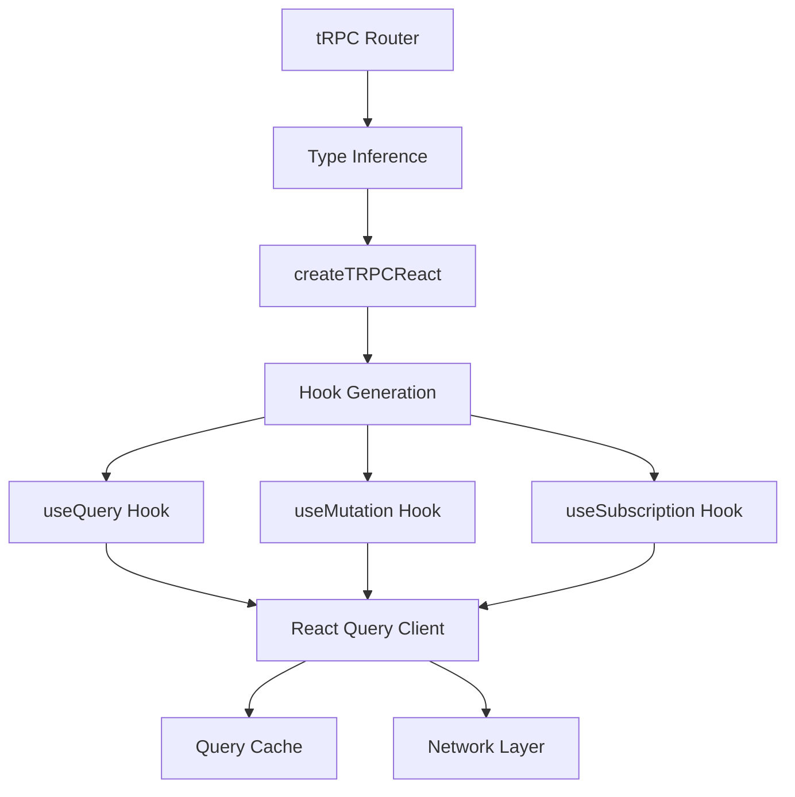

# Deep Dive: React Query Integration

## Overview

This deep dive examines how tRPC integrates with React Query (TanStack Query) to provide automatic caching, background refetching, query invalidation, and optimistic updates. The integration creates type-safe React hooks from server procedures.

## Architecture



## createTRPCReact

```typescript
// @trpc/react-query/src/createTRPCReact.tsx

export function createTRPCReact<TRouter extends Router<any>>(
  options?: CreateTRPCReactOptions
): CreateTRPCReactReturn<TRouter> {
  // Create context for client and query client
  const TRPCContext = React.createContext<{
    client: TRPCClient<TRouter>
    queryClient: QueryClient
  } | null>(null)
  
  // Generate hooks for each procedure
  function createHooks() {
    return {
      // Query hook generator
      useQuery: (path: string, input: unknown, options?: UseTRPCQueryOptions) => {
        const queryKey = getQueryKey(path, input)
        
        return useQuery({
          queryKey,
          queryFn: () => client.query(path, input),
          ...options,
        })
      },
      
      // Mutation hook generator
      useMutation: (path: string, options?: UseTRPCMutationOptions) => {
        return useMutation({
          mutationFn: (input: unknown) => client.mutate(path, input),
          ...options,
        })
      },
      
      // Subscription hook generator
      useSubscription: (path: string, input: unknown, options?: UseTRPCSubscriptionOptions) => {
        useSubscription({
          path,
          input,
          ...options,
        })
      },
    }
  }
  
  // Provider component
  function Provider({ children, client, queryClient }: ProviderProps) {
    return (
      <TRPCContext.Provider value={{ client, queryClient }}>
        <QueryClientProvider client={queryClient}>
          {children}
        </QueryClientProvider>
      </TRPCContext.Provider>
    )
  }
  
  return {
    Provider,
    useContext: () => {
      const context = React.useContext(TRPCContext)
      if (!context) {
        throw new Error('useContext must be used within TRPCProvider')
      }
      return context
    },
    ...createHooks(),
  }
}
```

## Hook Generation

```typescript
// @trpc/react-query/src/generateHook.ts

// Generate type-safe hooks from router types
type GenerateQueryHook<TProcedure extends QueryProcedure<any>> = 
  (input: inferProcedureInput<TProcedure>, options?: UseTRPCQueryOptions) => 
    UseTRPCQueryReturn<inferProcedureOutput<TProcedure>>

type GenerateMutationHook<TProcedure extends MutationProcedure<any>> = 
  (options?: UseTRPCMutationOptions) => 
    UseTRPCMutationReturn<inferProcedureInput<TProcedure>, inferProcedureOutput<TProcedure>>

// Recursive hook generation for nested routers
type GenerateHooksForRouter<TRouter extends Router<any>> = {
  [TKey in keyof inferRouterRecord<TRouter>]: 
    inferRouterRecord<TRouter>[TKey] extends Router<any>
      ? GenerateHooksForRouter<inferRouterRecord<TRouter>[TKey]>
      : inferRouterRecord<TRouter>[TKey] extends QueryProcedure<any>
      ? GenerateQueryHook<inferRouterRecord<TRouter>[TKey]>
      : inferRouterRecord<TRouter>[TKey] extends MutationProcedure<any>
      ? GenerateMutationHook<inferRouterRecord<TRouter>[TKey]>
      : never
}

// The result: nested hooks matching router structure
type AppHooks = {
  user: {
    get: (input: { id: string }, options?: UseTRPCQueryOptions) => UseTRPCQueryReturn<User>
    list: (input: void, options?: UseTRPCQueryOptions) => UseTRPCQueryReturn<User[]>
  }
  post: {
    create: (options?: UseTRPCMutationOptions) => UseTRPCMutationReturn<{ title: string }, Post>
  }
}
```

## Provider Setup

```typescript
// client/trpc/react.tsx

import { QueryClient, QueryClientProvider } from '@tanstack/react-query'
import { createTRPCReact } from '@trpc/react-query'
import { httpBatchLink } from '@trpc/client'
import type { AppRouter } from '../../server/trpc/router'

// Create the typed hook
export const trpc = createTRPCReact<AppRouter>()

const queryClient = new QueryClient({
  defaultOptions: {
    queries: {
      staleTime: 5 * 1000,  // 5 seconds
      retry: 1,
    },
  },
})

export function TRPCProvider({ children }: { children: React.ReactNode }) {
  const [client] = useState(() =>
    trpc.createClient({
      links: [
        loggerLink({
          enabled: () => process.env.NODE_ENV === 'development',
        }),
        httpBatchLink({
          url: 'http://localhost:3000/trpc',
          headers: () => {
            const token = localStorage.getItem('token')
            return {
              Authorization: token ? `Bearer ${token}` : undefined,
            }
          },
        }),
      ],
    })
  )
  
  return (
    <trpc.Provider client={client} queryClient={queryClient}>
      <QueryClientProvider client={queryClient}>
        {children}
      </QueryClientProvider>
    </trpc.Provider>
  )
}
```

## Using Query Hooks

```typescript
// Basic query hook
function UserProfile({ userId }: { userId: string }) {
  const { data, isLoading, error, refetch } = trpc.user.get.query({ id: userId })
  
  if (isLoading) return <div>Loading...</div>
  if (error) return <div>Error: {error.message}</div>
  if (!data) return null
  
  return (
    <div>
      <h1>{data.name}</h1>
      <p>{data.email}</p>
      <button onClick={() => refetch()}>Refresh</button>
    </div>
  )
}

// Query with options
function PostsList({ userId }: { userId: string }) {
  const { data, isLoading } = trpc.posts.list.query(
    { userId, limit: 10 },
    {
      staleTime: 10 * 1000,  // 10 seconds
      refetchOnWindowFocus: true,
      refetchInterval: 30 * 1000,  // Refetch every 30 seconds
      enabled: !!userId,  // Only run if userId is truthy
      select: (data) => ({
        // Transform data
        posts: data.posts.slice(0, 5),
        total: data.total,
      }),
    }
  )
  
  return <div>{/* Render posts */}</div>
}

// Paginated query
function PaginatedUsers() {
  const [page, setPage] = useState(0)
  
  const { data, fetchNextPage, hasNextPage, isFetchingNextPage } = 
    trpc.users.list.useInfiniteQuery(
      { limit: 10, cursor: page * 10 },
      {
        getNextPageParam: (lastPage) => lastPage.nextCursor,
        getPreviousPageParam: (firstPage) => firstPage.prevCursor,
      }
    )
  
  return (
    <div>
      {data?.pages.map((page, i) => (
        <div key={i}>
          {page.users.map(user => <UserCard key={user.id} user={user} />)}
        </div>
      ))}
      <button 
        onClick={() => fetchNextPage()} 
        disabled={!hasNextPage || isFetchingNextPage}
      >
        Load More
      </button>
    </div>
  )
}
```

## Using Mutation Hooks

```typescript
// Basic mutation
function CreateUser() {
  const utils = trpc.useContext()
  
  const createUser = trpc.user.create.useMutation({
    onSuccess: (data) => {
      console.log('User created:', data)
      // Invalidate user list to refetch
      utils.user.list.invalidate()
    },
    onError: (error) => {
      console.error('Failed to create user:', error.message)
    },
  })
  
  const handleSubmit = (e: React.FormEvent) => {
    e.preventDefault()
    const formData = new FormData(e.target as HTMLFormElement)
    
    createUser.mutate({
      name: formData.get('name') as string,
      email: formData.get('email') as string,
    })
  }
  
  return (
    <form onSubmit={handleSubmit}>
      <input name="name" placeholder="Name" />
      <input name="email" type="email" placeholder="Email" />
      <button type="submit" disabled={createUser.isLoading}>
        {createUser.isLoading ? 'Creating...' : 'Create'}
      </button>
    </form>
  )
}

// Mutation with optimistic updates
function EditableUser({ user }: { user: User }) {
  const utils = trpc.useContext()
  
  const updateUser = trpc.user.update.useMutation({
    // Optimistic update
    onMutate: async (newData) => {
      await utils.user.get.cancel({ id: user.id })
      
      // Get current data
      const currentUser = utils.user.get.getData({ id: user.id })
      
      // Set optimistic data
      utils.user.get.setData({ id: user.id }, {
        ...currentUser,
        ...newData,
      })
      
      return { currentUser }
    },
    
    // Rollback on error
    onError: (err, newData, context) => {
      if (context?.currentUser) {
        utils.user.get.setData({ id: user.id }, context.currentUser)
      }
    },
    
    // Refetch after success/error
    onSettled: () => {
      utils.user.get.invalidate({ id: user.id })
    },
  })
  
  return (
    <div>
      <input 
        defaultValue={user.name}
        onBlur={(e) => updateUser.mutate({ name: e.target.value })}
      />
    </div>
  )
}
```

## Query Invalidation

```typescript
// Manual invalidation
function RefreshButton() {
  const utils = trpc.useContext()
  
  const refreshAll = () => {
    // Invalidate everything
    utils.invalidate()
  }
  
  const refreshUsers = () => {
    // Invalidate specific procedure
    utils.user.invalidate()
  }
  
  const refreshUser = (userId: string) => {
    // Invalidate with specific input
    utils.user.get.invalidate({ id: userId })
  }
  
  return (
    <div>
      <button onClick={refreshAll}>Refresh All</button>
      <button onClick={refreshUsers}>Refresh Users</button>
      <button onClick={() => refreshUser('123')}>Refresh User 123</button>
    </div>
  )
}

// Automatic invalidation after mutation
function useInvalidateOnMutation<TPath extends string>(
  path: TPath,
  mutation: UseTRPCMutationReturn<any, any>
) {
  const utils = trpc.useContext()
  
  return trpc.useContext().client.mutation(path, {
    onSuccess: () => {
      // Invalidate related queries
      utils.invalidate({
        queryKey: [path],
      })
    },
  })
}

// Batch invalidation
function BulkActions() {
  const utils = trpc.useContext()
  
  const handleBulkUpdate = async () => {
    await Promise.all([
      api.users.update.mutate({ id: '1', name: 'Updated' }),
      api.users.update.mutate({ id: '2', name: 'Updated' }),
    ])
    
    // Invalidate all user queries at once
    utils.user.invalidate()
  }
  
  return <button onClick={handleBulkUpdate}>Update All</button>
}
```

## Prefetching

```typescript
// Prefetch on mount
function UserList() {
  const utils = trpc.useContext()
  
  // Prefetch when component mounts
  useEffect(() => {
    utils.user.list.prefetch()
  }, [])
  
  const { data, isLoading } = trpc.user.list.query()
  
  return <div>{/* Render */}</div>
}

// Prefetch on hover
function UserCard({ user }: { user: User }) {
  const utils = trpc.useContext()
  
  const handleMouseEnter = () => {
    utils.user.get.prefetch({ id: user.id })
  }
  
  return (
    <div onMouseEnter={handleMouseEnter}>
      <Link to={`/users/${user.id}`}>{user.name}</Link>
    </div>
  )
}

// Prefetch in loader (React Router)
export async function loader() {
  const queryClient = getQueryClient()
  
  await queryClient.prefetchQuery({
    queryKey: ['users', 'list'],
    queryFn: () => trpc.user.list.query(),
  })
  
  return null
}
```

## Server-Side Rendering

```typescript
// Next.js pages directory
export async function getServerSideProps() {
  const ssr = createSSRHelper<AppRouter>({
    trpc,
    ctx: {},
    info: {
      links: [
        httpBatchLink({ 
          url: `${BASE_URL}/trpc`,
          headers: { 'x-trpc-source': 'nextjs-request' },
        }),
      ],
    },
  })
  
  // Prefetch queries
  await ssr.user.list.prefetch()
  await ssr.posts.list.prefetch()
  
  return {
    props: {
      trpcState: ssr.dehydrate(),
    },
  }
}

// Next.js app directory
export default async function Page() {
  const trpc = getServerSideHelpers()
  
  const users = await trpc.user.list.query()
  
  return (
    <HydrateClient state={dehydrate(trpc.queryClient)}>
      <UserList initialData={users} />
    </HydrateClient>
  )
}

// Remix loader
export async function loader({ request }: LoaderArgs) {
  const trpc = await getTRPC({ request })
  
  const data = await trpc.user.list.query()
  
  return json({ data }, {
    headers: {
      'Cache-Control': 'max-age=60',
    },
  })
}

// Hydrate on client
function App() {
  const [queryClient] = useState(() => new QueryClient())
  const [trpcClient] = useState(() => createTRPCClient<AppRouter>({...}))
  
  return (
    <trpc.Provider client={trpcClient} queryClient={queryClient}>
      <QueryClientProvider client={queryClient}>
        <Outlet />
      </QueryClientProvider>
    </trpc.Provider>
  )
}
```

## Custom Hook Patterns

```typescript
// Custom hook for authenticated queries
function useAuthQuery<TPath extends string>(
  path: TPath,
  input: any,
  options?: UseTRPCQueryOptions
) {
  const { data: session } = useSession()
  
  return trpc.useQuery([path, input], {
    ...options,
    enabled: !!session && (options?.enabled ?? true),
  })
}

// Hook with automatic retry
function useRetryQuery<TPath extends string>(
  path: TPath,
  input: any,
  retries = 3
) {
  return trpc.useQuery([path, input], {
    retry: retries,
    retryDelay: (attemptIndex) => Math.min(1000 * 2 ** attemptIndex, 30000),
  })
}

// Hook with realtime subscription fallback
function useQueryWithRealtimeFallback<TPath extends string>(
  queryPath: TPath,
  queryInput: any,
  subscriptionPath: string,
  subscriptionInput: any
) {
  const query = trpc.useQuery([queryPath, queryInput], {
    staleTime: Infinity,  // Keep data fresh via subscription
  })
  
  const subscription = trpc.useSubscription(
    [subscriptionPath, subscriptionInput],
    {
      onData: (data) => {
        // Update query cache with realtime data
        queryClient.setQueryData([queryPath, queryInput], data)
      },
    }
  )
  
  return { ...query, subscription }
}
```

## Conclusion

tRPC's React Query integration provides:

1. **Type-Safe Hooks**: Hooks generated from router types
2. **Automatic Caching**: React Query cache with type-safe invalidation
3. **Optimistic Updates**: Update UI before server confirms
4. **Background Refetching**: Keep data fresh automatically
5. **SSR Support**: Prefetch on server, hydrate on client
6. **Pagination**: Built-in infinite query support
7. **Mutation Patterns**: onSuccess, onError, onSettled handlers
8. **Query Composition**: Combine multiple queries efficiently

The integration makes building reactive, type-safe React applications straightforward while leveraging React Query's powerful caching and synchronization features.
