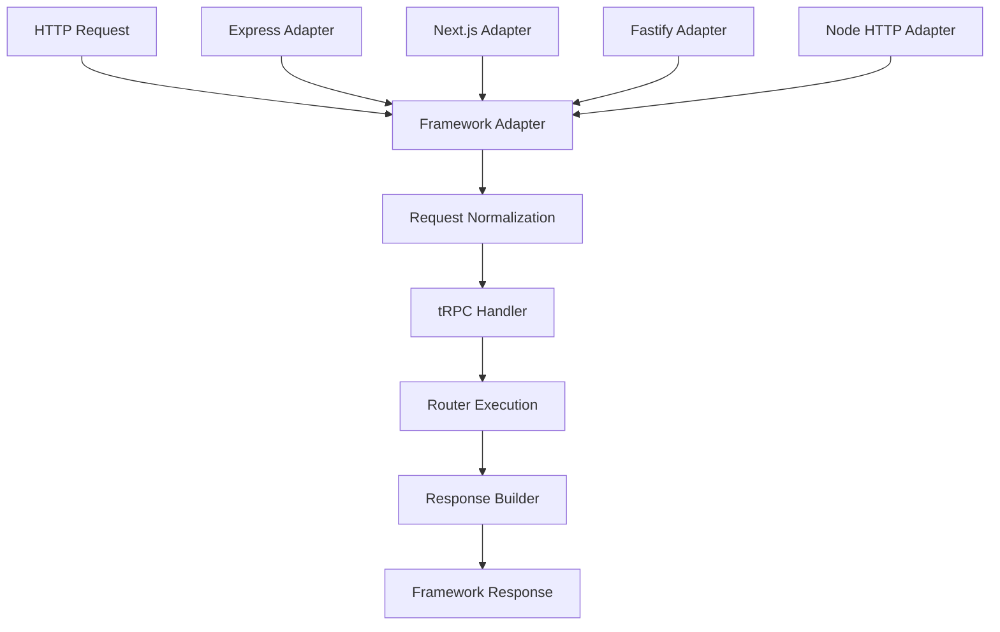

# Deep Dive: Server Adapters

## Overview

This deep dive examines tRPC's server adapter system - how tRPC integrates with different HTTP frameworks (Express, Next.js, Fastify) and standalone Node.js servers. Adapters translate framework-specific requests into tRPC operations and back.

## Adapter Architecture



## Common Adapter Interface

```typescript
// @trpc/server/src/adapters/types.ts

// Base handler options shared across adapters
interface BaseHandlerOptions<TRouter extends Router<any>, TContext> {
  router: TRouter
  createContext: (opts: AdapterOptions) => Promise<TContext> | TContext
  onError?: (opts: {
    error: TRPCError
    input: unknown
    ctx: TContext | undefined
    path: string
    type: 'query' | 'mutation' | 'subscription'
  }) => void
}

// Request normalization
interface NormalizedRequest {
  method: string
  path: string
  query: URLSearchParams
  body: unknown
  headers: Headers
}

// Response building
interface NormalizedResponse {
  status: number
  headers: Record<string, string>
  body: string
}

// All adapters implement this pattern
interface Adapter<TRouter extends Router<any>> {
  handler: (req: any, res: any) => Promise<void>
}
```

## Express Adapter

```typescript
// @trpc/server/src/adapters/express.ts

import * as express from 'express'
import type { Router as AnyRouter } from '../router'

interface ExpressOptions<TRouter extends AnyRouter> {
  router: TRouter
  createContext: (opts: { req: express.Request; res: express.Response }) => any
  onError?: (opts: any) => void
  maxBodySize?: number
}

export function createExpressMiddleware<TRouter extends AnyRouter>(
  opts: ExpressOptions<TRouter>
): express.Handler {
  return async (req, res) => {
    // Normalize Express request
    const path = req.path.slice(1)  // Remove leading slash
    const method = req.method
    
    // Parse input
    let input: unknown
    if (method === 'GET') {
      input = req.query.input ? JSON.parse(req.query.input as string) : undefined
    } else {
      input = req.body
    }
    
    // Create context
    const ctx = await opts.createContext({ req, res })
    
    // Build tRPC request
    const tRPCRequest = {
      method: method === 'GET' ? 'query' : 'mutation',
      path,
      input,
    }
    
    // Execute procedure
    try {
      const result = await callProcedure({
        procedure: tRPCRequest,
        router: opts.router,
        ctx,
      })
      
      // Send response
      res.json({
        result: {
          type: 'data',
          data: result,
        },
      })
    } catch (error) {
      opts.onError?.({ error, path, input, ctx })
      
      const statusCode = getStatusCode(error)
      res.status(statusCode).json({
        error: {
          code: error.code,
          message: error.message,
        },
      })
    }
  }
}

// Usage
import express from 'express'
import { createExpressMiddleware } from '@trpc/server/adapters/express'
import { appRouter } from './router'

const app = express()

app.use(express.json())  // Parse JSON bodies

app.use('/trpc', createExpressMiddleware({
  router: appRouter,
  createContext: ({ req, res }) => ({
    user: req.user,  // From auth middleware
    ip: req.ip,
  }),
  onError: ({ error, path }) => {
    console.error(`Error on ${path}:`, error.message)
  },
}))

app.listen(3000)
```

## Next.js Adapter (Pages Router)

```typescript
// @trpc/server/src/adapters/next.ts

import type { NextApiRequest, NextApiResponse } from 'next'
import type { Router as AnyRouter } from '../router'

interface NextOptions<TRouter extends AnyRouter> {
  router: TRouter
  createContext: (opts: { req: NextApiRequest; res: NextApiResponse }) => any
  onError?: (opts: any) => void
  keepAlive?: boolean
}

export function createNextApiHandler<TRouter extends AnyRouter>(
  opts: NextOptions<TRouter>
) {
  return async (req: NextApiRequest, res: NextApiResponse) => {
    // Normalize Next.js request
    const path = Array.isArray(req.query.trpc) 
      ? req.query.trpc.join('/') 
      : req.query.trpc as string
    
    const method = req.method
    
    // Parse input
    let input: unknown
    if (method === 'GET') {
      if (req.query.input) {
        input = typeof req.query.input === 'string' 
          ? JSON.parse(req.query.input) 
          : req.query.input
      }
    } else {
      input = req.body
    }
    
    // Create context
    const ctx = await opts.createContext({ req, res })
    
    // Handle request
    try {
      const result = await callProcedure({
        procedure: {
          method: method === 'GET' ? 'query' : 'mutation',
          path,
          input,
        },
        router: opts.router,
        ctx,
      })
      
      res.status(200).json({
        result: {
          type: 'data',
          data: result,
        },
      })
    } catch (error) {
      opts.onError?.({ error, path, input, ctx })
      
      const statusCode = getStatusCode(error)
      res.status(statusCode).json({
        error: {
          code: error.code,
          message: error.message,
        },
      })
    }
  }
}

// Usage: pages/api/trpc/[trpc].ts
import { createNextApiHandler } from '@trpc/server/adapters/next'
import { appRouter } from '../../../server/trpc/router'

export default createNextApiHandler({
  router: appRouter,
  createContext: ({ req, res }) => ({
    user: req.user,
  }),
})
```

## Next.js Adapter (App Router)

```typescript
// @trpc/server/src/adapters/next-app.ts

import { NextRequest, NextResponse } from 'next/server'
import type { Router as AnyRouter } from '../router'

interface NextAppOptions<TRouter extends AnyRouter> {
  router: TRouter
  createContext: (opts: { req: NextRequest }) => any | Promise<any>
  onError?: (opts: any) => void
}

export function createAppRouterHandler<TRouter extends AnyRouter>(
  opts: NextAppOptions<TRouter>
) {
  return async (req: NextRequest) => {
    // Parse path from URL
    const url = req.nextUrl.clone()
    const path = url.pathname.replace('/api/trpc/', '')
    
    const method = req.method
    let input: unknown
    
    // Parse body for POST/PUT
    if (method !== 'GET') {
      try {
        input = await req.json()
      } catch {
        input = undefined
      }
    } else {
      // Parse query string for GET
      const inputParam = url.searchParams.get('input')
      if (inputParam) {
        input = JSON.parse(inputParam)
      }
    }
    
    // Create context
    const ctx = await opts.createContext({ req })
    
    try {
      const result = await callProcedure({
        procedure: {
          method: method === 'GET' ? 'query' : 'mutation',
          path,
          input,
        },
        router: opts.router,
        ctx,
      })
      
      return NextResponse.json({
        result: {
          type: 'data',
          data: result,
        },
      })
    } catch (error) {
      opts.onError?.({ error, path, input, ctx })
      
      const statusCode = getStatusCode(error)
      return NextResponse.json(
        {
          error: {
            code: error.code,
            message: error.message,
          },
        },
        { status: statusCode }
      )
    }
  }
}

// Usage: app/api/trpc/[[...trpc]]/route.ts
import { NextRequest } from 'next/server'
import { createAppRouterHandler } from '@trpc/server/adapters/next-app'
import { appRouter } from '@/server/trpc/router'

const handler = createAppRouterHandler({
  router: appRouter,
  createContext: async (opts) => {
    // Access headers, cookies, etc.
    const token = opts.req.headers.get('authorization')
    return { token }
  },
})

export { handler as GET, handler as POST }
```

## Fastify Adapter

```typescript
// @trpc/server/src/adapters/fastify.ts

import { FastifyInstance, FastifyRequest, FastifyReply } from 'fastify'
import type { Router as AnyRouter } from '../router'

interface FastifyOptions<TRouter extends AnyRouter> {
  router: TRouter
  createContext: (opts: { req: FastifyRequest; reply: FastifyReply }) => any | Promise<any>
  onError?: (opts: any) => void
}

export function fastifyTRPCPlugin<TRouter extends AnyRouter>(
  fastify: FastifyInstance,
  opts: FastifyOptions<TRouter>,
  done: (err?: Error) => void
) {
  fastify.all('/trpc/*', async (req, reply) => {
    // Extract path from URL
    const path = req.url.slice('/trpc/'.length)
    const method = req.method
    
    // Parse input
    let input: unknown
    if (method === 'GET') {
      const query = req.query as any
      input = query.input ? JSON.parse(query.input) : undefined
    } else {
      input = req.body
    }
    
    // Create context
    const ctx = await opts.createContext({ req, reply })
    
    try {
      const result = await callProcedure({
        procedure: {
          method: method === 'GET' ? 'query' : 'mutation',
          path,
          input,
        },
        router: opts.router,
        ctx,
      })
      
      return reply.send({
        result: {
          type: 'data',
          data: result,
        },
      })
    } catch (error) {
      opts.onError?.({ error, path, input, ctx })
      
      const statusCode = getStatusCode(error)
      return reply.status(statusCode).send({
        error: {
          code: error.code,
          message: error.message,
        },
      })
    }
  })
  
  done()
}

// Usage
import Fastify from 'fastify'
import { fastifyTRPCPlugin } from '@trpc/server/adapters/fastify'
import { appRouter } from './router'

const server = Fastify()

server.register(fastifyTRPCPlugin, {
  prefix: '/trpc',
  trpcOptions: {
    router: appRouter,
    createContext: ({ req, reply }) => ({
      user: (req as any).user,
    }),
  },
})

server.listen({ port: 3000 })
```

## Node.js HTTP Adapter (Standalone)

```typescript
// @trpc/server/src/adapters/node-http/index.ts

import * as http from 'http'
import { parse as parseQueryString } from 'querystring'
import type { Router as AnyRouter } from '../../router'

interface NodeHTTPHandlerOptions<TRouter extends AnyRouter> {
  router: TRouter
  createContext: (opts: { req: http.IncomingMessage; res: http.ServerResponse }) => any | Promise<any>
  onError?: (opts: any) => void
  maxBodySize?: number
}

// Parse incoming request
function parseNodeRequest(req: http.IncomingMessage): Promise<{
  method: string
  path: string
  query: Record<string, any>
  body: any
}> {
  return new Promise((resolve) => {
    const url = req.url!
    const [path, queryString] = url.split('?')
    
    const query = parseQueryString(queryString || '')
    
    let body = ''
    req.on('data', (chunk) => {
      body += chunk
    })
    
    req.on('end', () => {
      // Parse body
      let parsedBody: any
      try {
        parsedBody = body ? JSON.parse(body) : undefined
      } catch {
        parsedBody = undefined
      }
      
      resolve({
        method: req.method || 'GET',
        path: path.slice(1),  // Remove leading slash
        query,
        body: parsedBody,
      })
    })
  })
}

// Send response
function sendNodeResponse(
  res: http.ServerResponse,
  status: number,
  data: any
) {
  res.writeHead(status, {
    'Content-Type': 'application/json',
  })
  res.end(JSON.stringify(data))
}

export function createHTTPHandler<TRouter extends AnyRouter>(
  opts: NodeHTTPHandlerOptions<TRouter>
): http.RequestListener {
  return async (req, res) => {
    // Parse request
    const { method, path, query, body } = await parseNodeRequest(req)
    
    // Get input
    const input = method === 'GET' 
      ? query.input ? JSON.parse(query.input as string) : undefined
      : body
    
    // Create context
    const ctx = await opts.createContext({ req, res })
    
    try {
      const result = await callProcedure({
        procedure: {
          method: method === 'GET' ? 'query' : 'mutation',
          path,
          input,
        },
        router: opts.router,
        ctx,
      })
      
      sendNodeResponse(res, 200, {
        result: {
          type: 'data',
          data: result,
        },
      })
    } catch (error) {
      opts.onError?.({ error, path, input, ctx })
      
      const statusCode = getStatusCode(error)
      sendNodeResponse(res, statusCode, {
        error: {
          code: error.code,
          message: error.message,
        },
      })
    }
  }
}

// Convenience function to create server
export function createHTTPServer<TRouter extends AnyRouter>(
  opts: NodeHTTPHandlerOptions<TRouter>
) {
  return http.createServer(createHTTPHandler(opts))
}

// Usage
import { createHTTPServer } from '@trpc/server/adapters/node-http'
import { appRouter } from './router'

const server = createHTTPServer({
  router: appRouter,
  createContext: ({ req, res }) => ({
    ip: req.socket.remoteAddress,
  }),
})

server.listen(3000, () => {
  console.log('Server running on http://localhost:3000')
})
```

## Batch Request Handling

```typescript
// @trpc/server/src/adapters/shared/batch.ts

// All adapters support batching
interface BatchRequest {
  batch: Array<{
    id: number
    method: 'query' | 'mutation'
    path: string
    input: unknown
  }>
}

interface BatchResponse {
  id: number
  result: {
    type: 'data'
    data: unknown
  }
}[]

// Process batch request
async function processBatchRequest(
  batch: BatchRequest['batch'],
  router: AnyRouter,
  ctx: any
): Promise<BatchResponse> {
  // Execute all procedures in parallel
  const results = await Promise.all(
    batch.map(async (operation) => {
      try {
        const result = await callProcedure({
          procedure: {
            method: operation.method,
            path: operation.path,
            input: operation.input,
          },
          router,
          ctx,
        })
        
        return {
          id: operation.id,
          result: {
            type: 'data',
            data: result,
          },
        }
      } catch (error) {
        return {
          id: operation.id,
          error: {
            code: error.code,
            message: error.message,
          },
        }
      }
    })
  )
  
  return results
}

// Each adapter checks for batch requests
// Express example:
if (Array.isArray(req.body.batch)) {
  const results = await processBatchRequest(req.body.batch, router, ctx)
  res.json(results)
} else {
  // Handle single request
}
```

## Adapter Comparison

```typescript
// Feature comparison

| Adapter | Request Type | Response Type | Context | Best For |
|---------|-------------|---------------|---------|----------|
| Express | req, res | res.json() | req.user, sessions | Traditional Node.js apps |
| Next.js Pages | NextApiRequest, NextApiResponse | res.json() | Cookies, sessions | Next.js pages router |
| Next.js App | NextRequest | NextResponse.json() | Headers, cookies | Next.js app router |
| Fastify | FastifyRequest, FastifyReply | reply.send() | Fastify decorators | High-performance apps |
| Node HTTP | IncomingMessage, ServerResponse | Manual JSON | Raw HTTP | Standalone servers |

// Performance characteristics

Express: Middleware overhead, mature ecosystem
Next.js: Integrated with Next.js features (SSR, API routes)
Fastify: Lowest overhead, schema validation built-in
Node HTTP: Minimal dependencies, full control
```

## Conclusion

tRPC's server adapter system provides:

1. **Framework Integration**: Works with Express, Next.js, Fastify, standalone Node.js
2. **Request Normalization**: Convert framework requests to tRPC operations
3. **Context Creation**: Framework-specific context building
4. **Error Handling**: Consistent error responses across adapters
5. **Batch Support**: All adapters handle batched requests
6. **Type Safety**: Full TypeScript types for each adapter
7. **Minimal Overhead**: Adapters are thin wrappers around tRPC core

The adapter pattern enables tRPC to work seamlessly with any Node.js HTTP framework while maintaining a consistent core API.
