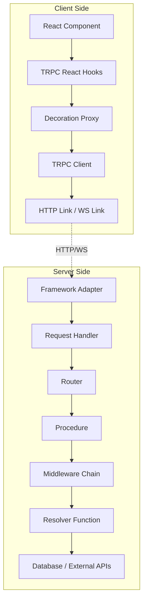

# Project Exploration: tRPC - End-to-End Typesafe APIs

## Overview

tRPC (TypeScript Remote Procedure Call) is a library that enables fully typesafe APIs without schemas or code generation. It allows developers to build and consume APIs where the client has complete type safety and autocompletion for inputs, outputs, and errors - all inferred directly from server-side code.

Key characteristics:
- **Zero code generation**: Types are inferred at build time using TypeScript's type system
- **Zero runtime bloat**: The client only imports type declarations, not implementation code
- **Framework agnostic**: Works with Express, Fastify, Next.js, standalone servers, and more
- **Full-stack TypeScript**: Designed for TypeScript monorepos where client and server share types

## Directory Structure

```
trpc/
├── packages/                    # Core tRPC packages
│   ├── server/                  # Server-side tRPC core
│   │   ├── unstable-core-do-not-import/
│   │   │   ├── initTRPC.ts      # tRPC initialization
│   │   │   ├── router.ts        # Router creation and merging
│   │   │   ├── procedureBuilder.ts  # Procedure builder pattern
│   │   │   ├── createProxy.ts   # Proxy for server-side calls
│   │   │   ├── parser.ts        # Schema validator integration
│   │   │   ├── middleware.ts    # Middleware system
│   │   │   └── transformer.ts   # Data transformation
│   │   └── adapters/            # Framework adapters
│   │       ├── express.ts
│   │       ├── fastify/
│   │       ├── next.ts
│   │       ├── fetch/
│   │       ├── node-http/
│   │       ├── standalone.ts
│   │       └── ws.ts            # WebSocket adapter
│   ├── client/                  # Client-side tRPC
│   │   ├── createTRPCClient.ts  # Typed client creation
│   │   ├── createTRPCUntypedClient.ts
│   │   └── links/               # Link chain system
│   │       ├── httpLink.ts
│   │       ├── httpBatchLink.ts
│   │       ├── wsLink/
│   │       └── loggerLink.ts
│   ├── react-query/             # React integration
│   │   ├── createTRPCReact.tsx  # Main React hook factory
│   │   ├── shared/
│   │   │   ├── proxy/
│   │   │   │   └── decorationProxy.ts  # React hook proxy
│   │   │   └── hooks/
│   │   │       └── createHooksInternal.tsx
│   │   └── internals/
│   │       └── getQueryKey.ts   # Query key generation
│   ├── next/                    # Next.js specific integration
│   └── tests/                   # Shared test utilities
├── examples/                    # Example implementations
│   ├── next-minimal-starter/    # Minimal Next.js example
│   ├── next-prisma-starter/     # Full-stack with Prisma
│   ├── express-server/          # Express.js example
│   ├── cloudflare-workers/      # Cloudflare Workers
│   └── standalone-server/       # Standalone HTTP server
├── www/                         # Documentation website
│   ├── docs/
│   │   └── main/
│   │       ├── introduction.mdx
│   │       ├── concepts.mdx
│   │       └── quickstart.mdx
│   └── src/
└── scripts/                     # Build and maintenance scripts
```

## Architecture

### High-Level Diagram



### Package Dependencies

```
@trpc/react-query
├── @trpc/client
│   └── @trpc/server (peer)
└── @tanstack/react-query (peer)

@trpc/next
├── @trpc/react-query
└── next (peer)
```

## Server-Side Routers

### Initialization with `initTRPC`

tRPC starts with initializing the root configuration using `initTRPC`:

```typescript
import { initTRPC } from '@trpc/server';
import { z } from 'zod';

const t = initTRPC.create({
  transformer: superjson,  // Optional: for Date, Map, Set, etc.
  errorFormatter: opts => ({ ...opts.shape, data: { ... } }),
});
```

The `initTRPC` builder pattern allows configuring:
- **Context**: Request-scoped data (user, database connection)
- **Meta**: Static metadata for procedures
- **Transformer**: Serialize/deserialize complex types
- **Error Formatter**: Customize error response shape

### Router Definition

Routers organize procedures into a hierarchical structure:

```typescript
const appRouter = t.router({
  greeting: publicProcedure
    .input(z.object({ name: z.string().nullish() }))
    .query(({ input }) => ({
      text: `hello ${input?.name ?? 'world'}`,
    })),

  users: t.router({
    list: publicProcedure.query(() => [...]),
    create: authedProcedure
      .input(z.object({ name: z.string() }))
      .mutation(({ input, ctx }) => ({ ... })),
  }),
});

export type AppRouter = typeof appRouter;  // Export ONLY the type
```

### Procedure Types

tRPC supports three procedure types:

1. **Query**: Read-only operations (HTTP GET)
2. **Mutation**: Write operations (HTTP POST)
3. **Subscription**: Real-time updates (WebSocket or SSE)

```typescript
// Query
greeting: publicProcedure
  .input(z.object({ name: z.string() }))
  .query(({ input }) => ({ text: `Hello ${input.name}` }));

// Mutation
updateUser: publicProcedure
  .input(z.object({ id: z.string(), name: z.string() }))
  .mutation(({ input }) => db.user.update({ ... }));

// Subscription (async generator)
liveData: publicProcedure.subscription(async function* () {
  while (true) {
    yield { value: Math.random() };
    await new Promise(r => setTimeout(r, 1000));
  }
});
```

### Middleware System

Middlewares intercept procedure execution for cross-cutting concerns:

```typescript
// Auth middleware
const authMiddleware = t.middleware(async ({ ctx, next }) => {
  const user = await getUser(ctx.token);
  if (!user) throw new TRPCError({ code: 'UNAUTHORIZED' });
  return next({ ctx: { user } });
});

// Protected procedure
const protectedProcedure = publicProcedure.use(authMiddleware);
```

Middleware can:
- Modify context
- Validate/transform input
- Short-circuit execution
- Log or track procedure calls

## Client-Side Proxy

### The Proxy Pattern

tRPC uses JavaScript Proxies to create a type-safe client without runtime code generation:

```typescript
// packages/client/src/createTRPCClient.ts
export function createTRPCClientProxy<TRouter extends AnyRouter>(
  client: TRPCUntypedClient<TRouter>,
): TRPCClient<TRouter> {
  const proxy = createRecursiveProxy(({ path, args }) => {
    const pathCopy = [...path];
    const procedureType = clientCallTypeToProcedureType(pathCopy.pop()!);
    const fullPath = pathCopy.join('.');
    return (client[procedureType] as any)(fullPath, ...(args as any));
  });
  return createFlatProxy<TRPCClient<TRouter>>(key => {
    if (key === untypedClientSymbol) return client;
    return proxy[key];
  });
}
```

### How the Proxy Works

1. **Path Capture**: When you call `trpc.users.list.useQuery()`, the proxy captures the path `['users', 'list', 'useQuery']`
2. **Type Extraction**: The last segment (`useQuery`) identifies the operation type
3. **Request Formation**: The remaining path (`users.list`) becomes the procedure identifier
4. **Type Inference**: TypeScript infers input/output types from the router type definition

### Recursive Proxy Implementation

```typescript
// packages/server/src/unstable-core-do-not-import/createProxy.ts
function createInnerProxy(
  callback: ProxyCallback,
  path: readonly string[],
  memo: Record<string, unknown>,
) {
  const cacheKey = path.join('.');
  memo[cacheKey] ??= new Proxy(noop, {
    get(_obj, key) {
      if (typeof key !== 'string' || key === 'then') return undefined;
      return createInnerProxy(callback, [...path, key], memo);
    },
    apply(_1, _2, args) {
      return callback({ args, path });
    },
  });
  return memo[cacheKey];
}
```

## Type Inference Without Code Generation

### The Key Insight

tRPC achieves type safety without code generation by:

1. **Exporting router types, not implementations**: The server exports `type AppRouter = typeof appRouter`
2. **Client imports only types**: The client imports `import type { AppRouter } from './server'`
3. **TypeScript inference**: TypeScript traverses the type structure to infer input/output types

### Type Inference Chain

```typescript
// Server: Define procedure
const greeting = publicProcedure
  .input(z.object({ name: z.string() }))
  .query(({ input }) => ({ text: `Hello ${input.name}` }));

// Type inference happens through these utilities:

// 1. Extract input type
type inferProcedureInput<T> = T extends Procedure<infer TInput, any>
  ? TInput : never;

// 2. Extract output type
type inferProcedureOutput<T> = T extends Procedure<any, infer TOutput>
  ? TOutput : never;

// 3. Transform output (handle serialization)
type inferTransformedProcedureOutput<TRoot, TProcedure> =
  TRoot['transformer'] extends false
    ? Serialize<inferProcedureOutput<TProcedure>>
    : inferProcedureOutput<TProcedure>;
```

### Router Input/Output Inference

```typescript
// packages/server/src/unstable-core-do-not-import/clientish/inference.ts
export type inferRouterInputs<TRouter extends AnyRouter> =
  GetInferenceHelpers<'input', TRouter['_def']['_config']['$types'], ...>;

export type inferRouterOutputs<TRouter extends AnyRouter> =
  GetInferenceHelpers<'output', TRouter['_def']['_config']['$types'], ...>;

// Usage:
type RouterInputs = inferRouterInputs<AppRouter>;
type RouterOutputs = inferRouterOutputs<AppRouter>;

// Results in:
// RouterInputs['greeting'] = { name?: string | null }
// RouterOutputs['greeting'] = { text: string }
```

## Input Validation with Zod

### Parser System

tRPC supports multiple validation libraries through a unified parser interface:

```typescript
// packages/server/src/unstable-core-do-not-import/parser.ts
export type ParserZodEsque<TInput, TParsedInput> = {
  _input: TInput;
  _output: TParsedInput;
};

export type Parser =
  | ParserZodEsque<any, any>
  | ParserValibotEsque<any, any>
  | ParserArkTypeEsque<any, any>
  | ParserStandardSchemaEsque<any, any>
  | ParserMyZodEsque<any>
  | ParserSuperstructEsque<any>
  | ParserYupEsque<any>;
```

### Zod Integration

```typescript
import { z } from 'zod';

// Input validation
procedure
  .input(z.object({
    id: z.string().uuid(),
    name: z.string().min(1),
    age: z.number().positive().optional(),
  }))
  .query(({ input }) => {
    // input is typed as { id: string; name: string; age?: number }
  });

// Output validation (optional)
procedure
  .output(z.object({ success: z.boolean() }))
  .query(() => ({ success: true }));
```

### Parser Resolution

The `getParseFn` utility normalizes different validator libraries:

```typescript
export function getParseFn<TType>(procedureParser: Parser): ParseFn<TType> {
  // Handle Zod
  if (typeof parser.parseAsync === 'function') {
    return parser.parseAsync.bind(parser);
  }
  if (typeof parser.parse === 'function') {
    return parser.parse.bind(parser);
  }
  // Handle Valibot, Yup, Superstruct, etc.
  // ...
}
```

## React Hooks Integration

### Hook Decoration Pattern

The React integration decorates procedures with hooks:

```typescript
// packages/react-query/src/createTRPCReact.tsx
export type DecorateProcedure<TType extends ProcedureType, TDef> =
  TType extends 'query'
    ? DecoratedQuery<TDef>
    : TType extends 'mutation'
      ? DecoratedMutation<TDef>
      : TType extends 'subscription'
        ? { useSubscription: ... }
        : never;

type DecoratedQuery<TDef> = {
  useQuery: ProcedureUseQuery<TDef>;
  useSuspenseQuery: ...;
  useInfiniteQuery: TDef['input'] extends { cursor?: any } ? ... : never;
};
```

### Usage Pattern

```typescript
import { trpc } from '~/utils/trpc';

function MyComponent() {
  // Query
  const greeting = trpc.greeting.useQuery({ name: 'World' });

  // Mutation
  const createUser = trpc.users.create.useMutation();

  // Subscription
  const liveData = trpc.liveData.useSubscription();

  // Utilities
  const utils = trpc.useUtils();
  utils.greeting.invalidate();
}
```

### Hook Creation

```typescript
// packages/react-query/src/shared/proxy/decorationProxy.ts
export function createReactDecoration(hooks) {
  return createRecursiveProxy(({ path, args }) => {
    const pathCopy = [...path];
    const lastArg = pathCopy.pop()!; // e.g., 'useQuery'

    if (lastArg === 'useMutation') {
      return hooks[lastArg](pathCopy, ...args);
    }

    const [input, ...rest] = args;
    return hooks[lastArg](pathCopy, input, rest[0]);
  });
}
```

## HTTP Transport and Serialization

### Link System

tRPC uses a "link" chain pattern for handling requests:

```typescript
// Client configuration
const trpc = createTRPCClient<AppRouter>({
  links: [
    loggerLink(),           // Log requests
    httpBatchLink({         // Batch multiple requests
      url: '/api/trpc',
      transformer: superjson,
    }),
  ],
});
```

### Built-in Links

- **httpLink**: Single HTTP requests
- **httpBatchLink**: Batches multiple requests into one
- **httpSubscriptionLink**: Server-Sent Events for subscriptions
- **wsLink**: WebSocket transport
- **loggerLink**: Debug logging
- **splitLink**: Conditional routing based on operation

### Request Format

```typescript
// HTTP request structure
POST /api/trpc/greeting
Content-Type: application/json

{
  "input": { "name": "World" }
}

// Response
{
  "result": {
    "data": { "text": "Hello World" }
  }
}
```

### Batching

The `httpBatchLink` combines multiple requests:

```typescript
// Multiple calls made at once get batched
trpc.greeting.useQuery({ name: 'A' });
trpc.greeting.useQuery({ name: 'B' });

// Single HTTP request:
POST /api/trpc/batch
[
  { path: 'greeting', input: { name: 'A' } },
  { path: 'greeting', input: { name: 'B' } }
]
```

### Transformers

For complex types (Date, Map, Set, BigInt), tRPC supports transformers:

```typescript
// Server and client must use the same transformer
import superjson from 'superjson';

const t = initTRPC.create({ transformer: superjson });

// Client
createTRPCClient({
  links: [httpBatchLink({ transformer: superjson })],
});
```

## Key Insights

### 1. Type Safety Without Runtime Overhead

tRPC's genius lies in exporting **only types** from the server. The client never imports server implementation code - only the inferred types. This means:
- Zero bundle size impact from server code
- No build step for code generation
- Full IntelliSense and compile-time checking

### 2. Proxy-Based API Design

The recursive proxy pattern creates an intuitive API that mirrors the router structure:
- `trpc.users.list.useQuery()` directly maps to the router path
- No string concatenation or manual path building
- TypeScript catches typos at compile time

### 3. Composable Middlewares

The middleware system enables powerful patterns:
- Authentication/authorization
- Input sanitization
- Logging and tracing
- Rate limiting

### 4. Framework Agnostic Core

The core tRPC packages have no framework dependencies:
- Adapters connect to Express, Fastify, Next.js, etc.
- Same router code works across frameworks
- Easy to migrate between frameworks

### 5. Subscription Support

tRPC supports real-time subscriptions with the same type safety:
- Async generators for simple streaming
- WebSocket adapter for bidirectional communication
- HTTP SSE for server-sent events

## Files Reference

| File | Purpose |
|------|---------|
| `/packages/server/src/unstable-core-do-not-import/initTRPC.ts` | Root tRPC initialization |
| `/packages/server/src/unstable-core-do-not-import/router.ts` | Router creation and merging |
| `/packages/server/src/unstable-core-do-not-import/procedureBuilder.ts` | Procedure builder pattern |
| `/packages/server/src/unstable-core-do-not-import/createProxy.ts` | Server-side proxy |
| `/packages/server/src/unstable-core-do-not-import/parser.ts` | Schema validator integration |
| `/packages/client/src/createTRPCClient.ts` | Typed client creation |
| `/packages/client/src/links/httpLink.ts` | HTTP transport |
| `/packages/react-query/src/createTRPCReact.tsx` | React hook factory |
| `/packages/react-query/src/shared/proxy/decorationProxy.ts` | React hook proxy |
| `/examples/next-minimal-starter/` | Minimal working example |
