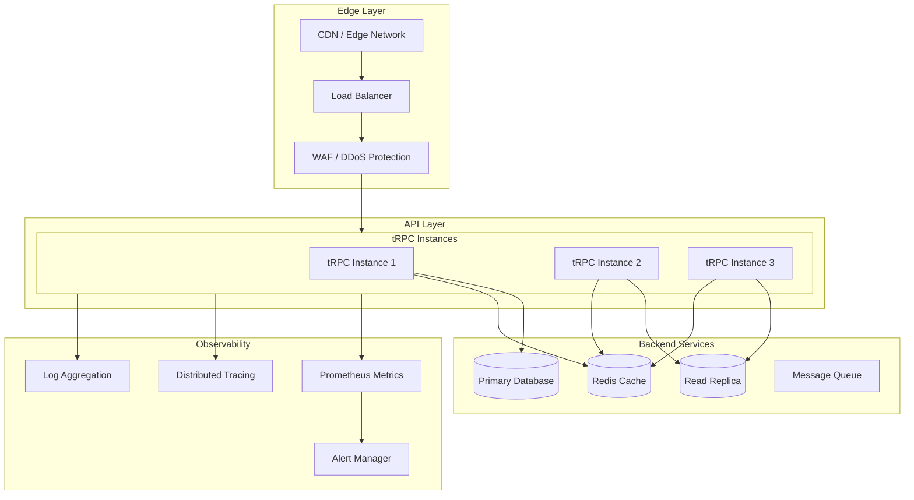

# Production-Grade tRPC

## Overview

This document outlines production-grade patterns for deploying tRPC applications. We cover monitoring, security hardening, scaling strategies, high availability, and operational excellence for enterprise deployments.

## Architecture



## Security Hardening

### Rate Limiting

```typescript
// server/middleware/rate-limit.ts

import { TRPCError } from '@trpc/server'
import { Redis } from 'ioredis'

const redis = new Redis(process.env.REDIS_URL!)

interface RateLimitConfig {
  windowMs: number
  maxRequests: number
  message: string
}

const configs: Record<string, RateLimitConfig> = {
  default: {
    windowMs: 60 * 1000,  // 1 minute
    maxRequests: 100,
    message: 'Too many requests',
  },
  auth: {
    windowMs: 15 * 60 * 1000,  // 15 minutes
    maxRequests: 5,  // Strict limit for auth
    message: 'Too many authentication attempts',
  },
  api: {
    windowMs: 1000,  // 1 second
    maxRequests: 10,
    message: 'API rate limit exceeded',
  },
}

export const rateLimitMiddleware = t.middleware(async ({ ctx, path, type, next }) => {
  const ip = ctx.ip
  const config = path.includes('login') || path.includes('register')
    ? configs.auth
    : configs.default
  
  const key = `rate-limit:${ip}:${path}`
  
  // Use Redis INCR with TTL for atomic rate limiting
  const [count] = await redis
    .multi()
    .incr(key)
    .expire(key, Math.ceil(config.windowMs / 1000))
    .exec()
  
  const currentCount = (count as any)[1]
  
  if (currentCount > config.maxRequests) {
    const ttl = await redis.ttl(key)
    
    throw new TRPCError({
      code: 'TOO_MANY_REQUESTS',
      message: config.message,
      data: {
        retryAfter: ttl,
      },
    })
  }
  
  return next()
})

// Usage in procedure
const protectedProcedure = t.procedure
  .use(rateLimitMiddleware)
  .use(authMiddleware)
```

### Input Validation

```typescript
// server/middleware/validation.ts

import { z } from 'zod'
import { TRPCError } from '@trpc/server'

// Sanitize strings
const sanitizeString = (str: string) => {
  return str
    .replace(/[<>]/g, '')  // Remove potential HTML tags
    .trim()
    .slice(0, 10000)  // Max length
}

// Email validation
const emailSchema = z.string()
  .email()
  .transform(s => s.toLowerCase().trim())

// Password strength
const passwordSchema = z.string()
  .min(8, 'Password must be at least 8 characters')
  .regex(/[A-Z]/, 'Must contain uppercase letter')
  .regex(/[a-z]/, 'Must contain lowercase letter')
  .regex(/[0-9]/, 'Must contain number')
  .regex(/[^A-Za-z0-9]/, 'Must contain special character')

// ID validation
const uuidSchema = z.string().uuid()

// Pagination
const paginationSchema = z.object({
  cursor: z.string().optional(),
  limit: z.number().int().min(1).max(100),
})

// Complex nested validation
const createUserSchema = z.object({
  email: emailSchema,
  password: passwordSchema,
  name: z.string().min(1).max(100).transform(sanitizeString),
  role: z.enum(['user', 'admin']).default('user'),
  metadata: z.record(z.unknown()).optional(),
})

// Custom validator middleware
export const validateInput = <T extends z.ZodTypeAny>(schema: T) => {
  return t.middleware(async ({ input, next }) => {
    const result = schema.safeParse(input)
    
    if (!result.success) {
      throw new TRPCError({
        code: 'BAD_REQUEST',
        message: 'Invalid input',
        data: {
          validationErrors: result.error.errors.map(err => ({
            path: err.path.join('.'),
            message: err.message,
          })),
        },
      })
    }
    
    return next({ input: result.data })
  })
}

// Usage
const userRouter = t.router({
  create: publicProcedure
    .input(createUserSchema)
    .mutation(async ({ input, ctx }) => {
      // input is fully validated and typed
      return ctx.db.user.create({ data: input })
    }),
})
```

### Authentication & Authorization

```typescript
// server/middleware/auth.ts

import { sign, verify } from 'jsonwebtoken'
import { TRPCError } from '@trpc/server'

interface JWTPayload {
  userId: string
  role: string
  iat: number
  exp: number
}

// Token generation
export function createToken(payload: Omit<JWTPayload, 'iat' | 'exp'>): string {
  return sign(payload, process.env.JWT_SECRET!, {
    expiresIn: '7d',
    audience: 'trpc-api',
    issuer: 'your-app',
  })
}

// Token verification middleware
export const authMiddleware = t.middleware(async ({ ctx, next }) => {
  const authHeader = ctx.headers?.authorization
  
  if (!authHeader?.startsWith('Bearer ')) {
    throw new TRPCError({
      code: 'UNAUTHORIZED',
      message: 'Missing or invalid authorization header',
    })
  }
  
  const token = authHeader.substring(7)
  
  try {
    const payload = verify(token, process.env.JWT_SECRET!, {
      audience: 'trpc-api',
      issuer: 'your-app',
    }) as JWTPayload
    
    // Check expiration
    if (payload.exp < Date.now() / 1000) {
      throw new TRPCError({
        code: 'UNAUTHORIZED',
        message: 'Token expired',
      })
    }
    
    return next({
      ctx: {
        ...ctx,
        user: {
          id: payload.userId,
          role: payload.role,
        },
      },
    })
  } catch (error) {
    throw new TRPCError({
      code: 'UNAUTHORIZED',
      message: 'Invalid token',
    })
  }
})

// Role-based access control
export const requireRole = (...allowedRoles: string[]) => {
  return t.middleware(async ({ ctx, next }) => {
    if (!ctx.user) {
      throw new TRPCError({
        code: 'UNAUTHORIZED',
        message: 'Authentication required',
      })
    }
    
    if (!allowedRoles.includes(ctx.user.role)) {
      throw new TRPCError({
        code: 'FORBIDDEN',
        message: `Required role: ${allowedRoles.join(' or ')}`,
      })
    }
    
    return next()
  })
}

// Resource ownership check
export const requireOwnership = <TInput extends { id: string }>() => {
  return t.middleware(async ({ ctx, input, next, path }) => {
    const typedInput = input as TInput
    
    // Check if user owns the resource
    const resource = await ctx.db.resource.findUnique({
      where: { id: typedInput.id },
    })
    
    if (!resource || resource.userId !== ctx.user.id) {
      throw new TRPCError({
        code: 'FORBIDDEN',
        message: 'Access denied',
      })
    }
    
    return next()
  })
}

// Procedure compositions
const publicProcedure = t.procedure.use(rateLimitMiddleware)
const authProcedure = publicProcedure.use(authMiddleware)
const adminProcedure = authProcedure.use(requireRole('admin'))
const ownerProcedure = authProcedure.use(requireOwnership())
```

## Monitoring & Observability

### Metrics Collection

```typescript
// server/middleware/metrics.ts

import client, { Counter, Histogram, Gauge } from 'prom-client'

// Request metrics
const httpRequestCounter = new Counter({
  name: 'trpc_requests_total',
  help: 'Total tRPC requests',
  labelNames: ['procedure', 'type', 'status'],
})

const requestDurationHistogram = new Histogram({
  name: 'trpc_request_duration_seconds',
  help: 'tRPC request duration',
  labelNames: ['procedure', 'type'],
  buckets: [0.001, 0.005, 0.01, 0.025, 0.05, 0.1, 0.25, 0.5, 1, 2.5, 5, 10],
})

const activeConnectionsGauge = new Gauge({
  name: 'trpc_active_connections',
  help: 'Active tRPC connections',
})

const errorCounter = new Counter({
  name: 'trpc_errors_total',
  help: 'Total tRPC errors',
  labelNames: ['procedure', 'type', 'code'],
})

// Business metrics
const businessMetrics = {
  usersCreated: new Counter({
    name: 'users_created_total',
    help: 'Total users created',
  }),
  ordersProcessed: new Counter({
    name: 'orders_processed_total',
    help: 'Total orders processed',
  }),
  activeUsers: new Gauge({
    name: 'active_users',
    help: 'Currently active users',
  }),
}

// Metrics middleware
export const metricsMiddleware = t.middleware(async ({ path, type, next }) => {
  const start = Date.now()
  activeConnectionsGauge.inc()
  
  try {
    const result = await next()
    
    httpRequestCounter.inc({ procedure: path, type, status: 'success' })
    
    return result
  } catch (error) {
    const code = (error as TRPCError).code || 'UNKNOWN'
    
    httpRequestCounter.inc({ procedure: path, type, status: 'error' })
    errorCounter.inc({ procedure: path, type, code })
    
    throw error
  } finally {
    const duration = (Date.now() - start) / 1000
    requestDurationHistogram.observe({ procedure: path, type }, duration)
    activeConnectionsGauge.dec()
  }
})

// Metrics endpoint
export const metricsRouter = t.router({
  metrics: publicProcedure.query(async () => {
    const metrics = await client.register.metrics()
    return metrics
  }),
})
```

### Distributed Tracing

```typescript
// server/middleware/tracing.ts

import { trace, context, SpanStatusCode, SpanKind } from '@opentelemetry/api'
import { SemanticAttributes } from '@opentelemetry/semantic-conventions'

const tracer = trace.getTracer('trpc-server')

export const tracingMiddleware = t.middleware(async ({ 
  path, 
  type, 
  input, 
  ctx,
  next 
}) => {
  const span = tracer.startSpan(`trpc.${path}`, {
    kind: SpanKind.SERVER,
    attributes: {
      [SemanticAttributes.HTTP_METHOD]: type,
      [SemanticAttributes.HTTP_ROUTE]: path,
      'trpc.type': type,
      'trpc.procedure': path,
    },
  })
  
  // Extract trace context from headers
  const traceContext = ctx.headers?.['x-traceparent']
  if (traceContext) {
    const extractedContext = propagation.extract({ traceparent: traceContext })
    context.with(trace.setSpan(extractedContext, span), async () => {
      // Continue with span context
    })
  }
  
  try {
    span.setAttribute('trpc.input', JSON.stringify(input).slice(0, 1000))
    
    const result = await next()
    
    span.setStatus({ code: SpanStatusCode.OK })
    span.setAttribute('trpc.output_size', JSON.stringify(result).length)
    
    return result
  } catch (error) {
    span.setStatus({ 
      code: SpanStatusCode.ERROR, 
      message: (error as Error).message 
    })
    span.recordException(error as Error)
    throw error
  } finally {
    span.end()
  }
})

// Database query tracing
export const withTracedQuery = async <T>(
  operation: string,
  query: () => Promise<T>
): Promise<T> => {
  const span = tracer.startSpan(`db.${operation}`, {
    kind: SpanKind.CLIENT,
  })
  
  try {
    const result = await query()
    return result
  } catch (error) {
    span.recordException(error as Error)
    throw error
  } finally {
    span.end()
  }
}

// External API call tracing
export const withTracedFetch = async <T>(
  url: string,
  options?: RequestInit
): Promise<T> => {
  const span = tracer.startSpan(`http.${url}`, {
    kind: SpanKind.CLIENT,
    attributes: {
      [SemanticAttributes.HTTP_URL]: url,
      [SemanticAttributes.HTTP_METHOD]: options?.method || 'GET',
    },
  })
  
  try {
    const response = await fetch(url, {
      ...options,
      headers: {
        ...options?.headers,
        'x-traceparent': span.spanContext().traceId,
      },
    })
    
    span.setAttribute(SemanticAttributes.HTTP_STATUS_CODE, response.status)
    
    return response.json()
  } catch (error) {
    span.recordException(error as Error)
    throw error
  } finally {
    span.end()
  }
}
```

### Structured Logging

```typescript
// server/middleware/logging.ts

import pino from 'pino'

const logger = pino({
  level: process.env.LOG_LEVEL || 'info',
  formatters: {
    level: (label) => ({ level: label.toUpperCase() }),
  },
  timestamp: pino.stdTimeFunctions.isoTime,
  transport: process.env.NODE_ENV === 'production' ? undefined : {
    target: 'pino-pretty',
    options: {
      colorize: true,
      translateTime: 'yyyy-mm-dd HH:MM:ss',
    },
  },
})

interface LogContext {
  requestId: string
  userId?: string
  procedure: string
  type: string
}

export const loggingMiddleware = t.middleware(async ({ 
  path, 
  type, 
  input,
  ctx,
  next 
}) => {
  const requestId = ctx.headers?.['x-request-id'] || crypto.randomUUID()
  const startTime = Date.now()
  
  const logContext: LogContext = {
    requestId,
    userId: ctx.user?.id,
    procedure: path,
    type,
  }
  
  // Log request start
  logger.info({
    ...logContext,
    event: 'request_start',
    input: sanitizeInput(input),
  }, 'tRPC request started')
  
  try {
    const result = await next()
    const duration = Date.now() - startTime
    
    // Log success
    logger.info({
      ...logContext,
      event: 'request_complete',
      duration,
      durationUnit: 'ms',
    }, 'tRPC request completed')
    
    return result
  } catch (error) {
    const duration = Date.now() - startTime
    
    // Log error
    logger.error({
      ...logContext,
      event: 'request_error',
      duration,
      durationUnit: 'ms',
      error: {
        name: (error as Error).name,
        message: (error as Error).message,
        stack: (error as Error).stack,
        code: (error as TRPCError).code,
      },
    }, 'tRPC request failed')
    
    throw error
  }
})

// Sanitize sensitive input
function sanitizeInput(input: unknown): unknown {
  if (typeof input !== 'object' || input === null) return input
  
  const sanitized = { ...input } as any
  
  // Remove sensitive fields
  const sensitiveFields = ['password', 'token', 'secret', 'creditCard', 'ssn']
  for (const field of sensitiveFields) {
    if (field in sanitized) {
      sanitized[field] = '[REDACTED]'
    }
  }
  
  return sanitized
}

// Usage in error handler
export const onError = ({ 
  error, 
  path, 
  input, 
  ctx, 
  type 
}: any) => {
  logger.error({
    error: {
      code: error.code,
      message: error.message,
      stack: error.stack,
    },
    procedure: path,
    type,
    input: sanitizeInput(input),
    userId: ctx?.user?.id,
  }, 'tRPC error')
}
```

## High Availability

### Circuit Breaker

```typescript
// server/middleware/circuit-breaker.ts

import { TRPCError } from '@trpc/server'

enum CircuitState {
  Closed = 'closed',
  Open = 'open',
  HalfOpen = 'half_open',
}

interface CircuitBreakerOptions {
  failureThreshold: number
  resetTimeout: number
  halfOpenRequests: number
}

class CircuitBreaker {
  private state = CircuitState.Closed
  private failures = 0
  private successes = 0
  private lastFailureTime: number | null = null
  private halfOpenRequests = 0
  
  constructor(private options: CircuitBreakerOptions) {}
  
  async call<T>(fn: () => Promise<T>): Promise<T> {
    if (this.state === CircuitState.Open) {
      if (Date.now() - this.lastFailureTime! > this.options.resetTimeout) {
        this.state = CircuitState.HalfOpen
        this.halfOpenRequests = 0
      } else {
        throw new TRPCError({
          code: 'SERVICE_UNAVAILABLE',
          message: 'Circuit breaker is open',
        })
      }
    }
    
    try {
      const result = await fn()
      
      if (this.state === CircuitState.HalfOpen) {
        this.successes++
        
        if (this.successes >= this.options.halfOpenRequests) {
          this.state = CircuitState.Closed
          this.failures = 0
          this.successes = 0
        }
      }
      
      return result
    } catch (err) {
      this.failures++
      this.lastFailureTime = Date.now()
      
      if (this.failures >= this.options.failureThreshold) {
        this.state = CircuitState.Open
      }
      
      throw err
    }
  }
  
  getState(): CircuitState {
    return this.state
  }
}

// Database circuit breaker
const dbBreaker = new CircuitBreaker({
  failureThreshold: 5,
  resetTimeout: 30000,
  halfOpenRequests: 3,
})

// Usage in procedure
const dbProcedure = t.procedure
  .input(z.object({ id: z.string() }))
  .query(async ({ input, ctx }) => {
    return dbBreaker.call(async () => {
      return ctx.db.user.findUnique({ where: { id: input.id } })
    })
  })
```

### Retry with Exponential Backoff

```typescript
// server/middleware/retry.ts

import { TRPCError } from '@trpc/server'

interface RetryOptions {
  maxRetries: number
  initialDelay: number
  maxDelay: number
  shouldRetry?: (error: TRPCError) => boolean
}

export async function withRetry<T>(
  fn: () => Promise<T>,
  options: RetryOptions = {
    maxRetries: 3,
    initialDelay: 100,
    maxDelay: 5000,
  }
): Promise<T> {
  const shouldRetry = options.shouldRetry ?? ((error) => {
    // Retry on transient errors
    return [
      'INTERNAL_SERVER_ERROR',
      'TIMEOUT',
      'SERVICE_UNAVAILABLE',
    ].includes(error.code)
  })
  
  let lastError: Error
  
  for (let attempt = 0; attempt <= options.maxRetries; attempt++) {
    try {
      return await fn()
    } catch (err) {
      lastError = err as Error
      
      if (!shouldRetry(err as TRPCError) || attempt === options.maxRetries) {
        break
      }
      
      // Exponential backoff with jitter
      const delay = Math.min(
        options.initialDelay * Math.pow(2, attempt) + Math.random() * 100,
        options.maxDelay
      )
      
      await new Promise(resolve => setTimeout(resolve, delay))
    }
  }
  
  throw lastError!
}

// Usage
const resilientProcedure = t.procedure
  .use(async ({ next }) => {
    return withRetry(() => next(), {
      maxRetries: 3,
      initialDelay: 100,
      maxDelay: 5000,
      shouldRetry: (error) => {
        return error.code === 'INTERNAL_SERVER_ERROR' ||
               error.code === 'TIMEOUT'
      },
    })
  })
```

### Health Checks

```typescript
// server/health.ts

import { TRPCError } from '@trpc/server'

interface HealthStatus {
  status: 'healthy' | 'degraded' | 'unhealthy'
  timestamp: string
  checks: Record<string, HealthCheck>
}

interface HealthCheck {
  status: 'up' | 'down' | 'degraded'
  latency?: number
  message?: string
}

export const healthRouter = t.router({
  // Basic liveness check
  live: publicProcedure.query(() => ({
    status: 'alive',
    timestamp: new Date().toISOString(),
    uptime: process.uptime(),
  })),
  
  // Readiness check with dependencies
  ready: publicProcedure.query(async ({ ctx }) => {
    const checks: Record<string, HealthCheck> = {}
    let overallStatus: HealthStatus['status'] = 'healthy'
    
    // Database check
    try {
      const start = Date.now()
      await ctx.db.$queryRaw`SELECT 1`
      const latency = Date.now() - start
      
      checks.database = {
        status: 'up',
        latency,
      }
      
      if (latency > 1000) {
        overallStatus = 'degraded'
      }
    } catch (error) {
      checks.database = {
        status: 'down',
        message: (error as Error).message,
      }
      overallStatus = 'unhealthy'
    }
    
    // Redis check
    try {
      const start = Date.now()
      await redis.ping()
      const latency = Date.now() - start
      
      checks.redis = {
        status: 'up',
        latency,
      }
    } catch (error) {
      checks.redis = {
        status: 'down',
        message: (error as Error).message,
      }
      overallStatus = 'unhealthy'
    }
    
    return {
      status: overallStatus,
      timestamp: new Date().toISOString(),
      checks,
    } as HealthStatus
  }),
  
  // Detailed diagnostics
  diagnostics: publicProcedure.query(async ({ ctx }) => {
    const diagnostics = {
      memory: process.memoryUsage(),
      cpu: process.cpuUsage(),
      eventLoopLag: await measureEventLoopLag(),
      activeConnections: activeConnectionsGauge.values,
      recentErrors: getRecentErrors(),
    }
    
    return diagnostics
  }),
})

// Measure event loop lag
async function measureEventLoopLag(): Promise<number> {
  return new Promise(resolve => {
    const start = process.hrtime.bigint()
    setImmediate(() => {
      const end = process.hrtime.bigint()
      const lag = Number(end - start) / 1e6  // Convert to ms
      resolve(lag)
    })
  })
}
```

## Deployment Configurations

### Docker Configuration

```dockerfile
# Dockerfile - Multi-stage build

# Build stage
FROM node:20-alpine AS builder

WORKDIR /app

# Install dependencies
COPY package*.json ./
COPY pnpm-lock.yaml ./
RUN corepack enable pnpm && pnpm install --frozen-lockfile

# Build
COPY . .
RUN pnpm build

# Production stage
FROM node:20-alpine AS production

# Security: non-root user
RUN addgroup -g 1001 -S nodejs && \
    adduser -S nodejs -u 1001

WORKDIR /app

# Copy built artifacts
COPY --from=builder --chown=nodejs:nodejs /app/dist ./dist
COPY --from=builder --chown=nodejs:nodejs /app/node_modules ./node_modules
COPY --from=builder --chown=nodejs:nodejs /app/package.json ./

# Security hardening
USER nodejs

# Health check
HEALTHCHECK --interval=30s --timeout=3s --start-period=10s --retries=3 \
  CMD wget -qO- http://localhost:3000/trpc/health/live || exit 1

EXPOSE 3000

CMD ["node", "dist/server.js"]
```

### Kubernetes Configuration

```yaml
# k8s/deployment.yaml

apiVersion: apps/v1
kind: Deployment
metadata:
  name: trpc-api
spec:
  replicas: 3
  selector:
    matchLabels:
      app: trpc-api
  template:
    metadata:
      labels:
        app: trpc-api
    spec:
      containers:
      - name: trpc-api
        image: your-registry/trpc-api:latest
        ports:
        - containerPort: 3000
        env:
        - name: NODE_ENV
          value: "production"
        - name: DATABASE_URL
          valueFrom:
            secretKeyRef:
              name: db-secrets
              key: url
        - name: JWT_SECRET
          valueFrom:
            secretKeyRef:
              name: app-secrets
              key: jwt-secret
        resources:
          requests:
            cpu: "100m"
            memory: "256Mi"
          limits:
            cpu: "500m"
            memory: "512Mi"
        livenessProbe:
          httpGet:
            path: /trpc/health/live
            port: 3000
          initialDelaySeconds: 10
          periodSeconds: 30
        readinessProbe:
          httpGet:
            path: /trpc/health/ready
            port: 3000
          initialDelaySeconds: 5
          periodSeconds: 10
        securityContext:
          runAsNonRoot: true
          runAsUser: 1001
          allowPrivilegeEscalation: false
          readOnlyRootFilesystem: true
---
apiVersion: v1
kind: Service
metadata:
  name: trpc-api
spec:
  selector:
    app: trpc-api
  ports:
  - port: 80
    targetPort: 3000
  type: ClusterIP
---
apiVersion: autoscaling/v2
kind: HorizontalPodAutoscaler
metadata:
  name: trpc-api-hpa
spec:
  scaleTargetRef:
    apiVersion: apps/v1
    kind: Deployment
    name: trpc-api
  minReplicas: 3
  maxReplicas: 20
  metrics:
  - type: Resource
    resource:
      name: cpu
      target:
        type: Utilization
        averageUtilization: 70
  - type: Resource
    resource:
      name: memory
      target:
        type: Utilization
        averageUtilization: 80
```

### Vercel/Edge Deployment

```typescript
// vercel.json

{
  "version": 2,
  "builds": [
    {
      "src": "api/trpc/[trpc].ts",
      "use": "@vercel/node"
    }
  ],
  "routes": [
    {
      "src": "/trpc/(.*)",
      "dest": "api/trpc/[trpc].ts"
    }
  ],
  "env": {
    "NODE_ENV": "production"
  },
  "regions": ["iad1", "sfo1", "lhr1"],
  "headers": [
    {
      "source": "/trpc/(.*)",
      "headers": [
        {
          "key": "X-Content-Type-Options",
          "value": "nosniff"
        },
        {
          "key": "X-Frame-Options",
          "value": "DENY"
        },
        {
          "key": "X-XSS-Protection",
          "value": "1; mode=block"
        }
      ]
    }
  ]
}
```

## Conclusion

Production-grade tRPC deployment requires:

1. **Security Hardening**: Rate limiting, input validation, authentication, authorization
2. **Monitoring**: Metrics collection, distributed tracing, structured logging
3. **High Availability**: Circuit breakers, retry logic, health checks
4. **Container Orchestration**: Docker and Kubernetes for scaling
5. **Edge Deployment**: Vercel/Cloudflare for low-latency global access
6. **Alerting**: Configure alerts based on metrics and error rates

These patterns ensure reliable, secure, and observable tRPC applications at enterprise scale.
