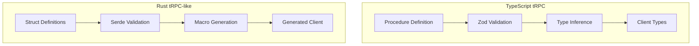

# Rust Revision: tRPC Patterns in Rust

## Overview

This document translates tRPC's TypeScript patterns into Rust equivalents. We explore how to achieve similar developer experience with type-safe RPC using Rust's type system, procedural macros, and frameworks like Axum, Tower, and Tokio.

## Key Differences

```typescript
// TypeScript (tRPC) - Runtime type inference
const router = t.router({
  greeting: publicProcedure
    .input(z.object({ name: z.string() }))
    .query(({ input }) => ({ text: `Hello ${input.name}` }))
})

// Types inferred at compile time from runtime definitions
type RouterType = typeof router  // Inferred
```

```rust
// Rust - Compile-time types with macros
#[derive(Debug, Serialize, Deserialize)]
pub struct GreetingInput {
    pub name: String,
}

#[derive(Debug, Serialize, Deserialize)]
pub struct GreetingOutput {
    pub text: String,
}

#[trpc_router]
pub mod app_router {
    #[trpc_query]
    pub async fn greeting(input: GreetingInput) -> GreetingOutput {
        GreetingOutput {
            text: format!("Hello {}", input.name),
        }
    }
}
```

## Architecture Comparison



## Core Types

```rust
// src/core/mod.rs

use async_trait::async_trait;
use serde::{Deserialize, Serialize};
use thiserror::Error;
use tokio::sync::RwLock;
use std::collections::HashMap;
use std::sync::Arc;

/// Request context - similar to tRPC's context
#[derive(Clone, Debug)]
pub struct Context {
    pub user: Option<User>,
    pub ip: String,
    pub headers: HashMap<String, String>,
}

#[derive(Clone, Debug, Serialize, Deserialize)]
pub struct User {
    pub id: String,
    pub role: String,
}

/// tRPC-compatible response format
#[derive(Debug, Serialize, Deserialize)]
pub struct TrpcResponse<T> {
    pub result: TrpcResult<T>,
}

#[derive(Debug, Serialize, Deserialize)]
#[serde(untagged)]
pub enum TrpcResult<T> {
    Data {
        #[serde(rename = "type")]
        result_type: String,
        data: T,
    },
    Error {
        error: TrpcErrorShape,
    },
}

#[derive(Debug, Serialize, Deserialize)]
pub struct TrpcErrorShape {
    pub code: TrpcErrorCode,
    message: String,
    data: TrpcErrorData,
}

#[derive(Debug, Serialize, Deserialize)]
#[serde(rename_all = "SCREAMING_SNAKE_CASE")]
pub enum TrpcErrorCode {
    BadRequest,
    Unauthorized,
    Forbidden,
    NotFound,
    MethodNotAllowed,
    Timeout,
    Conflict,
    PreconditionFailed,
    PayloadTooLarge,
    TooManyRequests,
    ClientClosedRequest,
    InternalServerError,
    NotImplemented,
    ServiceUnavailable,
}

#[derive(Debug, Serialize, Deserialize)]
pub struct TrpcErrorData {
    pub code: TrpcErrorCode,
    pub http_status: u16,
    pub path: Option<String>,
}

/// Error type for tRPC procedures
#[derive(Error, Debug)]
pub enum TrpcError {
    #[error("Bad request: {0}")]
    BadRequest(String),
    
    #[error("Unauthorized: {0}")]
    Unauthorized(String),
    
    #[error("Forbidden: {0}")]
    Forbidden(String),
    
    #[error("Not found: {0}")]
    NotFound(String),
    
    #[error("Internal server error: {0}")]
    InternalError(String),
    
    #[error("Too many requests")]
    TooManyRequests,
}

impl TrpcError {
    pub fn to_shape(&self, path: Option<String>) -> TrpcErrorShape {
        let (code, message, http_status) = match self {
            TrpcError::BadRequest(msg) => (TrpcErrorCode::BadRequest, msg.as_str(), 400),
            TrpcError::Unauthorized(msg) => (TrpcErrorCode::Unauthorized, msg.as_str(), 401),
            TrpcError::Forbidden(msg) => (TrpcErrorCode::Forbidden, msg.as_str(), 403),
            TrpcError::NotFound(msg) => (TrpcErrorCode::NotFound, msg.as_str(), 404),
            TrpcError::InternalError(msg) => (TrpcErrorCode::InternalServerError, msg.as_str(), 500),
            TrpcError::TooManyRequests => (TrpcErrorCode::TooManyRequests, "Too many requests", 429),
        };
        
        TrpcErrorShape {
            code,
            message: message.to_string(),
            data: TrpcErrorData {
                code,
                http_status,
                path,
            },
        }
    }
}
```

## Procedure Builder Pattern

```rust
// src/builder/mod.rs

use crate::core::{Context, TrpcError, TrpcResponse, TrpcResult};
use std::future::Future;
use std::marker::PhantomData;
use std::sync::Arc;

/// Middleware trait - similar to tRPC's middleware
#[async_trait]
pub trait Middleware<State>: Send + Sync {
    async fn handle(
        &self,
        ctx: Context,
        next: Box<dyn FnOnce(Context) -> Pin<Box<dyn Future<Output = Result<Context, TrpcError>> + Send>> + Send>,
    ) -> Result<Context, TrpcError>;
}

/// Auth middleware
pub struct AuthMiddleware {
    pub secret: String,
}

#[async_trait]
impl Middleware<()> for AuthMiddleware {
    async fn handle(
        &self,
        mut ctx: Context,
        next: Box<dyn FnOnce(Context) -> Pin<Box<dyn Future<Output = Result<Context, TrpcError>> + Send>> + Send>,
    ) -> Result<Context, TrpcError> {
        let token = ctx.headers.get("authorization")
            .ok_or_else(|| TrpcError::Unauthorized("Missing authorization header".to_string()))?;
        
        if !token.starts_with("Bearer ") {
            return Err(TrpcError::Unauthorized("Invalid authorization format".to_string()));
        }
        
        // Verify JWT (simplified)
        let user = verify_token(&self.secret, &token[7..])
            .map_err(|_| TrpcError::Unauthorized("Invalid token".to_string()))?;
        
        ctx.user = Some(user);
        next(ctx).await
    }
}

/// Logger middleware
pub struct LoggerMiddleware;

#[async_trait]
impl Middleware<()> for LoggerMiddleware {
    async fn handle(
        &self,
        ctx: Context,
        next: Box<dyn FnOnce(Context) -> Pin<Box<dyn Future<Output = Result<Context, TrpcError>> + Send>> + Send>,
    ) -> Result<Context, TrpcError> {
        let start = std::time::Instant::now();
        println!("Request started");
        
        let result = next(ctx).await;
        
        let duration = start.elapsed();
        println!("Request completed in {:?}", duration);
        
        result
    }
}

/// Procedure builder with type-state pattern
pub struct ProcedureBuilder<Input, Output, MiddlewareStack> {
    _input: PhantomData<Input>,
    _output: PhantomData<Output>,
    middleware: MiddlewareStack,
}

impl ProcedureBuilder<(), (), ()> {
    pub fn new() -> Self {
        ProcedureBuilder {
            _input: PhantomData,
            _output: PhantomData,
            middleware: (),
        }
    }
}

impl<Input, Output, M> ProcedureBuilder<Input, Output, M> {
    /// Add middleware to the chain
    pub fn use<NewMiddleware>(
        self,
        middleware: NewMiddleware,
    ) -> ProcedureBuilder<Input, Output, (M, NewMiddleware)> {
        ProcedureBuilder {
            _input: self._input,
            _output: self._output,
            middleware: (self.middleware, middleware),
        }
    }
    
    /// Define input type
    pub fn input<NewInput>(
        self,
    ) -> ProcedureBuilder<NewInput, Output, M> {
        ProcedureBuilder {
            _input: PhantomData,
            _output: self._output,
            middleware: self.middleware,
        }
    }
}

impl<Input, Output, M> ProcedureBuilder<Input, Output, M>
where
    Input: serde::de::DeserializeOwned + Send + Sync,
    Output: serde::Serialize + Send + Sync,
    M: MiddlewareStackExt<Context>,
{
    /// Define query handler
    pub fn query<F, Fut>(
        self,
        handler: F,
    ) -> QueryProcedure<Input, Output, M>
    where
        F: FnOnce(Input, Context) -> Fut + Send + Sync + 'static,
        Fut: Future<Output = Result<Output, TrpcError>> + Send,
    {
        QueryProcedure {
            handler: Box::new(handler),
            middleware: self.middleware,
            _input: PhantomData,
            _output: PhantomData,
        }
    }
    
    /// Define mutation handler
    pub fn mutation<F, Fut>(
        self,
        handler: F,
    ) -> MutationProcedure<Input, Output, M>
    where
        F: FnOnce(Input, Context) -> Fut + Send + Sync + 'static,
        Fut: Future<Output = Result<Output, TrpcError>> + Send,
    {
        MutationProcedure {
            handler: Box::new(handler),
            middleware: self.middleware,
            _input: PhantomData,
            _output: PhantomData,
        }
    }
}

/// Query procedure
pub struct QueryProcedure<Input, Output, M> {
    handler: Box<dyn FnOnce(Input, Context) -> Pin<Box<dyn Future<Output = Result<Output, TrpcError>> + Send>> + Send + Sync>,
    middleware: M,
    _input: PhantomData<Input>,
    _output: PhantomData<Output>,
}

/// Mutation procedure
pub struct MutationProcedure<Input, Output, M> {
    handler: Box<dyn FnOnce(Input, Context) -> Pin<Box<dyn Future<Output = Result<Output, TrpcError>> + Send>> + Send + Sync>,
    middleware: M,
    _input: PhantomData<Input>,
    _output: PhantomData<Output>,
}
```

## Router Definition

```rust
// src/router/mod.rs

use crate::core::{Context, TrpcError, TrpcResponse};
use crate::builder::{QueryProcedure, MutationProcedure};
use std::collections::HashMap;
use std::sync::Arc;

/// Router trait for procedure collections
pub trait Router: Send + Sync {
    fn call(
        &self,
        path: &str,
        input: serde_json::Value,
        ctx: Context,
    ) -> Pin<Box<dyn Future<Output = Result<TrpcResponse<serde_json::Value>, TrpcError>> + Send>>;
}

/// Procedure registry
pub struct ProcedureRegistry {
    procedures: HashMap<String, Arc<dyn ProcedureHandler>>,
}

trait ProcedureHandler: Send + Sync {
    fn handle(
        &self,
        input: serde_json::Value,
        ctx: Context,
    ) -> Pin<Box<dyn Future<Output = Result<serde_json::Value, TrpcError>> + Send>>;
}

impl ProcedureRegistry {
    pub fn new() -> Self {
        ProcedureRegistry {
            procedures: HashMap::new(),
        }
    }
    
    pub fn register_query<Input, Output, F, Fut>(
        &mut self,
        path: String,
        handler: F,
    ) where
        Input: serde::de::DeserializeOwned + Send + Sync + 'static,
        Output: serde::Serialize + Send + Sync + 'static,
        F: FnOnce(Input, Context) -> Fut + Send + Sync + 'static,
        Fut: Future<Output = Result<Output, TrpcError>> + Send + 'static,
    {
        let handler = Arc::new(ProcedureHandlerImpl {
            handler: Box::new(move |input, ctx| {
                let input = serde_json::from_value(input)
                    .map_err(|e| TrpcError::BadRequest(e.to_string()))?;
                Box::pin(handler(input, ctx))
            }),
        });
        
        self.procedures.insert(path, handler);
    }
}

struct ProcedureHandlerImpl<F> {
    handler: F,
}

impl<F, Input, Output, Fut> ProcedureHandler for ProcedureHandlerImpl<F>
where
    F: FnOnce(serde_json::Value, Context) -> Pin<Box<dyn Future<Output = Result<Output, TrpcError>> + Send>> + Send + Sync,
    Output: serde::Serialize + Send + Sync + 'static,
{
    fn handle(
        &self,
        input: serde_json::Value,
        ctx: Context,
    ) -> Pin<Box<dyn Future<Output = Result<serde_json::Value, TrpcError>> + Send>> {
        let fut = (self.handler)(input, ctx);
        Box::pin(async move {
            let result = fut.await?;
            serde_json::to_value(result)
                .map_err(|e| TrpcError::InternalError(e.to_string()))
        })
    }
}

/// Macro for defining routers (simplified)
#[macro_export]
macro_rules! trpc_router {
    (
        $(
            $name:ident => $proc:expr,
        )*
    ) => {
        pub struct AppRouter {
            registry: ProcedureRegistry,
        }
        
        impl AppRouter {
            pub fn new() -> Self {
                let mut registry = ProcedureRegistry::new();
                $(
                    registry.$name(stringify!($name).to_string(), $proc);
                )*
                AppRouter { registry }
            }
        }
    };
}
```

## Axum Adapter

```rust
// src/adapters/axum.rs

use axum::{
    extract::{Extension, Json, Path, State},
    http::StatusCode,
    response::IntoResponse,
    routing::{get, post},
    Router as AxumRouter,
};
use crate::core::{Context, TrpcError, TrpcResponse};
use crate::router::ProcedureRegistry;
use std::collections::HashMap;
use std::sync::Arc;

/// Application state
#[derive(Clone)]
pub struct AppState {
    pub registry: Arc<ProcedureRegistry>,
    pub db: Arc<DatabasePool>,
    pub config: Arc<AppConfig>,
}

/// Create Axum router for tRPC
pub fn create_trpc_router(state: AppState) -> AxumRouter {
    AxumRouter::new()
        .route("/trpc/:path", post(handle_procedure))
        .route("/trpc/:path", get(handle_procedure))
        .route("/trpc/health/live", get(health_check))
        .layer(Extension(state))
}

/// Handle tRPC procedure calls
async fn handle_procedure(
    State(state): State<AppState>,
    Path(path): Path<String>,
    headers: axum::http::HeaderMap,
    Json(body): Json<serde_json::Value>,
) -> impl IntoResponse {
    // Extract input
    let input = body.get("input").cloned().unwrap_or(serde_json::Value::Null);
    
    // Build context
    let ctx = Context {
        user: None,  // Would be populated by auth middleware
        ip: headers.get("x-forwarded-for")
            .and_then(|v| v.to_str().ok())
            .unwrap_or("unknown")
            .to_string(),
        headers: headers.iter()
            .map(|(k, v)| (k.to_string(), v.to_str().unwrap_or("").to_string()))
            .collect(),
    };
    
    // Call procedure
    match state.registry.call(&path, input, ctx).await {
        Ok(response) => Json(response).into_response(),
        Err(error) => {
            let status = match error {
                TrpcError::BadRequest(_) => StatusCode::BAD_REQUEST,
                TrpcError::Unauthorized(_) => StatusCode::UNAUTHORIZED,
                TrpcError::Forbidden(_) => StatusCode::FORBIDDEN,
                TrpcError::NotFound(_) => StatusCode::NOT_FOUND,
                TrpcError::TooManyRequests => StatusCode::TOO_MANY_REQUESTS,
                _ => StatusCode::INTERNAL_SERVER_ERROR,
            };
            
            (status, Json(TrpcResponse {
                result: TrpcResult::Error {
                    error: error.to_shape(Some(path)),
                },
            })).into_response()
        }
    }
}

/// Health check endpoint
async fn health_check() -> impl IntoResponse {
    Json(serde_json::json!({
        "status": "healthy",
        "timestamp": chrono::Utc::now().to_rfc3339(),
    }))
}

/// Batch request handler
async fn handle_batch(
    State(state): State<AppState>,
    headers: axum::http::HeaderMap,
    Json(batch): Json<Vec<BatchRequest>>,
) -> impl IntoResponse {
    let mut results = Vec::with_capacity(batch.len());
    
    for request in batch {
        let ctx = Context {
            user: None,
            ip: "unknown".to_string(),
            headers: headers.iter()
                .map(|(k, v)| (k.to_string(), v.to_str().unwrap_or("").to_string()))
                .collect(),
        };
        
        match state.registry.call(&request.path, request.input, ctx).await {
            Ok(response) => results.push(serde_json::json!({
                "id": request.id,
                "result": response.result,
            })),
            Err(error) => results.push(serde_json::json!({
                "id": request.id,
                "error": error.to_shape(Some(request.path)),
            })),
        }
    }
    
    Json(results)
}

#[derive(serde::Deserialize)]
struct BatchRequest {
    id: u64,
    path: String,
    input: serde_json::Value,
}
```

## Input Validation with Validator

```rust
// src/validation/mod.rs

use validator::{Validate, ValidationError};
use serde::{Deserialize, Serialize};

/// User registration input with validation
#[derive(Debug, Deserialize, Validate)]
pub struct RegisterInput {
    #[validate(email)]
    pub email: String,
    
    #[validate(length(min = 8))]
    #[validate(custom = "validate_password_strength")]
    pub password: String,
    
    #[validate(length(min = 1, max = 100))]
    pub name: String,
}

fn validate_password_strength(password: &str) -> Result<(), ValidationError> {
    if password.len() < 8 {
        return Err(ValidationError::new("Password must be at least 8 characters"));
    }
    
    if !password.chars().any(|c| c.is_uppercase()) {
        return Err(ValidationError::new("Password must contain uppercase letter"));
    }
    
    if !password.chars().any(|c| c.is_lowercase()) {
        return Err(ValidationError::new("Password must contain lowercase letter"));
    }
    
    if !password.chars().any(|c| c.is_numeric()) {
        return Err(ValidationError::new("Password must contain number"));
    }
    
    Ok(())
}

/// Pagination input
#[derive(Debug, Deserialize, Validate)]
pub struct PaginationInput {
    #[validate(range(min = 1, max = 100))]
    pub limit: u32,
    
    pub cursor: Option<String>,
}

/// Search input with sanitization
#[derive(Debug, Deserialize, Validate)]
pub struct SearchInput {
    #[validate(length(max = 200))]
    pub query: String,
    
    #[validate(range(min = 1, max = 50))]
    pub page: u32,
}

impl SearchInput {
    pub fn sanitized_query(&self) -> String {
        self.query
            .chars()
            .filter(|c| c.is_alphanumeric() || *c == ' ')
            .collect::<String>()
            .trim()
            .to_string()
    }
}
```

## Procedural Macro Approach

```rust
// trpc-macros/src/lib.rs

use proc_macro::TokenStream;
use quote::quote;
use syn::{parse_macro_input, ItemFn, FnArg};

/// Macro to define a tRPC query procedure
#[proc_macro_attribute]
pub fn trpc_query(_args: TokenStream, item: TokenStream) -> TokenStream {
    let input = parse_macro_input!(item as ItemFn);
    let name = &input.sig.ident;
    let inputs = &input.sig.inputs;
    let output = &input.sig.output;
    let body = &input.block;
    
    // Extract input type from function arguments
    let input_type = inputs.iter().find_map(|arg| {
        if let FnArg::Typed(pat) = arg {
            Some(&pat.ty)
        } else {
            None
        }
    });
    
    quote! {
        pub async fn #name(#inputs) #output {
            #body
        }
        
        pub struct #name;
        
        impl trpc::QueryProcedure for #name {
            type Input = #input_type;
            type Output = #output;
            
            async fn call(input: Self::Input, ctx: trpc::Context) -> Result<Self::Output, trpc::TrpcError> {
                #name(input, ctx).await
            }
        }
    }.into()
}

/// Macro to define a tRPC mutation procedure
#[proc_macro_attribute]
pub fn trpc_mutation(_args: TokenStream, item: TokenStream) -> TokenStream {
    let input = parse_macro_input!(item as ItemFn);
    let name = &input.sig.ident;
    
    quote! {
        pub async fn #name(#inputs) #output {
            #body
        }
        
        pub struct #name;
        
        impl trpc::MutationProcedure for #name {
            type Input = #input_type;
            type Output = #output;
            
            async fn call(input: Self::Input, ctx: trpc::Context) -> Result<Self::Output, trpc::TrpcError> {
                #name(input, ctx).await
            }
        }
    }.into()
}

/// Macro to define a router
#[proc_macro]
pub fn trpc_router(item: TokenStream) -> TokenStream {
    let input = parse_macro_input!(item as syn::ItemMod);
    
    quote! {
        #input
    }.into()
}
```

## Example Usage

```rust
// src/main.rs

use trpc_rust::{trpc_router, core::*, builder::*};
use axum::Router;
use std::sync::Arc;

// Input/output types
#[derive(Debug, serde::Deserialize, serde::Serialize, validator::Validate)]
pub struct GreetingInput {
    #[validate(length(min = 1, max = 100))]
    pub name: String,
}

#[derive(Debug, serde::Serialize)]
pub struct GreetingOutput {
    pub text: String,
}

#[derive(Debug, serde::Serialize)]
pub struct User {
    pub id: String,
    pub name: String,
    pub email: String,
}

// Define procedures
async fn greeting(
    input: GreetingInput,
    ctx: Context,
) -> Result<GreetingOutput, TrpcError> {
    Ok(GreetingOutput {
        text: format!("Hello, {}!", input.name),
    })
}

async fn get_user(
    input: GetUserInput,
    ctx: Context,
) -> Result<User, TrpcError> {
    let user = ctx.db
        .find_user(&input.id)
        .await
        .ok_or_else(|| TrpcError::NotFound("User not found".to_string()))?;
    
    Ok(User {
        id: user.id,
        name: user.name,
        email: user.email,
    })
}

// Build router
fn create_app() -> Router {
    let state = AppState {
        registry: Arc::new(ProcedureRegistry::new()),
        db: Arc::new(DatabasePool::new()),
        config: Arc::new(AppConfig::default()),
    };
    
    create_trpc_router(state)
}

#[tokio::main]
async fn main() {
    let app = create_app();
    
    let listener = tokio::net::TcpListener::bind("0.0.0.0:3000").await.unwrap();
    
    println!("Server running on http://localhost:3000");
    
    axum::serve(listener, app).await.unwrap();
}
```

## Conclusion

Translating tRPC to Rust involves:

1. **Type Safety**: Rust's compile-time types replace runtime Zod validation
2. **Procedural Macros**: Generate router code from annotated functions
3. **Tower Middleware**: Use Tower traits for middleware composition
4. **Axum Integration**: Leverage Axum's extractor pattern for requests
5. **Serde**: Handle serialization/deserialization with validation
6. **Tokio**: Async runtime for concurrent procedure execution

While Rust can't match tRPC's exact DX (runtime type inference), it achieves similar type safety through compile-time guarantees and macro-generated code.
