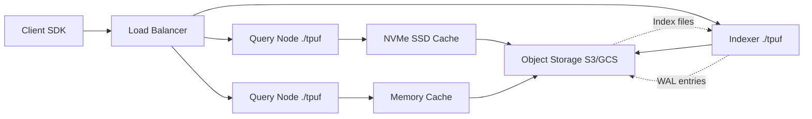
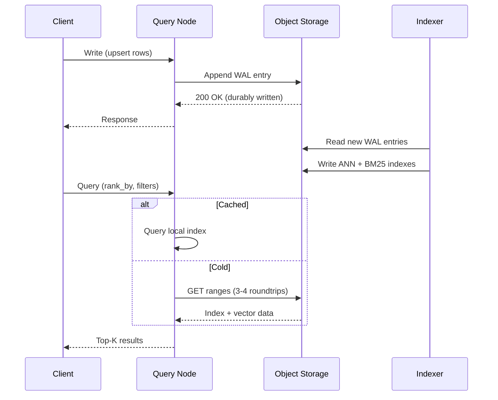

# What is Turbopuffer

Turbopuffer is a serverless vector and full-text search database built on object storage (S3/GCS). It replaces the traditional model of provisioned compute and storage with a design where **all durable state lives in object storage and compute nodes are stateless**. This eliminates the consensus layer that every other distributed database requires, making it 10x cheaper at scale.

## The Problem It Solves

Vector databases traditionally face a fundamental tension: **graph-based indexes (HNSW, DiskANN) require tight coupling between compute and storage** to achieve low latency. They store index files on local SSDs, replicate across nodes, and run consensus protocols to maintain consistency. This is expensive — you pay for provisioned compute 24/7 even when idle, and storage is locked to specific nodes.

Turbopuffer flips this: object storage is the only stateful dependency. **Any node can serve queries for any namespace**. No consensus, no replication management, no node-local state to recover on restart.

## Architecture at a Glance

Three tiers of storage form a cache hierarchy:

| Tier | Latency | Purpose |
|------|---------|---------|
| Object Storage (S3/GCS) | ~100ms per roundtrip | Source of truth, all durable data |
| NVMe SSD | ~1ms | Recently queried namespaces |
| Memory | ~10μs | Frequently accessed namespaces |

Cold queries (first query to a namespace) take ~400ms — three to four roundtrips to object storage. Warm queries (cached on NVMe or memory) take **8ms p50** on 1M documents.

## Core Design Decisions

**Centroid-based index (SPFresh) over graph-based (HNSW).** Centroids minimize roundtrips to object storage: download the centroid index, find closest centroids, then fetch all vectors in those clusters in one large ranged read. Graph indexes like HNSW require many small, random reads that multiply object storage latency.

**Write-ahead log on object storage.** Every write appends a file to the namespace's WAL directory. If the write returns, data is durably on S3. No two-phase commit, no Raft, no Paxos. Object storage's own consistency guarantees are sufficient.

**Multi-tenant compute.** Each `./tpuf` binary handles requests for many tenants. This keeps costs low by amortizing compute across namespaces with different traffic patterns.

**Aha:** The entire system works because object storage APIs (S3 GET with `If-Match`, conditional PUT) provide enough consistency primitives to build a database on top of them. The innovation is not a new storage engine — it's recognizing that S3 is already a distributed, consistent, highly-available key-value store, and building a query engine that works with its strengths (large sequential reads) instead of fighting its weaknesses (high per-request latency).

## Key Capabilities

- **Vector search** — ANN via SPFresh, dense (f32, f16) and sparse vectors, up to 10,752 dimensions
- **Full-text search** — BM25 ranking, phrase queries, token-based filtering
- **Hybrid search** — Combine vector + BM25 in a single query via `rank_by` expressions
- **Native filtering** — Attribute indexes aware of vector clustering, no recall loss
- **Aggregations** — Aggregate results by attribute values
- **Multi-query** — Up to 16 queries per request
- **Namespace pinning** — Reserved compute + NVMe for predictable performance

## Production Scale

Turbopuffer handles **3.5 trillion+ documents** across **13+ petabytes** of data, with **10M+ writes/s** at 32 GB/s throughput and **25k+ queries/s** globally.

## Query and Write Flow

## Source

The codebase at `@formulas/src.rust/src.turbopuffer/` contains the official SDKs, a semantic code search CLI (`turbogrep`), benchmark tools, and an API code generator. The production service itself runs as compiled Rust binaries (`./tpuf`) behind load balancers.

Source paths for key reference points:

Source: `turbogrep/src/turbopuffer.rs:14-26` — `TURBOPUFFER_REGIONS` constant listing all 11 GCP/AWS regions.
Source: `turbogrep/src/turbopuffer.rs:32-47` — HTTP client configuration (HTTP/2, brotli, connection pooling).
Source: `turbogrep/src/turbopuffer.rs:199-200` — Batch constants: `BATCH_SIZE = 1000`, `CONCURRENT_REQUESTS = 4`.
Source: `turbogrep/src/lib.rs:1-30` — Module exports, verbose logging macros.

See [System Architecture](01-architecture.md) for the full write and query paths.
