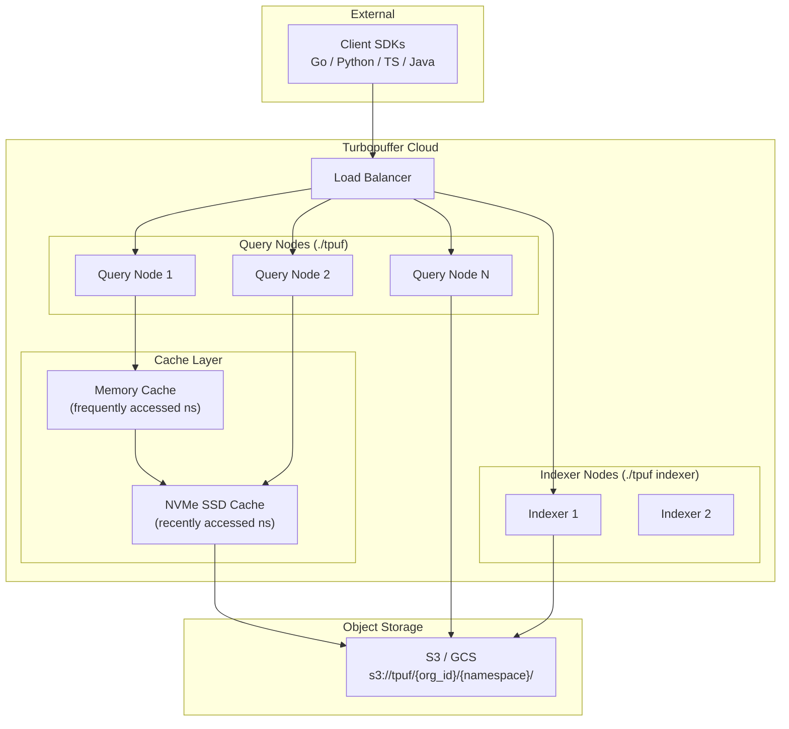
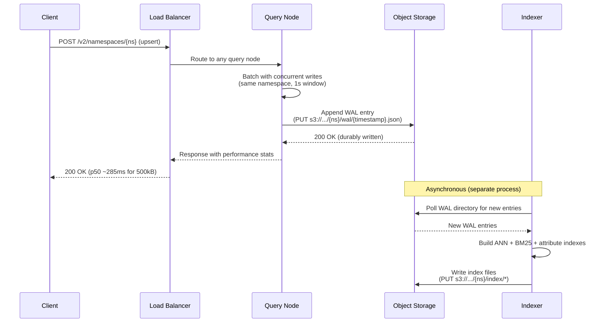
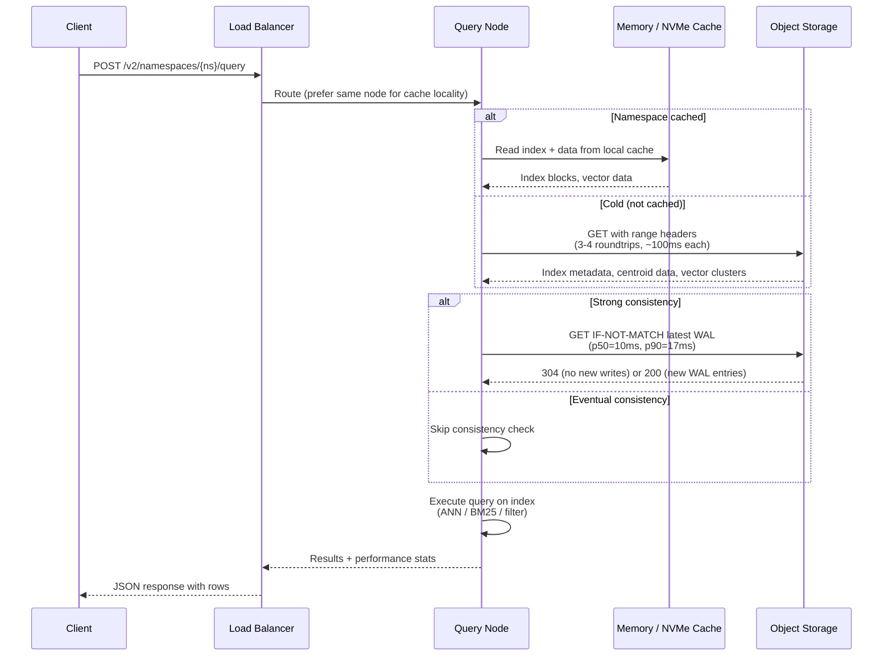

# System Architecture

Turbopuffer's architecture is defined by a single principle: **compute and storage are fully separated, and object storage is the only stateful dependency**. This eliminates the need for a consensus plane, node-local recovery, and replication management.

## Component Map



All components run the same Rust binary (`./tpuf`), just with different subcommands. Query nodes handle reads and writes. Indexer nodes consume the WAL and build indexes.

## The Write Path



**Key facts:**

- Each namespace can write **1 WAL entry per second**. Concurrent writes within that window are batched into a single entry.
- Write latency: p50 = 285ms for 500kB. The latency is dominated by the S3 PUT roundtrip, not computation.
- Data in the WAL but not yet indexed is still searchable via **exhaustive search** — the query node scans recent WAL entries directly.
- Upsert is atomic: all rows in a batch are applied simultaneously. Partial failures do not exist.

Source: `turbogrep/src/turbopuffer.rs:191` — `write_chunks()` streams batches of 1000 chunks with 4 concurrent requests, encoding vectors as base64 f32 little-endian bytes.

## The Query Path



**Cold query breakdown (~400ms total):**
1. Download centroid index from object storage (~100ms)
2. Find closest centroids locally (<1ms)
3. Fetch vectors for closest clusters in one ranged read (~100ms)
4. Execute distance computation locally (<1ms)
5. Check for newer WAL entries (consistency check, ~100ms)
6. Return results

**Warm query breakdown (~8ms total):**
1. Read index from memory/NVMe cache (<1ms)
2. Execute query locally (<5ms)
3. Consistency check (~10ms, can be skipped with eventual consistency)

Source: `turbogrep/src/turbopuffer.rs:350` — `query_chunks()` sends `rank_by`, `top_k`, `exclude_attributes`, and `consistency: { level: "eventual" }` in the request body.

## Cache Hierarchy

The three-tier cache is managed automatically:

| Tier | Capacity | Promotion | Demotion |
|------|----------|-----------|----------|
| Memory | GBs per node | Frequently accessed namespaces | LRU, evicted under memory pressure |
| NVMe SSD | TBs per node | Any queried namespace (after first query) | LRU, evicted under disk pressure |
| Object Storage | Unlimited (source of truth) | N/A | N/A |

After the first query to a namespace, data is cached on the querying node's NVMe SSD. Subsequent queries are routed to the same node (via load balancer affinity) for cache locality. Frequently accessed namespaces are promoted to memory.

**Aha:** The cache is **lazy and query-driven**. Unlike traditional databases that pre-load or pre-warm data, turbopuffer only caches namespaces that are actively queried. This is why it can scale to millions of namespaces without proportional memory costs — the working set is determined by actual query patterns, not total data size.

## Multi-Tenancy Model

Each `./tpuf` binary handles multiple tenants (namespaces). This is different from single-tenant architectures where each customer gets dedicated compute.

Benefits:
- Compute is amortized across namespaces with different traffic patterns
- Idle namespaces consume zero compute (only storage costs)
- Auto-scaling adds or removes query/indexer nodes based on global demand

Trade-offs:
- Noisy neighbor potential (mitigated by resource limits per namespace)
- Namespace pinning available for dedicated resources (see [Pricing](09-pricing-and-limits.md))

## Namespace Isolation

Each namespace has its own prefix in object storage: `s3://tpuf/{org_id}/{namespace}/`. Within that prefix:

```
s3://tpuf/{org_id}/{namespace}/
├── wal/           # Write-ahead log entries (JSON files)
├── index/         # Built indexes (ANN, BM25, attributes)
└── metadata       # Namespace configuration
```

Namespaces are fully isolated — no shared state, no cross-namespace queries. This isolation is what enables any node to serve any namespace without data migration.

See [S3 Storage Engine](02-storage-s3.md) for the detailed WAL and index file formats.
