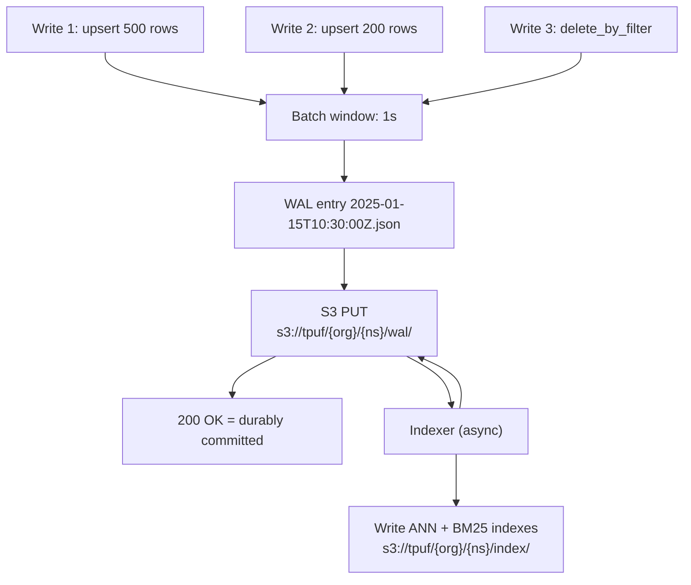
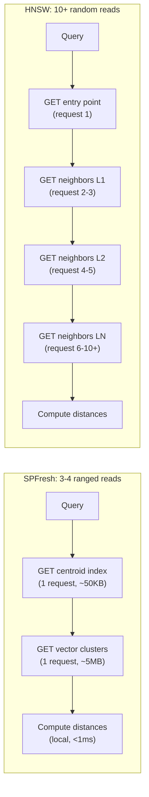

# S3 Storage Engine

Turbopuffer's entire storage strategy is built around one insight: **object storage is already a distributed, consistent, highly-available key-value store**. Rather than building a database on top of block storage with its own replication and consensus, turbopuffer uses S3/GCS APIs as the foundational layer.

## Why Object Storage Works as a Database Foundation

Traditional databases avoid object storage because of its latency: ~100ms per GET/PUT roundtrip. But object storage provides guarantees that are hard to build in a distributed system:

| Property | S3/GCS Guarantee | How Turbopuffer Uses It |
|----------|-----------------|------------------------|
| Durability | 11 nines (99.999999999%) | WAL entries are immediately durable |
| Consistency | Strong read-after-write | No need for consensus protocols |
| Conditional operations | `If-Match`, `If-None-Match` | Detect new writes for consistency checks |
| Unlimited scale | No capacity limits | Unlimited namespaces, unlimited documents |
| Cheap storage | ~$23/TB/month (S3 Standard) | 10x cheaper than provisioned SSDs |

**Aha:** The write amplification problem that kills graph-based indexes on object storage is solved by using a centroid-based index (SPFresh). HNSW requires many small random reads — each hop in the graph is a separate object storage request, multiplying latency. SPFresh downloads the centroid index once, finds the right clusters, then fetches all vectors in those clusters in **one massive ranged read**. Fewer roundtrips = lower latency.

## The WAL (Write-Ahead Log) Pattern

Every namespace has a WAL directory in object storage. Writes append files rather than modifying existing ones:



```
s3://tpuf/{org_id}/{namespace}/wal/
├── 2025-01-15T10:30:00Z.json    # WAL entry 1
├── 2025-01-15T10:30:01Z.json    # WAL entry 2
├── 2025-01-15T10:30:05Z.json    # WAL entry 3 (batched writes from :02 to :05)
└── ...
```

**How it works:**

1. Client sends an upsert request to a query node
2. Query node batches concurrent writes for the same namespace within a 1-second window
3. Batch is written as a single WAL entry (JSON file) to object storage
4. S3 returns 200 OK — data is now durably committed
5. Response returns to client (p50 ~285ms for 500kB)
6. Indexer nodes asynchronously pick up new WAL entries and build indexes

**WAL entry rate:** Each namespace can write 1 WAL entry per second. If a new batch starts within one second of the previous commit, it takes up to 1 second to commit. Concurrent writes are batched together.

**Unindexed data is still searchable:** WAL entries that haven't been indexed yet can be scanned exhaustively during queries. This means writes are immediately queryable, just with higher latency until the indexer catches up.

Source: `turbogrep/src/turbopuffer.rs:191-234` — `write_chunks()` demonstrates the client-side batch pattern: stream chunks in batches of 1000, 4 concurrent requests, with optional `delete_by_filter` in the first batch.

## Columnar Storage Format

Turbopuffer stores data in a columnar layout optimized for ranged reads. Instead of storing entire documents as single objects, each attribute is stored separately:

```
s3://tpuf/{org_id}/{namespace}/index/
├── vectors/          # Vector data, stored as contiguous f32 bytes
│   ├── cluster_0.bin
│   ├── cluster_1.bin
│   └── ...
├── bm25/             # BM25 inverted index
│   ├── postings.bin  # Term -> document mappings
│   ├── dictionary.bin
│   └── ...
├── attributes/       # Attribute indexes (filterable fields)
│   ├── attr_name_1/
│   └── attr_name_2/
└── metadata.json     # Index configuration
```

**Why columnar works for object storage:**

- **Small ranged reads:** A query for vectors in cluster 5 reads only `cluster_5.bin`, not the entire namespace. S3 `GET` with `Range` headers fetches exactly the bytes needed.
- **Compression per column:** Vectors, text, and numeric attributes compress differently. Columnar storage allows per-column compression optimization.
- **Selective loading:** Filtering on `user_id` only loads the `user_id` column, not vector data or full-text indexes.

## Efficient S3 Access Patterns

Turbopuffer optimizes for object storage's strengths and works around its weaknesses:

### Ranged Read vs Random Read



### Strength: Large Sequential Reads

Object storage throughput scales with object size. A single 10MB GET request is much faster (in bytes/ms) than 1000 10KB GET requests.

Turbopuffer leverages this by:
- Packing vector clusters into contiguous binary blobs
- Batching WAL entries to reduce the number of PUT operations
- Using base64-encoded f32 vectors (see below)

### Weakness: Per-Request Latency

Each S3 GET/PUT has ~100ms latency regardless of object size.

Turbopuffer minimizes this by:
- Reducing roundtrip count (SPFresh needs 3-4 roundtrips vs HNSW's 10+)
- Caching aggressively (NVMe after first query, memory for hot namespaces)
- Using HTTP/2 keep-alive and connection pooling

Source: `turbogrep/src/turbopuffer.rs:32-47` — HTTP client configuration with `pool_max_idle_per_host(8)`, `pool_idle_timeout(30s)`, `http2_keep_alive_interval(30s)`, `tcp_nodelay(true)`, and `brotli(true)`.

### Vector Encoding: Base64 f32 Little-Endian

Vectors are transmitted as base64-encoded f32 little-endian byte arrays, not JSON arrays of floats:

Source: `turbogrep/src/turbopuffer.rs:133-141`:
```rust
fn vector_to_base64(vector: &[f32]) -> String {
    let mut bytes = Vec::with_capacity(vector.len() * 4);
    for &f in vector {
        bytes.extend_from_slice(&f.to_le_bytes());
    }
    general_purpose::STANDARD.encode(&bytes)
}
```

**Why this matters for S3 efficiency:**
- JSON array of 1536 floats: `"vector": [0.123, -0.456, 0.789, ...]` — each float is ~6-8 bytes of ASCII text
- Base64 f32 bytes: 1536 * 4 = 6144 bytes → ~8192 bytes base64
- Savings: ~50-60% smaller payload per vector
- For 10M vectors at 1536 dimensions: saves ~30GB of transfer

The `USE_BASE64_VECTORS: bool = true` flag in the codebase controls this.

## Compression

Turbopuffer uses multiple compression strategies:

| Data Type | Compression | Rationale |
|-----------|-------------|-----------|
| Vectors | Product Quantization (PQ) | Reduces 1536-dim f32 vectors to ~10% of original size |
| WAL entries | Brotli | Text-heavy JSON compresses well with Brotli |
| BM25 postings | Varint encoding + block compression | Integer sequences compress efficiently |
| Attribute indexes | Bitmap compression | Boolean/equality attributes compress to bitmaps |

HTTP-level compression (brotli) is enabled on all API requests, providing an additional layer of compression for data in transit.

## Distributed Queue on Object Storage

Turbopuffer's indexing queue is implemented as a single JSON file on object storage. Indexer nodes read this file to discover new WAL entries that need indexing.

Key design:
- The queue file tracks which WAL entries have been indexed
- Multiple indexer nodes can work concurrently using atomic updates
- No separate message broker (Kafka, SQS) needed — S3's conditional writes provide enough coordination

This is described in the blog post "How to build a distributed queue in a single JSON file on object storage" (Feb 12, 2026).

**Aha:** The entire system has no message queues, no consensus layer, no distributed lock manager. It uses S3's native consistency and conditional write semantics as the coordination primitive. This is possible because the workload is append-heavy (WAL entries) with occasional index rebuilds — not the random read-write workload that requires consensus.

See [Vector Index: SPFresh](03-vector-index.md) for how the centroid-based index works on this columnar storage, and [Full-Text Search](04-full-text-search.md) for the BM25 inverted index design.
