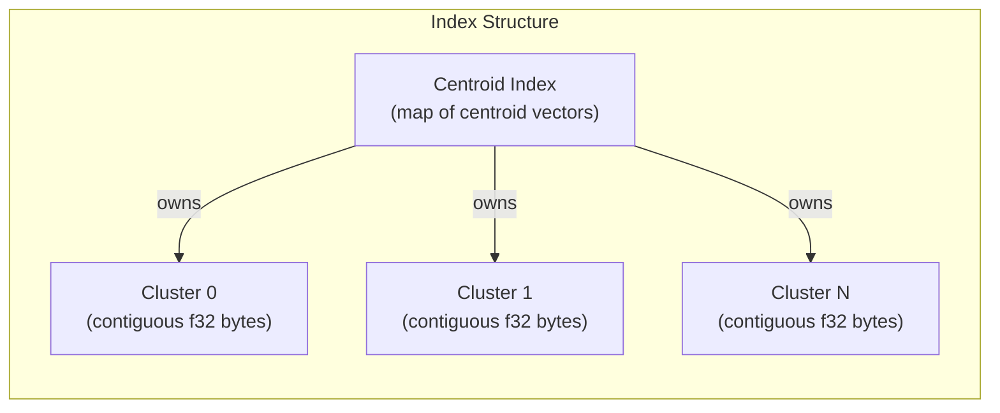

# Vector Index: SPFresh

Turbopuffer's vector index uses **SPFresh**, a centroid-based approximate nearest neighbor (ANN) algorithm optimized for object storage. It achieves **90-100% recall@10** with significantly fewer object storage roundtrips than graph-based alternatives.

## Centroid-Based vs Graph-Based Indexes

```mermaid
flowchart TD
    subgraph "Centroid-Based SPFresh"
        Q1["Query vector"] --> C1["Download centroid index<br/>(1 roundtrip)"]
        C1 --> C2["Find K closest centroids<br/>(local computation)"]
        C2 --> C3["Fetch all vectors in<br/>closest centroids (1 roundtrip)"]
        C3 --> C4["Compute distances locally<br/>(no roundtrips)"]
        C4 --> C5["Return top-K results"]
    end
    
    subgraph "Graph-Based HNSW"
        Q2["Query vector"] --> G1["Download entry point<br/>(1 roundtrip)"]
        G1 --> G2["Traverse graph layer 1<br/>(1+ roundtrips per hop)"]
        G2 --> G3["Traverse graph layer 2<br/>(1+ roundtrips per hop)"]
        G3 --> G4["Traverse graph layer N<br/>(1+ roundtrips per hop)"]
        G4 --> G5["Compute distances on<br/>visited nodes"]
        G5 --> G6["Return top-K results"]
    end
```

| Property | SPFresh (Centroid) | HNSW (Graph) | DiskANN (Graph+SSD) |
|----------|-------------------|--------------|---------------------|
| Roundtrips (cold) | 3-4 | 10+ | N/A (local SSD) |
| Cold p99 latency | ~200ms | ~1s+ | ~5ms |
| Write amplification | Low (append-only) | High (graph rebuilds) | Moderate |
| Recall@10 | 90-100% | 95-99% | 95-99% |
| Object storage friendly | Yes | No | No |

**Why centroids win on object storage:**

A graph-based index like HNSW requires navigating layers of a proximity graph. Each hop requires fetching the neighbors of the current node — on a local SSD this is fast, but on object storage each hop is a separate GET request with ~100ms latency. A 10-hop traversal takes 1+ seconds.

A centroid-based index partitions vectors into clusters. The query first identifies which centroids are closest (one download), then fetches all vectors in those clusters (one ranged read). Two large downloads replace dozens of small ones.

Source: `turbogrep/src/turbopuffer.rs:350-399` — `query_chunks()` uses `rank_by: ["vector", "ANN", query_vector]` which triggers SPFresh's centroid lookup + vector fetch on the server side.

## SPFresh Architecture

**Index components:**

1. **Centroid Index** — A map of centroid vectors, each representing the "center" of a cluster. Small enough to download entirely (~KBs to MBs depending on namespace size).

2. **Vector Clusters** — Each cluster stores its vectors as a contiguous binary blob (`cluster_N.bin`). Vectors within a cluster are stored as raw f32 little-endian bytes, enabling efficient ranged reads.

3. **Cluster Metadata** — Size, bounding boxes, and statistics for each cluster, used to prune clusters that cannot contain nearest neighbors.

**Query algorithm:**

1. Download the centroid index from object storage
2. Compute distance from query vector to each centroid (local, <1ms)
3. Select the K closest centroids
4. Issue one ranged GET to fetch all vectors in those clusters
5. Compute exact distances locally
6. Return top-K results

**Aha:** SPFresh trades a small amount of recall for dramatically fewer roundtrips. By only searching the closest centroids, it misses vectors in distant clusters that might be closer. But at 90-100% recall@10, this tradeoff is negligible for most applications — and the 5-10x latency improvement is massive.

## Continuous Recall Measurement

Turbopuffer measures recall continuously in production, not just during benchmarks. The "Continuous recall measurement" blog post (Sep 4, 2024) describes how:

- A held-out set of queries with known ground truth is run periodically
- Recall@10 is measured against exact search results
- Index parameters are adjusted automatically if recall drops below thresholds

This is critical because centroid-based indexes can degrade over time as data distribution shifts. Continuous measurement catches this before users notice.

## ANN v3: 200ms p99 Over 100 Billion Vectors

The ANN v3 index (Jan 21, 2026) achieved p99 query latency of 200ms over 100 billion vectors. Key improvements:

- Better centroid initialization (k-means++ variant for more balanced clusters)
- Hierarchical centroids (two-level hierarchy for billion-scale namespaces)
- Improved vector packing within clusters (SIMD-optimized distance computation)
- Better cache utilization in query nodes

## Vector Dimensions and Types

| Type | Max Dimensions | Storage |
|------|---------------|---------|
| Dense (f32) | 10,752 | 4 bytes per dimension |
| Dense (f16) | 10,752 | 2 bytes per dimension (50% savings) |
| Sparse | 30,522 total, 1,024 per vector | Coordinate format (index, value) |

Sparse vectors use coordinate format: `[(index_0, value_0), (index_1, value_1), ...]`. The total unique indices across all sparse vectors in a namespace is limited to 30,522, with at most 1,024 non-zero entries per vector.

**Source paths:**
- `turbogrep/src/turbopuffer.rs:263-269` — Upsert request body with `distance_metric: "cosine_distance"` and schema definitions
- `turbogrep/src/turbopuffer.rs:144-155` — `ChunkForUpload` (private struct, internal serialization only) with vector as optional `serde_json::Value`

See [Full-Text Search](04-full-text-search.md) for how BM25 complements the vector index, and [Native Filtering](05-native-filtering.md) for how attribute indexes interact with the centroid structure.
