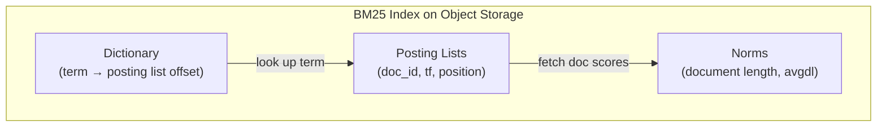
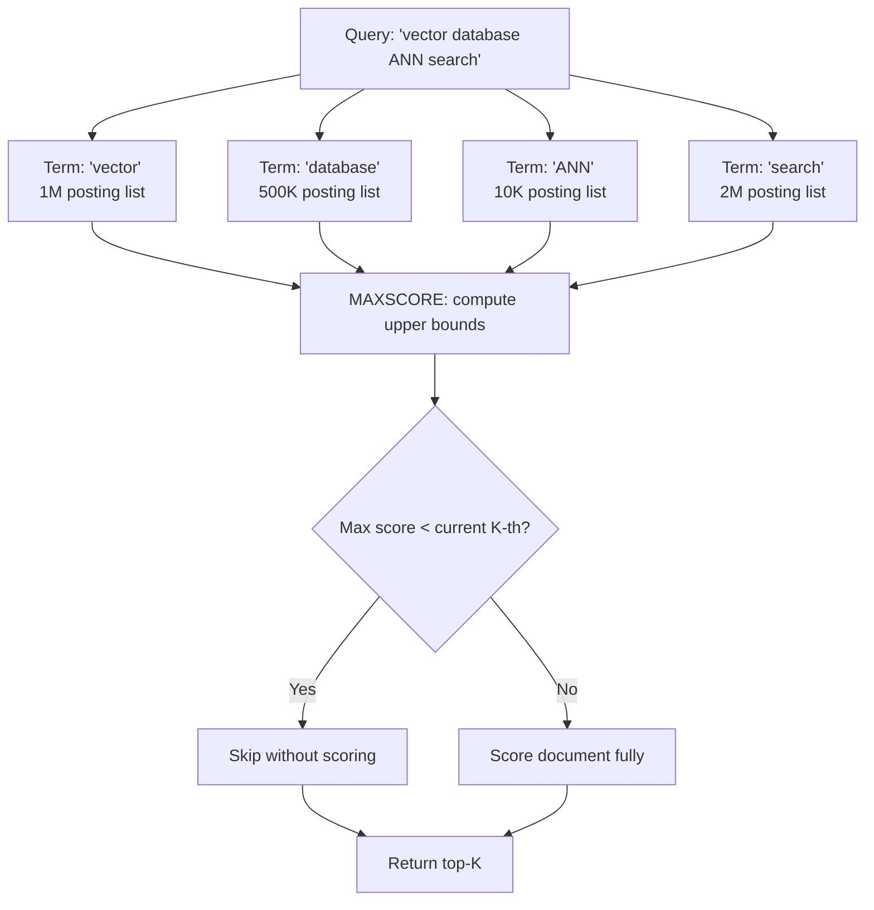

# Full-Text Search: BM25

Turbopuffer's full-text search uses the **BM25 (Best Matching 25)** ranking algorithm, implemented as inverted indexes stored on object storage. FTS v2 (Dec 4, 2025) delivered up to 20x faster full-text search through index redesign.

## BM25 Algorithm

BM25 is a probabilistic ranking function that scores documents based on query term frequency, inverse document frequency, and document length normalization:

```
score(D, Q) = Σ IDF(q_i) * (TF(q_i, D) * (k1 + 1)) / (TF(q_i, D) + k1 * (1 - b + b * |D|/avgdl))
```

Where:
- `TF(q_i, D)` = term frequency of query term `q_i` in document `D`
- `IDF(q_i)` = inverse document frequency of `q_i`
- `|D|` = document length
- `avgdl` = average document length across the corpus
- `k1` = term frequency saturation parameter (default ~0.9 in turbopuffer)
- `b` = document length normalization parameter (default ~0.4 in turbopuffer)

Source: `search-benchmark-game/engines/turbopuffer/src/bin/build_index.rs` — Schema uses `full_text_search` with BM25 parameters `k1=0.9, b=0.4`.

## Inverted Index Design on Object Storage

The challenge: BM25 traditionally relies on an in-memory inverted index where each term maps to a posting list of document IDs. On object storage, this requires storing and retrieving posting lists efficiently.



**Storage layout:**

```
s3://tpuf/{org_id}/{namespace}/index/bm25/
├── dictionary.bin     # Term → (offset, length, doc_freq) in postings file
├── postings.bin       # Contiguous posting lists for all terms
├── norms.bin          # Document length normalization factors
└── metadata.json      # k1, b, total documents, average doc length
```

**Query execution:**

1. Parse query into tokens
2. For each token, look up in dictionary (download dictionary or cache it)
3. For each matching term, fetch its posting list from object storage
4. Score documents using BM25 formula
5. Return top-K results

### FTS v2 Improvements

FTS v2 (Dec 4, 2025) achieved up to 20x speedup through:

- **Dictionary caching:** The term dictionary is cached in memory, eliminating one object storage roundtrip per query
- **Compressed posting lists:** Varint encoding for document IDs and term frequencies reduces data transfer
- **Block-level pruning:** Posting lists are organized in blocks; blocks that cannot contribute to top-K results are skipped

## Why BM25 Queries with More Terms Can Be Faster

Counterintuitively, BM25 queries with more terms can be faster than single-term queries. The blog post "Why BM25 queries with more terms can be faster" (Jan 7, 2026) explains:

With a single-term query, the posting list might contain millions of documents. The engine must score all of them.

With a multi-term query, the engine can use **MAXSCORE** or **WAND** (Weak AND) algorithms to skip documents that cannot possibly be in the top-K:

- If a document only contains 1 of 5 query terms, its maximum possible score is bounded
- If that bound is below the current K-th best score, the document is skipped without scoring

This means a 5-term query that narrows results to 100 documents can be faster than a 1-term query that matches 1M documents.



## Vectorized MAXSCORE over WAND

The blog post "Vectorized MAXSCORE over WAND, especially for long LLM-generated queries" (Dec 9, 2025) describes:

- **WAND** processes posting lists sequentially, advancing the list with the smallest document ID
- **MAXSCORE** separates essential terms (must be scored) from non-essential terms (can be pruned)
- **Vectorized MAXSCORE** uses SIMD instructions to score multiple documents in parallel

For LLM-generated queries (which can have 20+ terms), vectorized MAXSCORE is significantly faster because:
- More terms = more pruning opportunities in MAXSCORE
- SIMD processes 4-8 documents per instruction cycle
- Long queries have more non-essential terms that can be skipped

Source: `search-benchmark-game/engines/turbopuffer/src/bin/do_query.rs` — Query execution uses `rank_by: ["text", "BM25", query]` with `ContainsAllTokens` and `ContainsAnyToken` filters.

## Designing Inverted Indexes in a KV-Store

The blog post "Designing inverted indexes in a KV-store on object storage" (Jan 14, 2026) describes how turbopuffer's inverted indexes are designed to work within the constraints of a key-value store on object storage:

- **Term dictionary as a sorted key-value map:** Terms are sorted, enabling range scans for prefix queries
- **Posting lists as values:** Each term maps to a compressed posting list
- **Block-based organization:** Posting lists are split into blocks, each addressable independently
- **KV-store awareness:** The index layout is designed so that small, targeted KV reads replace full file downloads

This differs from traditional search engines (Lucene, Tantivy) that store everything in monolithic segment files. On object storage, a KV-store layout allows fetching only the specific terms needed for a query.

## Mixing Numeric Attributes into Text Search

The blog post "Mixing numeric attributes into text search for better first-stage relevance" (Apr 27, 2026) describes how numeric attributes can be incorporated into the BM25 scoring function, improving relevance for queries like "recent articles about X" or "high-rated products matching Y."

## BM25 in the Benchmark Game

The `search-benchmark-game` compares turbopuffer's BM25 against 33 search engine versions (Lucene, Tantivy, Bleve, Bluge, PISA, Rucene):

Source: `search-benchmark-game/engines/turbopuffer/src/bin/build_index.rs`:
```rust
// Schema with BM25 configuration
"schema": {
    "text": {
        "full_text_search": {
            "bm25": { "k1": 0.9, "b": 0.4 }
        }
    }
}
```

Benchmark methodology:
- Single-threaded, 10 runs, best score kept (GC-insensitive)
- English Wikipedia corpus with AOL-derived queries
- Query types: intersection, union, phrase
- Collection modes: COUNT, TOP 10, TOP 10 + COUNT

**Aha:** BM25 on object storage works because the inverted index's access pattern is fundamentally different from the vector index's. BM25 queries are term-driven — you know exactly which posting lists you need before executing the query. This means you can fetch only the relevant data from object storage, rather than navigating an unknown graph structure. The KV-store layout exploits this by making each term independently addressable.

See [Native Filtering](05-native-filtering.md) for how attribute indexes combine with BM25 for filtered text search, and [Performance Benchmarks](10-performance.md) for how turbopuffer's BM25 compares against Lucene and Tantivy.
