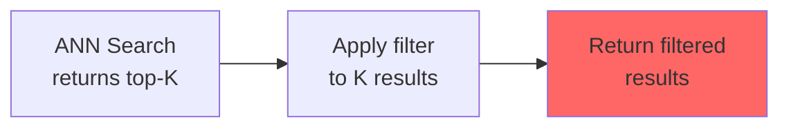
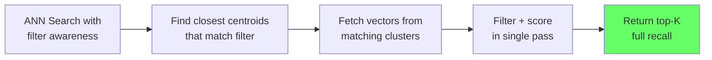

# Native Filtering

Turbopuffer's native filtering system builds inverted indexes for filterable attributes that are **aware of the primary vector index's clustering hierarchy**. This enables high-recall filtered vector searches, unlike post-filtering approaches that sacrifice recall for speed.

## The Post-Filtering Problem

Most vector databases implement filtering as a post-processing step:



**The problem:** If your filter matches only 10% of documents, and you request top-10 results, the ANN search returns 10 unfiltered results — of which only 1 might pass the filter. You end up with 1 result instead of 10.

To compensate, databases either:
1. Fetch top-K*N results (wasteful, N is unknown)
2. Sacrifice recall (return fewer results than requested)

## Native Filtering Architecture

Turbopuffer's native filtering builds attribute indexes that understand the vector clustering:



**How it works:**

1. Attribute indexes are inverted indexes, one per filterable attribute
2. Each posting list in the attribute index maps attribute values to document IDs
3. The attribute index knows which centroid each document belongs to
4. During query: the engine finds centroids that contain documents matching the filter, then fetches only those vectors

Source: `turbogrep/src/turbopuffer.rs:350-371` — `query_chunks()` sends optional `filters` as a JSON value using turbolisp syntax: `["path", "Eq", "src/main.rs"]`.

## Filter Syntax

Filters use a nested S-expression DSL ("turbolisp"):

```json
["And", [
  ["user_id", "Eq", "user-123"],
  ["Or", [
    ["status", "Eq", "active"],
    ["status", "Eq", "pending"]
  ]],
  ["created_at", "Gt", 1700000000]
]]
```

**Supported operators:**

| Operator | Description | Example |
|----------|-------------|---------|
| `Eq` | Equality | `["status", "Eq", "active"]` |
| `NotEq` | Not equal | `["status", "NotEq", "deleted"]` |
| `Gt` | Greater than | `["price", "Gt", 100]` |
| `Gte` | Greater than or equal | `["rating", "Gte", 4.0]` |
| `Lt` | Less than | `["age", "Lt", 30]` |
| `Lte` | Less than or equal | `["age", "Lte", 65]` |
| `In` | Set membership | `["category", "In", ["A", "B"]]` |
| `NotIn` | Set non-membership | `["status", "NotIn", ["banned"]]` |
| `ContainsAllTokens` | Full-text: all tokens | `["text", "ContainsAllTokens", "vector search"]` |
| `ContainsAnyToken` | Full-text: any token | `["text", "ContainsAnyToken", "vector search"]` |
| `Glob` | Glob pattern | `["path", "Glob", "*.rs"]` |
| `Regex` | Regular expression | `["email", "Regex", ".*@example.com"]` |

**Logical operators:** `And`, `Or`, `Not` — nest arbitrarily deep.

## Schema Configuration

Attributes must be declared as filterable in the schema:

```json
{
  "schema": {
    "user_id": "string",
    "status": "string",
    "price": "float",
    "vector": "float"
  }
}
```

Attributes marked `filterable: false` (or not declared in schema) get a **50% storage discount** and improve indexing performance, since no attribute index is built for them.

Source: `turbogrep/src/turbopuffer.rs:266-269` — Schema declaration in upsert:
```rust
"schema": {
    "file_hash": "uint",
    "chunk_hash": "uint"
}
```

## Attribute Index Storage

Attribute indexes are stored alongside the vector and BM25 indexes:

```
s3://tpuf/{org_id}/{namespace}/index/attributes/
├── user_id/
│   ├── dictionary.bin    # value → posting list offset
│   └── postings.bin      # posting lists (doc_ids, centroid_ids)
├── status/
│   ├── dictionary.bin
│   └── postings.bin
└── price/
    ├── dictionary.bin
    └── postings.bin
```

Each posting entry stores both the document ID and the centroid ID, enabling the query engine to determine which vector clusters contain matching documents.

## Native Filtering + BM25

Native filtering also works with BM25 full-text search. When combining filters with text search:

1. The filter is evaluated first, producing a set of matching document IDs
2. BM25 scoring is restricted to documents in that set
3. The MAXSCORE/WAND algorithms can skip documents that don't pass the filter

This is more efficient than post-filtering because the filter prunes the search space before BM25 scoring begins.

**Aha:** Native filtering works because the attribute index and vector index share the same clustering structure. If they were independent, the engine would need to cross-reference two separate data structures for every document. By building attribute indexes that "know about" vector centroids, the engine can prune at the centroid level before fetching any vector data from object storage. This is the same principle as index-only scans in relational databases — if the index contains all the information needed to answer the query, the table (or in this case, the vector clusters) is never touched.

Source: `turbogrep/src/turbopuffer.rs:272-293` — `delete_by_filter` uses the same filter syntax:
```rust
let filters: Vec<_> = stale_paths
    .iter()
    .map(|p| serde_json::json!(["path", "Eq", p]))
    .collect();
let delete_filter = if filters.len() == 1 {
    filters[0].clone()
} else {
    serde_json::json!(["Or", filters])
};
request_body["delete_by_filter"] = delete_filter;
```

See [Full-Text Search](04-full-text-search.md) for BM25 details, and [API & SDKs](07-api-and-sdks.md) for how filters are expressed in the SDK query APIs.
