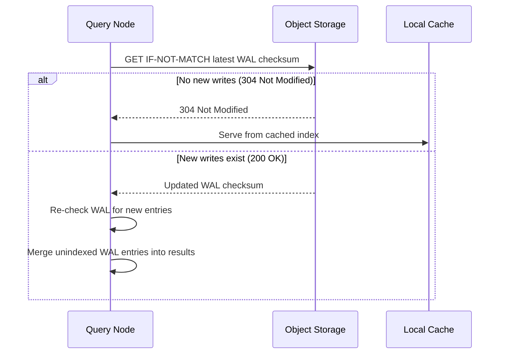
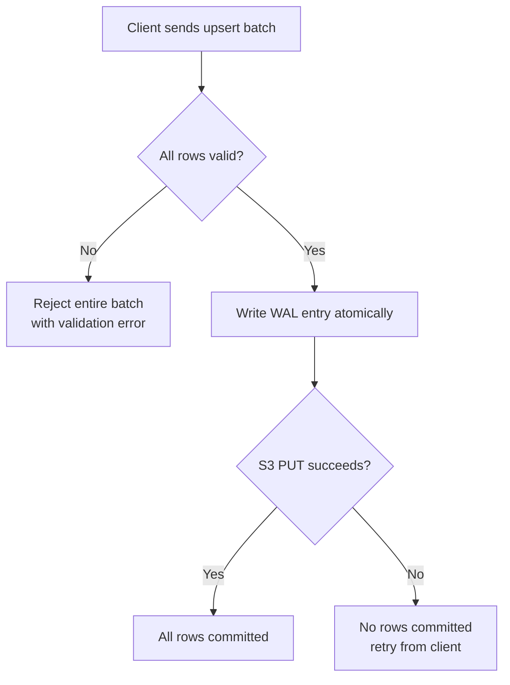

# Consistency Model

Turbopuffer provides **strong consistency by default** with an optional eventual consistency mode for lower latency on warm queries. The consistency model is built on top of the WAL pattern and object storage's native consistency guarantees.

## Strong Consistency (Default)

When you write data to turbopuffer, a subsequent query immediately sees that write. This is achieved through a consistency check on every query:



**How it works:**

1. Every WAL entry has a checksum (ETag or content hash)
2. Query nodes track the latest checksum they've seen for each namespace
3. Before serving a query, the node issues a conditional GET: `If-None-Match: <last_checksum>`
4. If S3 returns 304 Not Modified, no new writes exist — cached index is current
5. If S3 returns 200 OK with new checksum, there are new WAL entries — merge them into results

**Performance impact:**
- S3 conditional GET: p50 = 10ms, p90 = 17ms
- This adds ~10ms to every warm query's latency
- Cold queries are unaffected (they already read from S3)

Source: `turbogrep/src/turbopuffer.rs:362-367` — Query with eventual consistency:
```json
{
    "rank_by": ["vector", "ANN", query_vector],
    "top_k": 10,
    "exclude_attributes": ["vector"],
    "consistency": { "level": "eventual" }
}
```

## Eventual Consistency

Setting `consistency: { level: "eventual" }` skips the conditional GET check. The query runs against the cached index without verifying that newer WAL entries exist.

**Trade-offs:**
- Warm query latency drops by ~10ms (sub-10ms achievable)
- Staleness of up to ~1 hour in worst case (when namespace has >128MiB of outstanding writes)
- Over 99.8% of queries return consistent data even in eventual consistency mode (because the indexer usually keeps up)

**When to use eventual consistency:**
- Recommendation systems where freshness doesn't matter
- Batch analytics queries
- Pre-warmed namespaces where writes are infrequent

**When to use strong consistency:**
- User-facing search where new content should appear immediately
- Chat/agent contexts where new messages must be searchable
- Any workload where write-then-read is the common pattern

## Atomic Writes

All upsert operations are atomic — either all rows in the batch are applied, or none are. There are no partial failures.



Source: `turbogrep/src/turbopuffer.rs:263` — The upsert request body contains all rows in a single `"upsert_rows"` array, sent as one HTTP request.

## Conditional Writes

Turbopuffer supports conditional writes using the `upsert` semantics with ID-based matching:

- If a row with the same `id` exists, it is updated (upsert)
- If no row with that `id` exists, it is inserted

This enables atomic read-modify-write patterns when combined with the query API.

## Patch by Filter and Delete by Filter

Two operations extend the basic upsert/delete:

**`patch_by_filter`** — Update specific attributes of documents matching a filter:
```json
{
    "patch_by_filter": {
        "filter": ["status", "Eq", "pending"],
        "data": { "status": "processed" }
    }
}
```

**`delete_by_filter`** — Delete all documents matching a filter:
```json
{
    "delete_by_filter": ["Or", [
        ["path", "Eq", "src/old.rs"],
        ["path", "Eq", "src/deprecated.rs"]
    ]]
}
```

Source: `turbogrep/src/turbopuffer.rs:272-293` — `delete_by_filter` implementation in `write_batch()`:
```rust
if let Some(delete_chunks) = delete_chunks {
    if !delete_chunks.is_empty() {
        let stale_paths: Vec<String> = delete_chunks
            .into_iter()
            .map(|c| c.path)
            .collect::<HashSet<_>>()
            .into_iter()
            .collect();
        let filters: Vec<_> = stale_paths
            .iter()
            .map(|p| serde_json::json!(["path", "Eq", p]))
            .collect();
        let delete_filter = if filters.len() == 1 {
            filters[0].clone()
        } else {
            serde_json::json!(["Or", filters])
        };
        request_body["delete_by_filter"] = delete_filter;
    }
}
```

## ACID Properties

| Property | How Turbopuffer Achieves It |
|----------|---------------------------|
| **Atomicity** | Single WAL entry per batch — all or nothing |
| **Consistency** | WAL checksums + conditional GET ensure consistent reads |
| **Durability** | S3's 11-nines durability — once PUT returns, data is safe |
| **Isolation** | Conditional writes and filter-based operations prevent conflicts |

**Aha:** The consistency model is elegant because it doesn't try to make object storage behave like a database. Instead, it accepts object storage's latency characteristics (~10ms conditional GET) and builds the consistency protocol on top of them. The 99.8% strong consistency rate in eventual consistency mode is a happy side effect: the indexer is usually faster than users can write, so the gap between "written but not indexed" is typically seconds, not hours.

See [S3 Storage Engine](02-storage-s3.md) for the WAL pattern details, and [API & SDKs](07-api-and-sdks.md) for the full write API specification.
