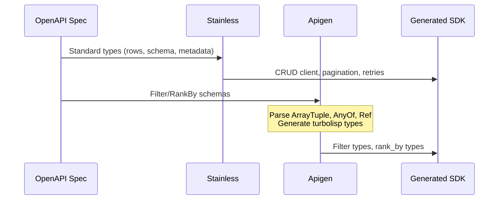
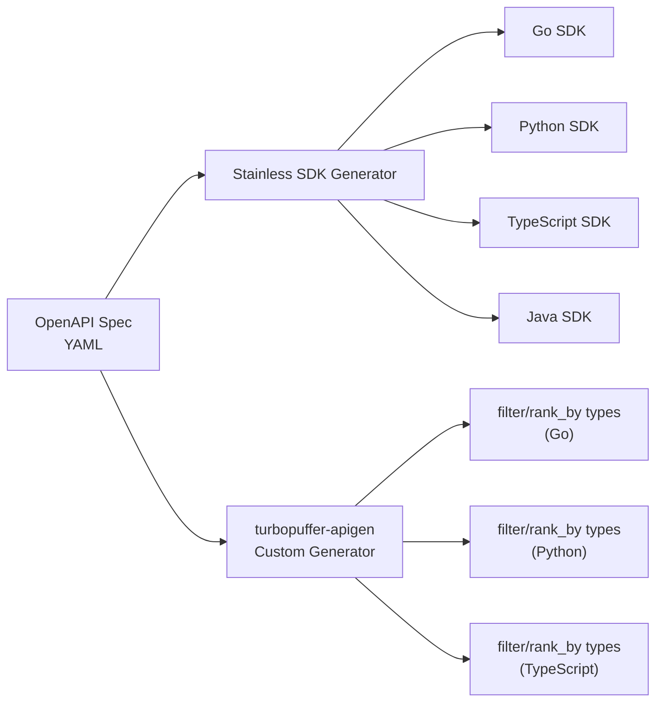

# API & SDKs

Turbopuffer provides a REST API and officially generated SDKs for Go, Python, TypeScript, and Java. The SDKs are generated from an OpenAPI specification using Stainless, with custom type generation for the filter and `rank_by` query syntax.

## REST API

**Base URL:** `https://{region}.turbopuffer.com/v2/namespaces/{namespace}`

**Authentication:** Bearer token via `TURBOPUFFER_API_KEY` environment variable.

### Core Endpoints

| Method | Path | Description |
|--------|------|-------------|
| `POST` | `/v2/namespaces/{ns}` | Upsert rows, delete by filter, set schema |
| `POST` | `/v2/namespaces/{ns}/query` | Query with ranking, filters, and consistency |
| `DELETE` | `/v2/namespaces/{ns}` | Delete entire namespace |
| `GET` | `/v2/namespaces/{ns}` | Get namespace metadata |
| `GET` | `/v2/namespaces` | List all namespaces |

### Write Request

```json
POST /v2/namespaces/{ns}
{
    "upsert_rows": [
        {
            "id": 123,
            "vector": "<base64 f32 bytes>",
            "path": "src/main.rs",
            "file_hash": 1234567890
        }
    ],
    "delete_by_filter": ["path", "Eq", "src/old.rs"],
    "distance_metric": "cosine_distance",
    "schema": {
        "file_hash": "uint",
        "path": "string"
    }
}
```

Source: `turbogrep/src/turbopuffer.rs:263-295` — Request body construction in `write_batch()`.

### Query Request

```json
POST /v2/namespaces/{ns}/query
{
    "rank_by": ["vector", "ANN", <query_vector>],
    "top_k": 10,
    "filters": ["status", "Eq", "active"],
    "consistency": { "level": "eventual" },
    "exclude_attributes": ["vector"]
}
```

Source: `turbogrep/src/turbopuffer.rs:362-371`.

### Additional Operations

| Operation | Description |
|-----------|-------------|
| Copy namespace | Create a copy of a namespace (for backups, migrations) |
| Export | Export all rows from a namespace |
| Warm cache | Pre-warm the cache for a namespace |
| Recall endpoint | Measure search recall quality |
| Aggregations | Aggregate results by attribute values |
| Multi-query | Up to 16 queries per request |

## SDK Generation: Stainless + Apigen

Turbopuffer uses a two-stage code generation approach:



### How Apigen Works



**Why two generators?**

Stainless handles the standard CRUD types (rows, schema, metadata) but cannot generate turbopuffer's filter and `rank_by` types. These use a "turbolisp" query syntax — a nested S-expression DSL that OpenAPI cannot express as a schema.

Source: `turbopuffer-apigen/src/main.rs` — Reads `.stats.yml` to discover OpenAPI spec URL, downloads it, filters schemas matching `Aggregate*`, `Filter*`, `RankBy*` prefixes, dispatches to language-specific codegen.

## The Turbolisp Query Syntax

Filters and `rank_by` expressions use a nested array syntax:

```
["And", [
  ["field1", "Eq", "value1"],
  ["Or", [
    ["field2", "Gt", 100],
    ["field2", "Lt", -100]
  ]]
]]
```

This is impossible to express in OpenAPI's type system because:
- Arrays contain mixed types (string operator, field name, value)
- Recursive nesting (And/Or contain more expressions)
- Operator strings are context-dependent (Eq vs Gt vs ContainsAllTokens)

### Apigen Code Generation

Source: `turbopuffer-apigen/src/codegen.rs` — Parses OpenAPI schema variants:
- `AnyOf` — Union types (filter can be multiple forms)
- `Object` — Named fields
- `ArrayList` — Homogeneous arrays
- `ArrayTuple` — Heterogeneous arrays (the turbolisp syntax)
- `String`, `Number`, `Const`, `Ref`, `Any` — Primitive types

Language backends:
- **Go** (`codegen/go.rs`, ~401 lines) — Most complete. Converts tuples to structs with `MarshalJSON` that serializes back to arrays. Generates sealed interfaces for `anyOf` refs.
- **TypeScript** (`codegen/typescript.rs`, ~102 lines) — Union types, tuples as `[T1, T2, ...]`.
- **Python** (`codegen/python.rs`, ~190 lines) — `Union[...]`, `Tuple[...]`, `Literal["const"]`. Topological sort for dependency ordering.
- **Java** (`codegen/java.rs`, ~7 lines) — Currently unimplemented.

## Official SDKs

### Go SDK (`turbopuffer-go/`)

- Go 1.18+, uses Go 1.24 `omitzero` JSON semantics
- `param.Opt[T]` for optional fields, `param.Null[T]()` for explicit null
- Sealed interfaces for union types via `sealed_{Type}()` method pattern
- Middleware support, custom HTTP client
- Auto-retries: 2x exponential backoff on connection errors, 408, 409, 429, 5xx
- Default timeout: 60 seconds

### Python SDK (`turbopuffer-python/`)

- Python 3.8+, TypedDict for request params, Pydantic for responses
- Both sync (`Turbopuffer`) and async (`AsyncTurbopuffer`) clients via httpx
- `[fast]` extra for C-accelerated JSON encoding
- `.with_raw_response.` and `.with_streaming_response.` prefixes for low-level access
- Auto-paging iterators across all list operations

### TypeScript SDK (`turbopuffer-typescript/`)

- Uses global `fetch()`, customizable for edge runtimes
- `APIPromise` with `.asResponse()` and `.withResponse()` methods
- Supports Node, Deno, Bun, Cloudflare Workers, Vercel Edge
- Auto-paging iterators

### Java SDK (`turbopuffer-java/`)

- Kotlin-based, 3 artifacts: core, okhttp client, combined
- Java 8+, builder pattern, immutable classes
- `async()` method returns `CompletableFuture`
- `JsonField<T>` for optional/null/missing distinction
- `JsonValue` for undocumented API values

### LangChain Integration (`langchain-turbopuffer/`)

Vector store integration for LangChain (Python and TypeScript):
- `TurbopufferVectorStore` class
- Supports embedding functions from LangChain
- Similarity search with optional filters

## SDK Benchmarking

The `turbopuffer-sdk-bench/` directory contains micro-benchmarks for the Python and TypeScript SDKs:

- `bench_upsert.py` — Write/upsert performance using `pyperf`
- `bench_query.py` — Query performance
- `bench_query_scale.py` — Query at scale

Baseline vs experiment comparison workflow.

**Aha:** The two-stage code generation (Stainless + apigen) is a pragmatic solution to a common API design problem: your API has a custom query syntax that's more expressive than REST, but OpenAPI can't describe it. Instead of hacking the OpenAPI spec or hand-writing types, apigen reads the same spec and generates only the types that Stainless can't handle. This keeps the standard SDKs auto-generated (easy to regenerate when the API changes) while handling the custom syntax in a separate, focused code generator.

Source paths:
- `turbopuffer-apigen/src/main.rs` — Entry point, OpenAPI download, schema filtering
- `turbopuffer-apigen/src/codegen.rs` — Schema parsing, variant types
- `turbopuffer-apigen/src/codegen/go.rs` — Go type generation (most complete)
- `turbopuffer-go/`, `turbopuffer-python/`, `turbopuffer-typescript/`, `turbopuffer-java/` — Generated SDKs

See [Turbogrep CLI](08-turbogrep.md) for how the `turbogrep` tool uses these APIs directly without the SDK, and [Native Filtering](05-native-filtering.md) for the full filter syntax.
