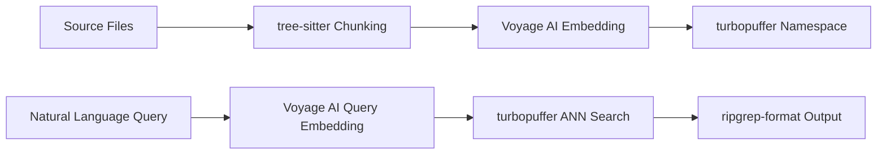
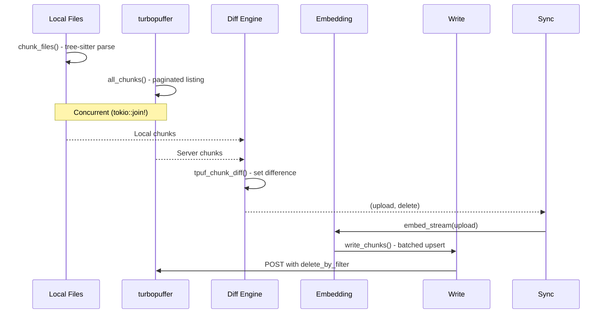
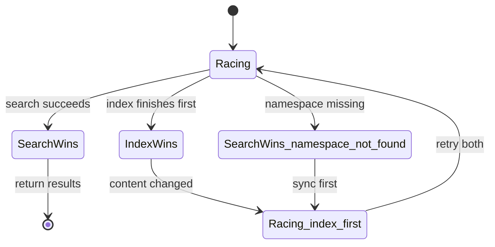

# Turbogrep CLI

`turbogrep` (binary name `tg`) is a ripgrep-style semantic code search CLI built on turbopuffer. It uses Voyage AI embeddings (`voyage-code-3` model) and stores vectors in turbopuffer namespaces, enabling natural language code search across local projects.

## What It Does

Instead of searching code by regex patterns (like `rg "function_name"`), turbogrep lets you search by meaning: `tg "authentication middleware"` finds functions related to auth middleware even if those exact words don't appear in the code.



## Architecture

```
turbogrep/src/
├── main.rs          # CLI entry point, command parsing
├── lib.rs           # Module exports, verbose logging
├── chunker.rs       # tree-sitter AST-aware code chunking
├── embeddings.rs    # Voyage AI embedding provider (trait-based)
├── sync.rs          # Incremental index synchronization (diff-based)
├── search.rs        # Query execution + speculative search
├── turbopuffer.rs   # HTTP client for turbopuffer API
├── config.rs        # Settings persistence (XDG/APPDATA)
├── project.rs       # Project root detection, namespace generation
└── progress.rs      # Branded progress bars
```

## Chunking: AST-Aware Code Splitting

Source: `chunker.rs:351-466` — `chunk()` function.

Turbogrep doesn't split code by lines or fixed-size windows. It uses **tree-sitter** to parse source code into an AST and extract semantically meaningful units:

**Supported languages (11):**

| Language | tree-sitter | Extracts |
|----------|------------|----------|
| Rust | `tree_sitter_rust` | `function_item`, `struct_item`, `impl_item` |
| Python | `tree_sitter_python` | `function_definition` |
| JavaScript | `tree_sitter_javascript` | `function_declaration`, `function_expression` |
| TypeScript/TSX | `tree_sitter_typescript::LANGUAGE_TSX` | `function_declaration`, `function_expression` |
| Go | `tree_sitter_go` | `function_declaration`, `method_declaration` |
| Java | `tree_sitter_java` | `method_declaration` |
| C | `tree_sitter_c` | `function_definition` |
| C++ | `tree_sitter_cpp` | `function_definition` |
| Ruby | `tree_sitter_ruby` | `method`, `singleton_method` |
| Bash | `tree_sitter_bash` | `function_definition` |
| Markdown | `tree_sitter_md` | `fenced_code_block`, `list`, `paragraph` |

**Preceding comments/docstrings** are included with each chunk:

Source: `chunker.rs:18-92` — `extract_function_with_comments()`:
```rust
// Walk backwards from function to find contiguous comment block
for i in (0..func_pos).rev() {
    let (node, start_byte) = &nodes[i];
    if matches!(node.kind(), "comment" | "line_comment" | "block_comment"
                | "doc_comment" | "documentation_comment") {
        if function_start_line <= comment_end_line + 2 {
            comment_start_byte = *start_byte;  // Include this comment
        }
    }
}
```

**Markdown paragraphs** include heading context:

Source: `chunker.rs:95-165` — `extract_paragraph_with_heading()`: walks up the tree to find the closest heading before a paragraph, prepending it to the chunk content.

**The Chunk data structure:**

Source: `chunker.rs:175-192`:
```rust
pub struct Chunk {
    pub id: u64,           // xxhash of "path:start_line:end_line:file_hash:chunk_hash"
    pub vector: Option<Vec<f32>>,
    pub path: String,
    pub start_line: u32,
    pub end_line: u32,
    pub file_hash: u64,    // xxhash of entire file content
    pub chunk_hash: u64,   // xxhash of chunk content
    pub file_mtime: u64,
    pub file_ctime: u64,
    pub content: Option<String>,  // kept locally only, never uploaded
    pub distance: Option<f64>,    // serialized as "$dist" via #[serde(rename)]
}
```

Note: `distance` is serialized as `"$dist"` in JSON responses from the turbopuffer API (via `#[serde(rename = "$dist")]` on the struct field).

**Aha:** The chunk ID includes both `file_hash` and `chunk_hash`. This means any content change anywhere in the file changes every chunk ID from that file, automatically triggering re-embedding. No complex dependency tracking needed — if you change a shared type definition, all functions using it get new IDs and are re-embedded.

## Embedding Provider

Source: `embeddings.rs:19-65` — `Embedding` trait.

```rust
pub trait Embedding: Clone + Send + 'static {
    fn embed(self, chunks: Vec<Chunk>, embedding_type: EmbeddingType) 
        -> impl Future<Output = Result<EmbedResult, EmbeddingError>> + Send;
    fn concurrency(&self) -> usize;
    fn max_batch_size(&self) -> usize;
    fn embed_stream<S>(self, chunks: S, embedding_type: EmbeddingType) 
        -> impl Stream<Item = Result<Chunk, EmbeddingError>>;
}
```

**Voyage AI implementation** (`embeddings.rs:168-321`):
- Model: `voyage-code-3`
- Concurrency: 8 (default)
- Max batch size: 256
- Input types: `query` (for search queries) vs `document` (for code chunks)
- Encoding: base64 f32 little-endian (matches turbopuffer API)
- Token limit handling: if batch exceeds model token limit, recursively splits in half and retries

**`choose_embedding_provider`** (`embeddings.rs:86-98`) — Checks environment variables to select the embedding backend. Currently only `VOYAGE_API_KEY` is supported (returns `"voyage"`), with stubs for future OpenAI support.

**`EmbedResult`** — Wraps embedded chunks with optional `total_tokens` usage tracking from the Voyage API response.

**`EmbeddingError`** — Enum with `MissingApiKey`, `RequestFailed`, and `ApiError` variants.

Source: `embeddings.rs:257-289` — Recursive split on token limit:
```rust
if error_text.to_lowercase().contains("max allowed tokens per submitted batch")
    && chunks.len() > 1
{
    let mid = chunks.len() / 2;
    let left_result = self.embed_batch_impl(left_chunks, embedding_type, api_key.clone()).await?;
    let right_result = self.embed_batch_impl(right_chunks, embedding_type, api_key).await?;
    // Combine results...
}
```

## Sync Pipeline: Incremental Index Update

Source: `sync.rs` — Full sync flow.



**The diff algorithm** (`sync.rs:9-38`):

```rust
pub fn tpuf_chunk_diff(local_chunks: Vec<Chunk>, server_chunks: Vec<Chunk>) 
    -> Result<(Vec<Chunk>, Vec<Chunk>)> 
{
    let local_ids: HashSet<u64> = local_chunks.iter().map(|c| c.id).collect();
    let server_ids: HashSet<u64> = server_chunks.iter().map(|c| c.id).collect();
    
    let delete = server_chunks.into_iter().filter(|s| !local_ids.contains(&s.id)).collect();
    let upload = local_chunks.into_iter().filter(|c| !server_ids.contains(&c.id)).collect();
    
    Ok((upload, delete))
}
```

Because chunk IDs change when content changes, the diff is a simple set difference — no content comparison needed.

**Write pipeline** (`sync.rs:67-114`):
```
chunks -> embed_stream() -> filter_map(Ok) -> write_chunks(namespace, stream, delete_chunks)
```

Streams through embedding directly to turbopuffer without materializing all chunks in memory. Batches at 1000, 4 concurrent requests. Embedding errors are silently suppressed via `filter_map(Ok)` — a failed embedding for one chunk doesn't abort the entire sync.

**`tpuf_apply_diff`** (`sync.rs:41-117`) — Applies the diff by embedding upload chunks and writing them with `delete_by_filter` for stale chunks. Returns `true` if content changed, `false` if index was already up-to-date.

**`chunk_file`** (`chunker.rs:958-1021`) — Parses a single file: reads content, validates UTF-8, skips files > 1MB or binary, then calls `chunk()`. Returns timing metrics (`read_time_ms`, `utf_time_ms`, `parse_time_ms`).

**`ChunkFileResult`** (`chunker.rs:950-957`) — Return type for `chunk_file()`: contains `chunks: Vec<Chunk>`, `read_time_ms`, `utf_time_ms`, `parse_time_ms`, and `file_size`.

**`hash_chunk_files`** (`chunker.rs:1112-1159`) — Creates lightweight metadata-only chunks (one per file, no content or parsing) for fast diff detection without embedding. Used during sync to compare against server chunks.

**`ChunkError`** — Enum with `UnsupportedExtension` and `ParseFailed` variants. Returned when `chunk()` encounters an unsupported language or tree-sitter parse failure.

## Speculative Search

Source: `search.rs:155-255` — `speculate_search()`.

Instead of sync-then-search (which waits for sync to complete before searching), turbogrep **races both**:



**The loop:**

1. Spawn `search_task` and `index_task` concurrently
2. `tokio::select!` on both:
   - **Search wins with results:** Return results immediately (index task continues in background)
   - **Search wins with "namespace not found":** Abort search, wait for index, retry
   - **Index wins with content changed:** Abort search, retry both (search on fresh index)
   - **Index wins with no changes:** Wait for search result

**Aha:** Speculative search optimizes for **perceived latency**, not raw throughput. In the common case (index is up-to-date, namespace exists), the search completes before the sync finishes, and results are returned immediately. The sync runs in the background, ensuring the next search is even faster. This is the same principle as speculative execution in CPUs — do both paths and discard the one you don't need.

**`search`** (`search.rs:88-150`) — The core search function: embeds the query, calls `query_chunks` with `rank_by: ["vector", "ANN", query_vector]`, loads content from local files, and formats as ripgrep output.

**`SearchError`** (`search.rs:8-24`) — Enum with `EmptyQuery`, `NoEmbedding`, `NamespaceNotFound`, `IndexBuildFailed`, `TurbopufferError`, `EmbeddingError`, and `NamespaceError` variants.

## Configuration

Source: `config.rs` — Settings stored in XDG/APPDATA config directory.

**`config_path`** (`config.rs:15-21`) — Computes the config file location: `$XDG_CONFIG_HOME/turbogrep/config.json` (or `~/.config/turbogrep/config.json`) on Unix, `%APPDATA%\turbogrep\config.json` on Windows. Creates the directory if it doesn't exist.

```rust
pub struct Settings {
    pub turbopuffer_region: Option<String>,    // Auto-detected closest region
    pub embedding_provider: Option<String>,    // "voyage" (VOYAGE_API_KEY)
}
```

Config path:
- Unix: `$XDG_CONFIG_HOME/turbogrep/config.json` or `~/.config/turbogrep/config.json`
- Windows: `%APPDATA%\turbogrep\config.json`

Auto-detects closest region by pinging all 11 regions on first run (`config.rs:51-62`).

## HTTP Client Configuration

Both the turbopuffer and Voyage AI clients share optimized HTTP configuration:

Source: `turbopuffer.rs:32-47` and `embeddings.rs:129-145`:
```rust
Client::builder()
    .pool_max_idle_per_host(8)
    .pool_idle_timeout(Duration::from_secs(30))
    .connect_timeout(Duration::from_secs(10))
    .timeout(Duration::from_secs(60))
    .http2_keep_alive_interval(Some(Duration::from_secs(30)))
    .http2_keep_alive_timeout(Duration::from_secs(10))
    .http2_keep_alive_while_idle(true)
    .brotli(true)
    .tcp_keepalive(Duration::from_secs(60))
    .tcp_nodelay(true)
```

## Project & Configuration

**`project.rs`** — Detects project root and generates namespace names.

- **`validate_directory`** (`project.rs:7-16`) — Checks that a path exists and is a directory. Returns `Result<PathBuf, String>` with descriptive error messages.
- **`find_project_root`** (`project.rs:18-103`) — Walks upward from a starting path, checking for 60+ project root indicators: VCS directories (`.git`, `.hg`), package managers (`Cargo.toml`, `package.json`, `go.mod`, `pyproject.toml`), build systems (`CMakeLists.txt`, `Makefile`), and IDE files (`.vscode`, `.idea`). Falls back to the canonicalized starting path if no root is found.
- **`namespace_and_dir`** (`project.rs:105-123`) — Combines `find_project_root` with an xxhash of the root path to generate a namespace like `tg_voyage_a1b2c3d4`. The embedding provider prefix allows different providers to use separate namespaces for the same project.

**`load_or_init_settings`** (`config.rs:39-79`) — Loads or creates the config file, auto-detects the closest turbopuffer region by pinging all 11 regions, and selects the embedding provider based on available API keys. Persists settings to avoid re-pinging on subsequent runs.

**`delete_namespace`** (`turbopuffer.rs:322-348`) — Sends `DELETE /v2/namespaces/{ns}` to remove an entire namespace and all its data.

**`TurbopufferError`** (`turbopuffer.rs:106-120`) — Enum with `MissingApiKey`, `RequestFailed`, `NamespaceNotFound`, `ApiError`, and `JoinError` variants. Used across all turbopuffer API functions.

## Output Format

Results are formatted as ripgrep-compatible output for fzf compatibility:

Source: `search.rs:50-86`:
```
path:line_number:preview_line
```

With scores enabled:
```
path:line_number:distance_score:preview_line
```

See [API & SDKs](07-api-and-sdks.md) for the underlying turbopuffer API that turbogrep calls, and [Performance Benchmarks](10-performance.md) for how turbopuffer's search compares against traditional engines.
