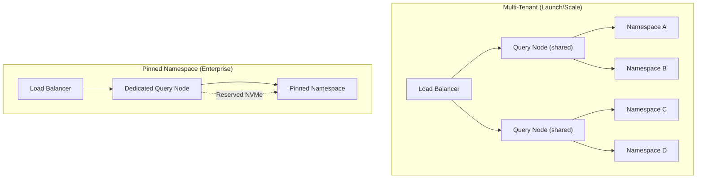
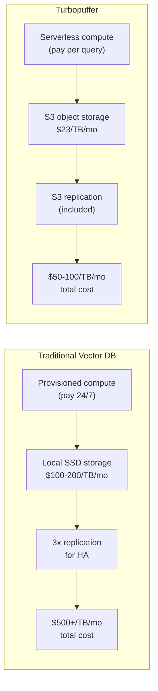

# Pricing & System Limits

## Pricing Tiers

| Feature | Launch | Scale | Enterprise |
|---------|--------|-------|------------|
| **Deployment** | Multi-tenant | Multi-tenant | Multi-tenant + Single-tenant + BYOC |
| **Min usage** | $64/month | $256/month | >= $4,096/month (35% premium) |
| **SSO** | No | Yes | Yes |
| **Audit Logs** | No | Yes | Yes |
| **HIPAA BAA** | No | Yes | Yes |
| **CMEK** | No | No | Yes (Per Namespace) |
| **Private Networking** | No | No | Yes |
| **Support** | Community Slack/Email | Community + Private Slack, 8-5 hrs | 24/7 + SLA 99.95% |
| **Uptime SLA** | None | None | 99.95% |

**Key pricing insight:** The minimum usage model means you pay for what you use, with a floor. On the Launch tier, if you use $20 of storage and queries, you still pay $64. On Enterprise, minimum is $4,096/month but you get single-tenant deployment, customer-managed encryption keys (CMEK), and private networking.

## System Limits

### Scale

| Metric | Production Observed | Current Limit |
|--------|-------------------|---------------|
| Max documents (global) | 3.5T+ @ 13PB+ | Unlimited |
| Max documents (per namespace) | 500M+ @ 2TB | 500M @ 2TB |
| Max namespaces | 100M+ | Unlimited |
| Max pinned namespaces | 256 | 256 (contact for custom) |

### Vectors

| Metric | Limit |
|--------|-------|
| Max vector columns | 2 |
| Max dimensions (dense) | 10,752 |
| Max dimensions (sparse) | 30,522 total, 1,024 per vector |

### Throughput

| Metric | Production Observed | Current Limit (per namespace) |
|--------|-------------------|------------------------------|
| Max write throughput (global) | 10M+ writes/s @ 32GB/s | Unlimited |
| Max write throughput (per ns) | 32k+ writes/s @ 64MB/s | 10k writes/s @ 32 MB/s |
| Max queries (global) | 25k+ queries/s | Unlimited |
| Max queries (per ns) | 1k+ queries/s | 1k writes/s |

### Documents

| Metric | Limit |
|--------|-------|
| Max upsert batch size | 512 MB |
| Max document size | 64 MiB |
| Max attribute value size | 8 MiB |

## Regions

### GCP Regions

| Region | Location |
|--------|----------|
| `gcp-us-central1` | Iowa |
| `gcp-us-west1` | Oregon |
| `gcp-us-east4` | N. Virginia |
| `gcp-northamerica-northeast2` | Toronto |
| `gcp-europe-west3` | Frankfurt |
| `gcp-asia-southeast1` | Singapore |
| `gcp-asia-northeast3` | Seoul |

### AWS Regions

| Region | Location |
|--------|----------|
| `aws-us-east-1` | N. Virginia |
| `aws-us-east-2` | Ohio |
| `aws-us-west-2` | Oregon |
| `aws-eu-central-1` | Frankfurt |
| `aws-eu-west-1` | Ireland |
| `aws-eu-west-2` | London |
| `aws-ap-southeast-2` | Sydney |
| `aws-ca-central-1` | Montreal |
| `aws-ap-south-1` | Mumbai |
| `aws-sa-east-1` | Sao Paulo |

**Azure:** Available for BYOC only (no public regions yet).

Source: `turbogrep/src/turbopuffer.rs:14-26` — `TURBOPUFFER_REGIONS` constant lists the 11 regions that `tg` auto-pings to find the closest:
```rust
const TURBOPUFFER_REGIONS: &[&str] = &[
    "gcp-us-central1", "gcp-us-west1", "gcp-us-east4",
    "gcp-northamerica-northeast2", "gcp-europe-west3",
    "gcp-asia-southeast1", "aws-ap-southeast-2",
    "aws-eu-central-1", "aws-us-east-1",
    "aws-us-east-2", "aws-us-west-2",
];
```

## Namespace Pinning

Namespace pinning reserves dedicated compute and NVMe SSD for a specific namespace:

- Guarantees predictable latency (no noisy neighbor)
- Bypasses the multi-tenant scheduling
- Costs more but provides dedicated resources
- Limited to 256 pinned namespaces per organization (contact for custom limits)



## Region Auto-Detection

The `turbogrep` CLI auto-detects the closest region by pinging all 11 regions concurrently on first run:

Source: `turbogrep/src/turbopuffer.rs:75-103` — `find_closest_region()`:
```rust
pub async fn find_closest_region() -> Result<String, TurbopufferError> {
    let ping_futures: Vec<_> = TURBOPUFFER_REGIONS
        .iter()
        .map(|&region| async move {
            match ping(Some(region)).await {
                Ok(latency) => Some((region.to_string(), latency)),
                Err(_e) => None,
            }
        })
        .collect();
    let results = join_all(ping_futures).await;
    // Pick lowest latency region...
}
```

Source: `turbogrep/src/config.rs:51-62` — Auto-save detected region to config:
```rust
if settings.turbopuffer_region.is_none() {
    match crate::turbopuffer::find_closest_region().await {
        Ok(best_region) => {
            settings.turbopuffer_region = Some(best_region);
            config_changed = true;
        }
        Err(_e) => {
            settings.turbopuffer_region = Some("gcp-us-east4".to_string());
            config_changed = true;
        }
    }
}
```

## Why Object Storage Makes It Cheap

The pricing advantage comes from the architecture:



| Cost Component | Traditional Vector DB | Turbopuffer |
|---------------|---------------------|-------------|
| Storage | Provisioned SSD ($100-200/TB/month) | S3 Standard ($23/TB/month) |
| Compute | Always-on (pay 24/7) | Serverless (pay per query/write) |
| Replication | 3x copies (for HA) | S3 handles replication (included) |
| Idle cost | Full provisioned cost | Near-zero (only storage) |

**Aha:** The $64/month Launch tier minimum is not arbitrary — it represents the baseline cost of running the multi-tenant infrastructure (load balancers, query nodes, indexer nodes) regardless of usage. The 35% premium on Enterprise reflects the additional infrastructure cost of single-tenant deployments and CMEK management.

Source: `turbogrep/src/turbopuffer.rs:199-200` — Write batch limits enforced client-side:
```rust
const BATCH_SIZE: usize = 1000;
const CONCURRENT_REQUESTS: usize = 4;
```

See [Performance Benchmarks](10-performance.md) for production scale numbers and how turbopuffer compares against Lucene/Tantivy benchmarks.
