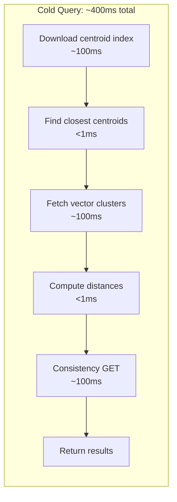
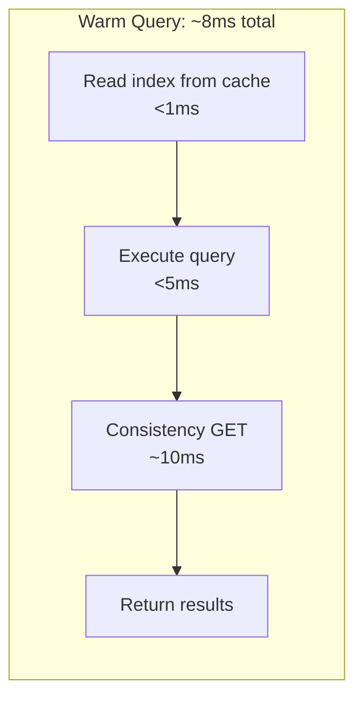

# Performance Benchmarks

Turbopuffer's performance characteristics are defined by its object storage architecture: cold queries pay object storage latency, warm queries are limited by local computation. Production scale numbers demonstrate that this tradeoff works at billion-document scale.

## Cold vs Warm Query Latency

### Cold Query (from Object Storage)

| Metric | 1M Documents |
|--------|-------------|
| p50 | 343ms |
| p90 | 444ms |
| p99 | 554ms |



### Warm Query (cached on NVMe/memory)

| Metric | 1M Documents |
|--------|-------------|
| p50 | 8ms |
| p99 | ~20ms |



Cold query breakdown:
1. Download centroid index (~100ms)
2. Find closest centroids locally (<1ms)
3. Fetch vectors for closest clusters (~100ms)
4. Compute distances locally (<1ms)
5. Consistency check via conditional GET (~100ms)
6. Return results

### Warm Query (cached on NVMe/memory)

| Metric | 1M Documents |
|--------|-------------|
| p50 | 8ms |
| p99 | ~20ms |

Warm query breakdown:
1. Read index from local cache (<1ms)
2. Execute query locally (<5ms)
3. Consistency check (~10ms, skip with eventual consistency)

## Write Performance

| Metric | Value |
|--------|-------|
| Write latency (p50) | 285ms for 500kB |
| Max writes/s per namespace | 32k+ @ 64MB/s (production) |
| Max writes/s global | 10M+ @ 32GB/s |
| WAL entry rate | 1 per second per namespace |

Writes are dominated by S3 PUT latency (~100ms roundtrip) plus serialization time. The 285ms p50 includes batching concurrent writes into a single WAL entry.

## Production Scale

| Metric | Production Observed |
|--------|-------------------|
| Total documents | 3.5 trillion+ |
| Total data | 13+ petabytes |
| Write throughput | 10M+ writes/s at 32 GB/s |
| Query throughput | 25k+ queries/s globally |
| Single query scope | 100B+ documents at 10TB |

## Search Benchmark Game

The `search-benchmark-game` compares 33 search engines on the English Wikipedia corpus using AOL-derived queries:

### Engines Compared

| Engine | Versions Tested |
|--------|----------------|
| Lucene | 7.2.1, 8.0.0, 8.10.1, 9.9.2, 9.12.0, 10.3.0 (+ bipartite variants) |
| Tantivy | 0.6 through 0.25 (13 versions) |
| Bleve | 0.8.0 (boltdb + scorch backends) |
| Bluge | 0.2.2 |
| PISA | 0.8.2 |
| Rucene | 0.1 |
| Turbopuffer | Current |

### Benchmark Methodology

Source: `search-benchmark-game/` — Each engine has `build_index.rs` and `do_query.rs` binaries:

- **Single-threaded** execution
- **10 runs**, best score kept (GC-insensitive)
- **Query types:** `intersection`, `union`, `phrase`
- **Collection modes:** `COUNT`, `TOP 10`, `TOP 10 + COUNT`
- **Corpus:** English Wikipedia with AOL-derived queries

### Turbopuffer Engine

Source: `search-benchmark-game/engines/turbopuffer/src/bin/build_index.rs`:
```rust
// Build index: reads JSON lines from stdin
// Batches at 10K documents, 32 concurrent upserts to localhost:3001
// Schema: full_text_search with BM25 (k1=0.9, b=0.4)
```

Source: `search-benchmark-game/engines/turbopuffer/src/bin/do_query.rs`:
```rust
// Read <COMMAND>\t<query> from stdin
// Commands: TOP_10, COUNT, TOP_100_FILTER_80%, etc.
// rank_by: ["text", "BM25", query]
// Filters: ContainsAllTokens, ContainsAnyToken
// Asserts exhaustive_search_count == 0 to ensure full indexing
```

## Rust Zero-Cost Abstractions vs SIMD

The blog post "Rust zero-cost abstractions vs. SIMD" (Feb 18, 2026) describes how turbopuffer optimizes the distance computation hot path:

- **Naive approach:** Iterate over f32 vectors with a simple loop
- **SIMD approach:** Use AVX2/AVX-512 intrinsics to compute 8-16 distances per instruction
- **Zero-cost abstraction approach:** Use Rust iterators with `.zip()` and `.map()`, letting the compiler auto-vectorize

Results showed that hand-written SIMD outperforms naive loops by 4-8x, but Rust's iterator abstractions (with proper compiler flags) come within 10-20% of hand-written SIMD — validating the "zero-cost abstraction" claim for this workload.

## Pre-Warming

Cold queries can be eliminated by pre-warming namespaces:

1. Send a `warm_cache` API request for a namespace
2. Turbopuffer loads the namespace into NVMe cache
3. Subsequent queries are warm (~8ms p50)

This is useful before latency-sensitive operations (e.g., user-facing search during peak hours).

## ANN v3: 200ms p99 Over 100 Billion Vectors

The ANN v3 index (Jan 21, 2026) achieved:
- **p99 query latency: 200ms** over 100 billion vectors
- **Recall@10: 90-100%**
- Improvements: better centroid initialization, hierarchical centroids, SIMD-optimized distance computation, improved cache utilization

## Consistency Check Overhead

| Mode | Additional Latency |
|------|-------------------|
| Strong consistency | ~10ms (S3 conditional GET: p50=10ms, p90=17ms) |
| Eventual consistency | 0ms (skips consistency check) |

For sub-10ms warm queries, eventual consistency is required. The tradeoff is potential staleness of up to ~1 hour in worst case (when namespace has >128MiB of outstanding writes).

## SDK Benchmarks

The `turbopuffer-sdk-bench/` directory contains micro-benchmarks:

- `bench_upsert.py` — Measures upsert throughput and latency
- `bench_query.py` — Measures query latency and throughput
- `bench_query_scale.py` — Measures query performance at scale

Uses `pyperf` for statistically rigorous benchmarking with baseline vs experiment comparison.

**Aha:** The benchmark game's methodology (10 runs, best score, single-threaded) is specifically designed to be GC-insensitive. This matters because JVM-based engines (Lucene) can have GC pauses that skew average results. Taking the best of 10 runs isolates the engine's best performance from GC noise. Turbopuffer benefits from this methodology because its stateless architecture has no GC pauses — every run is consistent.

See [S3 Storage Engine](02-storage-s3.md) for why cold queries take 3-4 roundtrips, and [Vector Index](03-vector-index.md) for how ANN v3 achieves 200ms p99.
